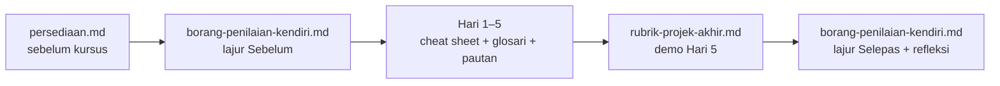

# Dokumen Sokongan — Kursus Pengaturcaraan JavaScript (PGN)

[← Jadual](../JADUAL.md) · [Nota topikal](../nota/README.md) · [Hari 5](../hari-5/README.md)

> Folder ini mengandungi bahan **rujukan pantas dan pentadbiran** kursus. Penerangan konsep yang mendalam berada dalam [`nota/`](../nota/README.md), manakala bahan sesi harian berada dalam `hari-1/` … `hari-5/`.
> Ragu tentang nama endpoint atau medan API? **[`projek/api/README.md`](../projek/api/README.md) menang.**

## Indeks

| Fail | Tujuan | Bila digunakan | Untuk |
|------|--------|----------------|-------|
| [`persediaan.md`](./persediaan.md) | Senarai semak pemasangan (Chrome/Edge, VS Code + sambungan, Node 22 LTS), arahan pengesahan, **kit luar talian**, proksi & masalah lazim | **≥ 5 hari bekerja sebelum kursus** (kelulusan IT) dan pagi Hari 1 | Peserta, IT jabatan, jurulatih |
| [`cheat-sheet-js.md`](./cheat-sheet-js.md) | Rumusan satu halaman: sintaks, array, objek, fungsi, modul, async/fetch, DOM, storage, error, debugging | Sepanjang lab; cetak dua muka | Peserta |
| [`cheat-sheet-geospatial.md`](./cheat-sheet-geospatial.md) | `[lng, lat]` vs `[lat, lng]`, GeoJSON, EPSG Malaysia, Leaflet, Turf, format → pustaka, GDAL, WMS/WFS, susunan bbox | Hari 1 (GeoJSON), Hari 3 (Leaflet), Hari 4 (format & proj4), Hari 5 (arkitektur peta) | Peserta |
| [`pautan-rujukan.md`](./pautan-rujukan.md) | Pautan dokumentasi rasmi (MDN, Node, Vite, Leaflet, Turf, proj4, OGC, GDAL, GeoServer, data.gov.my…) ikut hari. Semua disemak 26 Sep 2026 | Selepas setiap sesi; pembelajaran lanjut | Peserta, jurulatih |
| [`glosari.md`](./glosari.md) | Istilah BM ↔ EN beserta contoh dalam kursus, serta senarai singkatan | Apabila menemui istilah baharu dalam nota/slaid | Peserta |
| [`rubrik-projek-akhir.md`](./rubrik-projek-akhir.md) | Rubrik demo GeoLapor: gate G1–G4, 6 kriteria (100 markah), skrip masa 7 minit, helaian markah, bank soalan "terangkan baris ini" | Dibaca **Hari 4 petang**; digunakan Hari 5 S3 (demo) | Peserta, panel |
| [`borang-penilaian-kendiri.md`](./borang-penilaian-kendiri.md) | Penilaian kendiri 1–5 bagi setiap objektif sesi (Sebelum / Selepas / Bukti) + refleksi | Sebelum Hari 1, setiap petang, dan selepas demo Hari 5 | Peserta |

## Aliran penggunaan

## Bahan berkaitan di luar folder ini

| Lokasi | Kandungan |
|--------|-----------|
| [`../JADUAL.md`](../JADUAL.md) | Aturcara rasmi (masa tepat) & objektif setiap sesi |
| [`../nota/`](../nota/README.md) | 14 nota topikal: asas JS → async → HTTP/fetch → DOM → Leaflet → format geospatial → Turf → tooling → storage → state & arkitektur → debugging |
| `../hari-N/` | README (konsep sesi), `lab.md` |
| `../projek/api/` | Mock API GeoLapor (`npm start` → `http://localhost:3000`) |
| `../projek/data/` | Fail geospatial sampel sintetik (GeoJSON, Shapefile RSO, GeoPackage, KML/KMZ, GeoTIFF, LAS) |
| `../slides/` | Dek slaid HTML luar talian |
