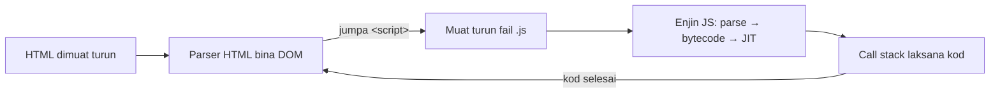

# Nota Pelajar — Hari 1: Modern JavaScript (ES6+) Core Syntax

Nota rujukan penuh untuk Hari 1. Baca bersama slaid dan lab hari ini.

**Kandungan:**

- Nota 01 — Asas JavaScript — Cara JS Berjalan, Jenis Data, Operator & Kawalan Aliran
- Nota 02 — Fungsi, Scope, Hoisting & Closure
- Nota 03 — JavaScript Moden (ES6+) — Template Literal, Destructuring, Spread/Rest, `?.`, `??` & ES Modules
- Nota 04 — Array, Objek & JSON — GeoJSON sebagai Data JavaScript

**Nota sokongan:** Nota 14 (Edaran Hari 5) — Debugging, Error Handling, Ujian & Amalan Terbaik.

---

## 01 · Asas JavaScript — Cara JS Berjalan, Jenis Data, Operator & Kawalan Aliran

> Nota topikal (rujukan merentas hari) · Indeks: `README.md`

### Objektif nota

- **Menerangkan** apa yang berlaku dari saat browser menerima fail `.js` hingga kod dilaksanakan (enjin, parse, call stack) dan **memilih** antara `<script>`, `defer` dan `type="module"`.
- **Membezakan** tujuh jenis primitif dan objek, serta **meramal** hasil `typeof` termasuk dua kejanggalannya (`null`, fungsi).
- **Menggunakan** operator aritmetik, perbandingan ketat (`===`) dan logik dengan betul, dan **menerangkan** kenapa `==` dielakkan.
- **Menulis** kawalan aliran (`if`/`else`, `switch`) dan loop (`for`, `while`, `do…while`, `for…of`, `for…in`) dengan `break`/`continue` yang sesuai.

---

### 1. Kenapa JavaScript?

JavaScript ialah **satu-satunya bahasa yang dijalankan secara asli oleh setiap browser web**. Jika anda mahu peta yang boleh dizum, borang yang menyemak input sebelum dihantar, atau senarai laporan yang dikemas kini tanpa muat semula halaman — anda perlukan JavaScript.

| Di mana JS berjalan | Contoh dalam kursus |
|---------------------|---------------------|
| **Browser** (Chrome, Edge, Firefox) | GeoLapor: peta Leaflet, borang laporan, senarai |
| **Node.js** (server / baris arahan) | Mock API `projek/api/server.mjs`, `npm`, Vite, `node --test` |
| Aplikasi desktop / mudah alih | Electron, React Native (sebutan sahaja) |

HTML memberi **struktur**, CSS memberi **rupa**, JavaScript memberi **tingkah laku**.

---

### 2. Bagaimana JavaScript berjalan dalam browser

#### 2.1 Dari fail ke pelaksanaan



1. Browser membaca HTML dari atas ke bawah dan membina **DOM** (pokok elemen).
2. Apabila bertemu `<script>`, browser memuat turun fail itu dan menyerahkannya kepada **enjin JavaScript** (V8 dalam Chrome/Edge/Node.js, SpiderMonkey dalam Firefox).
3. Enjin **mem-parse** kod (semak sintaks — syntax error bermakna *tiada satu baris pun* dalam fail itu berjalan), menukarnya kepada bytecode, dan mengoptimumkan bahagian yang kerap berjalan (JIT).
4. Kod dilaksanakan menggunakan **call stack** — timbunan fungsi yang sedang berjalan. JavaScript adalah **single-threaded**: satu perkara pada satu masa. (Bagaimana ia masih boleh menunggu API tanpa membeku? Lihat Nota 05 (Edaran Hari 2).)

```js
function kiraLuas(panjang, lebar) {
  return panjang * lebar;          // 3. kiraLuas di atas stack
}
function laporLuas() {
  const luas = kiraLuas(20, 5);    // 2. laporLuas memanggil kiraLuas
  console.log(`Luas: ${luas} m²`); // 4. console.log di atas stack
}
laporLuas();                       // 1. laporLuas masuk stack
// → Luas: 100 m²
```

> 💡 **Tip — lihat call stack sendiri.** Letak `debugger;` dalam `kiraLuas`, buka DevTools (F12) → Sources. Panel *Call Stack* menunjukkan `kiraLuas` → `laporLuas` → `(anonymous)`. Lihat Nota 14 (Edaran Hari 5).

#### 2.2 Tiga cara memuatkan skrip

| Cara | Bila dimuat turun | Bila dilaksana | Susunan | Guna bila |
|------|-------------------|----------------|---------|-----------|
| `<script src="a.js">` (dalam `<head>`) | Serta-merta, **menyekat** parser | Serta-merta | Ikut susunan | Hampir tidak pernah lagi |
| `<script src="a.js" defer>` | Parallel dengan parse HTML | Selepas DOM siap, sebelum `DOMContentLoaded` | Ikut susunan | Skrip klasik (cth Leaflet dari CDN) |
| `<script type="module" src="main.js">` | Parallel | Selepas DOM siap (**defer secara default**) | Ikut susunan | **Kod kita Hari 1–3** — membolehkan `import`/`export` |

```html
<!doctype html>
<html lang="ms">
<head>
  <meta charset="utf-8">
  <title>GeoLapor</title>
  <!-- Pustaka klasik: defer supaya tidak menyekat -->
  <script src="vendor/leaflet/leaflet.js" defer></script>
  <!-- Kod kita: module = defer + strict mode + import/export -->
  <script type="module" src="main.js"></script>
</head>
<body>
  <div id="peta"></div>
</body>
</html>
```

> ⚠️ **Modul tidak berfungsi melalui `file://`.** Buka fail HTML dengan dwiklik → console: *"CORS policy… origin 'null'"*. Modul **mesti** dihidang melalui HTTP: guna **Live Server** (VS Code) atau `npx serve`. Lihat `docs/persediaan.md`.

> 💡 `type="module"` juga menghidupkan **strict mode** secara automatik: variable yang tidak diisytihar akan throw error dan bukannya mencipta global secara senyap.

---

### 3. Variable: `let`, `const`, `var` (ringkas)

```js
const KATEGORI_SAH = ['infrastruktur', 'alam-sekitar', 'tanah', 'utiliti', 'lain-lain'];
let bilanganLaporan = 0;   // nilai akan berubah
bilanganLaporan += 1;

// var — gaya lama; function scope & hoisting mengelirukan. Jangan guna dalam kod baharu.
```

**Peraturan kursus:** `const` secara default; `let` hanya jika nilai perlu ditukar; **jangan** `var`. Butiran scope & hoisting dalam Nota 02 (Edaran Hari 1).

> ⚠️ `const` bermaksud **ikatan** tidak boleh ditukar, bukan nilai tidak boleh diubah. `const laporan = {}; laporan.status = 'baharu';` adalah sah. Untuk objek yang benar-benar beku guna `Object.freeze()`.

---

### 4. Jenis data

#### 4.1 Tujuh primitif + objek

| Jenis | Contoh GeoLapor | `typeof` |
|-------|-----------------|----------|
| `string` | `'Papan tanda sempadan rosak'` | `'string'` |
| `number` | `101.6958`, `40`, `NaN` | `'number'` |
| `bigint` | `9007199254740993n` (jarang) | `'bigint'` |
| `boolean` | `true` (laporan disahkan?) | `'boolean'` |
| `undefined` | medan yang tidak diisi | `'undefined'` |
| `null` | "sengaja tiada nilai", cth `dipilih: null` | `'object'` ⚠️ |
| `symbol` | key unik (jarang dalam kursus) | `'symbol'` |
| **objek** | `{ tajuk: '…' }`, `[101.69, 2.92]`, fungsi | `'object'` / `'function'` |

```js
typeof 'LPR-0001';          // → 'string'
typeof 2.9264;              // → 'number'
typeof NaN;                 // → 'number'   (Not-a-Number masih jenis number!)
typeof undefined;           // → 'undefined'
typeof null;                // → 'object'   ⚠️ pepijat sejarah sejak 1995, kekal demi keserasian
typeof [101.69, 2.92];      // → 'object'   array ialah objek
typeof { type: 'Feature' }; // → 'object'
typeof function () {};      // → 'function' (objek khas yang boleh dipanggil)

// Cara yang betul:
Array.isArray([101.69, 2.92]); // → true
nilai === null;                 // semak null secara terus
Number.isNaN(Number('abc'));    // → true
```

#### 4.2 Primitif disalin, objek dikongsi

```js
let a = 5;
let b = a;       // SALINAN nilai
b = 10;
console.log(a);  // → 5

const laporan1 = { status: 'baharu' };
const laporan2 = laporan1;      // RUJUKAN yang sama, bukan salinan
laporan2.status = 'selesai';
console.log(laporan1.status);   // → 'selesai'  ⚠️ kedua-duanya berubah
```

Ini sebab utama Hari 5 kita menekankan **kemas kini tidak boleh ubah** (salin dengan spread — lihat Nota 04 (Edaran Hari 1) dan Nota 13 (Edaran Hari 5)).

#### 4.3 Nombor: perpuluhan terapung

```js
0.1 + 0.2;                        // → 0.30000000000000004
(0.1 + 0.2).toFixed(2);           // → '0.30'  (string!)
Number((0.1 + 0.2).toFixed(2));   // → 0.3
101.6958.toFixed(3);              // → '101.696'
Number('2.9264');                 // → 2.9264
Number('');                       // → 0      ⚠️ input kosong jadi 0, bukan error
Number('2,9264');                 // → NaN    koma bukan titik perpuluhan
parseFloat('2.9264abc');          // → 2.9264 (berhenti pada aksara tidak sah)
```

> ⚠️ **Koordinat dari `<input>` sentiasa string.** `'101.69' + 0.01` → `'101.690.01'`. Tukar dahulu: `Number(input.value)` dan semak `Number.isFinite(nilai)` — ingat `Number('')` memberi `0` yang **sah** tetapi salah.

---

### 5. Operator

#### 5.1 Aritmetik & penugasan

```js
const jumlah = 40, selesai = 12;
const peratus = (selesai / jumlah) * 100;   // 30
const baki = jumlah % 7;                     // 5 (modulus)
const kuasaDua = 3 ** 2;                     // 9
let kiraan = 0;
kiraan += 1;  kiraan++;                      // 2
```

#### 5.2 Perbandingan: selalu `===`

| Ungkapan | `==` (longgar, tukar jenis) | `===` (ketat) |
|----------|-----------------------------|---------------|
| `'1' vs 1` | `true` | `false` |
| `0 vs ''` | `true` | `false` |
| `0 vs false` | `true` | `false` |
| `null vs undefined` | `true` | `false` |
| `NaN vs NaN` | `false` | `false` ⚠️ guna `Number.isNaN` |

```js
const idDariUrl = '3';          // dari URLSearchParams — sentiasa string
const idDalamData = 3;
idDariUrl == idDalamData;       // → true  (kebetulan — pepijat menunggu masa)
idDariUrl === idDalamData;      // → false (jujur: jenis berbeza)
Number(idDariUrl) === idDalamData; // → true  (tukar secara SENGAJA)
```

> **Peraturan kursus:** sentiasa `===` / `!==`. ESLint (`eqeqeq`) akan menegur `==` pada Hari 4.

#### 5.3 Logik, truthy & falsy

Dalam konteks boolean (`if`, `&&`, `||`, `!`), setiap nilai dianggap *truthy* atau *falsy*. Hanya **lapan** nilai adalah falsy:

`false`, `0`, `-0`, `0n`, `''`, `null`, `undefined`, `NaN`

Semua yang lain truthy — termasuk `'0'`, `'false'`, `[]` dan `{}`.

```js
const catatan = '';
if (!catatan) console.log('Tiada catatan');   // → dicetak

// && dan || memulangkan salah satu operand, bukan true/false
const nama = pengguna && pengguna.nama;        // pengguna falsy → pulang pengguna
const had = tetapan.had || 20;                 // ⚠️ jika had = 0, dapat 20!
const hadBetul = tetapan.had ?? 20;            // ✅ ?? hanya ganti null/undefined
```

> ⚠️ **`||` untuk nilai default menelan `0` dan `''`.** Latitud `0`, `had=0`, `catatan=''` semuanya digantikan. Guna `??` (nullish coalescing) — lihat Nota 03 (Edaran Hari 1).

#### 5.4 Ternary

```js
const label = laporan.status === 'selesai' ? 'Selesai' : 'Belum selesai';
```

Guna ternary untuk **nilai** mudah; jangan bersarang lebih daripada satu tahap — tukar kepada `if` atau objek pemetaan.

---

### 6. Kawalan aliran

#### 6.1 `if` / `else if` / `else`

```js
function tahapKeutamaan(laporan) {
  const { kategori, status } = laporan.properties;

  if (status === 'selesai' || status === 'ditolak') {
    return 'tiada';                   // keluar awal (guard clause)
  }
  if (kategori === 'infrastruktur') {
    return 'tinggi';
  } else if (kategori === 'utiliti') {
    return 'sederhana';
  }
  return 'rendah';
}
```

> 💡 **Guard clause** (pulang awal untuk kes khas) mengelakkan `if` bersarang 4 tahap. Kod dibaca dari atas ke bawah, kes biasa di hujung.

#### 6.2 `switch`

```js
function labelStatus(status) {
  switch (status) {                 // perbandingan menggunakan ===
    case 'baharu':
      return 'Baharu';
    case 'dalam-tindakan':
      return 'Dalam tindakan';
    case 'selesai':
      return 'Selesai';
    case 'ditolak':
      return 'Ditolak';
    default:
      return 'Tidak diketahui';
  }
}
```

> ⚠️ **Terlupa `break`** (bila tidak guna `return`) → *fall-through*: kod `case` seterusnya turut berjalan. Jika sengaja, tulis komen `// fall through`.

> 💡 Untuk pemetaan nilai → nilai, **objek** selalunya lebih ringkas daripada `switch`:
> ```js
> const LABEL_STATUS = { baharu: 'Baharu', 'dalam-tindakan': 'Dalam tindakan', selesai: 'Selesai', ditolak: 'Ditolak' };
> const label = LABEL_STATUS[status] ?? 'Tidak diketahui';
> ```

---

### 7. Loop

#### 7.1 Memilih loop yang betul

| Loop | Guna bila | Contoh GeoLapor |
|--------|-----------|-----------------|
| `for (let i = 0; i < n; i++)` | Perlu indeks / langkah khas | Titik ke-10, ke-20… sahaja |
| `for…of` | Ulang **nilai** dalam array/string/Map/Set | Setiap `feature` dalam `features` |
| `for…in` | Ulang **key** objek | Setiap medan dalam `properties` |
| `while` | Tidak tahu berapa kali; syarat di awal | Ambil halaman API sehingga habis |
| `do…while` | Mesti jalan sekurang-kurangnya sekali | Minta input sekurang-kurangnya sekali |
| `arr.forEach / map / filter` | Operasi pada setiap elemen (gaya fungsian) | Nota 04 (Edaran Hari 1) |

```js
const features = [
  { properties: { id: 'LPR-0001', kategori: 'infrastruktur', status: 'baharu' } },
  { properties: { id: 'LPR-0002', kategori: 'tanah', status: 'selesai' } },
  { properties: { id: 'LPR-0003', kategori: 'infrastruktur', status: 'ditolak' } },
];

// for klasik
for (let i = 0; i < features.length; i++) {
  console.log(i + 1, features[i].properties.id);
}

// for…of — paling mudah dibaca untuk array
let bilInfra = 0;
for (const f of features) {
  if (f.properties.status === 'ditolak') continue;   // langkau yang ditolak
  if (f.properties.kategori === 'infrastruktur') bilInfra++;
}
console.log(bilInfra);   // → 1

// for…in — key objek
const p = features[0].properties;
for (const medan in p) {
  console.log(`${medan}: ${p[medan]}`);
}
// → id: LPR-0001 / kategori: infrastruktur / status: baharu

// while — cari laporan pertama yang 'selesai'
let i = 0;
while (i < features.length && features[i].properties.status !== 'selesai') {
  i++;
}
console.log(i < features.length ? features[i].properties.id : 'tiada');  // → LPR-0002

// do…while — sekurang-kurangnya sekali
let cubaan = 0;
do {
  cubaan++;
  console.log(`Cubaan ${cubaan}`);
} while (cubaan < 3);
```

#### 7.2 `break` dan `continue`

```js
// break — berhenti sebaik jumpa
let jumpa = null;
for (const f of features) {
  if (f.properties.id === 'LPR-0002') {
    jumpa = f;
    break;              // tiada gunanya teruskan
  }
}
// (Lebih ringkas: features.find(f => f.properties.id === 'LPR-0002') — nota 04)
```

> ⚠️ **`for…in` pada array** memberi indeks sebagai **string** (`'0'`, `'1'`) dan turut mengulang property tambahan. Untuk array, sentiasa `for…of` atau method array.

> ⚠️ **Infinite loop** — `while (i < n)` tanpa `i++`. Tab browser membeku; tutup tab dan baiki. Dalam `while`, pastikan syarat **pasti** berubah.

> ⚠️ **`forEach` tidak boleh `break`.** Jika perlu berhenti awal, guna `for…of`, `find`, atau `some`.

---

### 8. Semua sekali: ringkasan laporan

Satu fungsi yang menggabungkan jenis data, operator, kawalan aliran dan loop (versi "tangan" sebelum kita belajar `reduce`):

```js
function ringkasanLaporan(features) {
  const ikutStatus = {};
  let tanpaCatatan = 0;

  for (const { properties: p } of features) {
    ikutStatus[p.status] = (ikutStatus[p.status] ?? 0) + 1;
    if (!p.catatan?.trim()) tanpaCatatan++;
  }

  const jumlah = features.length;
  const selesai = ikutStatus.selesai ?? 0;
  const peratusSelesai = jumlah === 0 ? 0 : Math.round((selesai / jumlah) * 100);

  return { jumlah, ikutStatus, tanpaCatatan, peratusSelesai };
}

ringkasanLaporan([
  { properties: { status: 'baharu', catatan: 'Tiang condong' } },
  { properties: { status: 'selesai', catatan: '' } },
  { properties: { status: 'selesai' } },
  { properties: { status: 'baharu', catatan: '   ' } },
]);
// → { jumlah: 4, ikutStatus: { baharu: 2, selesai: 2 }, tanpaCatatan: 3, peratusSelesai: 50 }
```

Perhatikan `jumlah === 0 ? 0 : …` — tanpa kawalan ini, `0 / 0` memberi `NaN` dan UI memaparkan "NaN%".

---

### ⚠️ Kesilapan lazim

| Kesilapan | Gejala | Pembetulan |
|-----------|--------|------------|
| Buka HTML dengan `file://` | CORS error / `origin 'null'` untuk modul | Guna Live Server / `npx serve` |
| `<script>` di `<head>` tanpa `defer` | `document.getElementById(...)` → `null` | `defer` atau `type="module"` |
| `==` bukannya `===` | `'3' == 3` benar; pepijat tidak konsisten | `===` + tukar jenis secara sengaja |
| `typeof x === 'object'` untuk semak objek | `null` turut lulus | `x !== null && typeof x === 'object'` |
| `input.value + 1` | Gabungan string `'101.691'` | `Number(input.value)` + `Number.isFinite` |
| `nilai \|\| lalai` | `0`, `''` diganti | `nilai ?? lalai` |
| `for…in` pada array | Indeks string, property asing | `for…of` |
| `switch` tanpa `break` | Beberapa `case` berjalan | `break` / `return` dalam setiap `case` |
| Bahagi tanpa semak sifar | `NaN%`, `Infinity` | Guard `jumlah === 0` |

---

### Rujukan rasmi

- MDN — JavaScript Guide: <https://developer.mozilla.org/en-US/docs/Web/JavaScript/Guide>
- MDN — `<script>` (`defer`, `type="module"`): <https://developer.mozilla.org/en-US/docs/Web/HTML/Reference/Elements/script>
- MDN — JavaScript data types and data structures: <https://developer.mozilla.org/en-US/docs/Web/JavaScript/Guide/Data_structures>
- MDN — `typeof`: <https://developer.mozilla.org/en-US/docs/Web/JavaScript/Reference/Operators/typeof>
- MDN — Equality comparisons and sameness: <https://developer.mozilla.org/en-US/docs/Web/JavaScript/Guide/Equality_comparisons_and_sameness>
- MDN — Falsy: <https://developer.mozilla.org/en-US/docs/Glossary/Falsy>
- MDN — Control flow and error handling: <https://developer.mozilla.org/en-US/docs/Web/JavaScript/Guide/Control_flow_and_error_handling>
- MDN — Loops and iteration: <https://developer.mozilla.org/en-US/docs/Web/JavaScript/Guide/Loops_and_iteration>
- V8 (enjin JS Chrome/Edge/Node.js): <https://v8.dev/>

### Digunakan pada Hari N

| Hari | Sesi | Bahagian nota |
|------|------|---------------|
| 1 | S1 · Variable Management & Scope | §2 (cara JS berjalan, `<script type="module">`), §3–4 (variable, jenis data), §5 (operator), §6–7 (kawalan aliran & loop), §8 |
| 1 | S3 · Destructuring & Operators | §5.2–5.3 (`===`, truthy/falsy, `\|\|` vs `??`) |
| 3 | S4 · Form Handling | §4.3 (input sentiasa string → `Number`) |
| 5 | S3 · Best Practices | §2.1 (call stack dalam DevTools) |

---

## 02 · Fungsi, Scope, Hoisting & Closure

> Nota topikal (rujukan merentas hari) · Indeks: `README.md`

### Objektif nota

- **Menulis** fungsi dalam tiga bentuk (deklarasi, ungkapan, arrow) dan **memilih** bentuk yang sesuai.
- **Menggunakan** default parameter, rest parameter dan nilai pulangan (termasuk memulangkan objek).
- **Menerangkan** scope global/fungsi/blok, hoisting dan *Temporal Dead Zone* (TDZ), dan **meramal** output kod `var` vs `let` dalam loop.
- **Membina** closure untuk menyimpan keadaan peribadi (pembilang ID, cache, `debounce`).
- **Menerangkan** perbezaan `this` dalam fungsi biasa vs arrow function.

---

### 1. Kenapa fungsi?

Tanpa fungsi, kiraan jarak antara dua laporan akan disalin di lima tempat. Apabila formula perlu dibaiki, anda perlu ingat kelima-limanya. Fungsi memberi:

1. **Nama** kepada satu idea (`jarakKm` lebih jelas daripada 6 baris trigonometri).
2. **Satu tempat** untuk dibaiki dan diuji (`node --test` Hari 5).
3. **Guna semula** — modul `utils/geo.js` Hari 1 digunakan sehingga Hari 5.

> **Fungsi yang baik:** satu tugas, nama kata kerja, input melalui parameter, output melalui `return`, **tiada kesan sampingan tersembunyi** (tidak mengubah variable luar secara senyap).

---

### 2. Tiga bentuk fungsi

```js
// 1. Deklarasi fungsi — di-hoist sepenuhnya (boleh dipanggil sebelum ditulis)
function formatKoordinat([lng, lat], perpuluhan = 5) {
  return `${lat.toFixed(perpuluhan)}, ${lng.toFixed(perpuluhan)}`;
}

// 2. Ungkapan fungsi — nilai yang disimpan dalam variable
const labelKategori = function (kod) {
  return kod.replace('-', ' ');
};

// 3. Arrow function (ES6) — ringkas; tiada `this`/`arguments` sendiri
const keRad = (darjah) => (darjah * Math.PI) / 180;
const kuasaDua = (x) => x * x;                     // return tersirat
const cipta = (tajuk) => ({ tajuk, status: 'baharu' }); // ⚠️ objek perlu dalam ( )
```

| Bentuk | Hoisting | `this` sendiri | Guna bila |
|--------|----------|----------------|-----------|
| Deklarasi `function f() {}` | Ya (boleh panggil sebelum) | Ya | Fungsi utama modul (`export function jarakKm`) |
| Ungkapan `const f = function () {}` | Tidak (TDZ) | Ya | Jarang; bila perlu nama dalaman untuk rekursi |
| Arrow `const f = () => {}` | Tidak (TDZ) | **Tidak** — ambil dari luar | Callback (`map`, `filter`, `addEventListener`, `then`) |

> ⚠️ **Arrow yang memulangkan objek:** `() => { tajuk: 'x' }` memulangkan `undefined` — `{` dibaca sebagai blok, `tajuk:` sebagai *label*. Balut dengan kurungan: `() => ({ tajuk: 'x' })`.

---

### 3. Parameter & nilai pulangan

#### 3.1 Default parameter

```js
function senaraiUrl(had = 20, mula = 0) {
  return `/api/laporan?had=${had}&mula=${mula}`;
}
senaraiUrl();          // → '/api/laporan?had=20&mula=0'
senaraiUrl(10);        // → '/api/laporan?had=10&mula=0'
senaraiUrl(undefined, 40); // → '/api/laporan?had=20&mula=40'
senaraiUrl(null);      // → '/api/laporan?had=null&mula=0'  ⚠️ null TIDAK mencetuskan default
```

Nilai default hanya digunakan apabila argumen `undefined` (tidak dihantar), bukan `null` atau `0`.

#### 3.2 Objek pilihan (options object) + destructuring

Apabila fungsi ada lebih daripada 2–3 parameter pilihan, susunan jadi sukar diingat. Guna **satu objek**:

```js
// ❌ tapisLaporan(features, 'tanah', '', 'runtuh') — apa maksud '' ?
// ✅ nama parameter kelihatan di tempat panggilan
function tapisLaporan(features, { kategori = '', status = '', q = '' } = {}) {
  const cari = q.trim().toLowerCase();
  return features.filter(({ properties: p }) =>
    (!kategori || p.kategori === kategori) &&
    (!status || p.status === status) &&
    (!cari || p.tajuk.toLowerCase().includes(cari)));
}

tapisLaporan(features, { kategori: 'tanah', q: 'runtuh' });
tapisLaporan(features);   // `= {}` di hujung membolehkan panggilan tanpa objek
```

Corak yang sama digunakan oleh `mintaJson(laluan, { method, body, signal, timeoutMs })` dalam `services/api.js` (Hari 2).

#### 3.3 Parameter rest

```js
function gabungId(...ids) {           // ids ialah ARRAY sebenar
  return ids.join(',');
}
gabungId('LPR-0001', 'LPR-0002');     // → 'LPR-0001,LPR-0002'

function log(tahap, ...mesej) {
  console[tahap]('[GeoLapor]', ...mesej); // spread semula semasa memanggil
}
log('warn', 'Lapisan', 'sungai', 'lambat dimuat');
```

#### 3.4 `return` — satu nilai, tetapi boleh jadi objek

```js
function statistikRingkas(features) {
  const jumlah = features.length;
  const selesai = features.filter((f) => f.properties.status === 'selesai').length;
  return { jumlah, selesai, peratus: jumlah ? Math.round((selesai / jumlah) * 100) : 0 };
}
const { jumlah, peratus } = statistikRingkas(features);
```

> ⚠️ **`return` di baris sendiri:** `return` diikuti baris baharu → JavaScript memasukkan `;` secara automatik (ASI) dan memulangkan `undefined`. Mulakan nilai pada baris yang sama dengan `return`.
> ```js
> return          // ❌ → return;
>   { ok: true };
> return {        // ✅
>   ok: true,
> };
> ```

---

### 4. Scope

**Scope** = kawasan kod di mana sesuatu nama boleh dilihat.

| Scope | Dicipta oleh | `let`/`const` | `var` |
|------|--------------|---------------|-------|
| Global | Fail skrip klasik | Global | Global + jadi `window.x` |
| Modul | Setiap fail `type="module"` | Scope modul (tidak bocor) | Scope modul |
| Fungsi | `function`, arrow | Dalam fungsi | Dalam fungsi |
| Blok | `{ }` — `if`, `for`, `while` | **Dalam blok** | ⚠️ Bocor keluar blok |

```js
function semak(laporan) {
  if (laporan.status === 'baharu') {
    var mesejVar = 'var bocor keluar blok';
    let mesejLet = 'let kekal dalam blok';
  }
  console.log(mesejVar);   // → 'var bocor keluar blok'
  console.log(mesejLet);   // ❌ ReferenceError: mesejLet is not defined
}
```

Scope **bersarang** membentuk *scope chain*: kod dalam boleh melihat variable luar, bukan sebaliknya.

```js
const API_ASAS = 'http://localhost:3000';        // scope modul
function urlLaporan(id) {
  const laluan = `/api/laporan/${id}`;            // scope fungsi
  return `${API_ASAS}${laluan}`;                  // nampak API_ASAS (luar)
}
console.log(laluan);                              // ❌ ReferenceError
```

> 💡 **Setiap modul ES mempunyai scope sendiri.** `const API_ASAS` dalam `api.js` tidak bertembung dengan `API_ASAS` dalam `main.js`. Ini sebab utama kita guna `type="module"` sejak Hari 1: tiada lagi pencemaran global.

---

### 5. Hoisting & Temporal Dead Zone

Sebelum kod berjalan, enjin mendaftarkan semua pengisytiharan dalam scope ("hoisting"). Tetapi setiap jenis diperlakukan berbeza:

```js
console.log(sapa('Aina'));     // ✅ 'Salam, Aina' — deklarasi fungsi di-hoist PENUH
function sapa(nama) { return `Salam, ${nama}`; }

console.log(x);                // undefined — var di-hoist, NILAI tidak
var x = 5;

console.log(y);                // ❌ ReferenceError: Cannot access 'y' before initialization
let y = 5;                     //    y wujud tetapi dalam TDZ sehingga baris ini

console.log(kira(2));          // ❌ ReferenceError — const + arrow = TDZ juga
const kira = (n) => n * 2;
```

**TDZ** (Temporal Dead Zone) ialah tempoh dari awal scope hingga baris pengisytiharan `let`/`const`. Error TDZ adalah **baik**: ia memberitahu anda terus, berbanding `var` yang diam-diam memberi `undefined`.

---

### 6. `var` dalam loop — soalan temu duga klasik

```js
const pemasaVar = [];
for (var i = 0; i < 3; i++) {
  pemasaVar.push(() => i);
}
console.log(pemasaVar.map((f) => f()));  // → [3, 3, 3]  satu `i` dikongsi

const pemasaLet = [];
for (let j = 0; j < 3; j++) {
  pemasaLet.push(() => j);
}
console.log(pemasaLet.map((f) => f()));  // → [0, 1, 2]  `j` baharu setiap pusingan
```

Dalam GeoLapor: jika anda memasang `click` pada 40 marker dalam loop `var`, **setiap** marker akan membuka laporan terakhir. Dengan `let` (atau `for…of` + `const`), setiap marker ingat laporannya sendiri.

---

### 7. Closure

**Closure** = fungsi + variable dari scope di mana ia **dicipta**, yang kekal hidup walaupun fungsi luar sudah selesai.

#### 7.1 Keadaan peribadi

```js
function ciptaPenjanaId(awalan) {
  let kiraan = 0;                       // peribadi — tiada siapa boleh ubah dari luar
  return () => {
    kiraan += 1;
    return `${awalan}-${String(kiraan).padStart(4, '0')}`;
  };
}

const idDraf = ciptaPenjanaId('DRAF');
idDraf();   // → 'DRAF-0001'
idDraf();   // → 'DRAF-0002'
const idLain = ciptaPenjanaId('UJI');
idLain();   // → 'UJI-0001'   (closure berasingan)
```

> Ini **idea yang sama** dengan `ciptaStore(keadaanAwal)` Hari 5: `keadaan` dan `pelanggan` disimpan dalam closure; dunia luar hanya boleh menggunakan `dapat()`, `set()` dan `langgan()`. Lihat Nota 13 (Edaran Hari 5).

#### 7.2 Cache ringkas (memoization)

```js
function ciptaCache(fungsiAmbil) {
  const simpanan = new Map();               // closure
  return async (kunci) => {
    if (simpanan.has(kunci)) return simpanan.get(kunci);
    const nilai = await fungsiAmbil(kunci);
    simpanan.set(kunci, nilai);
    return nilai;
  };
}
// const dapatkanLapisanCache = ciptaCache(dapatkanLapisan);
// await dapatkanLapisanCache('sungai'); // panggilan kedua tiada fetch
```

#### 7.3 `debounce` — tunggu pengguna berhenti menaip

Kotak carian `q` memanggil `/api/laporan?q=…`. Tanpa debounce, menaip "sempadan" menghantar **8 request**.

```js
function debounce(fn, tunggu = 300) {
  let pemasa;                               // closure: diingat antara panggilan
  return (...args) => {
    clearTimeout(pemasa);                   // batalkan panggilan sebelumnya
    pemasa = setTimeout(() => fn(...args), tunggu);
  };
}

// const cariDebounce = debounce((q) => muatLaporan({ q }), 300);
// inputCari.addEventListener('input', (e) => cariDebounce(e.target.value));
```

Digunakan semula pada Hari 5 (prestasi peta: `moveend` → muat ikut `bbox`).

---

### 8. `this` — ringkas dan praktikal

`this` dalam fungsi biasa ditentukan oleh **cara fungsi dipanggil**, bukan di mana ia ditulis. Arrow function **tiada** `this` sendiri — ia mengambil `this` dari scope luar.

```js
const pengira = {
  jumlah: 0,
  tambahBiasa() {
    [1, 2, 3].forEach(function (n) {
      // this di sini BUKAN pengira (undefined dalam strict mode)
    });
  },
  tambahArrow() {
    [1, 2, 3].forEach((n) => {
      this.jumlah += n;           // ✅ this = pengira (diambil dari tambahArrow)
    });
  },
};
pengira.tambahArrow();
pengira.jumlah;                   // → 6
```

> 💡 **Dalam kursus ini** kita jarang perlukan `this`: modul kita menggunakan fungsi biasa + closure, bukan kelas. Pengecualian: `class ApiError extends Error` (Hari 2) dan pustaka seperti Leaflet (`L.Map`). Jika `this` mengelirukan, itu tanda baik untuk guna fungsi biasa dengan parameter.

> ⚠️ **Event listener:** dalam `el.addEventListener('click', function () { this })`, `this` ialah elemen. Dalam versi arrow, `this` ialah scope luar. Gunakan `event.currentTarget` — jelas dan tidak bergantung pada bentuk fungsi.

---

### 9. Fungsi tulen (pure) vs kesan sampingan

```js
// ❌ tidak tulen — bergantung & mengubah keadaan luar
let semuaLaporan = [];
function tambahLaporan(f) {
  semuaLaporan.push(f);         // mutasi global
}

// ✅ tulen — input sama → output sama; tiada mutasi
function denganLaporan(senarai, f) {
  return [...senarai, f];       // array BAHARU
}
```

Fungsi tulen mudah **diuji** (`assert.deepEqual(denganLaporan([], f), [f])`), mudah **difahami**, dan selamat digunakan dalam store Hari 5. Semua fungsi dalam `utils/geo.js` (`jarakKm`, `tapisLaporan`, `kiraIkut`, `bboxDari`, `dalamMalaysia`, `formatKoordinat`) adalah tulen.

---

### ⚠️ Kesilapan lazim

| Kesilapan | Gejala | Pembetulan |
|-----------|--------|------------|
| `() => { a: 1 }` | Pulang `undefined` | `() => ({ a: 1 })` |
| Lupa `return` dalam fungsi berbadan `{ }` | `undefined` di tempat panggilan | Tambah `return`, atau guna arrow ringkas tanpa `{}` |
| `return` diikuti baris baharu | `undefined` | Mula nilai di baris `return` |
| Panggil `const f = () => …` sebelum ditulis | `Cannot access 'f' before initialization` | Susun semula, atau guna deklarasi `function` |
| `var` dalam loop + callback | Semua callback nampak nilai terakhir | `let` / `for…of` dengan `const` |
| Harap `null` mencetuskan default parameter | `had=null` dalam URL | Hantar `undefined` atau guna `??` dalam badan fungsi |
| Fungsi mengubah array input | Data dalam store/senarai berubah senyap | Pulang salinan (`[...arr]`, `{...obj}`) |
| Guna `this` dalam arrow sebagai method objek | `this` = `undefined` | Method biasa `nama() {}` untuk method objek |

---

### Rujukan rasmi

- MDN — Functions (guide): <https://developer.mozilla.org/en-US/docs/Web/JavaScript/Guide/Functions>
- MDN — Arrow function expressions: <https://developer.mozilla.org/en-US/docs/Web/JavaScript/Reference/Functions/Arrow_functions>
- MDN — Default parameters: <https://developer.mozilla.org/en-US/docs/Web/JavaScript/Reference/Functions/Default_parameters>
- MDN — Rest parameters: <https://developer.mozilla.org/en-US/docs/Web/JavaScript/Reference/Functions/rest_parameters>
- MDN — Closures: <https://developer.mozilla.org/en-US/docs/Web/JavaScript/Guide/Closures>
- MDN — Hoisting: <https://developer.mozilla.org/en-US/docs/Glossary/Hoisting>
- MDN — `let` (Temporal Dead Zone): <https://developer.mozilla.org/en-US/docs/Web/JavaScript/Reference/Statements/let>
- MDN — `this`: <https://developer.mozilla.org/en-US/docs/Web/JavaScript/Reference/Operators/this>

### Digunakan pada Hari N

| Hari | Sesi | Bahagian nota |
|------|------|---------------|
| 1 | S1 · Variable Management & Scope | §4 (scope), §5 (hoisting, TDZ), §6 (`var` vs `let` dalam loop) |
| 1 | S2 · Modern Strings & Functions | §2 (tiga bentuk), §3 (default, objek pilihan, rest, return), §7.1 (closure), §9 (fungsi tulen) → `formatKoordinat()`, `jarakKm()` |
| 2 | S4 · Fetch API Integration | §3.2 (objek pilihan `mintaJson(laluan, {…})`), §7.2 (cache) |
| 3 | S3 · Event Handling | §6 (marker dalam loop), §7.3 (`debounce` carian), §8 (`this` vs `currentTarget`) |
| 5 | S1 · State Management | §7.1 (closure → `ciptaStore`), §9 (fungsi tulen → selector) |

---

## 03 · JavaScript Moden (ES6+) — Template Literal, Destructuring, Spread/Rest, `?.`, `??` & ES Modules

> Nota topikal (rujukan merentas hari) · Indeks: `README.md`

### Objektif nota

- **Menulis** template literal berbilang baris dengan interpolasi, dan **menerangkan** kenapa ia tidak selamat untuk membina HTML dengan data pengguna.
- **Membuat destructuring** pada `feature.properties` dan `geometry.coordinates` (termasuk nilai default, nama semula dan bersarang).
- **Menggunakan** spread/rest untuk menyalin & menggabung objek/array tanpa mengubah asal.
- **Menggunakan** `?.`, `??` dan `??=` untuk data API yang mungkin tiada medan.
- **Menyusun** kod kepada ES Modules dengan `export`/`import` (named & default) dan **menerangkan** peraturan laluan modul dalam browser.

---

### 1. Kenapa "moden"?

ES2015 (ES6) dan kemas kini tahunan selepasnya mengubah cara JavaScript ditulis. Kod pustaka yang anda akan baca (Leaflet, Turf, dokumentasi MDN) menggunakan sintaks ini. Faedah utama:

| Masalah lama | Penyelesaian moden |
|--------------|---------------------|
| `'Laporan ' + id + ' (' + status + ')'` | `` `Laporan ${id} (${status})` `` |
| `var p = f.properties; var tajuk = p.tajuk; var status = p.status;` | `const { tajuk, status } = f.properties;` |
| `Object.assign({}, lama, { status: 'selesai' })` | `{ ...lama, status: 'selesai' }` |
| `f && f.properties && f.properties.catatan` | `f?.properties?.catatan` |
| `x !== null && x !== undefined ? x : 20` | `x ?? 20` |
| Semua fail berkongsi global `window` | `import { jarakKm } from './utils/geo.js'` |

Browser sasaran kursus (Chrome/Edge terkini) menyokong **ES2024** sepenuhnya — tiada transpiler diperlukan.

---

### 2. Template literal

```js
const laporan = { id: 'LPR-0001', tajuk: 'Papan tanda sempadan rosak', status: 'baharu' };
const [lng, lat] = [101.6958, 2.9264];

// Interpolasi ${…} — sebarang ungkapan
const ringkas = `${laporan.id}: ${laporan.tajuk} [${laporan.status.toUpperCase()}]`;
// → 'LPR-0001: Papan tanda sempadan rosak [BAHARU]'

// Berbilang baris — baris baharu dikekalkan
const mesej = `Laporan diterima.
Lokasi: ${lat.toFixed(4)}, ${lng.toFixed(4)}
Masa: ${new Date('2026-09-01T09:15:00+08:00').toLocaleString('ms-MY', { timeZone: 'Asia/Kuala_Lumpur' })}`;

// Membina URL — ingat encodeURIComponent untuk nilai pengguna
const q = 'papan & tiang';
const url = `/api/laporan?q=${encodeURIComponent(q)}&had=20`;
// → '/api/laporan?q=papan%20%26%20tiang&had=20'
```

> 💡 Untuk URL dengan banyak query, `URLSearchParams` lebih selamat daripada template literal — ia mengekod setiap nilai secara automatik (lihat Nota 06 (Edaran Hari 2)).

> ⚠️ **Template literal + `innerHTML` + data pengguna = XSS.**
> ```js
> senarai.innerHTML = `<li>${laporan.tajuk}</li>`;   // ❌ tajuk "" akan dilaksana
> const li = document.createElement('li');
> li.textContent = laporan.tajuk;                    // ✅ dipaparkan sebagai teks
> ```
> Lihat Nota 07 (Edaran Hari 3) §3.

#### Method string berguna

```js
'  Tiang condong  '.trim();                 // → 'Tiang condong'
'LPR-0001'.startsWith('LPR-');              // → true
'Papan Tanda'.toLowerCase().includes('tanda'); // → true (carian tanpa sensitif huruf)
String(7).padStart(4, '0');                 // → '0007'  → `LPR-${…}`
'alam-sekitar'.replaceAll('-', ' ');        // → 'alam sekitar'
'101.6958,2.9264'.split(',').map(Number);   // → [101.6958, 2.9264]
```

---

### 3. Destructuring

#### 3.1 Objek

```js
const feature = {
  type: 'Feature',
  id: 'LPR-0001',
  geometry: { type: 'Point', coordinates: [101.6958, 2.9264] },
  properties: {
    id: 'LPR-0001', tajuk: 'Papan tanda sempadan rosak', kategori: 'infrastruktur',
    status: 'baharu', catatan: 'Tiang condong, perlu ganti.', pelapor: 'pegawai1@latihan.test',
  },
};

const { tajuk, status } = feature.properties;         // ambil ikut NAMA
const { kategori: kod } = feature.properties;         // nama semula → kod = 'infrastruktur'
const { lampiran = [] } = feature.properties;         // default jika undefined → []
const { id, ...selebihnya } = feature.properties;     // rest: semua kecuali id
```

#### 3.2 Array — ikut KEDUDUKAN

```js
const [lng, lat] = feature.geometry.coordinates;      // GeoJSON: [lng, lat]
const [, latSahaja] = feature.geometry.coordinates;   // langkau elemen pertama
```

> ⚠️ **Susunan koordinat!** GeoJSON = `[lng, lat]`. Leaflet `L.marker([lat, lng])`. Destructuring dengan nama yang jelas (`const [lng, lat] = …`) adalah pertahanan terbaik: kemudian tulis `L.marker([lat, lng])` — nama menjadikan kesilapan kelihatan.

#### 3.3 Bersarang & dalam parameter

```js
// Bersarang: terus ke koordinat
const { geometry: { coordinates: [x, y] }, properties: { tajuk: t } } = feature;

// Dalam parameter fungsi — corak paling kerap dalam kursus
function labelPopup({ properties: { tajuk, status }, geometry: { coordinates: [lng, lat] } }) {
  return `${tajuk} (${status}) @ ${lat.toFixed(4)}, ${lng.toFixed(4)}`;
}
labelPopup(feature);
// → 'Papan tanda sempadan rosak (baharu) @ 2.9264, 101.6958'

// Dalam loop
for (const { properties: { id, status } } of [feature]) {
  console.log(id, status);
}

// Tukar dua nilai (cth membetulkan [lat, lng] yang terbalik)
let a = 2.9264, b = 101.6958;
[a, b] = [b, a];          // a = 101.6958, b = 2.9264
```

> ⚠️ **Destructuring `undefined`** akan throw error: `const { tajuk } = undefined;` → `TypeError: Cannot destructure property 'tajuk' of 'undefined'`. Berlaku bila API memulangkan 404 dan anda terus buat destructuring. Semak dahulu, atau beri default: `const { tajuk } = laporan ?? {};`.

---

### 4. Spread & rest (`...`)

Tiga titik yang sama, dua peranan:

- **Spread** — *kembangkan* (di sebelah kanan / dalam panggilan): salin, gabung.
- **Rest** — *kumpulkan* (di sebelah kiri / dalam parameter): baki.

```js
// Spread array — salin & gabung
const asal = ['infrastruktur', 'tanah'];
const salinan = [...asal];                          // array baharu
const semua = [...asal, 'utiliti', 'lain-lain'];    // gabung
Math.max(...[3, 9, 4]);                             // → 9

// Spread objek — salin & timpa (yang kemudian menang)
const laporanLama = { id: 'LPR-0001', status: 'baharu', catatan: 'Tiang condong' };
const laporanBaru = { ...laporanLama, status: 'dalam-tindakan' };
// laporanLama tidak berubah → penting untuk store Hari 5

// Kemas kini bersarang — spread SETIAP tahap yang berubah
const featureBaru = {
  ...feature,
  properties: { ...feature.properties, status: 'selesai', dikemaskini: '2026-09-02T10:00:00+08:00' },
};
feature.properties.status;       // → 'baharu' (asal kekal)
featureBaru.properties.status;   // → 'selesai'

// Rest — buang medan (cth sebelum hantar PATCH)
const { id: _abaikan, dicipta, ...bolehDikemaskini } = feature.properties;
```

> ⚠️ **Spread ialah salinan cetek (shallow).** `{ ...feature }` menyalin tahap pertama sahaja; `featureSalin.properties` masih **objek yang sama**. Mengubah `featureSalin.properties.status = 'x'` akan mengubah asal juga. Untuk salinan dalam penuh: `structuredClone(feature)`.

---

### 5. Optional chaining `?.` dan nullish coalescing `??`

Data dari API tidak selalu lengkap: `catatan` mungkin tiada, `geometry` mungkin `null` (GeoJSON membenarkannya).

```js
const f1 = { properties: { tajuk: 'A' }, geometry: null };

f1.geometry.coordinates;              // ❌ TypeError: Cannot read properties of null
f1.geometry?.coordinates;             // → undefined (berhenti dengan selamat)
f1.properties?.catatan?.trim();       // → undefined
f1.properties.lampiran?.[0];          // akses indeks
kemaskini?.();                        // panggil jika fungsi wujud

// ?? — default HANYA untuk null/undefined
const catatan = f1.properties.catatan ?? '(tiada catatan)';
const had = 0;
had || 20;   // → 20  ⚠️ 0 dianggap falsy
had ?? 20;   // → 0   ✅

// ??= — tetapkan jika null/undefined
const tetapan = { zum: 0 };
tetapan.zum ??= 12;        // kekal 0
tetapan.pusat ??= [2.9264, 101.6958];   // ditetapkan (ingat: Leaflet [lat, lng])
```

| Operator | Ganti bila nilai kiri ialah | Guna untuk |
|----------|-----------------------------|------------|
| `\|\|` | Mana-mana falsy (`0`, `''`, `false`, `null`, `undefined`, `NaN`) | Jarang — bila `''`/`0` memang "tiada" |
| `??` | `null` atau `undefined` sahaja | **Default untuk data** (had, zum, koordinat, kiraan) |
| `?.` | Hentikan chain jika `null`/`undefined` | Medan pilihan dari API |

> ⚠️ **Jangan tabur `?.` di mana-mana.** Jika `feature.properties` **wajib** (sentiasa ada), `feature.properties?.tajuk` menyembunyikan pepijat: data rosak dipaparkan sebagai kosong dan tiada siapa perasan. Guna `?.` hanya untuk medan yang benar-benar pilihan.

---

### 6. Singkatan objek & computed key

```js
const tajuk = 'Longkang tersumbat', kategori = 'utiliti';
const badan = { tajuk, kategori };             // = { tajuk: tajuk, kategori: kategori }

const medan = 'status';
const tampalan = { [medan]: 'selesai' };       // computed key → { status: 'selesai' }

const api = {
  senarai() { /* … */ },                        // singkatan method
};
```

---

### 7. ES Modules

#### 7.1 Kenapa modul?

Sebelum modul, setiap `<script>` berkongsi satu scope global. Dua fail yang mentakrif `function format()` akan bertembung secara senyap. Modul memberi setiap fail scope sendiri dan **kontrak eksplisit**: hanya yang di-`export` boleh digunakan, dan setiap pengguna mesti `import`.

#### 7.2 Export & import bernama

```js
// utils/geo.js — satu modul, banyak fungsi tulen
const R_BUMI_KM = 6371;                       // TIDAK di-export → peribadi
const keRad = (d) => (d * Math.PI) / 180;

export function jarakKm([lng1, lat1], [lng2, lat2]) {
  const dLat = keRad(lat2 - lat1), dLng = keRad(lng2 - lng1);
  const a = Math.sin(dLat / 2) ** 2 +
            Math.cos(keRad(lat1)) * Math.cos(keRad(lat2)) * Math.sin(dLng / 2) ** 2;
  return 2 * R_BUMI_KM * Math.asin(Math.sqrt(a));
}

export function dalamMalaysia([lng, lat]) {
  return lng >= 99.5 && lng <= 119.5 && lat >= 0.8 && lat <= 7.5;
}
```

```js
// main.js
import { jarakKm, dalamMalaysia } from './utils/geo.js';     // nama mesti sepadan
import { jarakKm as jarak } from './utils/geo.js';           // nama semula
import * as geo from './utils/geo.js';                       // namespace: geo.jarakKm(…)

const putrajaya = [101.6958, 2.9264], cyberjaya = [101.6500, 2.9200];
console.log(jarakKm(putrajaya, cyberjaya).toFixed(2), 'km');  // → '5.14 km'
console.log(dalamMalaysia([2.9264, 101.6958]));               // → false (terbalik!)
```

#### 7.3 Default export

```js
// ui/peta.js
export default function ciptaPeta(idElemen) { /* … */ }

// main.js
import ciptaPeta from './ui/peta.js';      // tiada { }, nama bebas
```

> 💡 **Konvensyen kursus:** guna **export bernama** untuk semua modul kita (`utils/geo.js`, `services/api.js`, `state/store.js`). Nama bernama boleh dikesan oleh editor, sukar tersalah eja, dan konsisten merentas modul. Default export kita temui dalam pustaka (cth `import JSZip from 'jszip'`).

#### 7.4 Peraturan laluan modul

| Konteks | `import … from './utils/geo.js'` | `import L from 'leaflet'` (bare specifier) |
|---------|------------------------------------|--------------------------------------------|
| Browser tanpa build (Hari 1–3) | ✅ **Mesti** ada `./` dan sambungan `.js` | ❌ Gagal — browser tidak tahu `node_modules` (kecuali *import map*) |
| Vite (Hari 4–5) | ✅ | ✅ Vite menyelesaikan dari `node_modules` |
| Node.js (`node --test`) | ✅ | ✅ |

```js
import { jarakKm } from './utils/geo';        // ❌ browser: 404 (tiada .js)
import { jarakKm } from 'utils/geo.js';       // ❌ browser: bare specifier
import { jarakKm } from './utils/geo.js';     // ✅
```

#### 7.5 Import dinamik

Muat pustaka berat hanya bila perlu (cth pembaca Shapefile hanya bila pengguna memilih fail `.zip`):

```js
butangImport.addEventListener('change', async (e) => {
  const fail = e.target.files[0];
  if (fail.name.endsWith('.zip')) {
    const { default: shp } = await import('shpjs');   // dimuat kali pertama sahaja
    const geojson = await shp(await fail.arrayBuffer());
    // …
  }
});
```

Vite memecahkan pustaka yang diimport secara dinamik kepada *chunk* berasingan — muatan awal lebih ringan (Hari 5, prestasi).

> ⚠️ **Modul hanya dilaksana sekali** walaupun diimport oleh 5 fail. Ini ciri, bukan pepijat: `state/store.js` yang mencipta satu `store` akan dikongsi oleh semua pengimport — itulah "sumber kebenaran tunggal".

---

### ⚠️ Kesilapan lazim

| Kesilapan | Gejala | Pembetulan |
|-----------|--------|------------|
| `const [lat, lng] = feature.geometry.coordinates` | Marker di Lautan Hindi / Antartika | GeoJSON ialah `[lng, lat]` |
| Destructuring response 404 | `Cannot destructure property … of 'undefined'` | Semak `res.ok` dahulu; `?? {}` |
| Spread cetek untuk objek bersarang | Asal turut berubah | Spread setiap tahap / `structuredClone` |
| `\|\|` untuk default nombor | `zum=0` jadi 12 | `??` |
| `?.` pada medan wajib | Pepijat data tersembunyi | `?.` hanya untuk medan pilihan |
| Import tanpa `.js` dalam browser | 404 dalam tab Network | Tulis `./fail.js` penuh |
| `import` dalam `<script>` biasa | `Cannot use import statement outside a module` | `<script type="module">` |
| Default export diimport dengan `{ }` | `does not provide an export named` | Padankan jenis export |
| Template literal ke `innerHTML` | XSS | `textContent` / `createElement` |

---

### Rujukan rasmi

- MDN — Template literals: <https://developer.mozilla.org/en-US/docs/Web/JavaScript/Reference/Template_literals>
- MDN — Destructuring: <https://developer.mozilla.org/en-US/docs/Web/JavaScript/Reference/Operators/Destructuring>
- MDN — Spread syntax: <https://developer.mozilla.org/en-US/docs/Web/JavaScript/Reference/Operators/Spread_syntax>
- MDN — Optional chaining: <https://developer.mozilla.org/en-US/docs/Web/JavaScript/Reference/Operators/Optional_chaining>
- MDN — Nullish coalescing: <https://developer.mozilla.org/en-US/docs/Web/JavaScript/Reference/Operators/Nullish_coalescing>
- MDN — JavaScript modules: <https://developer.mozilla.org/en-US/docs/Web/JavaScript/Guide/Modules>
- MDN — `import()` dinamik: <https://developer.mozilla.org/en-US/docs/Web/JavaScript/Reference/Operators/import>
- MDN — `structuredClone()`: <https://developer.mozilla.org/en-US/docs/Web/API/Window/structuredClone>
- RFC 7946 — GeoJSON (susunan `[lng, lat]`, §3.1.1): <https://datatracker.ietf.org/doc/html/rfc7946>

### Digunakan pada Hari N

| Hari | Sesi | Bahagian nota |
|------|------|---------------|
| 1 | S2 · Modern Strings & Functions | §2 (template literal, method string) |
| 1 | S3 · Destructuring & Operators | §3 (destructuring `properties` & `coordinates`), §4 (spread/rest), §5 (`?.`, `??`) |
| 1 | S4 · Modern Array Methods & ES Modules | §7.1–7.4 → modul `utils/geo.js` |
| 2 | S4 · Fetch API Integration | §2 (URL), §6 (singkatan objek untuk badan JSON) |
| 4 | S2 · Module Bundlers & Build Tools | §7.4 (bare specifier via Vite), §7.5 (import dinamik) |
| 5 | S1 · State Management | §4 (spread untuk kemas kini tidak boleh ubah), §7.5 (modul sekali laksana = store dikongsi) |

---

## 04 · Array, Objek & JSON — GeoJSON sebagai Data JavaScript

> Nota topikal (rujukan merentas hari) · Indeks: `README.md`

### Objektif nota

- **Membaca, menambah, mengubah dan membuang** property objek, serta **mengulang** objek dengan `Object.keys/values/entries`.
- **Memilih dan menggunakan** method array yang betul (`push/pop`, `forEach`, `map`, `filter`, `reduce`, `find`, `some/every`, `sort`, `flatMap`) atas `FeatureCollection`.
- **Membezakan** method yang **mengubah** (mutating) array dengan yang **memulangkan array baharu**, dan **menulis** kemas kini tidak boleh ubah.
- **Menukar** antara objek JS dan teks JSON dengan `JSON.parse`/`JSON.stringify` (termasuk `replacer`, indentasi dan error handling).
- **Menerangkan** struktur GeoJSON (`FeatureCollection` → `Feature` → `geometry` + `properties`) dan susunan `[lng, lat]`.

---

### 1. Kenapa ini teras kursus?

Hampir **semua** data dalam GeoLapor ialah array objek:

- `GET /api/laporan` → `FeatureCollection` dengan array `features`.
- `GET /api/kategori` → array `[{ kod, nama, warna }]`.
- Fail `sempadan-zon.geojson`, hasil `shpjs`, `togeojson` → semua GeoJSON.

Jika anda mahir `map`/`filter`/`reduce` atas `features`, anda sudah menguasai separuh daripada logik aplikasi peta — tapis ikut kategori, kira statistik, cari laporan terdekat, tukar ke format lain.

---

### 2. Objek

```js
const laporan = {
  id: 'LPR-0001',
  tajuk: 'Papan tanda sempadan rosak',
  kategori: 'infrastruktur',
  status: 'baharu',
  'dikemaskini-oleh': 'pegawai1@latihan.test',   // key dengan '-' perlu petikan
};

laporan.tajuk;                   // notasi titik
laporan['dikemaskini-oleh'];     // notasi kurungan (key khas)
const medan = 'status';
laporan[medan];                  // key dinamik → 'baharu'

laporan.catatan = 'Tiang condong';   // tambah (MUTASI)
delete laporan['dikemaskini-oleh'];  // buang (MUTASI)
'catatan' in laporan;                // → true
Object.hasOwn(laporan, 'lampiran');  // → false

Object.keys(laporan);    // → ['id', 'tajuk', 'kategori', 'status', 'catatan']
Object.values(laporan);  // → ['LPR-0001', …]
Object.entries(laporan); // → [['id', 'LPR-0001'], ['tajuk', …], …]

// Ulang pasangan key-nilai
for (const [kunci, nilai] of Object.entries(laporan)) {
  console.log(`${kunci} = ${nilai}`);
}

// Bina objek dari pasangan (cth kategori → warna)
const kategori = [
  { kod: 'infrastruktur', nama: 'Infrastruktur', warna: '#d9480f' },
  { kod: 'tanah', nama: 'Tanah', warna: '#8d6e63' },
];
const warnaIkutKod = Object.fromEntries(kategori.map((k) => [k.kod, k.warna]));
// → { infrastruktur: '#d9480f', tanah: '#8d6e63' }
```

---

### 3. GeoJSON — objek JS biasa dengan peraturan

```json
{
  "type": "FeatureCollection",
  "features": [
    {
      "type": "Feature",
      "id": "LPR-0001",
      "geometry": { "type": "Point", "coordinates": [101.6958, 2.9264] },
      "properties": { "id": "LPR-0001", "tajuk": "Papan tanda sempadan rosak", "kategori": "infrastruktur", "status": "baharu" }
    }
  ]
}
```

| Tahap | Kandungan | Nota |
|-------|-----------|------|
| `FeatureCollection` | `features: Feature[]` | Apa yang `/api/laporan` pulangkan |
| `Feature` | `geometry` + `properties` (+ `id`) | Satu laporan |
| `geometry` | `type` + `coordinates` | `Point`, `LineString`, `Polygon`, `Multi*` |
| `coordinates` | **`[longitud, latitud]`** | ⚠️ Terbalik daripada Leaflet `[lat, lng]` |
| `properties` | Objek bebas | Medan laporan (lihat `projek/api/README.md`) |

| Geometri | Bentuk `coordinates` | Contoh dalam `projek/data/` |
|----------|----------------------|-----------------------------|
| `Point` | `[lng, lat]` | Laporan, `kemudahan` |
| `LineString` | `[[lng, lat], [lng, lat], …]` | `sungai.geojson` |
| `Polygon` | `[[[lng, lat], …, sama dengan titik pertama]]` (gelang luar + lubang) | `sempadan-zon.geojson` |

> 💡 **Ingatan:** "**X dahulu, Y kemudian**" — longitud ialah paksi-X (timur-barat). Malaysia: lng ≈ 99.5–119.5, lat ≈ 0.8–7.5. Jika "lat" anda 101, ia terbalik. `dalamMalaysia([lng, lat])` dalam `utils/geo.js` menangkap kesilapan ini.

---

### 4. Array — method asas (silibus)

```js
const ids = ['LPR-0001', 'LPR-0002'];

ids.push('LPR-0003');       // tambah di hujung  → MUTASI, pulang panjang baharu (3)
ids.pop();                  // buang di hujung   → MUTASI, pulang 'LPR-0003'
ids.unshift('LPR-0000');    // tambah di depan   → MUTASI
ids.shift();                // buang di depan    → MUTASI
ids.length;                 // → 2
ids.includes('LPR-0002');   // → true
ids.indexOf('LPR-0009');    // → -1 (tiada)
ids.at(-1);                 // → 'LPR-0002' (elemen terakhir)
ids.join(', ');             // → 'LPR-0001, LPR-0002'
ids.slice(0, 1);            // → ['LPR-0001'] — array BAHARU, asal kekal
```

#### Mengubah vs memulangkan baharu

| Mengubah array asal (mutating) ⚠️ | Pulang array baharu (selamat untuk state) ✅ |
|-----------------------------------|---------------------------------------------|
| `push`, `pop`, `shift`, `unshift` | `[...arr, x]`, `arr.slice()`, `arr.concat(x)` |
| `splice` | `arr.toSpliced()` (ES2023), `filter` |
| `sort` | `arr.toSorted()` (ES2023) atau `[...arr].sort()` |
| `reverse` | `arr.toReversed()` (ES2023) |
| `arr[i] = x` | `arr.with(i, x)` (ES2023), `map` |

Hari 1–4 mutasi kadangkala tidak mengapa. Hari 5, store **mesti** menerima array baharu supaya pelanggan tahu data berubah — lihat Nota 13 (Edaran Hari 5).

---

### 5. Method array fungsian — atas `features`

Data contoh untuk bahagian ini:

```js
const titik = (id, lng, lat, kategori, status, tajuk) => ({
  type: 'Feature', id,
  geometry: { type: 'Point', coordinates: [lng, lat] },
  properties: { id, kategori, status, tajuk },
});
const features = [
  titik('LPR-0001', 101.6958, 2.9264, 'infrastruktur', 'baharu', 'Papan tanda sempadan rosak'),
  titik('LPR-0002', 101.6500, 2.9200, 'tanah', 'selesai', 'Tanah runtuh kecil'),
  titik('LPR-0003', 101.7100, 2.9400, 'infrastruktur', 'dalam-tindakan', 'Lampu jalan padam'),
  titik('LPR-0004', 101.6800, 2.9100, 'utiliti', 'baharu', 'Paip air bocor'),
];
```

#### 5.1 `forEach` — lakukan sesuatu (tiada pulangan)

```js
features.forEach((f, i) => console.log(i, f.properties.tajuk));
```

#### 5.2 `map` — tukar setiap elemen (panjang sama)

```js
const tajukSahaja = features.map((f) => f.properties.tajuk);
// → ['Papan tanda sempadan rosak', 'Tanah runtuh kecil', …]

const untukLeaflet = features.map(({ geometry: { coordinates: [lng, lat] } }) => [lat, lng]);
// → [[2.9264, 101.6958], …]   // susunan Leaflet
```

#### 5.3 `filter` — pilih sebahagian

```js
const infra = features.filter((f) => f.properties.kategori === 'infrastruktur');   // 2 elemen
const belumSelesai = features.filter(({ properties: { status } }) =>
  status !== 'selesai' && status !== 'ditolak');                                   // 3 elemen
```

#### 5.4 `find` / `findIndex` / `some` / `every`

```js
features.find((f) => f.id === 'LPR-0003');          // → Feature LPR-0003 (atau undefined)
features.findIndex((f) => f.id === 'LPR-0003');     // → 2 (atau -1)
features.some((f) => f.properties.status === 'baharu');   // → true (sekurang-kurangnya satu)
features.every((f) => f.geometry.type === 'Point');       // → true (semua)
```

#### 5.5 `reduce` — kumpul kepada satu nilai

```js
// Kira ikut kategori → { infrastruktur: 2, tanah: 1, utiliti: 1 }
const ikutKategori = features.reduce((acc, f) => {
  const k = f.properties.kategori;
  acc[k] = (acc[k] ?? 0) + 1;
  return acc;                       // ⚠️ WAJIB pulang acc
}, {});                             // ⚠️ nilai awal {}

// Kotak sempadan (bbox) [minLng, minLat, maxLng, maxLat]
const bbox = features.reduce(
  ([minX, minY, maxX, maxY], { geometry: { coordinates: [x, y] } }) =>
    [Math.min(minX, x), Math.min(minY, y), Math.max(maxX, x), Math.max(maxY, y)],
  [Infinity, Infinity, -Infinity, -Infinity],
);
// → [101.65, 2.91, 101.71, 2.94]
```

Kedua-dua corak ini ialah asas `kiraIkut(features, medan)` dan `bboxDari(features)` dalam `utils/geo.js`. (Node 21+/Chrome 117+ juga ada `Object.groupBy(features, f => f.properties.kategori)` yang memulangkan array per kumpulan.)

#### 5.6 `sort` / `toSorted`

```js
// ⚠️ sort() MENGUBAH asal dan secara default membanding sebagai STRING
[10, 9, 100].sort();                 // → [10, 100, 9]  !!
[10, 9, 100].toSorted((a, b) => a - b);  // → [9, 10, 100]

// Susun ikut tajuk (BM) — localeCompare
const ikutTajuk = features.toSorted((a, b) =>
  a.properties.tajuk.localeCompare(b.properties.tajuk, 'ms'));

// Susun ikut jarak dari titik rujukan (terdekat dahulu)
import { jarakKm } from './utils/geo.js';
const rujukan = [101.6958, 2.9264];
const terdekat = features
  .map((f) => ({ f, km: jarakKm(rujukan, f.geometry.coordinates) }))
  .toSorted((a, b) => a.km - b.km)
  .slice(0, 3);
```

#### 5.7 Chaining

```js
// "Tajuk laporan infrastruktur yang belum selesai, ikut abjad"
const hasil = features
  .filter((f) => f.properties.kategori === 'infrastruktur')
  .filter((f) => f.properties.status !== 'selesai')
  .map((f) => f.properties.tajuk)
  .toSorted((a, b) => a.localeCompare(b, 'ms'));
// → ['Lampu jalan padam', 'Papan tanda sempadan rosak']
```

#### 5.8 `flatMap` — koordinat semua geometri

```js
// Semua titik verteks dari LineString sungai (array bersarang → rata)
const sungai = [
  { geometry: { type: 'LineString', coordinates: [[101.68, 2.93], [101.69, 2.92]] } },
  { geometry: { type: 'LineString', coordinates: [[101.70, 2.95], [101.71, 2.94]] } },
];
const semuaVerteks = sungai.flatMap((f) => f.geometry.coordinates);   // 4 titik
```

| Soalan | Method |
|--------|--------|
| Tukar setiap satu? | `map` |
| Pilih sebahagian? | `filter` |
| Cari **satu**? | `find` |
| Ada sekurang-kurangnya satu? / semua? | `some` / `every` |
| Kumpul kepada nombor/objek? | `reduce` |
| Susun? | `toSorted` |
| Kesan sampingan sahaja (log, lukis)? | `forEach` / `for…of` |

---

### 6. Kemas kini tidak boleh ubah (immutable update)

```js
// Tukar status satu laporan — pulang array BAHARU dengan Feature BAHARU
function kemasKiniStatus(features, id, statusBaru) {
  return features.map((f) =>
    f.id !== id
      ? f                                                      // yang lain: rujukan sama
      : { ...f, properties: { ...f.properties, status: statusBaru } });
}

const selepas = kemasKiniStatus(features, 'LPR-0001', 'dalam-tindakan');
features[0].properties.status;   // → 'baharu'           (asal kekal)
selepas[0].properties.status;    // → 'dalam-tindakan'
selepas[1] === features[1];      // → true (yang tidak berubah dikongsi — jimat memori)

// Tambah & buang
const denganBaharu = [...features, titik('LPR-0005', 101.69, 2.93, 'lain-lain', 'baharu', 'Pokok tumbang')];
const tanpa0002 = features.filter((f) => f.id !== 'LPR-0002');
```

Corak `map` + spread inilah yang digunakan oleh *optimistic update* Hari 5.

---

### 7. JSON

**JSON** (JavaScript Object Notation) ialah format **teks** untuk bertukar data — antara browser dan API, dalam fail `.geojson`, dalam `localStorage`.

#### 7.1 JSON ≠ objek JS

| Objek JS | JSON |
|----------|------|
| `{ tajuk: 'A' }` | `{"tajuk":"A"}` — key **mesti** petikan berganda |
| `'petikan tunggal'` | Hanya `"petikan berganda"` |
| `undefined`, fungsi, `Symbol` | ❌ tidak wujud (digugurkan atau jadi `null`) |
| `Date` | Jadi string ISO |
| `NaN`, `Infinity` | Jadi `null` |
| Komen, koma hujung | ❌ tidak dibenarkan |

#### 7.2 `JSON.stringify` — objek → teks

```js
const badan = { tajuk: 'Longkang tersumbat', kategori: 'utiliti', lat: 2.9264, lng: 101.6958, sementara: undefined };

JSON.stringify(badan);
// → '{"tajuk":"Longkang tersumbat","kategori":"utiliti","lat":2.9264,"lng":101.6958}'  (undefined digugurkan)

JSON.stringify(badan, null, 2);          // cantik, indentasi 2 — untuk log/eksport fail
JSON.stringify(badan, ['tajuk', 'kategori']);  // replacer array: medan terpilih sahaja
JSON.stringify({ masa: new Date('2026-09-01T01:15:00Z') });
// → '{"masa":"2026-09-01T01:15:00.000Z"}'
```

#### 7.3 `JSON.parse` — teks → objek

```js
const teks = '{"type":"Feature","geometry":{"type":"Point","coordinates":[101.6958,2.9264]},"properties":{"tajuk":"A"}}';
const f = JSON.parse(teks);
f.geometry.coordinates[0];   // → 101.6958

// JSON rosak akan throw SyntaxError — sentiasa balut untuk input luar
function selamatParse(teks, lalai = null) {
  try {
    return JSON.parse(teks);
  } catch (ralat) {
    console.warn('JSON tidak sah:', ralat.message);
    return lalai;
  }
}
selamatParse("{tajuk: 'A'}");            // → null + amaran
selamatParse(localStorage.getItem('draf'), {});   // null dari getItem → JSON.parse(null) → null
```

> ⚠️ **`Unexpected token '<'`** semasa `res.json()` hampir selalu bermaksud server memulangkan **HTML** (halaman 404/500 atau `index.html` Vite) dan bukan JSON. Semak URL dan tab *Network* — lihat Nota 06 (Edaran Hari 2).

#### 7.4 JSON dalam `fetch` (preview Hari 2)

```js
// Hantar: objek → JSON.stringify → request body
// Terima: res.json() → JSON.parse secara automatik
const res = await fetch('http://localhost:3000/api/laporan', {
  method: 'POST',
  headers: { 'Content-Type': 'application/json', 'X-API-Key': 'latihan-pgn-2026' },
  body: JSON.stringify({ tajuk: 'Longkang tersumbat', kategori: 'utiliti', catatan: '', lat: 2.9264, lng: 101.6958 }),
});
const featureBaru = await res.json();    // 201 → Feature dengan id 'LPR-00xx'
```

#### 7.5 Salinan dalam (deep copy)

```js
const salin1 = JSON.parse(JSON.stringify(feature));  // gaya lama: hilang Date, undefined, Map
const salin2 = structuredClone(feature);             // ✅ moden: kekalkan Date, Map, Set
```

---

### ⚠️ Kesilapan lazim

| Kesilapan | Gejala | Pembetulan |
|-----------|--------|------------|
| `reduce` tanpa nilai awal | `TypeError: Reduce of empty array with no initial value` bila tapisan kosong | Sentiasa beri nilai awal (`{}`, `0`, `[]`) |
| Lupa `return acc` dalam `reduce` | `undefined` pada pusingan kedua | `return acc;` |
| `map` dengan `{}` tanpa `return` | Array `[undefined, …]` | `map(f => nilai)` atau `return` |
| `sort()` tanpa comparator untuk nombor | `[10, 100, 9]` | `(a, b) => a - b` |
| `sort()` pada array dari store | State berubah senyap; UI tidak dikemas kini | `toSorted()` |
| `features.filter(...)[0]` untuk cari satu | Membazir, tidak jelas | `find` |
| `forEach` + `push` untuk bina array | Panjang, mudah tersalah | `map` / `filter` |
| `[lat, lng]` dalam GeoJSON | Titik terbalik | `[lng, lat]` + `dalamMalaysia` |
| `JSON.parse` tanpa `try…catch` | Aplikasi rosak pada input luar | Balut, pulang nilai default |
| `JSON.stringify` objek dengan `undefined` | Medan hilang dalam PATCH | Guna `null` bila mahu "kosongkan" |

---

### Rujukan rasmi

- MDN — Working with objects: <https://developer.mozilla.org/en-US/docs/Web/JavaScript/Guide/Working_with_objects>
- MDN — Array: <https://developer.mozilla.org/en-US/docs/Web/JavaScript/Reference/Global_Objects/Array>
- MDN — `Array.prototype.reduce()`: <https://developer.mozilla.org/en-US/docs/Web/JavaScript/Reference/Global_Objects/Array/reduce>
- MDN — `Array.prototype.toSorted()`: <https://developer.mozilla.org/en-US/docs/Web/JavaScript/Reference/Global_Objects/Array/toSorted>
- MDN — `Object.groupBy()`: <https://developer.mozilla.org/en-US/docs/Web/JavaScript/Reference/Global_Objects/Object/groupBy>
- MDN — Working with JSON: <https://developer.mozilla.org/en-US/docs/Learn_web_development/Core/Scripting/JSON>
- MDN — `JSON.stringify()`: <https://developer.mozilla.org/en-US/docs/Web/JavaScript/Reference/Global_Objects/JSON/stringify>
- RFC 7946 — The GeoJSON Format: <https://datatracker.ietf.org/doc/html/rfc7946>
- geojson.io (lihat & sunting GeoJSON secara visual): <https://geojson.io/>

### Digunakan pada Hari N

| Hari | Sesi | Bahagian nota |
|------|------|---------------|
| 1 | S1 · Variable Management & Scope | §2 (objek laporan), §3 (GeoJSON pertama) |
| 1 | S4 · Modern Array Methods & ES Modules | §4–5 (method array atas `features`), §7.1–7.3 (JSON) → `tapisLaporan`, `kiraIkut`, `bboxDari` |
| 2 | S4 · Fetch API Integration | §7.4 (JSON hantar & terima), §7.3 (`Unexpected token '<'`) |
| 3 | S2 · DOM Element Manipulation | §5.2 (`map` → `[lat, lng]` untuk Leaflet), §5.6 (susun senarai) |
| 4 | S4 · Browser Storage | §7.3 (`selamatParse` untuk `localStorage`) |
| 5 | S1 · State Management | §4 (jadual mutasi), §6 (kemas kini tidak boleh ubah) |
