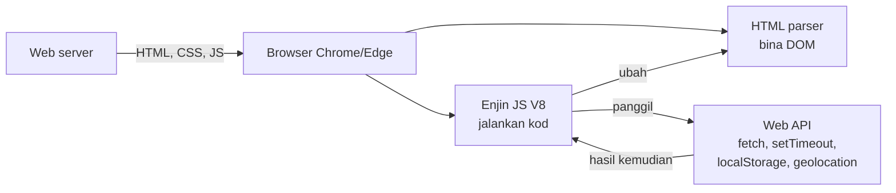
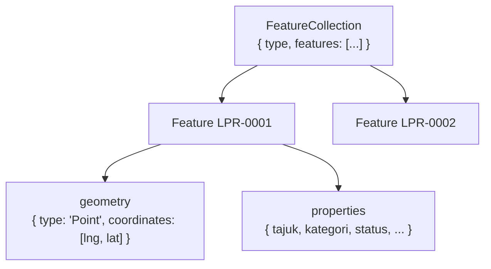
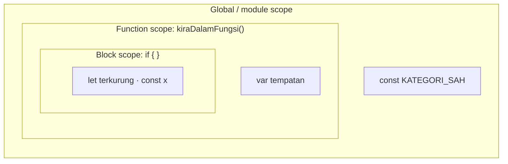
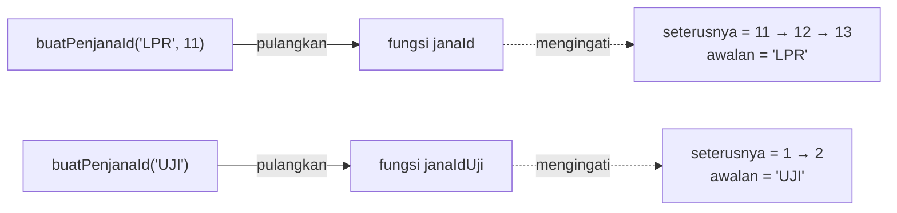
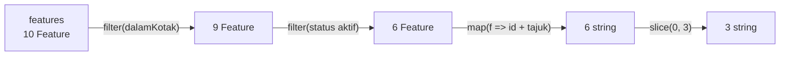
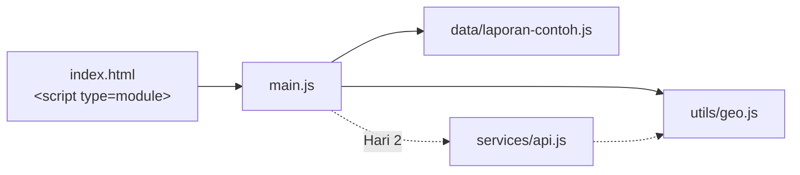

# Hari 1 — Modern JavaScript (ES6+) Core Syntax

[📅 Jadual](../JADUAL.md) · [🧪 Lab Hari 1](./lab.md) · [🗂️ Fail latihan](../projek/latihan/hari-1/)

> Seorang pegawai lapangan melaporkan papan tanda sempadan yang rosak di Putrajaya. Laporan itu tiba di sistem sebagai **teks JSON**, menjadi **objek JavaScript**, dipaparkan sebagai **titik di peta**, dan dikira dalam **statistik**. Hari ini kita membina asas untuk semua langkah itu: variable, jenis data, fungsi, objek, array — dan modul pertama GeoLapor, **`utils/geo.js`**. Tahap peserta berbeza-beza, jadi S1 bermula dari **asas** dan bergerak ke **moden**. Jika anda sudah biasa dengan asas, gunakan ⭐ Cabaran dalam lab.

---

## 🎯 Objektif Pembelajaran

Di akhir hari ini, peserta boleh:

| # | Objektif (boleh diukur) | Sesi | Bukti |
|---|------------------------|------|-------|
| O1 | **Membezakan** `var`/`let`/`const` dan **meramal** hasil `typeof` bagi 8 nilai (termasuk kes pelik `null` dan array) | S1 | Latihan 01 bahagian A–C: ramalan ditulis sebelum dijalankan, ≥ 7/8 betul |
| O2 | **Menulis** kawalan aliran (`if…else`, `switch`) dan loop (`for`, `for…of`, `while`, `do…while`) untuk mengesahkan koordinat | S1 | Latihan 01 D–F: output `F1 sah = 2`, `F2 LPR-0004` |
| O3 | **Membina** laporan sebagai GeoJSON `Feature` dan `FeatureCollection` dengan susunan `[lng, lat]` yang betul, dan **menerangkan** block scope vs function scope | S1 | Latihan 02: `B1 3`, `B2 baharu = 2`; ramalan C/D betul |
| O4 | **Menulis** fungsi (deklarasi, ungkapan, arrow) dengan default parameter, rest dan closure — termasuk `formatKoordinat()` dan `jarakKm()` | S2 | Latihan 03: `C1 2.92640, 101.69580`, `D1 5.05 km`, `F1 LPR-0011 …` |
| O5 | **Menggunakan** destructuring, spread/rest, `?.`, `??` dan `===` untuk mengekstrak dan mengemas kini feature **tanpa mengubah asal** | S3 | Latihan 04: `C1 baharu → selesai`, `F1 50 0` |
| O6 | **Memproses** FeatureCollection dengan `map/filter/reduce/find/some/toSorted`, **menukar** data dengan `JSON.parse/stringify`, dan **mengeksport** modul `utils/geo.js` | S4 | `node semak.js` → **6/6 ✅** |

---

## 📅 Jadual Hari Ini

| Masa | Sesi | Aktiviti (aturcara) | Fokus |
|------|------|---------------------|-------|
| 9.00 – 11.00 pagi | S1 | **Variable Management & Scope** | Asas → moden: JS dalam browser, sintaks, `var/let/const`, jenis data, operator, `if/switch`, loop, objek & GeoJSON pertama, scope & hoisting |
| 11.00 – 1.00 tgh | S2 | **Modern Strings & Functions** | Template literal, string method, fungsi (3 bentuk), default parameter/rest, closure; `formatKoordinat()`, `jarakKm()` |
| 1.00 – 2.30 ptg | — | Makan tengah hari | |
| 2.30 – 3.30 ptg | S3 | **Destructuring & Operators** | Destructuring `feature.properties` & `geometry.coordinates`, spread/rest, `?.`, `??`, `===` |
| 3.30 – 5.00 ptg | S4 | **Modern Array Methods & ES Modules** | `map/filter/reduce/find/some/sort`, `JSON.parse/stringify`, `import/export` → **`utils/geo.js`** |

> 💡 Sesi 2 jam (S1, S2) mempunyai rehat regangan ~10 minit di pertengahan — ikut isyarat penceramah.

---

## 🧭 Kenapa hari ini penting

Setiap sistem geospatial web moden — daripada portal MyGeoportal hingga dashboard dalaman — bergantung pada JavaScript di browser. Data vektor untuk web hampir selalu tiba sebagai **GeoJSON**, iaitu JSON biasa. Maka, sesiapa yang menguasai **objek, array dan fungsi** JavaScript boleh membaca, menapis dan meringkaskan data geospatial tanpa perisian tambahan.

| Tanpa hari ini | Dengan hari ini |
|----------------|-----------------|
| `var` di mana-mana; nilai berubah secara misteri | `const` secara default, `let` bila perlu — niat jelas |
| `'5' == 5` → `true`, pepijat senyap | `===` sentiasa; jenis diramal dengan betul |
| Koordinat `[2.93, 101.70]` → titik jatuh di Lautan Hindi | `[lng, lat]` untuk GeoJSON, disemak dengan `dalamMalaysia()` |
| Loop `for` bersarang 30 baris untuk mengira laporan | `features.filter(…).reduce(…)` — 3 baris, boleh dibaca |
| Satu fail `script.js` 2,000 baris | Modul kecil `utils/geo.js` yang diuji dan digunakan semula |

Modul `utils/geo.js` yang anda tulis hari ini akan digunakan **tanpa perubahan** pada Hari 3 (peta Leaflet), Hari 4 (Vite) dan Hari 5 (statistik).

---

## S1 — Variable Management & Scope: *asas → moden* (9.00 – 11.00 pagi)

> 📖 **Bacaan buku** — *JavaScript All-in-One For Dummies* (Minnick, 2023), pengayaan selepas sesi. Halaman PDF = muka surat cetak + 24.
>
> - **Cara menjalankan JS, `console`** — B1 · Bab 1 (Jumping into JavaScript), *Running Code in the Console; Running Code in a Browser Window* — ms. 33–40 (**PDF 57–64**)
> - **`let`/`const`, jenis data, scope** — B1 · Bab 3 (Using Data), *Making Variables with let; Making Constants with const; Taking a Look at the Data Types; Getting a Handle on Scope* — ms. 63–80 (**PDF 87–104**)
> - **Operator** — B1 · Bab 4 (Working with Operators and Expressions), *Operators: The Lineup* — ms. 83–90 (**PDF 107–114**)
> - **`if…else`, `switch`, loop** — B1 · Bab 5 (Controlling Flow), *Choosing a Path; Making Loops* — ms. 91–103 (**PDF 115–127**)
> - **Objek (asas GeoJSON)** — B1 · Bab 7 (Making and Using Objects), *Objects: The Basics; Creating Objects; Modifying Objects* — ms. 125–131 (**PDF 149–155**)

### 1.1 JavaScript: apa, di mana, dan bagaimana ia berjalan

JavaScript ialah bahasa pengaturcaraan **web**. HTML memberi struktur, CSS memberi rupa, JavaScript memberi **tingkah laku**: bertindak balas kepada klik, mengambil data dari server, melukis peta.



| Konsep | Maksud ringkas |
|--------|----------------|
| **Enjin JS** | Program dalam browser yang menjalankan kod anda (Chrome/Edge: **V8**; Firefox: SpiderMonkey) |
| **DOM** | Wakil halaman HTML sebagai objek yang boleh diubah oleh JS (Hari 3) |
| **Web API** | Kemudahan yang browser sediakan kepada JS: `fetch`, `setTimeout`, `localStorage`… (Hari 2 & 4) |
| **Node.js** | Enjin V8 yang sama, di luar browser — untuk alat (npm, Vite) dan server (mock API kita) |
| **Satu utas (single-threaded)** | JS menjalankan satu perkara pada satu masa; kerja lambat diserahkan kepada Web API (Hari 2) |

### 1.2 Tiga cara menjalankan JavaScript

**(a) Dalam halaman HTML** — cara sebenar aplikasi web:

```html
<!doctype html>
<html lang="ms">
  <head>
    <meta charset="utf-8" />
    <title>GeoLapor</title>
    <!-- type="module": boleh guna import/export, mod ketat, ditangguh (defer) secara automatik -->
    <script type="module" src="./main.js"></script>
  </head>
  <body>
    <h1>GeoLapor</h1>
  </body>
</html>
```

**(b) DevTools Console** — tekan `F12` → tab *Console*. Sesuai untuk menguji satu baris:

```js
> 0.1 + 0.2
< 0.30000000000000004
> typeof null
< 'object'
```

**(c) Node.js di terminal** — pantas untuk logik tulen (tiada DOM):

```bash
node latihan-01.js
```

> ⚠️ **Kesilapan lazim:** Membuka `index.html` dengan dwiklik (`file:///C:/...`). Browser **menyekat** `<script type="module">` dan `fetch` dari `file://`. Sentiasa guna server HTTP: VS Code **Live Server** atau `npx serve . -l 5500`.

### 1.3 Sintaks asas & alat `console`

```js
// Komen satu baris
/* Komen
   berbilang baris */

const tajuk = 'Papan tanda rosak'; // pernyataan diakhiri ; (pilihan, tetapi kita konsisten)
const Tajuk = 'lain';               // JS peka huruf besar/kecil: tajuk ≠ Tajuk

console.log('Nilai:', tajuk);       // output biasa
console.warn('Koordinat mencurigakan');  // kuning
console.error('Gagal memuat');      // merah
console.table([{ id: 'LPR-0001', status: 'baharu' }, { id: 'LPR-0002', status: 'selesai' }]); // jadual
```

> 💡 **Tip:** `console.log({ tajuk, status })` (dengan kurungan kerawit) mencetak **nama dan nilai** sekali gus: `{ tajuk: 'Papan tanda rosak', status: 'baharu' }`. Sangat berguna semasa nyahpepijat.

### 1.4 Variable: `var`, `let`, `const`

| | `var` (lama, ES5) | `let` (ES6) | `const` (ES6) |
|---|---|---|---|
| Scope | **fungsi** | **blok** `{ }` | **blok** `{ }` |
| Boleh ditetapkan semula? | ✅ | ✅ | ❌ |
| Boleh diisytihar semula dalam scope sama? | ✅ (bahaya) | ❌ | ❌ |
| Hoisting | diangkat, nilai `undefined` | diangkat tetapi dalam **TDZ** | diangkat tetapi dalam **TDZ** |
| Guna bila? | **Jangan** dalam kod baharu | nilai akan berubah (pembilang, loop) | **default** — hampir semua perkara |

```js
const KATEGORI_SAH = ['infrastruktur', 'alam-sekitar', 'tanah', 'utiliti', 'lain-lain'];
let bilanganDiproses = 0;
bilanganDiproses = bilanganDiproses + 1; // ✅ let boleh berubah

const laporan = { id: 'LPR-0001', status: 'baharu' };
laporan.status = 'dalam-tindakan';       // ✅ dibenarkan!
// laporan = {};                         // ❌ TypeError: Assignment to constant variable.
```

`const` bermaksud **rujukan tetap**, bukan kandungan beku. Objek dan array `const` masih boleh diubah isinya; yang tidak boleh ialah menunjuk variable itu kepada objek lain.

> ⚠️ **Kesilapan lazim:** *"`const` untuk constant sahaja seperti `PI`."* Tidak — dalam JS moden, `const` ialah **pilihan default**. Tukar kepada `let` hanya bila anda memang perlu menetapkan semula. Ini menjadikan kod lebih mudah dibaca: bila nampak `let`, pembaca tahu "nilai ini akan berubah".

### 1.5 Jenis data & `typeof`

JavaScript mempunyai **7 jenis primitif** dan **objek**:

| Jenis | Contoh GeoLapor | `typeof` |
|-------|-----------------|----------|
| `string` | `'LPR-0001'`, `"tanah"`, `` `teks ${x}` `` | `'string'` |
| `number` | `101.6958`, `2.9264`, `NaN`, `Infinity` | `'number'` |
| `bigint` | `9007199254740993n` (jarang) | `'bigint'` |
| `boolean` | `true`, `false` | `'boolean'` |
| `undefined` | medan yang tiada nilai | `'undefined'` |
| `null` | "sengaja kosong", cth `catatan: null` | `'object'` ⚠️ |
| `symbol` | key unik (jarang dalam aplikasi) | `'symbol'` |
| **object** | `{ type: 'Point' }` | `'object'` |
| array (objek) | `[101.6958, 2.9264]` | `'object'` ⚠️ |
| fungsi (objek) | `function () {}`, `() => {}` | `'function'` |

```js
typeof null;                    // 'object'   ← pepijat sejarah JS sejak 1995, tidak boleh dibaiki
Array.isArray([101.69, 2.93]);  // true       ← cara betul menyemak array
nilai === null;                 // true       ← cara betul menyemak null
typeof NaN;                     // 'number'   ← "Not a Number" ialah... number
Number.isNaN(Number('abc'));    // true
```

**Nombor titik apung (floating point).** Semua nombor JS ialah IEEE-754 64-bit:

```js
0.1 + 0.2;                 // 0.30000000000000004
(0.1 + 0.2).toFixed(2);    // '0.30'  (string!)
Number('101.6958');        // 101.6958
parseFloat('2.9264°');     // 2.9264  (berhenti pada aksara bukan nombor)
Number('2.9264°');         // NaN     (ketat)
```

> 💡 **Tip geospatial:** Koordinat 6–7 tempat perpuluhan sudah melebihi ketepatan GPS biasa. Jangan risau tentang error `0.00000000000004` pada koordinat; risau tentang **susunan** `[lng, lat]` yang salah (§1.9).

**Truthy & falsy.** Dalam `if`, nilai ditukar kepada boolean. **Hanya 8 nilai falsy**:

```text
false   0   -0   0n   ''   null   undefined   NaN
```

Semua yang lain truthy — termasuk `'0'`, `'false'`, `[]` dan `{}`.

### 1.6 Operator

| Kumpulan | Operator | Contoh → hasil |
|----------|----------|----------------|
| Aritmetik | `+ - * / % **` | `7 % 3` → `1` · `2 ** 10` → `1024` |
| Tugasan | `= += -= *= ++ --` | `n += 1` |
| Perbandingan ketat | `=== !==` | `'1' === 1` → `false` ✅ |
| Perbandingan longgar | `== !=` | `'1' == 1` → `true` ⚠️ (paksaan jenis) |
| Hubungan | `< > <= >=` | `lat >= 0.8` |
| Logik | `&& \|\| !` | `true && 'ya'` → `'ya'` · `0 \|\| 'lalai'` → `'lalai'` |
| Ternary | `syarat ? a : b` | `status === 'baharu' ? '🆕' : '✔️'` |
| String | `+` | `'5' + 3` → `'53'` ⚠️ · `'5' - 3` → `2` |

> ⚠️ **Kesilapan lazim:** Nilai dari borang HTML dan query string **sentiasa string**. `input.value + 1` dengan `'2.93'` memberi `'2.931'`, bukan `3.93`. Tukar dahulu: `Number(input.value) + 1`.

`&&` dan `||` tidak semestinya memulangkan `true/false` — ia memulangkan **salah satu operan**. `||` memulangkan operan truthy pertama; `&&` memulangkan operan falsy pertama (atau yang terakhir). Ini asas kepada `??` dalam S3.

### 1.7 Kawalan aliran: `if…else` dan `switch`

```js
const lat = 2.9264;
let zon;
if (lat < 0.8 || lat > 7.5) {
  zon = 'Di luar julat latitud Malaysia';
} else if (lat < 3.0) {
  zon = 'Selatan Lembah Klang';
} else {
  zon = 'Utara Lembah Klang';
}
console.log(zon); // Selatan Lembah Klang
```

`switch` sesuai bila **satu nilai** dibandingkan dengan banyak pilihan tetap (perbandingan `===`):

```js
function labelStatus(status) {
  switch (status) {
    case 'baharu':
      return 'Baharu';
    case 'dalam-tindakan':
      return 'Dalam Tindakan';
    case 'selesai':
    case 'ditolak':          // dua case berkongsi blok (fall-through sengaja)
      return 'Ditutup';
    default:
      return 'Status tidak sah';
  }
}
labelStatus('ditolak'); // 'Ditutup'
```

> ⚠️ **Kesilapan lazim:** Lupa `break` (atau `return`) dalam `switch`. Tanpanya, pelaksanaan **jatuh** ke `case` seterusnya — status `'baharu'` akan dilabel `'Dalam Tindakan'`.

### 1.8 Loop

| Loop | Guna bila | Contoh |
|--------|-----------|--------|
| `for (let i = 0; i < n; i++)` | perlu indeks | lelar koordinat & cetak kedudukan |
| `for (const x of senarai)` | lelar **nilai** array/string | setiap feature |
| `for (const k in objek)` | lelar **key** objek | medan dalam `properties` |
| `while (syarat)` | bilangan pusingan tidak diketahui | cari ID yang belum digunakan |
| `do { } while (syarat)` | badan mesti berjalan **sekurang-kurangnya sekali** | cuba sambung semula |

```js
const senaraiKoordinat = [[101.6958, 2.9264], [2.935, 101.701], [151.2093, -33.8688], [100.3327, 5.4164]];
let bilanganSah = 0;
for (let i = 0; i < senaraiKoordinat.length; i++) {
  const lng = senaraiKoordinat[i][0];
  const lat = senaraiKoordinat[i][1];
  if (lng < 99.5 || lng > 119.5 || lat < 0.8 || lat > 7.5) {
    console.log(i, 'LUAR kotak Malaysia');
    continue;                         // langkau baki badan, ke pusingan seterusnya
  }
  bilanganSah++;
}
console.log('sah =', bilanganSah);    // 1 LUAR…, 2 LUAR…, sah = 2

// while — cari ID pertama yang belum digunakan
const idDigunakan = ['LPR-0001', 'LPR-0002', 'LPR-0003'];
let nombor = 1;
while (idDigunakan.includes('LPR-' + String(nombor).padStart(4, '0'))) {
  nombor++;
}
console.log('LPR-' + String(nombor).padStart(4, '0')); // LPR-0004

// do...while — sekurang-kurangnya sekali
let cubaan = 0;
let berjaya = false;
do {
  cubaan++;
  berjaya = cubaan >= 3;              // anggap berjaya pada cubaan ke-3
} while (!berjaya && cubaan < 5);     // cubaan = 3
```

> ⚠️ **Kesilapan lazim:** `for…in` atas **array** — ia melelar indeks sebagai *string* (`'0'`, `'1'`) dan boleh termasuk property warisan. Untuk array, guna `for…of` atau array method (S4).

### 1.9 Objek & GeoJSON pertama

Objek ialah himpunan pasangan **key: nilai**. Satu laporan GeoLapor ialah **GeoJSON `Feature`** (RFC 7946) — objek biasa dengan struktur piawai:

```js
const laporan = {
  type: 'Feature',                                              // wajib: jenis objek GeoJSON
  id: 'LPR-0001',
  geometry: { type: 'Point', coordinates: [101.6958, 2.9264] }, // [lng, lat] !!!
  properties: {                                                 // data atribut — bebas
    id: 'LPR-0001',
    tajuk: 'Papan tanda sempadan rosak',
    kategori: 'infrastruktur',
    status: 'baharu',
    catatan: 'Tiang condong, perlu ganti.',
    pelapor: 'pegawai1@latihan.test',
    dicipta: '2026-09-01T09:15:00+08:00',
    dikemaskini: '2026-09-01T09:15:00+08:00',
  },
};

laporan.properties.tajuk;          // notasi titik
const medan = 'kategori';
laporan.properties[medan];         // notasi kurungan — bila nama medan dalam variable
laporan.properties.keutamaan = 'tinggi';  // tambah medan
delete laporan.properties.keutamaan;      // buang medan
Object.keys(laporan.properties);   // ['id', 'tajuk', ...] — 8 key
```

Banyak feature dikumpul dalam **`FeatureCollection`**:

```js
const koleksi = {
  type: 'FeatureCollection',
  features: [laporan /* , feature lain… */],
};
koleksi.features.push(laporanLain);
koleksi.features.length; // bilangan laporan
```



> ⚠️ **Kesilapan paling mahal dalam kursus ini: `[lng, lat]` vs `[lat, lng]`.**
>
> | Sistem | Susunan | Putrajaya |
> |--------|---------|-----------|
> | **GeoJSON** (RFC 7946), Turf.js, MapLibre, API kita | **`[lng, lat]`** (x, y) | `[101.6958, 2.9264]` |
> | **Leaflet** `L.marker()`, Google Maps, teks manusia | **`[lat, lng]`** | `[2.9264, 101.6958]` |
>
> Jika terbalik, `[2.9264, 101.6958]` dibaca sebagai lng 2.9°, lat 101.7° — **latitud mustahil** (> 90°). Sesetengah pustaka menolak; yang lain melukis titik di tempat pelik tanpa amaran. Ingat: **GeoJSON = x dahulu = longitud dahulu**.

### 1.10 Scope & hoisting

**Scope** menentukan di mana variable boleh dilihat.



Scope dalam boleh melihat ke **luar**; scope luar **tidak** boleh melihat ke dalam.

```js
if (true) {
  var bocor = 'var bocor keluar dari blok';
  let terkurung = 'let kekal dalam blok';
}
console.log(bocor);            // 'var bocor keluar dari blok'  ← var abaikan blok!
console.log(typeof terkurung); // 'undefined'
```

**Hoisting** — pengisytiharan "diangkat" ke atas skopnya sebelum kod berjalan:

```js
console.log(diangkat);   // undefined     (var: diangkat, nilai belum)
var diangkat = 'nilai';

console.log(belumSedia); // ❌ ReferenceError (let/const: dalam Temporal Dead Zone)
let belumSedia = 'nilai';

sapa('PGN');             // ✅ 'Salam, PGN' — deklarasi fungsi diangkat SEPENUHNYA
function sapa(nama) { return 'Salam, ' + nama; }
```

**Kenapa `var` dalam loop berbahaya** (preview Hari 2):

```js
for (var i = 0; i < 3; i++) setTimeout(() => console.log(i), 0); // 3 3 3
for (let j = 0; j < 3; j++) setTimeout(() => console.log(j), 0); // 0 1 2
```

`var i` ialah **satu** variable dikongsi; bila `setTimeout` akhirnya berjalan, loop sudah tamat dan `i === 3`. `let j` mencipta variable **baharu** untuk setiap pusingan.

> 💡 **Tip:** Dalam `<script type="module">` dan fail ES module, kod berjalan dalam **mod ketat** (*strict mode*) secara automatik dan variable peringkat atas **tidak** menjadi global (`window.x`). Satu lagi sebab untuk sentiasa guna modul.

---

## S2 — Modern Strings & Functions (11.00 pagi – 1.00 tgh)

> 📖 **Bacaan buku** — *JavaScript All-in-One For Dummies* (Minnick, 2023), pengayaan selepas sesi. Halaman PDF = muka surat cetak + 24.
>
> - **Template literal, string method** — B1 · Bab 3 (Using Data), *String data type* — ms. 69–73 (**PDF 93–97**)
> - **Fungsi, parameter default/rest, arrow function, hoisting** — B1 · Bab 8 (Writing and Running Functions), *Functions: An Introduction; Writing Functions; Declaring Anonymous functions* — ms. 140–154 (**PDF 164–178**)

### 2.1 Template literal

Backtick `` ` `` membolehkan **interpolasi** `${ungkapan}` dan **berbilang baris**:

```js
const f = { id: 'LPR-0001', properties: { tajuk: '  Papan tanda sempadan rosak ', kategori: 'infrastruktur', status: 'baharu' } };

// Cara lama — mudah tersilap ruang & tanda +
const lama = '[' + f.id + '] ' + f.properties.tajuk.trim() + ' (' + f.properties.kategori + ')';

// Cara moden
const ringkasan = `[${f.id}] ${f.properties.tajuk.trim()}
  Kategori : ${f.properties.kategori.toUpperCase()}
  Status   : ${f.properties.status === 'baharu' ? '🆕 Baharu' : f.properties.status}`;
// [LPR-0001] Papan tanda sempadan rosak
//   Kategori : INFRASTRUKTUR
//   Status   : 🆕 Baharu
```

Dalam `${ }` boleh diletakkan **sebarang ungkapan**: panggilan fungsi, ternary, aritmetik — tetapi bukan pernyataan (`if`, `for`).

> ⚠️ **Kesilapan lazim:** Membina HTML dengan template literal dan data pengguna: `` el.innerHTML = `<b>${tajuk}</b>` ``. Jika `tajuk` mengandungi ``, kod penyerang berjalan (XSS). Hari 3 kita guna `textContent` / `createElement` — **jangan** `innerHTML` dengan data pengguna.

### 2.2 String method yang kerap digunakan

| Method | Contoh | Hasil |
|--------|--------|-------|
| `trim()` | `'  Papan '.trim()` | `'Papan'` |
| `toUpperCase()` / `toLowerCase()` | `'tanah'.toUpperCase()` | `'TANAH'` |
| `includes(x)` | `'Batu sempadan'.includes('sempadan')` | `true` |
| `startsWith(x)` / `endsWith(x)` | `'LPR-0007'.startsWith('LPR-')` | `true` |
| `split(pemisah)` | `'LPR-0007'.split('-')` | `['LPR', '0007']` |
| `padStart(n, c)` | `String(42).padStart(4, '0')` | `'0042'` |
| `replaceAll(a, b)` | `'alam-sekitar'.replaceAll('-', ' ')` | `'alam sekitar'` |
| `slice(a, b)` | `'2026-09-01T09:15'.slice(0, 10)` | `'2026-09-01'` |
| `localeCompare(b)` | `'a'.localeCompare('b')` | `-1` (untuk isihan) |

String **tidak boleh diubah** (*immutable*): setiap method memulangkan string **baharu**.

### 2.3 Fungsi: tiga bentuk

Fungsi ialah blok kod bernama yang menerima **parameter** dan memulangkan **nilai** (`return`). Tanpa `return`, fungsi memulangkan `undefined`.

```js
// 1) Deklarasi fungsi — diangkat (boleh dipanggil sebelum ditulis)
function formatKoordinat([lng, lat], dp = 5) {
  return `${lat.toFixed(dp)}, ${lng.toFixed(dp)}`;   // teks manusia: lat dahulu
}

// 2) Ungkapan fungsi — fungsi sebagai NILAI dalam variable
const keRadian = function (darjah) {
  return (darjah * Math.PI) / 180;
};

// 3) Arrow function (ES6) — ringkas
const labelKategori = (kod) => kod.replaceAll('-', ' ').toUpperCase(); // satu ungkapan = return tersirat
const kuasaDua = (x) => {
  const hasil = x * x;       // badan berkurungan {} → PERLU return
  return hasil;
};

formatKoordinat([101.6958, 2.9264]);     // '2.92640, 101.69580'
formatKoordinat([101.6958, 2.9264], 2);  // '2.93, 101.70'
labelKategori('alam-sekitar');           // 'ALAM SEKITAR'
```

| | Deklarasi | Ungkapan | Arrow |
|---|---|---|---|
| Diangkat (hoisted) | ✅ penuh | ❌ (ikut `const`) | ❌ (ikut `const`) |
| `this` sendiri | ✅ | ✅ | ❌ (warisi dari luar) |
| Sesuai untuk | fungsi utama modul | jarang | callback pendek, `map/filter` |

> ⚠️ **Kesilapan lazim:** Arrow yang memulangkan **objek** mesti dibalut kurungan: `(f) => ({ id: f.id })`. Tanpa `( )`, `{` dianggap badan fungsi dan hasilnya `undefined`.

### 2.4 Parameter: default, rest, dan nilai pulangan

```js
// Default parameter — digunakan bila argumen undefined (atau tidak diberi)
const sapa = (nama = 'Pegawai', jabatan = 'PGN') => `Salam ${nama} (${jabatan})`;
sapa();                    // 'Salam Pegawai (PGN)'
sapa('Aina');              // 'Salam Aina (PGN)'
sapa(undefined, 'JUPEM');  // 'Salam Pegawai (JUPEM)'

// Parameter rest — kumpul baki argumen menjadi ARRAY sebenar
function purata(...nombor) {
  if (nombor.length === 0) return 0;          // pulang awal (guard clause)
  let jumlah = 0;
  for (const n of nombor) jumlah += n;
  return jumlah / nombor.length;
}
purata(2.9264, 2.9223, 2.9395);  // 2.9294
purata();                        // 0
```

> 💡 **Tip:** Fungsi yang baik: **satu tugas**, nama kata kerja (`kira…`, `format…`, `tapis…`), menerima input melalui parameter dan memulangkan output — tidak mengubah variable global. Fungsi begini (*pure function*) mudah diuji — itulah sebabnya `utils/geo.js` boleh disemak oleh `semak.js`.

### 2.5 Function scope & closure

Setiap panggilan fungsi mencipta scope baharu. **Closure** berlaku apabila fungsi dalaman **mengingati** variable dari scope luar walaupun fungsi luar sudah tamat:

```js
function buatPenjanaId(awalan = 'LPR', mula = 1) {
  let seterusnya = mula;                                       // "peribadi"
  return () => `${awalan}-${String(seterusnya++).padStart(4, '0')}`;
}

const janaId = buatPenjanaId('LPR', 11);
const janaIdUji = buatPenjanaId('UJI');
janaId();     // 'LPR-0011'
janaId();     // 'LPR-0012'
janaIdUji();  // 'UJI-0001'  ← kaunter berasingan
janaId();     // 'LPR-0013'
```



Closure digunakan di mana-mana: event handler (Hari 3), `debounce`, store keadaan (Hari 5), dan callback `fetch` (Hari 2).

### 2.6 Fungsi tertib tinggi — fungsi sebagai argumen

Fungsi dalam JS ialah **nilai**: boleh disimpan, dihantar sebagai argumen, dan dipulangkan.

```js
function prosesSemua(senarai, fn) {       // fn = "callback"
  const hasil = [];
  for (const item of senarai) hasil.push(fn(item));
  return hasil;
}
prosesSemua([[101.6958, 2.9264], [101.6505, 2.9223]], (k) => formatKoordinat(k, 3));
// ['2.926, 101.696', '2.922, 101.650']
```

Anda baru sahaja menulis semula `Array.prototype.map` (S4). Konsep callback ini juga asas kepada **Hari 2** (async).

### 2.7 GeoLapor: `jarakKm()` — formula haversine

Bumi bukan satah; jarak antara dua koordinat darjah **tidak** boleh dikira dengan Pythagoras. Formula **haversine** memberi jarak bulatan besar pada sfera berjejari 6,371 km:

```js
const JEJARI_BUMI_KM = 6371;

function jarakKm([lng1, lat1], [lng2, lat2]) {          // destructuring dalam parameter (S3)
  const dLat = keRadian(lat2 - lat1);
  const dLng = keRadian(lng2 - lng1);
  const a =
    Math.sin(dLat / 2) ** 2 +
    Math.cos(keRadian(lat1)) * Math.cos(keRadian(lat2)) * Math.sin(dLng / 2) ** 2;
  return 2 * JEJARI_BUMI_KM * Math.asin(Math.sqrt(a));
}

jarakKm([101.6958, 2.9264], [101.6505, 2.9223]).toFixed(2); // '5.05'  (Putrajaya → Cyberjaya, km)
```

| Tempat perpuluhan | Ketepatan kira-kira di khatulistiwa |
|-------------------|-------------------------------------|
| 2 dp | ~1.1 km |
| 4 dp | ~11 m |
| **5 dp** (default `formatKoordinat`) | **~1.1 m** |
| 6 dp | ~0.11 m |

> 💡 **Tip:** Haversine menganggap bumi sfera sempurna — error ≤ 0.5%. Untuk ukur tanah sebenar (GDM2000, elipsoid GRS80) guna pustaka seperti Turf/proj4 (Hari 4) atau GIS. Untuk "laporan mana paling hampir", haversine lebih dari cukup.

---

## S3 — Destructuring & Operators (2.30 – 3.30 ptg)

> 📖 **Bacaan buku** — *JavaScript All-in-One For Dummies* (Minnick, 2023), pengayaan selepas sesi. Halaman PDF = muka surat cetak + 24.
>
> - **Destructuring & spread array** — B1 · Bab 6 (Using Arrays), *Destructuring Arrays; Spreading Arrays* — ms. 122–123 (**PDF 146–147**)
> - **Salin objek dengan spread** — B1 · Bab 7 (Making and Using Objects), *Comparing and Copying Objects* — ms. 132–134 (**PDF 156–158**)
> - **Perbandingan ketat `===`** — B1 · Bab 4 (Working with Operators and Expressions), *Comparison operators* — ms. 85–86 (**PDF 109–110**)

### 3.1 Destructuring objek

Destructuring = **membongkar** nilai dari objek/array ke variable dalam satu pernyataan.

```js
const pertama = laporanContoh.features[0];

// Tanpa destructuring (3 baris untuk 3 nilai, laluan berulang):
//   const id = pertama.id;
//   const tajuk = pertama.properties.tajuk;
//   const lng = pertama.geometry.coordinates[0];

// Dengan destructuring — bentuk kiri MENIRU bentuk objek
const {
  id,
  properties: { tajuk, status },          // bersarang
  geometry: { coordinates: [lng, lat] },  // objek → array
} = pertama;
// id='LPR-0001'  tajuk='Papan tanda sempadan rosak'  status='baharu'  lng=101.6958  lat=2.9264

// Namakan semula (kategori → kat) + nilai default
const { kategori: kat, keutamaan = 'biasa' } = pertama.properties;
// kat='infrastruktur'  keutamaan='biasa' (medan tiada → default)
```

> ⚠️ **Kesilapan lazim:** Nilai default destructuring hanya untuk **`undefined`**, bukan `null`. LPR-0006 ada `catatan: null`:
> ```js
> const { catatan = 'Tiada catatan' } = keenam.properties;  // catatan === null  (default TIDAK digunakan)
> const catatanSelamat = keenam.properties.catatan ?? 'Tiada catatan';  // 'Tiada catatan' ✅
> ```

### 3.2 Destructuring array

```js
const [pertama, , ketiga] = laporanContoh.features;   // langkau elemen ke-2

// GeoJSON → Leaflet: tukar susunan
const keLeaflet = ([lng, lat]) => [lat, lng];
keLeaflet([101.6958, 2.9264]);   // [2.9264, 101.6958]

// Tukar dua nilai tanpa variable sementara
let a = 2.935, b = 101.701;
[a, b] = [b, a];                 // a=101.701  b=2.935  — cara betulkan koordinat terbalik!
```

### 3.3 Destructuring dalam parameter fungsi

```js
// Fungsi hanya "meminta" medan yang ia perlukan — dokumentasi percuma
const ringkas = ({ id, properties: { status } }) => `${id}:${status}`;
ringkas(pertama);  // 'LPR-0001:baharu'

// Corak "objek opsyen" — nama argumen jelas, susunan tidak penting, semua pilihan
function tapisLaporan(features, { kategori, status, q } = {}) { /* … */ }
tapisLaporan(senarai, { status: 'baharu' });
tapisLaporan(senarai);   // = {} → semua undefined → tiada tapisan
```

Corak `{ … } = {}` ini digunakan dalam **semua** API dikunci kursus: `tapisLaporan(features, {…} = {})`, `mintaJson(laluan, {…} = {})` (Hari 2).

### 3.4 Spread `...` — salin & gabung

```js
// Kemas kini TANPA mengubah asal (corak "immutable update" — penting untuk state Hari 5)
const dikemas = {
  ...pertama,                                                   // salin semua medan aras atas
  properties: { ...pertama.properties, status: 'selesai' },     // salin properties, ganti status
};
pertama.properties.status;  // 'baharu'   ← asal tidak berubah
dikemas.properties.status;  // 'selesai'

// Array
const semuaLat = [2.9264, 2.9395, 2.9147];
Math.max(...semuaLat);      // 2.9395   (spread array → argumen berasingan)
const gabung = [...senaraiA, ...senaraiB];
```

> ⚠️ **Kesilapan lazim:** Spread ialah salinan **cetek** (*shallow*). Objek bersarang masih **dikongsi**:
> ```js
> const cetek = { ...pertama };
> cetek.properties === pertama.properties;     // true — objek SAMA!
> cetek.properties.status = 'X';               // ❌ turut mengubah pertama!
> const dalam = structuredClone(pertama);      // salinan dalam (deep copy) sebenar
> ```

### 3.5 Rest dalam destructuring — buang medan

```js
const { id: _id, pelapor, ...awam } = pertama.properties;
// awam = { tajuk, kategori, status, catatan, dicipta, dikemaskini } — tanpa id & e-mel pelapor
```

Berguna untuk membuang medan peribadi sebelum eksport/kongsi.

### 3.6 Optional chaining `?.` dan nullish coalescing `??`

```js
pertama.properties.lampiran[0].url;                     // ❌ TypeError: Cannot read properties of undefined
pertama.properties.lampiran?.[0]?.url;                  // undefined (berhenti awal, tiada error)
pertama.properties.lampiran?.[0]?.url ?? 'tiada lampiran';  // 'tiada lampiran'

const respons = null;                                   // bayangkan API gagal
respons?.features?.length ?? 0;                          // 0
```

**`??` lawan `||`** — perbezaan paling penting:

| Ungkapan | `x = 0` | `x = ''` | `x = null` | `x = undefined` |
|----------|---------|----------|------------|-----------------|
| `x \|\| 50` | **50** ⚠️ | 50 | 50 | 50 |
| `x ?? 50` | **0** ✅ | `''` | 50 | 50 |

```js
const tetapan = { had: 0 };
tetapan.had || 50;   // 50   ← salah! pengguna mahu had 0
tetapan.had ?? 50;   // 0    ← betul: ?? hanya ganti null/undefined
```

**Logical assignment** (ES2021):

```js
opsyen.had ??= 20;    // tetapkan jika null/undefined
opsyen.mula ||= 0;    // tetapkan jika falsy
opsyen.aktif &&= semak();  // tetapkan jika truthy
```

### 3.7 Perbandingan ketat

```js
'0' == 0;        // true   ⚠️ paksaan jenis
'0' === 0;       // false  ✅
[] == false;     // true   ⚠️ (!)
null == undefined;   // true  — satu-satunya kes == yang kadang berguna
NaN === NaN;     // false  — NaN tidak sama dengan apa-apa, termasuk dirinya
Number.isNaN(x); // cara betul · Object.is(NaN, NaN) → true
```

> 💡 **Tip:** Peraturan pasukan yang mudah: **sentiasa `===` dan `!==`**. ESLint (Hari 4) akan menguatkuasakannya dengan peraturan `eqeqeq`.

---

## S4 — Modern Array Methods & ES Modules (3.30 – 5.00 ptg)

> 📖 **Bacaan buku** — *JavaScript All-in-One For Dummies* (Minnick, 2023), pengayaan selepas sesi. Halaman PDF = muka surat cetak + 24.
>
> - **`map`/`filter`/`reduce` & method array lain** — B1 · Bab 6 (Using Arrays), *Programming with Array Methods; Looping with Array Methods* — ms. 112–121 (**PDF 136–145**)
> - **`JSON.parse` / `JSON.stringify`** — B1 · Bab 11 (Writing Asynchronous JavaScript), *Working with JSON data* — ms. 220–222 (**PDF 244–246**)
> - **ES Modules `import`/`export`** — B1 · Bab 12 (Using JavaScript Modules), *Keseluruhan bab* — ms. 223–229 (**PDF 247–253**)

### 4.1 Mengubah vs tidak mengubah (mutating vs non-mutating)

| Mengubah array asal ⚠️ | Memulangkan array/nilai BAHARU ✅ |
|------------------------|----------------------------------|
| `push`, `pop`, `shift`, `unshift` | `map`, `filter`, `slice`, `concat` |
| `sort`, `reverse`, `splice` | `toSorted`, `toReversed`, `toSpliced`, `with` (ES2023) |
| `fill` | `reduce`, `find`, `some`, `every`, `flatMap`, `at` |

```js
const tindanan = ['LPR-0001', 'LPR-0002'];
tindanan.push('LPR-0003');   // 3 (panjang baharu) — tambah di hujung
tindanan.pop();              // 'LPR-0003'         — buang dari hujung
```

### 4.2 Method utama atas `features`

Semua contoh guna `laporanContoh` ([`data/laporan-contoh.js`](../projek/latihan/hari-1/data/laporan-contoh.js)) — 10 laporan sintetik, **LPR-0010 sengaja berkoordinat terbalik**.

```js
import { laporanContoh } from './data/laporan-contoh.js';
const { features } = laporanContoh;

// forEach — lakukan sesuatu untuk setiap elemen (TIADA nilai pulangan)
features.forEach((f) => console.log(f.id));

// map — ubah SETIAP elemen → array baharu, panjang SAMA
const senaraiId = features.map((f) => f.id);          // ['LPR-0001', …, 'LPR-0010']

// filter — pilih elemen yang lulus ujian → array baharu, panjang ≤ asal
const baharu = features.filter((f) => f.properties.status === 'baharu');  // 5 feature

// find / findIndex — elemen PERTAMA yang padan (atau undefined / -1)
features.find((f) => f.id === 'LPR-0007')?.properties.tajuk;  // 'Pencerobohan tanah kerajaan'
features.findIndex((f) => f.id === 'LPR-0004');               // 3

// some / every — adakah SEKURANG-KURANGNYA SATU / SEMUA lulus?
const dalamKotak = ([lng, lat]) => lng >= 99.5 && lng <= 119.5 && lat >= 0.8 && lat <= 7.5;
features.some((f) => f.properties.status === 'ditolak');      // true
features.every((f) => dalamKotak(f.geometry.coordinates));    // false  ← LPR-0010!

// reduce — lipat seluruh array menjadi SATU nilai (nombor, objek, …)
const ikutKategori = features.reduce((acc, f) => {
  const k = f.properties.kategori;
  acc[k] = (acc[k] ?? 0) + 1;       // ?? dari S3
  return acc;                        // WAJIB pulangkan penumpuk
}, {});                              // nilai awal
// { infrastruktur: 3, 'alam-sekitar': 2, tanah: 2, utiliti: 2, 'lain-lain': 1 }

// toSorted — isih TANPA mengubah asal (ES2023)
const terkini = features.toSorted((a, b) => b.properties.dicipta.localeCompare(a.properties.dicipta));
terkini.slice(0, 3).map((f) => f.id);   // ['LPR-0010', 'LPR-0008', 'LPR-0006']
```



```js
// Chaining — "paip data" yang dibaca dari atas ke bawah
const ringkasan = features
  .filter((f) => dalamKotak(f.geometry.coordinates))
  .filter((f) => !['selesai', 'ditolak'].includes(f.properties.status))
  .map(({ id, properties: { tajuk } }) => `${id} ${tajuk}`)
  .slice(0, 3);
```

> ⚠️ **Kesilapan lazim:** `[10, 9, 1].sort()` → `[1, 10, 9]`. Tanpa fungsi pembanding, `sort` membandingkan sebagai **string**. Untuk nombor: `.sort((a, b) => a - b)`. Dan ingat `sort()` **mengubah** array asal — guna `toSorted()`.

> ⚠️ **Kesilapan lazim:** Lupa `return` dalam `reduce` atau dalam `map` berkurungan `{ }` → hasil `undefined`.

| Soalan | Method |
|--------|--------|
| "Tukar setiap X kepada Y" | `map` |
| "Hanya yang memenuhi syarat" | `filter` |
| "Yang pertama memenuhi syarat" | `find` |
| "Adakah ada / adakah semua?" | `some` / `every` |
| "Kira / jumlah / kumpul ikut kumpulan" | `reduce` |
| "Susun" | `toSorted` |
| "Setiap elemen → beberapa elemen, kemudian rata" | `flatMap` |

### 4.3 JSON — format pertukaran data

**JSON** (*JavaScript Object Notation*) ialah **teks** yang mewakili data. Setiap API dalam kursus ini (Hari 2) menghantar dan menerima JSON, dan GeoJSON ialah JSON.

| Objek JavaScript | Teks JSON |
|------------------|-----------|
| `{ id: 'LPR-0001' }` | `{"id":"LPR-0001"}` — key **mesti** petikan berganda |
| `'teks'` atau `"teks"` | hanya `"teks"` |
| `undefined`, fungsi, `Symbol` | ❌ tidak wujud (digugurkan) |
| `NaN`, `Infinity` | ❌ menjadi `null` |
| `new Date()` | menjadi string ISO |
| komen, koma di hujung | ❌ tidak dibenarkan |

```js
// Objek → teks (untuk hantar ke API, simpan dalam localStorage)
const teks = JSON.stringify(laporanContoh);                 // '{"type":"FeatureCollection",…'
JSON.stringify({ id: 'LPR-0001', lokasi: [101.6958, 2.9264] }, null, 2);  // inden 2 ruang — mudah dibaca

// Teks → objek (response API, fail .geojson)
const semula = JSON.parse(teks);
semula.features.length;       // 10
semula === laporanContoh;     // false — objek BAHARU (satu lagi cara salinan dalam)

// Apa yang hilang
JSON.stringify({ tarikh: new Date('2026-09-28T01:00:00Z'), tiada: undefined, fn() {}, nan: NaN });
// '{"tarikh":"2026-09-28T01:00:00.000Z","nan":null}'

// JSON rosak → SyntaxError. SENTIASA bungkus parse data luar dengan try...catch
try {
  JSON.parse("{'id': 'LPR-0001'}");   // petikan tunggal — tidak sah
} catch (ralat) {
  console.error('Fail GeoJSON rosak:', ralat.name); // SyntaxError
}
```

> 💡 **Tip:** `JSON.stringify(obj, null, 2)` ialah cara pantas melihat struktur response API dalam console atau menyimpan fail `.geojson` yang boleh dibaca manusia. Kod server mock API kita melakukan tepat ini.

### 4.4 ES Modules — `import` / `export`

Modul = satu fail dengan **scope sendiri**. Hanya yang di-`export` boleh dilihat oleh fail lain.

```js
// utils/geo.js — EXPORT bernama (named export)
export function formatKoordinat([lng, lat], dp = 5) { /* … */ }
export function jarakKm(a, b) { /* … */ }
const keRadian = (d) => (d * Math.PI) / 180;   // TIDAK dieksport → peribadi kepada modul

// data/laporan-contoh.js
export const laporanContoh = { type: 'FeatureCollection', features: [/* … */] };
```

```js
// main.js — IMPORT
import { laporanContoh } from './data/laporan-contoh.js';
import { formatKoordinat, jarakKm } from './utils/geo.js';
import * as geo from './utils/geo.js';            // namespace: geo.jarakKm(…)
import { jarakKm as jarak } from './utils/geo.js'; // namakan semula
```

```html
<!-- index.html — hanya titik masuk perlu type="module" -->
<script type="module" src="./main.js"></script>
```



| Peraturan modul browser | Akibat jika dilanggar |
|--------------------------|-----------------------|
| Laluan relatif **mesti** bermula `./` atau `../` | `import … from 'utils/geo.js'` → error "bare specifier" (Vite akan membenarkan nama pakej pada Hari 4) |
| Sambungan **`.js` wajib** | `'./utils/geo'` → 404 |
| Mesti dihidang melalui **HTTP** | `file://` → error CORS |
| Modul dijalankan **sekali** walau diimport banyak kali | selamat untuk data dikongsi |
| Mod ketat, module scope, `defer` automatik | `this` peringkat atas `undefined`; tiada global tidak sengaja |

> 💡 **Tip:** *Named export* lebih disukai berbanding `export default` untuk modul utiliti — nama konsisten di setiap fail yang mengimport, dan editor boleh auto-import dengan tepat.

### 4.5 GeoLapor: modul `utils/geo.js` (API dikunci)

Enam fungsi ini ialah kontrak — nama dan tandatangan **mesti tepat** kerana Hari 3–5 bergantung padanya.

| Fungsi | Input | Output | Contoh |
|--------|-------|--------|--------|
| `formatKoordinat([lng, lat], dp = 5)` | koordinat GeoJSON | `"lat, lng"` | `'2.92640, 101.69580'` |
| `jarakKm(a, b)` | dua `[lng, lat]` | km (number) | `5.05…` |
| `tapisLaporan(features, { kategori, status, q } = {})` | array Feature | array Feature baharu | `q` tidak peka huruf besar/kecil atas `tajuk` |
| `kiraIkut(features, medan)` | array Feature, nama medan | `{ nilai: bilangan }` | `{ baharu: 4, … }` |
| `bboxDari(features)` | array Feature | `[minLng, minLat, maxLng, maxLat]` atau `null` | `[101.644, 2.9012, 101.722, 2.9555]` |
| `dalamMalaysia([lng, lat])` | koordinat | boolean | `false` bagi `[2.935, 101.701]` |

Petikan pelaksanaan:

```js
export function tapisLaporan(features, { kategori, status, q } = {}) {
  const carian = q?.trim().toLowerCase();                 // ?. — q mungkin undefined
  return features.filter(({ properties: p }) => {
    if (kategori && p.kategori !== kategori) return false; // '' / undefined → abaikan
    if (status && p.status !== status) return false;
    if (carian && !p.tajuk.toLowerCase().includes(carian)) return false;
    return true;
  });
}

export function kiraIkut(features, medan) {
  return features.reduce((kiraan, f) => {
    const nilai = f.properties?.[medan] ?? '(tiada)';     // medan dinamik → notasi kurungan
    kiraan[nilai] = (kiraan[nilai] ?? 0) + 1;
    return kiraan;
  }, {});
}

// Sokong Point, LineString, Polygon — koordinat bersarang pada kedalaman berbeza
function semuaKoordinat(koordinat) {
  if (typeof koordinat[0] === 'number') return [koordinat];  // satu kedudukan [lng, lat]
  return koordinat.flatMap(semuaKoordinat);                   // rekursi: turun satu aras
}

export function bboxDari(features) {
  const titik = features.filter((f) => f.geometry?.coordinates).flatMap((f) => semuaKoordinat(f.geometry.coordinates));
  if (titik.length === 0) return null;
  const lngs = titik.map(([lng]) => lng);
  const lats = titik.map(([, lat]) => lat);
  return [Math.min(...lngs), Math.min(...lats), Math.max(...lngs), Math.max(...lats)];
}
```

Lihat betapa satu rekod rosak merosakkan hasil:

```js
bboxDari(sah);        // [101.644, 2.9012, 101.722, 2.9555]   ← kotak kecil sekitar Putrajaya
bboxDari(features);   // [2.935, 2.9012, 101.722, 101.701]    ← kotak "gila" merentasi separuh dunia
```

Pada Hari 3, `bboxDari()` akan digunakan untuk `map.fitBounds()` — satu koordinat terbalik akan menzum peta keluar ke seluruh dunia. Itulah sebabnya `dalamMalaysia()` wujud.

> 💡 **Tip:** `bbox` dalam GeoJSON dan dalam query API kita (`?bbox=minLng,minLat,maxLng,maxLat`) juga ikut susunan **x dahulu** — konsisten dengan `[lng, lat]`.

---

## 📦 Hasil Hari Ini

- [ ] Latihan 01–05 lengkap; setiap output sepadan komen `// ⇒`
- [ ] `projek/latihan/hari-1/utils/geo.js` — 6 fungsi dieksport dengan tandatangan dikunci (jangan ubah)
- [ ] `node semak.js` → **6/6 lulus**
- [ ] `node latihan-06.js` → `1 sah=9 rosak=LPR-0010` … `6c null`
- [ ] Boleh menerangkan: `const` vs `let`, `typeof null`, `===`, `[lng, lat]`, `??` vs `||`, salinan cetek, `map/filter/reduce`, kenapa `file://` memecahkan modul

---

## 🧠 Semakan Kendiri

1. Apakah output kod berikut, dan kenapa?
   ```js
   const laporan = { status: 'baharu' };
   laporan.status = 'selesai';
   console.log(laporan.status, typeof null, typeof [1, 2]);
   ```
   <details><summary>Jawapan</summary><code>selesai object object</code>. <code>const</code> menetapkan <b>rujukan</b>, bukan kandungan — medan objek boleh diubah. <code>typeof null</code> memberi <code>'object'</code> kerana pepijat sejarah JS; array juga objek. Guna <code>x === null</code> dan <code>Array.isArray(x)</code> untuk semakan tepat.</details>

2. Seorang rakan menulis `const titik = [2.9264, 101.6958]` sebagai `geometry.coordinates` sebuah GeoJSON Point untuk Putrajaya. Apa salahnya, dan fungsi mana dalam `utils/geo.js` yang mengesannya?
   <details><summary>Jawapan</summary>GeoJSON mewajibkan <code>[lng, lat]</code>. Nilai itu dibaca sebagai lng 2.93°, lat 101.70° — latitud mustahil (> 90°). <code>dalamMalaysia([2.9264, 101.6958])</code> memulangkan <code>false</code>. Betulkan dengan <code>[101.6958, 2.9264]</code> atau <code>[a, b] = [b, a]</code>. Ingat: Leaflet pula mahu <code>[lat, lng]</code> (Hari 3).</details>

3. `tetapan = { had: 0 }`. Apakah beza `tetapan.had || 50` dan `tetapan.had ?? 50`? Mana satu betul untuk had carian?
   <details><summary>Jawapan</summary><code>||</code> memberi <code>50</code> kerana <code>0</code> falsy; <code>??</code> memberi <code>0</code> kerana ia hanya menggantikan <code>null</code>/<code>undefined</code>. Untuk nilai di mana 0 atau '' adalah sah, guna <code>??</code>.</details>

4. Kod ini bertujuan mengemas kini status tanpa mengubah data asal. Adakah ia berjaya? Betulkan.
   ```js
   const salinan = { ...feature };
   salinan.properties.status = 'selesai';
   ```
   <details><summary>Jawapan</summary>Tidak. Spread menyalin <b>cetek</b> — <code>salinan.properties</code> ialah objek yang <b>sama</b> dengan <code>feature.properties</code>, jadi asal turut berubah. Betul: <code>const salinan = { ...feature, properties: { ...feature.properties, status: 'selesai' } }</code>, atau <code>structuredClone(feature)</code>.</details>

5. Tulis satu chain array method yang memulangkan **bilangan** laporan berkategori `tanah` yang **bukan** `ditolak`. Kemudian terangkan kenapa `index.html` yang mengimport `utils/geo.js` gagal apabila dibuka dengan dwiklik.
   <details><summary>Jawapan</summary><code>features.filter((f) => f.properties.kategori === 'tanah' && f.properties.status !== 'ditolak').length</code> → <code>1</code> dalam data contoh (LPR-0003). Atau dengan modul: <code>tapisLaporan(features, { kategori: 'tanah' }).filter(…).length</code>. Dwiklik membuka <code>file://</code>; browser menyekat modul ES dari asal <code>file://</code> (dasar CORS) — hidangkan dengan Live Server atau <code>npx serve . -l 5500</code>.</details>

---

## ➡️ Esok: Hari 2 — Asynchronous JavaScript & Web API Integration

Esok data tidak lagi datang dari fail tempatan — ia datang dari **mock API GeoLapor** melalui rangkaian. Kita akan belajar kenapa JavaScript tidak "menunggu" (event loop), menggunakan Promise dan `async/await`, dan membina modul kedua: **`services/api.js`**.

Persediaan:
- Pastikan `node --version` ≥ 22 dan `npm --version` berfungsi.
- Cuba hidupkan mock API sekali: `cd projek/api && npm start` → buka <http://localhost:3000/api/kesihatan>. Hentikan dengan `Ctrl+C`.
- Pasang (pilihan) sambungan VS Code **Thunder Client** atau aplikasi **Postman** — untuk menguji API tanpa menulis kod.
- Simpan `utils/geo.js` anda — ia digunakan semula esok dan pada Hari 3.
- Ulang kaji §2.6 (fungsi sebagai argumen) — callback ialah titik mula Hari 2.
