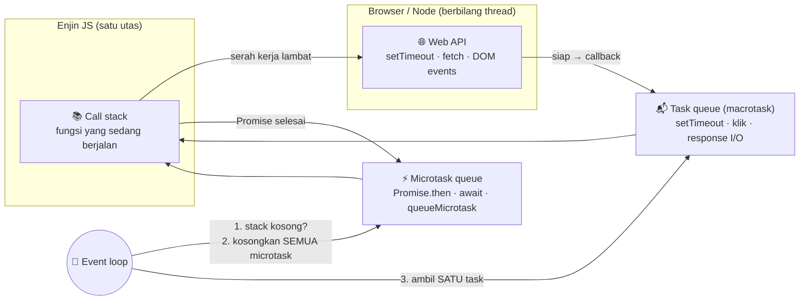
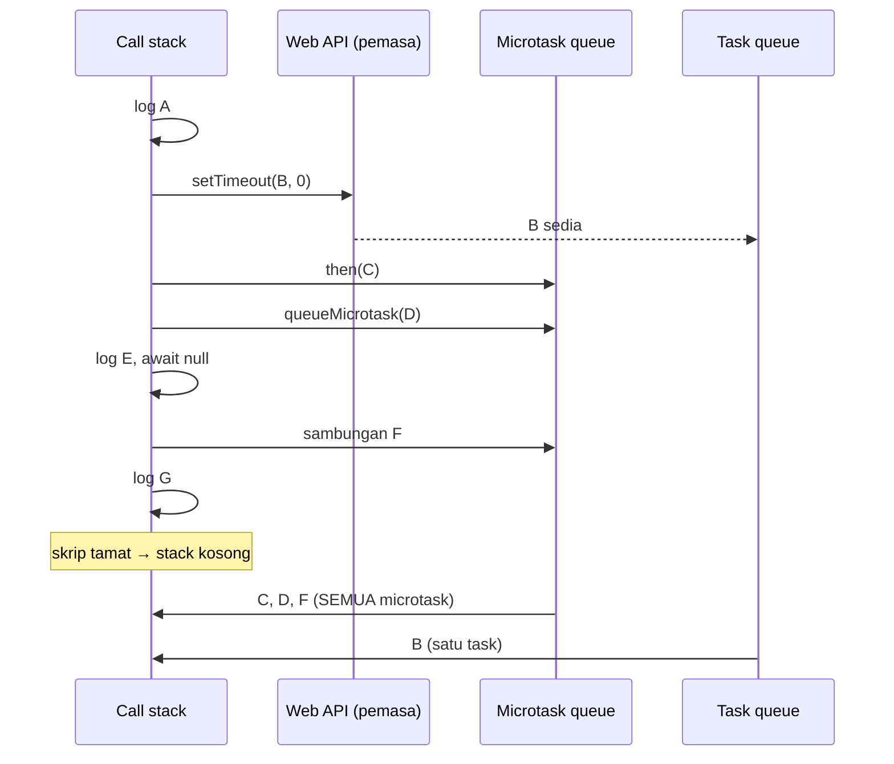
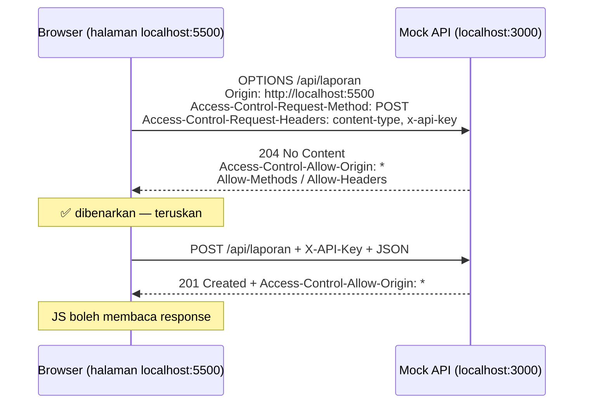
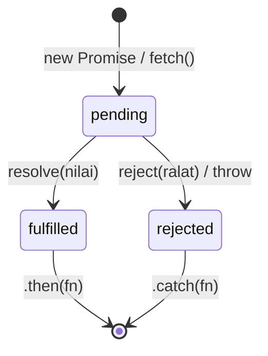
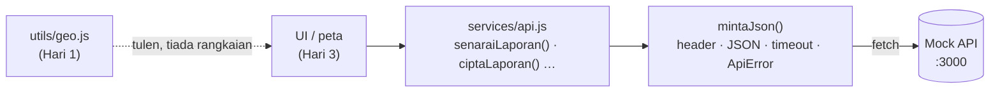

# Hari 2 — Asynchronous JavaScript & Web API Integration

[📅 Jadual](../JADUAL.md) · [🧪 Lab Hari 2](./lab.md) · [🗂️ Fail latihan](../projek/latihan/hari-2/)

> Semalam semua data berada dalam fail tempatan dan setiap baris kod berjalan serta-merta. Dunia sebenar tidak begitu: laporan tinggal di **server**, rangkaian mengambil masa, server kadang-kadang gagal, dan pengguna tidak sabar. Hari ini kita belajar bagaimana JavaScript **tidak menunggu** (event loop), bagaimana ia **berjanji** untuk memberi jawapan kemudian (Promise, `async/await`), dan bagaimana ia **bercakap dengan API** (HTTP, JSON, `fetch`). Hasil hari ini ialah modul kedua GeoLapor: **`services/api.js`** — satu-satunya pintu antara aplikasi dan server.

---

## 🎯 Objektif Pembelajaran

Di akhir hari ini, peserta boleh:

| # | Objektif (boleh diukur) | Sesi | Bukti |
|---|------------------------|------|-------|
| O1 | **Menerangkan** peranan call stack, Web API, task queue dan microtask queue, lalu **meramal** susunan output kod yang mencampurkan `setTimeout`, Promise dan `await` | S1 | Latihan 01: ramalan `A · E · G · C · D · F · B` betul sebelum dijalankan |
| O2 | **Menghuraikan** anatomi HTTP request/response (method, URL, header, kod status, badan JSON), prinsip REST dan CORS, serta **menguji** endpoint mock API dengan `curl`/Thunder Client dan tab Network | S1 | Lab 2.1: `curl -i` menunjukkan `201 Created` + `Location`; preflight `OPTIONS` → `204` |
| O3 | **Mencipta** dan **chain** Promise (termasuk *promisify* callback), dan **memilih** `Promise.all/allSettled/race/any` yang sesuai untuk memuat 3 layer GeoJSON | S2 | Latihan 03 & 05: `A1 5 3 12 ≈1000 ms`; allSettled `2/3 lapisan dimuat` |
| O4 | **Menulis** fungsi `async/await` dengan `try…catch…finally`, **membezakan** network error, HTTP error dan validation error, serta **membandingkan** pelaksanaan sequential vs parallel | S3 | Latihan 06: `bersiri ≈3000 ms` vs `selari ≈1000 ms`; 4 jenis error dikelaskan |
| O5 | **Menggunakan** `fetch` untuk GET/POST/PATCH/DELETE dengan header JSON dan `X-API-Key`, **mengendali** 401/404/422/204, dan **membatalkan** request dengan `AbortController` & timeout | S4 | Latihan 07: `A 401`, `B 422` (4 medan), `C 201`, `E1 204`, `F AbortError`, `G TimeoutError` |
| O6 | **Membina** `services/api.js` mengikut API dikunci (`ApiError`, `mintaJson`, 9 fungsi) | S4 | `node semak.js` → **10/10 ✅** |

---

## 📅 Jadual Hari Ini

| Masa | Sesi | Aktiviti (aturcara) | Fokus |
|------|------|---------------------|-------|
| 9.00 – 11.00 pagi | S1 | **Asynchronous Programming Concepts** | Event loop, task vs microtask, callback & callback hell · **mock API dihidupkan** · HTTP, REST, JSON, CORS · DevTools Network, `curl`, Thunder Client/Postman |
| 11.00 – 1.00 tgh | S2 | **Promise Handling** | Cipta & chain Promise · `fetch` ialah Promise · `Promise.all/allSettled/race/any` — **muat 3 layer GeoJSON serentak** |
| 1.00 – 2.30 ptg | — | Makan tengah hari | |
| 2.30 – 3.30 ptg | S3 | **Async / Await Syntax** | `async/await`, `try…catch…finally`, sequential vs parallel · simulasi **`?lambat=`** & **`?gagal=`** · taksonomi error |
| 3.30 – 5.00 ptg | S4 | **Fetch API Integration** | GET/POST/PATCH/DELETE, header, status, `X-API-Key`, `AbortController`, timeout · **`services/api.js` lengkap** · ⭐ retry + backoff · ⭐ API awam `api.data.gov.my` |

> 💡 Sesi 2 jam (S1, S2) mempunyai rehat regangan ~10 minit di pertengahan.

---

## 🧭 Kenapa hari ini penting

Klien meminta secara khusus: **"Berkaitan dengan API — banyakkan."** Sebabnya jelas: hampir setiap sistem geospatial moden ialah **klien kepada API** — perkhidmatan tile peta, WMS/WFS, OGC API Features, portal data terbuka, API dalaman jabatan. Jika aplikasi tidak mengendali kelewatan dan kegagalan dengan betul, pengguna melihat skrin beku, data separuh, atau lebih buruk: data **disangka** tersimpan sedangkan tidak.

| Tanpa hari ini | Dengan hari ini |
|----------------|-----------------|
| Halaman beku 5 saat semasa memuat layer besar | UI kekal responsif; penunjuk "⏳ Memuatkan…" |
| 3 layer dimuat satu-satu (3 s) | `Promise.all` — serentak (1 s) |
| Satu layer gagal → peta kosong | `Promise.allSettled` — 2/3 layer dipapar + amaran |
| `fetch` 404 disangka berjaya → `undefined` di mana-mana | `res.ok` disemak; `ApiError` dengan status & mesej jelas |
| Pengguna menaip carian → 10 request bersaing, hasil lama menimpa hasil baharu | `AbortController` membatalkan request lama |
| `fetch` dan URL bertaburan di 20 fail | Satu modul `services/api.js` — tukar URL/key di satu tempat (Hari 4: `.env`) |

---

## S1 — Asynchronous Programming Concepts (9.00 – 11.00 pagi)

> 📖 **Bacaan buku** — *JavaScript All-in-One For Dummies* (Minnick, 2023), pengayaan selepas sesi. Halaman PDF = muka surat cetak + 24.
>
> - **Call stack, queue, event loop** — B1 · Bab 10 (Making Things Happen with Events), *Understanding the JavaScript Runtime Model; The Event Loop* — ms. 182–184 (**PDF 206–208**)
> - **Sync vs async, callback** — B1 · Bab 11 (Writing Asynchronous JavaScript), *Understanding Asynchronous JavaScript* — ms. 198–202 (**PDF 222–226**)
> - **HTTP & CORS** — B1 · Bab 11 (Writing Asynchronous JavaScript), *Introducing HTTP; Making requests with CORS* — ms. 216–220 (**PDF 240–244**)

### 1.1 Sync vs async

JavaScript di browser berjalan pada **satu utas** (*single thread*): ia hanya boleh melakukan **satu perkara pada satu masa**. Jika satu tugas mengambil 5 saat, **segala-galanya** menunggu — klik, skrol, animasi peta.

Bayangkan kaunter kaunter tunggal di pejabat tanah:

| Sync (*blocking*) | Async (*non-blocking*) |
|---------------------|------------------------------|
| Kerani menghantar fail ke arkib dan **berdiri menunggu** 20 minit. Barisan tidak bergerak. | Kerani memberi **nombor giliran**, menghantar request ke arkib, dan melayan orang seterusnya. Bila fail tiba, nombor anda dipanggil. |
| `while (…) {}` loop berat | `setTimeout`, `fetch`, membaca fail |

```js
// Latihan 01 bahagian B — loop sibuk 300 ms
const mula = performance.now();
setTimeout(() => console.log(`berjalan selepas ≈${Math.round(performance.now() - mula)} ms`), 0);
while (performance.now() - mula < 300) {} // call stack TIDAK pernah kosong
// → "berjalan selepas ≈300 ms" — bukan 0!
```

> ⚠️ **Kesilapan lazim:** *"`setTimeout(fn, 0)` berjalan serta-merta."* Tidak — ia berjalan **selepas call stack kosong**, sekurang-kurangnya 0 ms. `0` bermaksud "secepat mungkin, tetapi bukan sekarang".

### 1.2 Model runtime: call stack, Web API, baris gilir & event loop



| Komponen | Tugas |
|----------|-------|
| **Call stack** | Timbunan fungsi yang sedang dilaksanakan. JS hanya menjalankan apa yang di atas stack. |
| **Web API** | Kemudahan browser (dalam C++, berbilang utas): pemasa, rangkaian, event DOM. Kerja lambat berlaku **di sini**, bukan dalam JS. |
| **Task queue** | Callback yang sedia: `setTimeout`, event klik, response rangkaian (peringkat rendah). |
| **Microtask queue** | Keutamaan lebih tinggi: `.then/.catch/.finally`, sambungan selepas `await`, `queueMicrotask`. |
| **Event loop** | Loop abadi: *jika stack kosong → jalankan SEMUA microtask → jalankan SATU task → (browser lukis skrin) → ulang*. |

### 1.3 Task vs microtask — ramal susunan

```js
console.log('A');
setTimeout(() => console.log('B'), 0);                 // task
Promise.resolve().then(() => console.log('C'));        // microtask
queueMicrotask(() => console.log('D'));                // microtask
(async () => {
  console.log('E');                                    // SYNC — badan async berjalan terus sehingga await pertama
  await null;
  console.log('F');                                    // microtask (sambungan selepas await)
})();
console.log('G');
// Output: A E G C D F B
```



**Tiga peraturan** yang menerangkan hampir semua teka-teki susunan:
1. Kod **sync** habis dahulu (termasuk badan `async` sehingga `await` pertama).
2. Kemudian **semua** microtask (Promise).
3. Kemudian **satu** task (`setTimeout`, event) — dan ulang.

> 💡 **Tip:** Anda tidak perlu menghafal ini untuk menulis aplikasi. Tetapi apabila "kod saya berjalan dalam susunan pelik", model ini ialah jawapannya.

### 1.4 Callback & "callback hell"

**Callback** = fungsi yang anda serahkan untuk dipanggil **kemudian**. Konvensyen Node: *error dahulu* — `callback(ralat, data)`.

```js
import { muatLapisanCb } from './simulasi.js';   // simulasi server dalam memori (Latihan 02)

muatLapisanCb('sungai', (ralat, data) => {
  if (ralat) return console.log('❌', ralat.message);
  console.log('sungai:', data.features.length, 'feature');   // dicetak KEMUDIAN (≈200 ms)
});
console.log('permintaan dihantar');                            // dicetak DAHULU
```

Masalah bermula bila langkah bergantung antara satu sama lain:

```js
muatLapisanCb('sempadan-zon', (r1, zon) => {
  if (r1) return tunjukRalat(r1);
  muatLapisanCb('sungai', (r2, sungai) => {
    if (r2) return tunjukRalat(r2);
    muatLapisanCb('kemudahan', (r3, kemudahan) => {
      if (r3) return tunjukRalat(r3);
      lukisPeta(zon, sungai, kemudahan);     // ← "piramid azab" (pyramid of doom)
    });
  });
});
```

| Masalah callback hell | Akibat |
|-----------------------|--------|
| Inden semakin dalam | Sukar dibaca & diubah |
| Error mesti disemak di **setiap** aras | Mudah terlepas satu → pepijat senyap |
| `try…catch` luar **tidak** menangkap error dalam callback | Aplikasi ranap (Latihan 02 D) |
| Sequential secara tidak sengaja | 3 layer = 300 + 200 + 100 = 600 ms walaupun boleh serentak |
| *Inversion of control* — anda percaya fungsi lain memanggil callback **tepat sekali** | Callback dipanggil dua kali / tidak langsung |

Promise (S2) menyelesaikan semua lima.

### 1.5 Hidupkan mock API GeoLapor

Terminal **A** (biarkan berjalan sepanjang hari):

```bash
cd projek/api
npm start
```
```text
GeoLapor mock API berjalan di http://localhost:3000
  Laporan: 40 rekod (data/laporan.json)
  Fail statik: http://localhost:3000/data/  →  …/projek/data
  Ctrl+C untuk berhenti.
```

Setiap request dilog: `[09:05:12] GET    /api/kesihatan → 200 (1 ms)` — log ini ialah cermin tab Network anda.

| Method | Endpoint | Guna | Key? |
|--------|----------|------|:------:|
| GET | `/api/kesihatan` | `{ ok, masa }` | |
| GET | `/api/kategori` | `[{ kod, nama, warna }]` | |
| GET | `/api/laporan` | FeatureCollection · query `kategori`, `status`, `q`, `bbox`, `had`, `mula` | |
| GET | `/api/laporan/:id` | satu Feature · 404 | |
| POST | `/api/laporan` | cipta → **201** · 422 | ✅ |
| PATCH | `/api/laporan/:id` | kemas kini separa → 200 | ✅ |
| DELETE | `/api/laporan/:id` | **204** | ✅ |
| GET | `/api/lapisan` · `/api/lapisan/:id` | senarai layer · GeoJSON layer | |
| GET | `/api/statistik` | `{ jumlah, ikutKategori, ikutStatus }` | |

**Mod pengajaran** pada **mana-mana** endpoint: `?lambat=1500` (lengah 1.5 s) dan `?gagal=1` (paksa 500). Data rosak? `npm run reset-data`.

### 1.6 HTTP — bahasa perbualan browser ↔ server

Setiap `fetch` ialah **request** (*request*) teks yang dibalas dengan **response** (*response*) teks:

```http
POST /api/laporan HTTP/1.1                       ← baris permintaan: KAEDAH  LALUAN  VERSI
Host: localhost:3000                              ← header (pasangan Nama: nilai)
Content-Type: application/json                    ← "badan saya ialah JSON"
Accept: application/json                          ← "saya mahu JSON kembali"
X-API-Key: latihan-pgn-2026                       ← header tersuai (pengesahan ringkas)
                                                  ← baris kosong
{"tajuk":"Longkang tersumbat","kategori":"infrastruktur","lat":2.9301,"lng":101.6902}
```

```http
HTTP/1.1 201 Created                              ← baris status: VERSI  KOD  TEKS
Content-Type: application/geo+json; charset=utf-8
Location: /api/laporan/LPR-0041                   ← di mana sumber baharu tinggal
Access-Control-Allow-Origin: *                    ← CORS (§1.9)

{"type":"Feature","id":"LPR-0041","geometry":{"type":"Point","coordinates":[101.6902,2.9301]},…}
```

**Method (HTTP verb):**

| Method | Maksud | Selamat (tiada kesan)? | Idempoten (ulang = hasil sama)? | Badan? |
|--------|--------|:---:|:---:|:---:|
| `GET` | baca | ✅ | ✅ | ❌ |
| `POST` | cipta / tindakan | ❌ | ❌ ⚠️ | ✅ |
| `PUT` | ganti keseluruhan | ❌ | ✅ | ✅ |
| `PATCH` | kemas kini sebahagian | ❌ | biasanya | ✅ |
| `DELETE` | padam | ❌ | ✅ | jarang |
| `OPTIONS` | tanya keupayaan (preflight CORS) | ✅ | ✅ | ❌ |

> ⚠️ **Idempoten penting untuk retry (§4.7):** mengulang `GET` atau `DELETE` selamat. Mengulang `POST` yang gagal "separuh jalan" boleh mencipta **dua** laporan.

**Kod status** — digit pertama memberitahu kelas:

| Kod | Nama | Bila dalam GeoLapor | Tindakan klien |
|-----|------|---------------------|----------------|
| **200** | OK | GET/PATCH berjaya | guna data |
| **201** | Created | POST berjaya (+ header `Location`) | tambah ke senarai/peta |
| **204** | No Content | DELETE berjaya — **tiada badan** | jangan panggil `res.json()`! |
| **400** | Bad Request | `bbox=abc`, JSON rosak | pepijat klien — betulkan kod |
| **401** | Unauthorized | tiada/salah `X-API-Key` | log masuk / semak key |
| 403 | Forbidden | ada identiti, tiada kebenaran | mesej "tiada akses" |
| **404** | Not Found | `LPR-9999`, laluan salah | "tidak dijumpai" |
| 405 | Method Not Allowed | `PUT /api/laporan/…` (+ header `Allow`) | pepijat klien |
| **422** | Unprocessable Content | validasi gagal (+ `medan`) | papar error per medan pada borang (Hari 3) |
| 429 | Too Many Requests | had kadar (API awam) | tunggu & cuba semula |
| **500** | Internal Server Error | `?gagal=1` | "cuba lagi kemudian"; boleh retry |
| 502/503/504 | Gateway / tidak tersedia | proksi/server sibuk | boleh retry dengan backoff |

**Header yang anda akan jumpa hari ini:**

| Header | Arah | Maksud |
|--------|------|--------|
| `Content-Type` | ↔ | format **badan** mesej ini: `application/json`, `application/geo+json` |
| `Accept` | → | format yang klien **mahu** |
| `X-API-Key` | → | API key mock (`X-` = tersuai) |
| `Location` | ← | URL sumber yang baru dicipta (201) |
| `X-Jumlah` | ← | jumlah padanan sebelum `had/mula` (penomboran) |
| `Access-Control-Allow-*` | ← | kebenaran CORS |
| `Allow` | ← | method yang dibenarkan (405) |

### 1.7 REST — URL sebagai kata nama, method sebagai kata kerja

REST (*Representational State Transfer*) ialah gaya reka bentuk API: **sumber** dikenal pasti dengan URL, **tindakan** dengan HTTP method.

| ❌ Bukan REST | ✅ REST |
|--------------|---------|
| `GET /api/getLaporan?id=LPR-0001` | `GET /api/laporan/LPR-0001` |
| `POST /api/padamLaporan` | `DELETE /api/laporan/LPR-0001` |
| `POST /api/kemaskiniStatus` | `PATCH /api/laporan/LPR-0001` `{ "status": "selesai" }` |

**Query string** untuk tapisan, carian & penomboran — ia bukan sumber baharu, cuma "pandangan" koleksi:

```text
/api/laporan?status=baharu&kategori=tanah          ← tapis
/api/laporan?q=jalan                               ← cari dalam tajuk
/api/laporan?bbox=101.67,2.90,101.72,2.95          ← kawasan peta semasa (minLng,minLat,maxLng,maxLat)
/api/laporan?had=10&mula=20                        ← halaman ke-3 (10 setiap halaman)
```

```js
// Bina query dengan selamat — URLSearchParams mengekod aksara khas (ruang, &, é …)
const qs = new URLSearchParams({ status: 'baharu', q: 'jalan raya', had: 5 });
`http://localhost:3000/api/laporan?${qs}`;
// 'http://localhost:3000/api/laporan?status=baharu&q=jalan+raya&had=5'
```

> 💡 **Tip geospatial:** Parameter `bbox` ialah corak piawai (OGC API Features, WFS) untuk "beri saya hanya feature dalam kawasan peta yang sedang dilihat". Pada Hari 3, `map.getBounds()` Leaflet akan menjana nilai ini secara automatik.

### 1.8 JSON di atas HTTP

HTTP hanya membawa **teks** (atau bait). JSON ialah perjanjian tentang bentuk teks itu:

| Arah | Anda perlu | Kod |
|------|------------|-----|
| **Hantar** (POST/PATCH) | objek → teks + beritahu server | `body: JSON.stringify(data)` + `'Content-Type': 'application/json'` |
| **Terima** | teks → objek | `await res.json()` (sama seperti `JSON.parse(await res.text())`) |

`application/geo+json` ialah jenis media rasmi GeoJSON (RFC 7946) — ia **masih JSON**. Mock API memulangkan `geo+json` untuk laporan & layer, dan `json` untuk yang lain.

> ⚠️ **Kesilapan lazim:** Menghantar `body: data` (objek) tanpa `JSON.stringify`. `fetch` menukarnya kepada teks `"[object Object]"` — server membalas `400 JSON tidak sah`.

### 1.9 CORS — kenapa browser kadang-kadang "menyekat" API

**Origin** = skema + hos + port. Halaman latihan anda (`http://localhost:5500`) dan mock API (`http://localhost:3000`) ialah **origin berbeza** (port berbeza).

| URL A | URL B | Origin sama? |
|-------|-------|:---:|
| `http://localhost:5500/index.html` | `http://localhost:5500/data.json` | ✅ |
| `http://localhost:5500` | `http://localhost:3000` | ❌ port |
| `http://localhost:5500` | `http://127.0.0.1:5500` | ❌ hos |
| `http://geolapor.gov.my` | `https://geolapor.gov.my` | ❌ skema |

**Dasar same-origin**: secara default, JavaScript dalam halaman **tidak boleh membaca** response dari origin lain — melindungi anda daripada laman jahat yang cuba membaca e-mel/bank anda menggunakan kuki anda. **CORS** (*Cross-Origin Resource Sharing*) ialah cara **server** memberi kebenaran:

```http
Access-Control-Allow-Origin: *                              ← sesiapa boleh membaca
Access-Control-Allow-Methods: GET, POST, PATCH, DELETE, OPTIONS
Access-Control-Allow-Headers: Content-Type, X-API-Key
Access-Control-Expose-Headers: X-Jumlah, Location          ← header yang JS dibenarkan baca
```

Untuk request "tidak mudah" (method selain GET/POST ringkas, atau header tersuai seperti `X-API-Key`, atau `Content-Type: application/json`), browser menghantar **preflight** `OPTIONS` dahulu:



Jika server **tidak** membalas header ini, Console memaparkan:

```text
Access to fetch at 'http://localhost:3000/api/laporan' from origin 'http://localhost:5500'
has been blocked by CORS policy: No 'Access-Control-Allow-Origin' header is present…
```

…dan `fetch` reject dengan `TypeError: Failed to fetch` — **tiada** kod status untuk dibaca.

> ⚠️ **Salah faham besar:** *"CORS ialah ciri keselamatan server."* Tidak — CORS ialah peraturan **browser** untuk melindungi **pengguna**. `curl`, Postman dan Node **tidak** tertakluk kepada CORS (itulah sebabnya "ia berfungsi dalam Postman tetapi tidak dalam browser"). Server masih mesti mengesahkan setiap request sendiri (kunci API, sesi).

> 💡 **Tip:** CORS dibetulkan di **server** (atau melalui proksi), **bukan** dalam kod frontend. Tiada header yang anda boleh tambah dalam `fetch` untuk "mematikan" CORS. Pada Hari 4, proksi dev server Vite ialah satu penyelesaian.

### 1.10 Alat menguji API: DevTools Network, `curl`, Thunder Client/Postman

**DevTools → Network** (F12) — alat paling penting hari ini:

| Bahagian | Guna |
|----------|------|
| Penapis **Fetch/XHR** | Sembunyikan CSS/imej; tunjuk panggilan API sahaja |
| Lajur *Status*, *Type*, *Time* | 200/404/500 sepintas lalu; `preflight` kelihatan sebagai baris berasingan |
| Tab **Headers** | URL penuh, method, header request & response (semak `X-API-Key`, `Content-Type`) |
| Tab **Payload** | Badan JSON yang **dihantar** |
| Tab **Preview / Response** | Badan yang **diterima** (Preview = pohon boleh dikembang) |
| Tab **Timing** | Masa menunggu server (*Waiting for server response*) — lihat kesan `?lambat=` |
| *Throttling* (No throttling ▾ → Slow 4G / Offline) | Simulasi rangkaian perlahan / putus tanpa mengubah kod |
| Klik kanan → **Copy as cURL** | Ulang request tepat di terminal |

**`curl`** — klien HTTP baris arahan (terbina dalam macOS, Linux, Windows 10+ sebagai `curl.exe`):

```bash
curl -i http://localhost:3000/api/kesihatan                    # -i: tunjuk baris status + header
curl "http://localhost:3000/api/laporan?status=baharu&had=2"    # petik URL yang ada &

curl -i -X POST http://localhost:3000/api/laporan \
  -H "Content-Type: application/json" \
  -H "X-API-Key: latihan-pgn-2026" \
  -d '{"tajuk":"Ujian curl — longkang tersumbat","kategori":"infrastruktur","lat":2.93,"lng":101.69}'
# HTTP/1.1 201 Created
# Content-Type: application/geo+json; charset=utf-8
# Location: /api/laporan/LPR-0041
```

**Windows (PowerShell):**

```powershell
$r = Invoke-WebRequest -UseBasicParsing http://localhost:3000/api/kesihatan     # Invoke-WebRequest: ada status + header
$r.StatusCode; $r.Headers
Invoke-RestMethod "http://localhost:3000/api/laporan?status=baharu&had=2"     # petik URL yang ada &

$badan = @{ tajuk = 'Ujian curl — longkang tersumbat'; kategori = 'infrastruktur'; lat = 2.93; lng = 101.69 } | ConvertTo-Json -Depth 10
$r = Invoke-WebRequest -UseBasicParsing -Method Post -Uri http://localhost:3000/api/laporan `
  -Headers @{ 'X-API-Key' = 'latihan-pgn-2026' } `
  -ContentType 'application/json; charset=utf-8' -Body $badan
$r.StatusCode; $r.Headers['Location']     # 201 · /api/laporan/LPR-0041
```

> ⚠️ **Windows:** Dalam PowerShell 5, `curl` ialah alias kepada `Invoke-WebRequest` (sintaks berbeza). Guna **Git Bash** (disyorkan), taip **`curl.exe`** untuk GET, atau guna blok PowerShell di atas (`Invoke-WebRequest`/`Invoke-RestMethod`). Petikan tunggal `'{…}'` tidak berfungsi dalam `cmd.exe`, dan PowerShell 5 membuang `"` dalam argumen `curl.exe` — untuk POST guna Git Bash, blok PowerShell atau Thunder Client.

**Thunder Client** (sambungan VS Code) / **Postman** — klien grafik: pilih method, URL, tab *Headers*, tab *Body → JSON*, klik *Send*. Simpan request dalam **Collection** "GeoLapor" untuk digunakan semula sepanjang kursus.

---

## S2 — Promise Handling (11.00 pagi – 1.00 tgh)

> 📖 **Bacaan buku** — *JavaScript All-in-One For Dummies* (Minnick, 2023), pengayaan selepas sesi. Halaman PDF = muka surat cetak + 24.
>
> - **Mencipta & chaining Promise** — B1 · Bab 11 (Writing Asynchronous JavaScript), *Making Promises* — ms. 202–206 (**PDF 226–230**)
> - **`.catch`, rejection yang tidak di-handle** — B7 · Bab 7 (Error Handling and Debugging), *Catching exceptions with promises* — ms. 656–659 (**PDF 680–683**)

### 2.1 Apa itu Promise?

**Promise** ialah objek yang mewakili **hasil masa depan** sesuatu operasi async — seperti nombor giliran di kaunter. Ia sentiasa dalam **satu** daripada tiga keadaan:



- Sekali *settled* (fulfilled/rejected), keadaan **tidak berubah lagi**.
- `.then/.catch` yang didaftar **selepas** selesai masih dipanggil (tidak seperti event yang terlepas).
- Callback `.then` sentiasa berjalan sebagai **microtask** — tidak pernah sync.

### 2.2 Mencipta Promise

```js
// 1) Pembalut pemasa — Promise paling ringkas
const tunggu = (ms) => new Promise((resolve) => setTimeout(resolve, ms));
await tunggu(500);   // (dalam async/modul) jeda 0.5 s tanpa membekukan halaman

// 2) "Promisify" — bungkus API callback lama
function muatLapisan(id) {
  return new Promise((resolve, reject) => {
    muatLapisanCb(id, (ralat, data) => {
      if (ralat) reject(ralat);    // → rejected
      else resolve(data);          // → fulfilled
    });
  });
}

// 3) Promise yang sudah selesai
Promise.resolve(42);
Promise.reject(new Error('gagal'));
```

> 💡 **Tip:** Anda jarang menulis `new Promise` dalam aplikasi — `fetch`, `res.json()` dan pustaka sudah memulangkan Promise. `new Promise` hanya untuk membalut API berasaskan callback/event.

### 2.3 Menggunakan & chaining: `.then`, `.catch`, `.finally`

```js
muatLapisan('sempadan-zon')
  .then((zon) => {
    kiraan.zon = zon.features.length;
    return muatLapisan('sungai');          // ← PULANGKAN promise: .then seterusnya menunggunya
  })
  .then((sungai) => {
    kiraan.sungai = sungai.features.length;
    return muatLapisan('kemudahan');
  })
  .then((kemudahan) => {
    kiraan.kemudahan = kemudahan.features.length;
    console.log(kiraan);                   // { zon: 5, sungai: 3, kemudahan: 8 }
  })
  .catch((ralat) => console.log('❌', ralat.message))   // SATU catch untuk SEMUA langkah di atas
  .finally(() => sembunyikanLoading());                 // sentiasa — berjaya atau gagal
```

Callback hell 3 aras menjadi **rata**, dengan **satu** tempat error handling.

| Dalam `.then(fn)`, jika `fn`… | Promise seterusnya… |
|-------------------------------|---------------------|
| memulangkan nilai biasa `x` | fulfilled dengan `x` |
| memulangkan **Promise** `p` | menunggu `p`, kemudian ikut hasilnya |
| melontar (`throw`) | rejected → lompat ke `.catch` terdekat |
| tiada `return` | fulfilled dengan `undefined` ⚠️ |

```js
Promise.resolve(2)
  .then((x) => x * 10)                                         // 20
  .then((x) => { if (x > 10) throw new Error(`Nilai ${x} terlalu besar`); return x; })
  .catch((e) => { console.log('❌', e.message); return 0; })   // catch PULIH dengan 0
  .then((x) => console.log('selepas pulih:', x));              // selepas pulih: 0
```

> ⚠️ **Kesilapan lazim #1 hari ini:** Lupa `return` dalam `.then`. Kerja async dimulakan tetapi chain **tidak menunggunya** — `.then` seterusnya menerima `undefined` dan ralatnya tidak ditangkap (Latihan 03 E).

### 2.4 `fetch` ialah Promise

```js
const API_URL = 'http://localhost:3000';

fetch(`${API_URL}/api/kesihatan`)                 // Promise<Response>
  .then((res) => {
    console.log(res.status, res.ok, res.statusText);         // 200 true OK
    console.log(res.headers.get('content-type'));            // application/json; charset=utf-8
    return res.json();                                       // Promise<data> — badan dibaca ASYNC
  })
  .then((data) => console.log(data));                        // { ok: true, masa: '…+08:00' }
```

Dua peringkat, dua Promise: (1) `fetch` selesai bila **header** tiba; (2) `res.json()` selesai bila **badan** penuh dibaca & di-parse.

| Property/method `Response` | Nilai |
|-------------------------|-------|
| `res.ok` | `true` jika status 200–299 |
| `res.status` / `res.statusText` | `404` / `'Not Found'` |
| `res.headers.get('nama')` | nilai header (tidak peka huruf besar/kecil) |
| `res.json()` / `res.text()` / `res.blob()` | Promise badan — **boleh dibaca sekali sahaja** |

> ⚠️ **Kesilapan lazim #2 hari ini: `fetch` TIDAK reject untuk 404 atau 500.** Ia hanya reject bila **tiada response langsung** (rangkaian putus, CORS, URL tidak sah, dibatalkan). Response 404 ialah "kejayaan" dari sudut rangkaian:
> ```js
> fetch(`${API_URL}/api/laporan/LPR-9999`).then((res) => console.log(res.ok, res.status)); // false 404 ← .then, bukan .catch!
> ```
> Anda **mesti** menyemak `res.ok` sendiri:
> ```js
> function ambilJson(url) {
>   return fetch(url).then((res) => {
>     if (!res.ok) throw new Error(`HTTP ${res.status}`);   // tukar kepada rejected
>     return res.json();
>   });
> }
> ```

### 2.5 Kombinator: muat 3 layer GeoJSON serentak

Peta GeoLapor memerlukan tiga layer rujukan: `sempadan-zon` (Polygon), `sungai` (LineString), `kemudahan` (Point). Ketiga-tiganya **bebas** — tiada sebab menunggu satu sebelum meminta yang lain.

```js
const LAPISAN = ['sempadan-zon', 'sungai', 'kemudahan'];
const janji = LAPISAN.map((id) => ambilJson(`${API_URL}/api/lapisan/${id}?lambat=1000`)); // 3 request DIMULAKAN sekarang

Promise.all(janji).then(([zon, sungai, kemudahan]) => {       // susunan hasil = susunan INPUT
  console.log(zon.features.length, sungai.features.length, kemudahan.features.length); // 5 3 12
});   // ≈1000 ms — bukan 3000
```

| Kombinator | Selesai bila | Hasil | Guna dalam GeoLapor |
|------------|-------------|-------|---------------------|
| `Promise.all([…])` | **semua** berjaya, **atau** yang pertama gagal | array nilai / error pertama | layer yang **semua** wajib (data + kategori sebelum render) |
| `Promise.allSettled([…])` | **semua** selesai (apa pun hasil) | `[{status, value \| reason}]` | layer pilihan — papar yang berjaya, amaran untuk yang gagal |
| `Promise.race([…])` | yang **pertama** selesai (berjaya atau gagal) | nilai/error pertama | timeout manual |
| `Promise.any([…])` | yang **pertama berjaya**; gagal hanya jika **semua** gagal | nilai pertama / `AggregateError` | beberapa cermin/tile server — ambil yang terpantas hidup |

```js
// allSettled — satu layer rosak TIDAK meruntuhkan peta
const hasil = await Promise.allSettled(LAPISAN.map((id) => ambilJson(`${API_URL}/api/lapisan/${id}${id === 'sungai' ? '?gagal=1' : ''}`)));
hasil.forEach((h, i) =>
  h.status === 'fulfilled'
    ? console.log(LAPISAN[i], '✅', h.value.features.length)
    : console.log(LAPISAN[i], '❌', h.reason.message),
);
// sempadan-zon ✅ 5 · sungai ❌ HTTP 500 — … · kemudahan ✅ 12

// race — had masa
const tamatMasa = (ms) => tunggu(ms).then(() => { throw new Error(`Tamat masa ${ms} ms`); });
Promise.race([ambilJson(`${API_URL}/api/lapisan/sungai?lambat=2000`), tamatMasa(500)])
  .catch((e) => console.log(e.message));   // Tamat masa 500 ms
```



```mermaid
gantt
    title Sequential vs Promise.all (setiap layer ≈1 s)
    dateFormat ss
    axisFormat %S s
    section Bersiri (≈3 s)
    sempadan-zon :a1, 00, 1s
    sungai       :a2, after a1, 1s
    kemudahan    :a3, after a2, 1s
    section Promise.all (≈1 s)
    sempadan-zon :b1, 00, 1s
    sungai       :b2, 00, 1s
    kemudahan    :b3, 00, 1s
```

> ⚠️ **Kesilapan lazim:** *"`Promise.race` membatalkan yang kalah."* Tidak — request yang lambat **terus berjalan** di latar (lihat tab Network). Untuk benar-benar membatalkan: `AbortController` (S4).

> 💡 **Tip:** `Promise.all` **memulakan** apa-apa pun — ia hanya **menunggu**. Kerja bermula ketika `ambilJson(…)` dipanggil dalam `map`. Itulah sebabnya ia serentak.

### 2.6 Rejection yang tidak di-handle (*unhandled rejection*)

Promise yang di-reject tanpa `.catch` menghasilkan amaran merah dalam Console (`Uncaught (in promise)`) — dan dalam Node, **mematikan proses**. Setiap chain mesti berakhir dengan `.catch`, atau berada dalam `try…catch` (S3).

---

## S3 — Async / Await Syntax (2.30 – 3.30 ptg)

> 📖 **Bacaan buku** — *JavaScript All-in-One For Dummies* (Minnick, 2023), pengayaan selepas sesi. Halaman PDF = muka surat cetak + 24.
>
> - **`async`/`await`** — B1 · Bab 11 (Writing Asynchronous JavaScript), *Introducing async functions* — ms. 206–210 (**PDF 230–234**)
> - **Jenis error, `try…catch` dalam fungsi async** — B7 · Bab 7 (Error Handling and Debugging), *Knowing the Types of Errors; Catching exceptions with async functions* — ms. 651–653, 659–660 (**PDF 675–677, 683–684**)

### 3.1 `async` & `await` — Promise yang dibaca seperti kod sync

- Fungsi `async` **sentiasa memulangkan Promise**.
- `await p` **menjeda fungsi itu sahaja** sehingga `p` selesai — utas utama bebas membuat kerja lain (UI kekal responsif).
- `await` hanya dalam fungsi `async` — **atau** peringkat atas ES module (*top-level await*).

```js
// Versi .then (S2)
function ambilJson(url) {
  return fetch(url).then((res) => {
    if (!res.ok) throw new Error(`HTTP ${res.status}`);
    return res.json();
  });
}
```

```js
// Versi async/await — logik SAMA, dibaca dari atas ke bawah
async function ambilJson(url) {
  const res = await fetch(url);
  if (!res.ok) throw new Error(`HTTP ${res.status}`);
  return res.json();
}
```

Versi lebih lengkap (Latihan 06) — membaca mesej `ralat` dari badan response server:

```js
async function ambilJson(url) {
  const res = await fetch(url);                          // boleh melontar TypeError (rangkaian)
  const data = await res.json().catch(() => null);        // badan mungkin kosong / bukan JSON
  if (!res.ok) {
    const ralat = new Error(data?.ralat ?? `HTTP ${res.status}`);
    ralat.status = res.status;                            // simpan status untuk pengelasan
    throw ralat;
  }
  return data;
}
```

### 3.2 `try…catch…finally` & keadaan "loading"

```js
async function muatDenganStatus(label, url) {
  tunjukLoading(label);                    // ⏳
  try {
    const fc = await ambilJson(url);       // error di sini → terus ke catch
    lukisLapisan(fc);                      // ✅
    return fc;
  } catch (e) {
    tunjukRalat(`${label}: ${e.message}`); // ❌
    return null;                           // pulih dengan nilai selamat
  } finally {
    sembunyikanLoading(label);             // ⏹️ SENTIASA — tiada spinner "tersekat"
  }
}
```

> ⚠️ **Kesilapan lazim:** Menyembunyikan penunjuk loading dalam `try` sahaja. Bila error berlaku, spinner berpusing selama-lamanya. `finally` wujud tepat untuk ini.

### 3.3 Sequential vs parallel

```js
// ❌ Sequential — setiap await MENUNGGU sebelum memulakan yang seterusnya: ≈3000 ms
for (const id of LAPISAN) {
  hasil.push(await ambilJson(`${API_URL}/api/lapisan/${id}?lambat=1000`));
}

// ✅ Parallel — mulakan SEMUA, kemudian tunggu bersama: ≈1000 ms
const hasil = await Promise.all(LAPISAN.map((id) => ambilJson(`${API_URL}/api/lapisan/${id}?lambat=1000`)));
```

| Guna sequential bila… | Guna parallel bila… |
|--------------------|-------------------|
| Langkah 2 **perlukan** hasil langkah 1 (cipta laporan → guna `id` baharu untuk PATCH) | Request **bebas** (3 layer, kategori + statistik) |
| Mahu mengehadkan beban server (cth 500 fail dimuat naik satu-satu) | Bilangan kecil & server mampu |

> ⚠️ **Kesilapan lazim:** `forEach(async …)` **tidak menunggu**:
> ```js
> LAPISAN.forEach(async (id) => { await ambilJson(…); });
> console.log('siap');   // dicetak SERTA-MERTA (≈0 ms) — fetch belum selesai!
> ```
> `forEach` mengabaikan Promise yang dipulangkan. Guna `for…of` (sequential) atau `Promise.all(map(…))` (parallel).

### 3.4 Taksonomi error — bukan semua error sama

| Jenis | Bagaimana dikesan | Contoh | Mesej kepada pengguna | Retry? |
|-------|-------------------|--------|------------------------|:---:|
| **Rangkaian** | `fetch` **reject** dengan `TypeError` | server mati, port salah, CORS, tiada internet | "Tidak dapat menghubungi server" | ✅ |
| **Timeout** | `TimeoutError` (§4.4) | `?lambat=10000` | "Server lambat — cuba lagi" | ✅ |
| **Dibatalkan** | `AbortError` | pengguna tukar tapisan | *(senyap)* | ❌ |
| **HTTP 4xx klien** | `!res.ok`, status 400–499 | 400 `bbox` rosak, 401, 404 | spesifik ("tidak dijumpai", "tiada kebenaran") | ❌ |
| **Validasi 422** | status 422 + `medan` | tajuk terlalu pendek | error **per medan** di borang | ❌ |
| **HTTP 5xx server** | status ≥ 500 | `?gagal=1` | "Server bermasalah — cuba sebentar lagi" | ✅ |
| **Badan rosak** | `res.json()` melontar `SyntaxError` | server pulangkan HTML error | "Response tidak dijangka" | ❌ |

```js
function kelaskan(e) {
  if (e.name === 'TypeError') return 'RANGKAIAN (pelayan mati / CORS / URL salah)';
  if (e.status >= 500) return `PELAYAN (${e.status}) — cuba lagi kemudian`;
  if (e.status === 404) return 'TIDAK DIJUMPAI (404)';
  if (e.status >= 400) return `PERMINTAAN SALAH (${e.status})`;
  return 'LAIN';
}
// port salah → RANGKAIAN · ?gagal=1 → SERVER (500) · LPR-9999 → TIDAK DIJUMPAI · bbox=abc → REQUEST SALAH (400)
```

### 3.5 Simulasi dunia sebenar: `?lambat=` & `?gagal=`

| Mahu uji | Cara |
|----------|------|
| Penunjuk loading kelihatan? | `?lambat=2000` |
| UI mengendali 500 dengan baik? | `?gagal=1` |
| Timeout berfungsi? | `?lambat=10000` dengan `timeoutMs: 1000` |
| Seluruh aplikasi pada rangkaian perlahan | DevTools → Network → *Slow 4G* |
| Luar talian | DevTools → Network → *Offline* (atau hentikan mock API dengan `Ctrl+C`) |

> 💡 **Tip:** Uji **laluan gagal** sama kerap dengan laluan berjaya. Dalam demo, server sentiasa pantas; di lapangan (liputan 3G di kawasan pedalaman), ia jarang begitu.

---

## S4 — Fetch API Integration (3.30 – 5.00 ptg)

> 📖 **Bacaan buku** — *JavaScript All-in-One For Dummies* (Minnick, 2023), pengayaan selepas sesi. Halaman PDF = muka surat cetak + 24.
>
> - **`fetch`, Response, error, opsyen (method, header, body)** — B1 · Bab 11 (Writing Asynchronous JavaScript), *Using AJAX; Getting data with the Fetch API* — ms. 210–216 (**PDF 234–240**)
> - **JSON hantar & terima** — B1 · Bab 11 (Writing Asynchronous JavaScript), *Working with JSON data* — ms. 220–222 (**PDF 244–246**)

### 4.1 Pilihan `fetch(url, opsyen)`

| Opsyen | Nilai | Nota |
|--------|-------|------|
| `method` | `'GET'` (default), `'POST'`, `'PATCH'`, `'DELETE'` | |
| `headers` | `{ 'Content-Type': 'application/json', 'X-API-Key': … }` | |
| `body` | **string** (`JSON.stringify(obj)`), `FormData`, `Blob` | tiada untuk GET |
| `signal` | `AbortSignal` | pembatalan & timeout |
| `credentials` | `'omit'` · `'same-origin'` (default) · `'include'` | kuki merentas origin (sistem sebenar dengan sesi) |
| `cache` | `'no-store'`, `'reload'`… | kawalan cache HTTP |

### 4.2 Menulis data: POST, PATCH, DELETE

```js
const API_URL = 'http://localhost:3000';
const API_KEY = 'latihan-pgn-2026';

// ── POST: cipta ──
const res = await fetch(`${API_URL}/api/laporan`, {
  method: 'POST',
  headers: { 'Content-Type': 'application/json', 'X-API-Key': API_KEY },
  body: JSON.stringify({ tajuk: 'Longkang tersumbat', kategori: 'infrastruktur', lat: 2.9301, lng: 101.6902 }),
});
const cipta = await res.json();
res.status;                    // 201
cipta.id;                      // 'LPR-0041'  (dijana SERVER — jangan jana sendiri)
cipta.geometry.coordinates;    // [101.6902, 2.9301]  ← server menerima {lat, lng}, menyimpan [lng, lat]
res.headers.get('location');   // '/api/laporan/LPR-0041'

// ── PATCH: kemas kini SEBAHAGIAN — hanya hantar medan yang berubah ──
await fetch(`${API_URL}/api/laporan/${cipta.id}`, {
  method: 'PATCH',
  headers: { 'Content-Type': 'application/json', 'X-API-Key': API_KEY },
  body: JSON.stringify({ status: 'dalam-tindakan' }),
});   // 200 + Feature penuh terkini

// ── DELETE ──
const r = await fetch(`${API_URL}/api/laporan/${cipta.id}`, { method: 'DELETE', headers: { 'X-API-Key': API_KEY } });
r.status;   // 204 — TIADA badan. r.json() akan melontar SyntaxError!
```

**Error response mock API** — bentuk konsisten `{ ralat, medan? }`:

```js
// 401 — tiada key
{ ralat: 'Kunci API tidak sah' }

// 422 — validasi: SATU mesej umum + SATU mesej per medan
{
  ralat: 'Data laporan tidak sah',
  medan: {
    tajuk: 'Tajuk wajib, 5–120 aksara',
    kategori: 'Kategori mesti salah satu: infrastruktur, alam-sekitar, tanah, utiliti, lain-lain',
    lat: 'Latitud mesti dalam Malaysia (0.8–7.5)',
    lng: 'Longitud mesti dalam Malaysia (99.5–119.5)',
  },
}
```

Pada Hari 3, `medan` ini akan dipaparkan di bawah setiap input borang.

> 💡 **Tip:** Server mengesahkan koordinat dalam kotak Malaysia — sama seperti `dalamMalaysia()` anda semalam. **Validasi di klien** (Hari 3) memberi maklum balas pantas; **validasi di server** ialah yang sebenarnya melindungi data. Sentiasa kedua-duanya.

### 4.3 Membatalkan request: `AbortController` & timeout

```js
// Batal manual — cth pengguna menukar tapisan sebelum response tiba
const pengawal = new AbortController();
setTimeout(() => pengawal.abort(), 300);
try {
  await fetch(`${API_URL}/api/laporan?lambat=3000`, { signal: pengawal.signal });
} catch (e) {
  e.name;   // 'AbortError'
}

// Timeout — isyarat terbina (Chrome 103+, Node 18+)
try {
  await fetch(`${API_URL}/api/laporan?lambat=3000`, { signal: AbortSignal.timeout(1000) });
} catch (e) {
  e.name;   // 'TimeoutError'
}

// Gabung kedua-dua: batal bila MANA-MANA berlaku dahulu (Chrome 116+, Node 20+)
const isyarat = AbortSignal.any([pengawal.signal, AbortSignal.timeout(8000)]);
```

<details><summary>Di sebalik tabir — timeout manual tanpa <code>AbortSignal.timeout</code></summary>

```js
async function fetchDenganTimeout(url, ms) {
  const pengawal = new AbortController();
  const pemasa = setTimeout(() => pengawal.abort(), ms);
  try {
    return await fetch(url, { signal: pengawal.signal });
  } finally {
    clearTimeout(pemasa);   // WAJIB — jika tidak, pemasa "hidup" walaupun fetch sudah selesai
  }
}
```
</details>

**Corak "carian semasa menaip"** — hanya request terkini dikira:

```js
let pengawalSemasa = null;
async function cari(q) {
  pengawalSemasa?.abort();                  // batal carian sebelumnya
  pengawalSemasa = new AbortController();
  try {
    const fc = await senaraiLaporan({ q }, { signal: pengawalSemasa.signal });
    paparSenarai(fc);
  } catch (e) {
    if (e.name !== 'AbortError') tunjukRalat(e);   // AbortError = sengaja → senyap
  }
}
```

Tanpa ini, response `"j"` yang lambat boleh tiba **selepas** response `"jalan"` dan menimpa senarai dengan hasil yang salah (*race condition*).

### 4.4 Membina `services/api.js` langkah demi langkah

Kenapa satu modul? Tanpanya, setiap fail mengulang `fetch` + header + `res.ok` + `JSON.stringify` — dan bila URL berubah (Hari 4: `.env`) anda perlu menyunting 20 tempat.



**Langkah 1 — `ApiError`: satu bentuk error untuk semua kegagalan**

```js
export class ApiError extends Error {
  constructor(mesej, status, medan) {
    super(mesej);
    this.name = 'ApiError';
    this.status = status;        // 404, 422, 500 … · 0 = tiada response (rangkaian/timeout)
    this.medan = medan ?? null;  // error per medan (422)
  }
}
```

Kini pemanggil boleh menulis `if (e instanceof ApiError && e.status === 422) …` tanpa meneka.

**Langkah 2 — `mintaJson`: header automatik**

```js
const API_URL = 'http://localhost:3000';   // Hari 4 → import.meta.env.VITE_API_URL
const API_KEY = 'latihan-pgn-2026';

export async function mintaJson(laluan, { method = 'GET', body, signal, timeoutMs = 8000 } = {}) {
  const headers = { Accept: 'application/json' };
  if (body !== undefined) headers['Content-Type'] = 'application/json';
  if (method !== 'GET') headers['X-API-Key'] = API_KEY;      // hanya operasi tulis
```

**Langkah 3 — isyarat gabungan (pemanggil + timeout)**

```js
  const isyaratTimeout = AbortSignal.timeout(timeoutMs);
  const isyarat = signal ? AbortSignal.any([signal, isyaratTimeout]) : isyaratTimeout;
```

**Langkah 4 — terjemah network error**

```js
  let respons;
  try {
    respons = await fetch(`${API_URL}${laluan}`, {
      method,
      headers,
      body: body === undefined ? undefined : JSON.stringify(body),
      signal: isyarat,
    });
  } catch (ralat) {
    if (ralat.name === 'TimeoutError') throw new ApiError(`Tiada respons dalam ${timeoutMs / 1000} saat`, 0);
    if (ralat.name === 'AbortError') throw ralat;              // pemanggil yang batalkan — biar dia abaikan
    throw new ApiError('Tidak dapat menghubungi pelayan. Adakah mock API sedang berjalan?', 0);
  }
```

**Langkah 5 — 204, content-type, dan `res.ok`**

```js
  if (respons.status === 204) return null;                    // DELETE — tiada badan

  const jenis = respons.headers.get('content-type') ?? '';
  const data = jenis.includes('json') ? await respons.json() : null;   // json DAN geo+json

  if (!respons.ok) {
    throw new ApiError(data?.ralat ?? `HTTP ${respons.status} ${respons.statusText}`, respons.status, data?.medan);
  }
  return data;
}
```

> ⚠️ **Kesilapan lazim:** Menyemak `jenis.includes('application/json')`. Laporan & layer dipulangkan sebagai **`application/geo+json`** — semakan itu gagal dan `senaraiLaporan()` memulangkan `null`. Semak `'json'` sahaja.

**Langkah 6 — pembina query & fungsi sumber**

```js
function bina(tapisan) {
  const qs = new URLSearchParams();
  for (const [kunci, nilai] of Object.entries(tapisan)) {
    if (nilai === undefined || nilai === null || nilai === '') continue;   // abaikan kosong
    qs.set(kunci, Array.isArray(nilai) ? nilai.join(',') : String(nilai)); // bbox [a,b,c,d] → "a,b,c,d"
  }
  const teks = qs.toString();
  return teks ? `?${teks}` : '';
}

export const senaraiLaporan = (tapisan = {}, { signal } = {}) => mintaJson(`/api/laporan${bina(tapisan)}`, { signal });
export const dapatkanLaporan = (id) => mintaJson(`/api/laporan/${encodeURIComponent(id)}`);
export const ciptaLaporan = (data) => mintaJson('/api/laporan', { method: 'POST', body: data });
export const kemaskiniLaporan = (id, perubahan) => mintaJson(`/api/laporan/${encodeURIComponent(id)}`, { method: 'PATCH', body: perubahan });
export const padamLaporan = (id) => mintaJson(`/api/laporan/${encodeURIComponent(id)}`, { method: 'DELETE' });
export const senaraiKategori = () => mintaJson('/api/kategori');
export const senaraiLapisan = () => mintaJson('/api/lapisan');
export const dapatkanLapisan = (id) => mintaJson(`/api/lapisan/${encodeURIComponent(id)}`);
export const dapatkanStatistik = () => mintaJson('/api/statistik');
```

(Nota: fungsi juga boleh ditulis sebagai `export function` — setara dengan arrow function di atas.)

**Guna:**

```js
import { ApiError, senaraiLaporan, ciptaLaporan } from './services/api.js';

const fc = await senaraiLaporan({ status: 'baharu', bbox: [101.67, 2.9, 101.72, 2.95] });
try {
  await ciptaLaporan({ tajuk: 'x' });
} catch (e) {
  if (e instanceof ApiError && e.status === 422) console.log(e.medan);   // { tajuk: '…', kategori: '…', … }
}
```

| Fungsi (API dikunci) | HTTP | Pulangan |
|----------------------|------|----------|
| `mintaJson(laluan, { method, body, signal, timeoutMs })` | apa-apa | JSON / `null` (204) · lontar `ApiError` |
| `senaraiLaporan(tapisan = {}, { signal } = {})` | GET `/api/laporan?…` | FeatureCollection |
| `dapatkanLaporan(id)` | GET `/api/laporan/:id` | Feature |
| `ciptaLaporan(data)` | POST | Feature (201) |
| `kemaskiniLaporan(id, perubahan)` | PATCH | Feature |
| `padamLaporan(id)` | DELETE | `null` |
| `senaraiKategori()` · `senaraiLapisan()` · `dapatkanLapisan(id)` · `dapatkanStatistik()` | GET | array / GeoJSON / objek |

### 4.5 JSON hantar & terima — ringkasan corak

| Arah | Bentuk dihantar | Bentuk diterima |
|------|-----------------|-----------------|
| POST laporan | `{ tajuk, kategori, catatan, lat, lng }` **atau** GeoJSON Feature | Feature (koordinat `[lng, lat]`) |
| PATCH | objek separa `{ status }`, `{ catatan }`, `{ lat, lng }` (berpasangan) | Feature penuh terkini |
| GET senarai | query string | FeatureCollection + `jumlah` (& header `X-Jumlah`) |
| Error | — | `{ ralat, medan? }` |

> ⚠️ **Awas `[lng, lat]` sekali lagi:** Borang POST menghantar medan bernama `lat` dan `lng` (tiada kekeliruan), tetapi response menyimpan `coordinates: [lng, lat]`. Jika anda membaca `coordinates[0]` sebagai latitud, titik anda akan ke Lautan Hindi.

### 4.6 Keselamatan: kenapa `X-API-Key` dalam frontend **bukan** rahsia

Apa sahaja yang dihantar ke browser — kod JS, constant, `.env` Vite (`VITE_*`) — **boleh dibaca oleh pengguna** melalui DevTools → Sources atau Network. Key `latihan-pgn-2026` sengaja "terdedah": ia **key latihan** untuk mengajar konsep header pengesahan.

| Latihan (hari ini) | Sistem sebenar |
|--------------------|----------------|
| Key tetap dalam `services/api.js` | Pengguna **log masuk** → server mengeluarkan sesi/token (OAuth2/OIDC, JWT jangka pendek) |
| Sesiapa yang ada key boleh POST | Server menyemak **siapa** dan **kebenaran** setiap request |
| API pihak ketiga dipanggil terus dari browser | Secret key pihak ketiga disimpan di **backend/proksi**; browser memanggil backend anda |
| — | Jangan sekali-kali commit key sebenar ke Git; guna pengurus rahsia |

### 4.7 ⭐ Cuba semula dengan *exponential backoff*

Error **sementara** (rangkaian, 5xx, 429) sering hilang jika dicuba sebentar lagi. Cuba semula **serta-merta** berulang kali memburukkan server yang sudah sesak — maka tunggu semakin lama: 300 → 600 → 1200 ms (+ *jitter* rawak supaya semua klien tidak serentak).

```js
const bolehCubaSemula = (e) => e instanceof ApiError && (e.status === 0 || e.status >= 500 || e.status === 429);

export async function denganCubaSemula(fn, { cubaan = 3, tundaAsasMs = 300, log = () => {} } = {}) {
  for (let ke = 1; ; ke++) {
    try {
      return await fn();
    } catch (e) {
      if (ke >= cubaan || !bolehCubaSemula(e)) throw e;          // habis cubaan, atau error kekal (4xx)
      const tunda = tundaAsasMs * 2 ** (ke - 1) + Math.random() * 100;
      log(`cubaan ${ke} gagal (${e.status}) — cuba lagi dalam ${Math.round(tunda)} ms`);
      await tunggu(tunda);
    }
  }
}

const statistik = await denganCubaSemula(() => dapatkanStatistik());
```

| Jangan cuba semula | Kenapa |
|--------------------|--------|
| 400, 401, 403, 404, 422 | Hasil akan sama — pepijat atau data salah |
| `AbortError` | Pengguna sengaja membatalkan |
| **POST** tanpa idempotency key | Mungkin berjaya di server tetapi response hilang → cuba semula = **laporan pendua** |

Hari 5 akan memasang `denganCubaSemula` ke dalam layer service & store.

### 4.8 ⭐ API awam: `api.data.gov.my` (pilihan, perlu internet)

Portal data terbuka kerajaan Malaysia menyediakan **Data Catalogue API** — GET sahaja, tanpa key, CORS dibuka (`Access-Control-Allow-Origin: *`).

```js
const qs = new URLSearchParams({
  id: 'fuelprice',               // ID set data (lihat katalog di data.gov.my)
  limit: '3',
  sort: '-date',                 // terkini dahulu
  filter: 'level@series_type',   // nilai@lajur
});
const res = await fetch(`https://api.data.gov.my/data-catalogue/?${qs}`, { signal: AbortSignal.timeout(8000) });
const rekod = await res.json();  // array objek biasa, BUKAN GeoJSON
// [{ date: '2026-09-24', ron95: …, ron97: …, diesel: …, series_type: 'level', … }, …]
```

> ⚠️ Perhatikan `/data-catalogue/` **dengan** garis condong di hujung — tanpanya server membalas `301` dahulu (fetch mengikut redirect secara automatik, tetapi ia satu perjalanan tambahan).

API awam lain yang relevan untuk geospatial (sebut sahaja; hormati polisi penggunaan):

| API | Guna | Polisi penting |
|-----|------|----------------|
| Tile OpenStreetMap | peta asas (Hari 3) | atribusi wajib; jangan muat turun pukal |
| Nominatim | geocoding alamat ↔ koordinat | ≤ 1 request/saat; `User-Agent`/`Referer` sah |
| `api.data.gov.my` | statistik terbuka Malaysia | had kadar — cache hasil |

> 💡 **Tip:** Semua lab **mesti** boleh disiapkan dengan mock API sahaja. API awam ialah bonus — jika bilik tiada internet, Latihan 10 memaparkan error message yang kemas, bukan ranap.

---

## 📦 Hasil Hari Ini

- [ ] Mock API berjalan; `curl -i` / Thunder Client — GET, POST (201), PATCH, DELETE (204) diuji; preflight `OPTIONS` difahami
- [ ] Latihan 01–03: ramalan event loop & Promise dicatat; callback hell diratakan
- [ ] Latihan 04–06: `fetch` GET, `Promise.all/allSettled/race/any`, `async/await`, sequential vs parallel, 4 jenis error
- [ ] Latihan 07: 401, 422, 201, 200, 204, 404, `AbortError`, `TimeoutError`
- [ ] **`projek/latihan/hari-2/services/api.js`** — `ApiError`, `mintaJson`, 9 fungsi; `node semak.js` → **10/10**
- [ ] Latihan 08: kitaran CRUD melalui service + `mesejPengguna(e)`
- [ ] ⭐ Latihan 09 (retry) · ⭐ Latihan 10 (data.gov.my)

---

## 🧠 Semakan Kendiri

1. Ramal output dan terangkan dengan tiga peraturan event loop:
   ```js
   setTimeout(() => console.log(1), 0);
   Promise.resolve().then(() => console.log(2));
   console.log(3);
   ```
   <details><summary>Jawapan</summary><code>3 2 1</code>. (1) Kod sync dahulu → <code>3</code>. (2) Stack kosong → SEMUA microtask → <code>2</code> (<code>.then</code>). (3) Satu task → <code>1</code> (<code>setTimeout</code>). <code>setTimeout(…, 0)</code> tidak pernah mendahului microtask.</details>

2. `fetch('/api/laporan/LPR-9999')` dipanggil dan server membalas 404. Adakah `.catch` dipanggil? Tulis semakan yang betul.
   <details><summary>Jawapan</summary>Tidak — <code>fetch</code> hanya reject untuk kegagalan rangkaian (tiada response), CORS, URL tidak sah atau pembatalan. 404 ialah response sah, jadi <code>.then</code> dipanggil dengan <code>res.ok === false</code>. Semak: <code>if (!res.ok) throw new ApiError(data?.ralat ?? `HTTP ${res.status}`, res.status, data?.medan);</code> — inilah yang <code>mintaJson</code> lakukan.</details>

3. Peta memerlukan 3 layer rujukan. Layer `sungai` kadang-kadang gagal, tetapi peta patut tetap dipapar dengan dua layer lain. Kombinator mana, dan kenapa bukan `Promise.all`?
   <details><summary>Jawapan</summary><code>Promise.allSettled</code>. Ia menunggu <b>semua</b> dan melaporkan setiap satu (<code>fulfilled</code>/<code>rejected</code>). <code>Promise.all</code> reject sebaik <b>satu</b> gagal — hasil dua layer yang berjaya hilang dan peta kosong. Guna <code>all</code> hanya bila semua input wajib.</details>

4. Halaman `http://localhost:5500` memanggil `POST http://localhost:3000/api/laporan` dengan `X-API-Key`. Dalam tab Network anda nampak **dua** baris. Apakah baris pertama, dan kenapa `curl` tidak menghantarnya?
   <details><summary>Jawapan</summary>Baris pertama ialah <b>preflight CORS</b> <code>OPTIONS</code> — browser bertanya sama ada origin <code>:5500</code> dibenarkan menghantar <code>POST</code> dengan header <code>content-type</code> dan <code>x-api-key</code> ke origin <code>:3000</code>. Server membalas <code>204</code> + <code>Access-Control-Allow-*</code>. <code>curl</code> bukan browser — dasar same-origin & CORS tidak terpakai padanya.</details>

5. Anda mahu mencuba semula secara automatik apabila `ciptaLaporan()` gagal. Senaraikan dua jenis kegagalan yang **tidak** patut dicuba semula, dan satu risiko khusus mencuba semula POST.
   <details><summary>Jawapan</summary>Jangan ulang: <b>422</b> (data tidak sah — hasil sama), <b>401/403/404</b>, dan <b>AbortError</b> (pengguna membatalkan). Risiko POST: request mungkin sudah <b>berjaya di server</b> tetapi response hilang (timeout) — mengulangnya mencipta <b>laporan pendua</b> kerana POST tidak idempoten. Penyelesaian sebenar: kunci idempotensi (header unik per percubaan) atau semak dahulu sebelum mengulang.</details>

---

## ➡️ Esok: Hari 3 — JavaScript DOM Manipulation & Event Handling

Esok data dari `services/api.js` akhirnya **kelihatan**: senarai laporan dalam halaman, **peta Leaflet** dengan marker dan popup, klik peta untuk mengisi koordinat, dan borang yang POST laporan baharu — lengkap dengan error 422 di bawah setiap medan.

Persediaan:
- Simpan `services/api.js` (10/10) dan `utils/geo.js` (6/6) — kedua-duanya digunakan **terus** esok.
- Jika ada internet di rumah: buka <https://leafletjs.com/examples/quick-start/> dan baca 5 minit.
- Ingat semula: **Leaflet = `[lat, lng]`**, GeoJSON = `[lng, lat]`. Esok anda akan menggunakan kedua-duanya dalam fail yang sama.
- Hentikan mock API dengan `Ctrl+C`; jika data bersepah selepas latihan, `npm run reset-data`.
