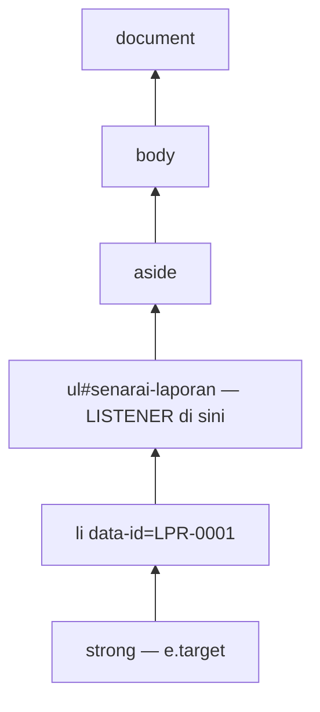

# Nota Pelajar — Hari 3: JavaScript DOM Manipulation & Event Handling

Nota rujukan penuh untuk Hari 3. Baca bersama slaid dan lab hari ini.

**Kandungan:**

- Nota 07 — DOM, Event & Borang — Membina Antara Muka GeoLapor dengan Selamat
- Nota 08 — Web Mapping dengan Leaflet, OGC & GeoServer

**Nota sokongan:** Nota 06 (Edaran Hari 2) — HTTP, REST & Fetch API — Bekerja dengan API Secara Profesional.

---

## 07 · DOM, Event & Borang — Membina Antara Muka GeoLapor dengan Selamat

> Nota topikal (rujukan merentas hari) · Indeks: `README.md`

### Objektif nota

- **Memilih** elemen dengan `getElementById`, `querySelector(All)` dan **merentas** pokok DOM (`closest`, `children`, `parentElement`).
- **Mencipta dan mengubah** elemen, atribut, kelas dan gaya; **merender** senarai laporan dari data API **tanpa** risiko XSS (`textContent`/`createElement`, bukan `innerHTML` dengan data pengguna).
- **Mengendali** event `click`, `input`, `change`, `keyup`, `submit` dan **menggunakan** event delegation untuk senarai dinamik.
- **Membina** borang laporan dengan validasi asas (HTML + JS), `FormData`, POST JSON, dan **memaparkan** error 422 di sebelah medan.

---

### 1. Kenapa DOM?

API memberi **data**; pengguna melihat **halaman**. **DOM** (Document Object Model) ialah jambatan: browser menukar HTML kepada pokok objek JavaScript yang boleh dibaca dan diubah. Setiap kali GeoLapor menambah item senarai, menukar lencana status, atau menunjukkan error borang — itu manipulasi DOM.

```text
document
└── html
    ├── head
    └── body
        ├── header#kepala
        ├── main
        │   ├── div#peta                    ← Leaflet (nota 08)
        │   ├── aside#panel
        │   │   ├── form#borang-penapis
        │   │   └── ul#senarai-laporan      ← li[data-id="LPR-0001"] …
        │   └── form#borang-laporan
        └── div#notis[role=status]
```

---

### 2. Memilih & merentas

```js
// Satu elemen
const peta = document.getElementById('peta');                    // pantas, ikut id
const senarai = document.querySelector('#senarai-laporan');       // pemilih CSS
const butangHantar = document.querySelector('#borang-laporan button[type="submit"]');

// Banyak elemen → NodeList (statik)
const semuaLi = document.querySelectorAll('#senarai-laporan li');
semuaLi.forEach((li) => li.classList.remove('dipilih'));
const ids = [...semuaLi].map((li) => li.dataset.id);             // tukar ke array untuk map/filter

// Dalam elemen tertentu (lebih pantas & tepat)
const borang = document.querySelector('#borang-laporan');
const inputTajuk = borang.querySelector('[name="tajuk"]');
const inputLat = borang.elements.lat;                             // borang.elements ikut name

// Merentas
const li = senarai.querySelector('li');
li.parentElement;          // ul#senarai-laporan
li.nextElementSibling;     // li seterusnya (atau null)
senarai.children;          // HTMLCollection anak elemen
li.closest('aside');       // nenek moyang terdekat yang padan pemilih — PENTING untuk delegasi
```

> ⚠️ **`null` kerana skrip terlalu awal / pemilih salah.** `Cannot read properties of null (reading 'addEventListener')` = `querySelector` tidak jumpa. Semak: (1) `defer`/`type="module"`? (2) id dieja sama (`senarai-laporan` vs `senaraiLaporan`)? (3) `#` untuk id dalam `querySelector`, **tanpa** `#` untuk `getElementById`.

---

### 3. `textContent` vs `innerHTML` — isu keselamatan

Bayangkan pengguna menghantar laporan dengan tajuk:

```text

```

```js
// ❌ BAHAYA — string dijadikan HTML; onerror DILAKSANAKAN pada setiap browser yang memaparkan senarai
li.innerHTML = `<strong>${laporan.tajuk}</strong>`;

// ✅ SELAMAT — dipaparkan sebagai teks, tiada HTML dilaksanakan
const strong = document.createElement('strong');
strong.textContent = laporan.tajuk;
li.append(strong);
```

Inilah **XSS (Cross-Site Scripting)** tersimpan: data dari API (yang asalnya dari pengguna lain) dilaksanakan sebagai kod dalam browser anda. Popup Leaflet juga sama — `marker.bindPopup(teksPengguna)` menerima HTML!

| Property / API | Tafsir sebagai | Guna untuk data pengguna? |
|-------------|----------------|---------------------------|
| `el.textContent = s` | Teks biasa | ✅ Ya |
| `document.createElement` + `append` | Nod DOM | ✅ Ya |
| `el.setAttribute('title', s)` | Nilai atribut (bukan `href`/`src`/`on*`) | ✅ Ya |
| `el.innerHTML = s` | **HTML** | ❌ Tidak (hanya untuk templat statik anda sendiri) |
| `el.insertAdjacentHTML` | **HTML** | ❌ Tidak |
| `a.href = s` | URL — `javascript:` boleh dilaksana | ⚠️ Sahkan skema `https:` dahulu |
| `L.marker().bindPopup(s)` (Leaflet) | **HTML** | ⚠️ Hantar **elemen DOM**, bukan string |

> **Peraturan projek:** jangan gunakan `innerHTML` dengan data pengguna. Jika HTML kaya benar-benar diperlukan, sanitasi dengan pustaka seperti DOMPurify — tetapi dalam GeoLapor kita tidak memerlukannya.

---

### 4. Mencipta & mengubah elemen

#### 4.1 Fungsi render satu laporan

```js
const LABEL_STATUS = { baharu: 'Baharu', 'dalam-tindakan': 'Dalam tindakan', selesai: 'Selesai', ditolak: 'Ditolak' };

function elemenLaporan(feature) {
  const { id, tajuk, kategori, status } = feature.properties;
  const [lng, lat] = feature.geometry.coordinates;

  const li = document.createElement('li');
  li.className = 'laporan';
  li.dataset.id = id;                              // → data-id="LPR-0001" (untuk delegasi)
  li.tabIndex = 0;                                 // boleh difokus dengan papan kekunci

  const tajukEl = document.createElement('strong');
  tajukEl.textContent = tajuk;                     // ✅ selamat

  const lencana = document.createElement('span');
  lencana.classList.add('lencana', `status-${status}`);   // kelas untuk warna CSS
  lencana.textContent = LABEL_STATUS[status] ?? status;

  const meta = document.createElement('small');
  meta.textContent = `${kategori} · ${lat.toFixed(4)}, ${lng.toFixed(4)}`;

  const padam = document.createElement('button');
  padam.type = 'button';
  padam.dataset.tindakan = 'padam';
  padam.textContent = 'Padam';
  padam.setAttribute('aria-label', `Padam laporan ${id}`);

  li.append(tajukEl, lencana, meta, padam);
  return li;
}
```

#### 4.2 Render senarai — sekali ke DOM

```js
function renderSenarai(ul, features) {
  if (features.length === 0) {
    const kosong = document.createElement('li');
    kosong.className = 'kosong';
    kosong.textContent = 'Tiada laporan sepadan dengan penapis.';
    ul.replaceChildren(kosong);
    return;
  }
  ul.replaceChildren(...features.map(elemenLaporan));   // ganti semua anak dalam SATU operasi
}
```

> 💡 `replaceChildren(...)` membersihkan dan mengisi semula dalam satu langkah — lebih ringkas daripada `ul.innerHTML = ''` + loop `appendChild`, dan browser hanya melukis semula sekali. Untuk ratusan item, `DocumentFragment` memberi kesan yang sama.

#### 4.3 Atribut, kelas, gaya

```js
li.classList.add('dipilih');
li.classList.toggle('dipilih', idDipilih === li.dataset.id);   // paksa on/off ikut syarat
li.classList.contains('dipilih');

butangHantar.disabled = true;                  // property boolean
butangHantar.setAttribute('aria-busy', 'true');
li.hidden = true;                              // sembunyi (lebih jelas daripada style.display)

// Gaya: utamakan KELAS CSS. Gaya sebaris hanya untuk nilai dinamik.
lencana.style.backgroundColor = warnaIkutKod[kategori] ?? '#6c757d';
document.documentElement.style.setProperty('--tinggi-peta', '60vh');  // CSS variable
```

---

### 5. Event

#### 5.1 `addEventListener`

```js
const inputCari = document.querySelector('#cari');
const pilihKategori = document.querySelector('#penapis-kategori');

inputCari.addEventListener('input', (e) => {      // setiap perubahan (taip, tampal, padam)
  console.log('carian:', e.target.value);
});
pilihKategori.addEventListener('change', (e) => {  // bila nilai <select> dipilih
  console.log('kategori:', e.target.value);
});
inputCari.addEventListener('keyup', (e) => {
  if (e.key === 'Escape') {                         // e.key, bukan keyCode (lapuk)
    inputCari.value = '';
    inputCari.dispatchEvent(new Event('input'));    // cetuskan semula penapisan
  }
});
```

| Event | Bila | Guna dalam GeoLapor |
|-------|------|---------------------|
| `click` | Klik / Enter pada butang | Butang padam, item senarai |
| `input` | Setiap perubahan nilai | Carian `q` (dengan debounce) |
| `change` | Nilai disahkan (select, checkbox, selepas blur untuk text) | Penapis kategori/status, togol layer |
| `keyup` / `keydown` | Kekunci | `Escape` kosongkan carian, `Enter` pada item senarai |
| `submit` | Borang dihantar (butang atau Enter) | Borang laporan |
| `DOMContentLoaded` | DOM siap | Tidak perlu jika guna `defer`/`module` |

> ⚠️ **`addEventListener('click', simpan())`** — tanda kurung memanggil fungsi **serta-merta** dan mendaftarkan hasilnya (`undefined`). Hantar rujukan: `addEventListener('click', simpan)` atau `() => simpan(id)`.

#### 5.2 Event delegation — satu listener untuk seluruh senarai

Senarai dirender semula setiap kali penapis berubah. Jika setiap `<li>` ada listener sendiri, anda perlu memasangnya semula setiap kali (dan listener lama mungkin bocor). **Delegasi**: pasang **satu** listener pada induk yang kekal; gunakan *bubbling* dan `closest()` untuk tahu apa yang diklik.

```js
senarai.addEventListener('click', async (e) => {
  const li = e.target.closest('li[data-id]');         // klik pada <strong>/<small> pun sampai ke li
  if (!li || !senarai.contains(li)) return;           // klik di luar item
  const id = li.dataset.id;

  if (e.target.closest('[data-tindakan="padam"]')) {
    e.stopPropagation();
    if (!confirm(`Padam ${id}?`)) return;
    await padamLaporan(id);                           // services/api.js
    li.remove();
    return;
  }
  pilihLaporan(id);                                   // zum peta ke marker (Hari 3 S3)
});

// Aksesibiliti: Enter pada item yang difokus
senarai.addEventListener('keydown', (e) => {
  if (e.key === 'Enter' && e.target.matches('li[data-id]')) pilihLaporan(e.target.dataset.id);
});
```



> 💡 **`e.target` vs `e.currentTarget`:** `target` = elemen paling dalam yang diklik (`<strong>`); `currentTarget` = elemen yang memegang listener (`<ul>`). Delegasi menggunakan `target.closest(...)`.

#### 5.3 Event peta (preview nota 08)

```js
peta.on('click', (e) => {                          // Leaflet: e.latlng = { lat, lng }
  borang.elements.lat.value = e.latlng.lat.toFixed(6);
  borang.elements.lng.value = e.latlng.lng.toFixed(6);
});
```

---

### 6. Borang

#### 6.1 HTML dengan validasi terbina

```html
<form id="borang-laporan" novalidate>
  <label for="tajuk">Tajuk</label>
  <input id="tajuk" name="tajuk" required minlength="5" maxlength="120" aria-describedby="ralat-tajuk">
  <p id="ralat-tajuk" class="ralat" aria-live="polite"></p>

  <label for="kategori">Kategori</label>
  <select id="kategori" name="kategori" required>
    <option value="">— pilih —</option>
    <!-- diisi dari GET /api/kategori -->
  </select>
  <p id="ralat-kategori" class="ralat" aria-live="polite"></p>

  <label for="catatan">Catatan</label>
  <textarea id="catatan" name="catatan" maxlength="1000"></textarea>

  <fieldset>
    <legend>Lokasi (klik peta)</legend>
    <input name="lat" inputmode="decimal" required placeholder="lat cth 2.9264" aria-describedby="ralat-lat">
    <input name="lng" inputmode="decimal" required placeholder="lng cth 101.6958" aria-describedby="ralat-lng">
    <p id="ralat-lat" class="ralat"></p>
    <p id="ralat-lng" class="ralat"></p>
  </fieldset>

  <button type="submit">Hantar laporan</button>
</form>
```

`novalidate` mematikan gelembung error default browser supaya **kita** memaparkan mesej BM yang konsisten — tetapi atribut `required`/`minlength` masih boleh disemak melalui `checkValidity()`.

#### 6.2 Isi `<select>` dari API

```js
const kategori = await senaraiKategori();       // [{ kod, nama, warna }]
const pilih = borang.elements.kategori;
for (const { kod, nama } of kategori) {
  pilih.append(new Option(nama, kod));          // new Option(teks, nilai) — selamat (teks)
}
```

#### 6.3 Hantar: `FormData` → validasi → POST JSON → 422

```js
import { ciptaLaporan, ApiError } from './services/api.js';
import { dalamMalaysia } from './utils/geo.js';

function validasi(data) {
  const ralat = {};
  if (data.tajuk.length < 5) ralat.tajuk = 'Tajuk sekurang-kurangnya 5 aksara.';
  if (!data.kategori) ralat.kategori = 'Sila pilih kategori.';
  if (!Number.isFinite(data.lat) || !Number.isFinite(data.lng)) {
    ralat.lat = 'Koordinat tidak sah — klik pada peta.';
  } else if (!dalamMalaysia([data.lng, data.lat])) {
    ralat.lat = 'Lokasi di luar Malaysia. Adakah lat/lng tertukar?';
  }
  return ralat;
}

function paparRalatMedan(borang, ralat = {}) {
  for (const el of borang.querySelectorAll('.ralat')) el.textContent = '';   // kosongkan dahulu
  for (const input of borang.querySelectorAll('[aria-invalid]')) input.removeAttribute('aria-invalid');

  for (const [medan, mesej] of Object.entries(ralat)) {
    const p = borang.querySelector(`#ralat-${medan}`);
    if (p) p.textContent = mesej;                                              // ✅ textContent
    borang.elements[medan]?.setAttribute('aria-invalid', 'true');
  }
  const pertama = Object.keys(ralat)[0];
  if (pertama) borang.elements[pertama]?.focus();                              // bawa pengguna ke medan error
}

borang.addEventListener('submit', async (e) => {
  e.preventDefault();                               // ⚠️ tanpa ini halaman dimuat semula

  const fd = new FormData(borang);
  const data = {
    tajuk: fd.get('tajuk').trim(),
    kategori: fd.get('kategori'),
    catatan: fd.get('catatan').trim(),
    lat: fd.get('lat') === '' ? NaN : Number(fd.get('lat')),   // '' → NaN, bukan 0
    lng: fd.get('lng') === '' ? NaN : Number(fd.get('lng')),
  };

  const ralat = validasi(data);                     // 1. validasi klien — pantas, mesra
  paparRalatMedan(borang, ralat);
  if (Object.keys(ralat).length) return;

  const butang = borang.querySelector('[type="submit"]');
  butang.disabled = true;                           // 2. halang klik berganda → laporan pendua
  butang.textContent = 'Menghantar…';
  try {
    const baharu = await ciptaLaporan(data);        // 3. POST JSON → 201 Feature
    notis(`Laporan ${baharu.id} berjaya dihantar.`);
    borang.reset();
    tambahKePetaDanSenarai(baharu);
  } catch (err) {
    if (err instanceof ApiError && err.status === 422) {
      paparRalatMedan(borang, err.medan ?? {});     // 4. validasi SERVER menang
    } else {
      notis(err.message, 'ralat');
    }
  } finally {
    butang.disabled = false;
    butang.textContent = 'Hantar laporan';
  }
});
```

**Kenapa validasi dua kali?** Validasi klien untuk **pengalaman pengguna** (maklum balas segera). Validasi server untuk **kebenaran** — sesiapa boleh memintas JS dengan `curl`. Server sentiasa menjadi hakim terakhir; UI mesti boleh memaparkan `medan` dari 422.

> 💡 `Object.fromEntries(new FormData(borang))` menukar semua medan kepada objek sekali gus — berguna, tetapi ingat semua nilai ialah **string** (atau `File`). Tukar nombor secara eksplisit.

#### 6.4 Notis yang boleh dibaca pembaca skrin

```js
const kotakNotis = document.querySelector('#notis');     // <div id="notis" role="status" aria-live="polite">
function notis(mesej, jenis = 'info') {
  kotakNotis.className = `notis notis-${jenis}`;
  kotakNotis.textContent = mesej;                         // ✅ textContent
  clearTimeout(notis.pemasa);
  notis.pemasa = setTimeout(() => (kotakNotis.textContent = ''), 5000);
}
```

---

### 7. Prestasi DOM — ringkas

| Amalan | Kenapa |
|--------|--------|
| Bina dahulu, masukkan ke DOM sekali (`replaceChildren`, `DocumentFragment`) | Elak lukis semula berulang |
| Delegasi untuk senarai | Satu listener vs 400 |
| Debounce `input` carian (300 ms — Nota 02 (Edaran Hari 1) §7.3) | Kurang render & request |
| Jangan baca `offsetHeight` dalam loop yang menulis gaya | Elak *layout thrashing* |
| Ratusan marker → clustering (Hari 5, Nota 08 (Edaran Hari 3)) | DOM peta ringan |

---

### ⚠️ Kesilapan lazim

| Kesilapan | Gejala | Pembetulan |
|-----------|--------|------------|
| `innerHTML` dengan tajuk/catatan pengguna | XSS; HTML rosak jika tajuk ada `<` | `textContent` / `createElement` |
| `bindPopup(\`<b>${tajuk}</b>\`)` | XSS dalam popup peta | Bina elemen, `bindPopup(el)` |
| Lupa `e.preventDefault()` pada submit | Halaman dimuat semula, data hilang, tiada error kelihatan | `e.preventDefault()` baris pertama |
| `querySelector('peta')` (tanpa `#`) | `null` | `#peta` atau `getElementById('peta')` |
| Listener pada setiap `<li>` selepas render semula | Klik berganda / tiada tindak balas | Delegasi pada `<ul>` |
| `e.target.dataset.id` terus | `undefined` bila klik anak `<strong>` | `e.target.closest('li[data-id]')` |
| `Number(fd.get('lat'))` untuk medan kosong | `0` lulus validasi | Semak `''` dahulu → `NaN` |
| Butang tidak dinyahaktif semasa hantar | Laporan pendua | `disabled = true` + `finally` |
| Hanya validasi klien | Data tidak sah melalui `curl` | Papar 422 `medan` dari server |
| Error tidak dikosongkan antara hantaran | Mesej lama kekal | Kosongkan semua `.ralat` dahulu |
| `addEventListener('click', f())` | Fungsi jalan sekali, klik tiada kesan | `addEventListener('click', f)` |

---

### Rujukan rasmi

- MDN — Introduction to the DOM: <https://developer.mozilla.org/en-US/docs/Web/API/Document_Object_Model/Introduction>
- MDN — `Document.querySelector()`: <https://developer.mozilla.org/en-US/docs/Web/API/Document/querySelector>
- MDN — `Element.closest()`: <https://developer.mozilla.org/en-US/docs/Web/API/Element/closest>
- MDN — `Node.textContent`: <https://developer.mozilla.org/en-US/docs/Web/API/Node/textContent>
- MDN — `Element.innerHTML` (pertimbangan keselamatan): <https://developer.mozilla.org/en-US/docs/Web/API/Element/innerHTML>
- MDN — `Element.replaceChildren()`: <https://developer.mozilla.org/en-US/docs/Web/API/Element/replaceChildren>
- MDN — Event bubbling & delegation: <https://developer.mozilla.org/en-US/docs/Learn_web_development/Core/Scripting/Event_bubbling>
- MDN — `FormData`: <https://developer.mozilla.org/en-US/docs/Web/API/FormData>
- MDN — Client-side form validation: <https://developer.mozilla.org/en-US/docs/Learn_web_development/Extensions/Forms/Form_validation>
- MDN — ARIA live regions: <https://developer.mozilla.org/en-US/docs/Web/Accessibility/ARIA/Guides/Live_regions>
- OWASP — Cross Site Scripting Prevention Cheat Sheet: <https://cheatsheetseries.owasp.org/cheatsheets/Cross_Site_Scripting_Prevention_Cheat_Sheet.html>
- Leaflet — `bindPopup` (menerima String | HTMLElement): <https://leafletjs.com/reference.html#layer-bindpopup>

### Digunakan pada Hari N

| Hari | Sesi | Bahagian nota |
|------|------|---------------|
| 3 | S1 · DOM Selection & Traversal | §1–2 (pokok DOM, pemilihan, `closest`) → rangka halaman GeoLapor |
| 3 | S2 · DOM Element Manipulation | §3 (`textContent` vs `innerHTML`), §4 (render senarai dari API, kelas, gaya) |
| 3 | S3 · Event Handling | §5 (`click/input/change/keyup`, delegasi, event peta) → klik senarai zum marker |
| 3 | S4 · Form Handling | §6 (validasi, `FormData`, POST JSON, 422) → borang laporan baharu |
| 4 | S4 · Browser Storage | §6.3 (simpan draf borang — lihat Nota 12 (Edaran Hari 4)) |
| 5 | S3 · Best Practices & Conclusion | §3 (senarai semak keselamatan XSS), §7 (prestasi) |

---

## 08 · Web Mapping dengan Leaflet, OGC & GeoServer

> Nota topikal · Indeks: `./README.md`

### Objektif nota

Selepas membaca nota ini, anda boleh:

- **Menerangkan** cara *tile* peta XYZ `z/x/y` berfungsi dan beza tile **raster** dengan tile **vektor**.
- **Membezakan** EPSG:4326 (data) dengan EPSG:3857 (paparan), dan **menukar** susunan `[lng, lat]` (GeoJSON) ↔ `[lat, lng]` (Leaflet) tanpa silap.
- **Membina** peta Leaflet 1.9 dengan tile OSM beratribusi, marker, popup selamat, `L.geoJSON` (`pointToLayer`, `style`, `onEachFeature`), `fitBounds` dan kawalan layer.
- **Memanggil** perkhidmatan OGC (WMS, WMTS, WFS) daripada GeoServer dan memaparkannya dalam Leaflet.
- **Memilih** pustaka peta yang sesuai (Leaflet / MapLibre GL JS / OpenLayers / ArcGIS Maps SDK) dan **merancang** cara menyepadukannya ke dalam sistem PGN sedia ada.

---

### 1. Kenapa peta web berbeza daripada peta desktop?

Dalam QGIS/ArcGIS Pro, fail dibuka terus daripada cakera dan dilukis oleh CPU mesin anda. Dalam browser:

1. **Data mesti dihantar melalui rangkaian** — setiap bait dikira. Peta dunia penuh pada zum 18 ialah berbilion piksel; mustahil dimuat sekali gus.
2. **Browser hanya faham HTML, CSS, JS, imej & JSON** — bukan `.shp` atau `.ecw`. Sesuatu mesti menukar data kepada bentuk yang browser faham (tile imej, GeoJSON, tile vektor).
3. **Pengguna menjangka peta licin** — seret & zum tanpa tersekat.

Penyelesaian industri: **potong dunia kepada tile kecil** (biasanya 256×256 px) dan muat hanya tile yang kelihatan. Di atas tile asas itu, kita tindih **layer data** (GeoJSON, WMS, dsb.).

```mermaid
flowchart TB
    subgraph Browser
      M[Leaflet L.map] --> T[Base tile layer<br/>OSM / tile dalaman]
      M --> W[WMS layer<br/>GeoServer]
      M --> G[GeoJSON layer<br/>GeoLapor API]
    end
    T -->|GET /{z}/{x}/{y}.png| TS[(Tile server)]
    W -->|GET ?SERVICE=WMS&REQUEST=GetMap| GS[(GeoServer)]
    G -->|GET /api/laporan| API[(Mock API :3000)]
```

---

### 2. Tile XYZ: `{z}/{x}/{y}`

| Simbol | Maksud |
|--------|--------|
| `z` | Aras zum. Zum 0 = seluruh dunia dalam **1** tile. Setiap aras menggandakan lebar & tinggi → zum `z` ada `2^z × 2^z` tile. |
| `x` | Lajur tile, 0 di barat (−180°) bertambah ke timur. |
| `y` | Baris tile, 0 di **utara** (≈85.05°U) bertambah ke selatan (skema XYZ/"Slippy Map"). TMS menterbalikkan `y` — punca biasa tile "tunggang terbalik". |

Contoh: Putrajaya (lat 2.9264, lng 101.6958) pada zum 12 ialah tile kira-kira `z=12, x=3205, y=2014` — URL OSM: `https://tile.openstreetmap.org/12/3205/2014.png`.

```js
// Kira nombor tile untuk satu titik — berguna untuk memahami (dan untuk menyediakan tile luar talian)
function jubinUntuk(lat, lng, z) {
  const n = 2 ** z;
  const x = Math.floor(((lng + 180) / 360) * n);
  const latRad = (lat * Math.PI) / 180;
  const y = Math.floor(((1 - Math.log(Math.tan(latRad) + 1 / Math.cos(latRad)) / Math.PI) / 2) * n);
  return { z, x, y };
}
console.log(jubinUntuk(2.9264, 101.6958, 12)); // { z: 12, x: 3205, y: 2014 }
```

#### Raster vs vektor

| | **Tile raster** (PNG/JPEG/WebP) | **Tile vektor** (MVT/PBF) |
|---|---|---|
| Kandungan | Imej siap dilukis | Geometri + atribut, dilukis di browser (WebGL) |
| Gaya | Tetap (ditentukan di server) | Boleh ubah di klien (tema gelap, label BM) |
| Putaran/condong 3D | Tidak | Ya |
| Saiz | Lebih besar per tile | Lebih kecil, tajam pada semua skala |
| Pustaka | Leaflet (natif) | MapLibre GL JS / OpenLayers (natif); Leaflet perlu plugin |
| Contoh | OSM standard, WMS/WMTS | OpenMapTiles, PMTiles, tile vektor ArcGIS |

> 💡 **Tip:** Untuk kursus ini (dan kebanyakan sistem dalaman), **tile raster + layer GeoJSON** memadai dan paling mudah difahami. Tile vektor menjadi relevan apabila anda perlukan gaya dinamik atau data sangat besar.

---

### 3. CRS: data dalam 4326, paparan dalam 3857

| EPSG | Nama | Unit | Di mana |
|------|------|------|---------|
| **4326** | WGS 84 (geografi) | darjah | **Data**: GeoJSON (RFC 7946 mewajibkan WGS84), GPS, API GeoLapor |
| **3857** | WGS 84 / Pseudo-Mercator | meter | **Paparan**: hampir semua tile web (OSM, Google, Bing) |
| **3375** | GDM2000 / Peninsula RSO | meter | Data rasmi Semenanjung (lihat Nota 09 (Edaran Hari 4)) |

Leaflet secara default menggunakan `L.CRS.EPSG3857` untuk **paparan** tetapi semua API awamnya menerima **lat/lng (darjah)**. Jadi anda jarang perlu menukar 4326→3857 sendiri — Leaflet buat untuk anda. Yang **mesti** anda buat sendiri ialah menukar data RSO (3375) → 4326 **sebelum** memberi kepada Leaflet (guna `keWgs84()` dalam `utils/unjuran.js`).

#### ⚠️ Susunan koordinat — ulang sampai hafal

```js
// GeoJSON (RFC 7946) — [longitud, latitud]  →  [x, y]
const feature = { type: 'Feature', geometry: { type: 'Point', coordinates: [101.6958, 2.9264] } };

// Leaflet — [latitud, longitud]  →  [y, x]
L.marker([2.9264, 101.6958]);

// Tukar dengan destructuring — JANGAN indeks [0]/[1] tanpa nama
const [lng, lat] = feature.geometry.coordinates;
L.marker([lat, lng]);

// Atau guna pembantu Leaflet
const latlng = L.GeoJSON.coordsToLatLng(feature.geometry.coordinates); // L.LatLng {lat: 2.9264, lng: 101.6958}
```

**Ujian pantas:** Malaysia berada sekitar **lat 1–7**, **lng 99–119**. Jika `[101.6958, 2.9264]` diberi terus kepada Leaflet, ia dibaca sebagai lat 101.7 (tidak wujud — Leaflet mengepit ke ≈85°) dan marker muncul di luar peta atau di tempat mengarut. Jika marker anda tiada di Malaysia, susunan anda terbalik. `dalamMalaysia([lng, lat])` dalam `utils/geo.js` wujud tepat untuk tangkap kesilapan ini.

---

### 4. Leaflet 1.9 — teras

#### 4.1 Peta + tile asas (dengan atribusi)

```html
<!-- Salinan tempatan (luar talian) — lihat §9. Versi CDN: https://unpkg.com/leaflet@1.9.4/dist/leaflet.css -->
<link rel="stylesheet" href="./vendor/leaflet/leaflet.css" />
<div id="peta" style="height: 480px"></div>
<script src="./vendor/leaflet/leaflet.js"></script>
<script type="module" src="./main.js"></script>
```

```js
// main.js — Hari 3 (tanpa bundler; L global daripada <script>)
const peta = L.map('peta', {
  center: [2.9264, 101.6958], // [lat, lng] — Putrajaya
  zoom: 13,
  maxZoom: 19,
});

// Tile OSM: atribusi WAJIB (lesen ODbL) dan hormati polisi penggunaan tile
const osm = L.tileLayer('https://tile.openstreetmap.org/{z}/{x}/{y}.png', {
  maxZoom: 19,
  attribution: '&copy; <a href="https://www.openstreetmap.org/copyright">OpenStreetMap</a> contributors',
}).addTo(peta);
```

> ⚠️ **Polisi tile OSM:** server `tile.openstreetmap.org` ialah sumbangan komuniti. **Dilarang** memuat turun pukal (*bulk download/prefetch*) untuk kegunaan luar talian, dan aplikasi berat perlu tile server sendiri atau pembekal komersial. Untuk sistem produksi PGN, gunakan tile server/peta asas dalaman.

#### 4.2 Marker & popup — kandungan selamat

`bindPopup(string)` **mentafsir HTML**. Jika `tajuk` datang daripada pengguna (borang GeoLapor), string HTML membuka pintu XSS. Beri **elemen DOM** sebaliknya:

```js
function binaPopup(properties) {
  const div = document.createElement('div');
  const h = document.createElement('strong');
  h.textContent = properties.tajuk;          // textContent — tidak ditafsir sebagai HTML
  const p = document.createElement('p');
  p.textContent = `${properties.kategori} · ${properties.status}`;
  div.append(h, p);
  return div;
}

L.marker([2.9264, 101.6958]).bindPopup(binaPopup({
  tajuk: 'Papan tanda sempadan rosak ', // cubaan XSS → dipapar sebagai teks
  kategori: 'infrastruktur',
  status: 'baharu',
})).addTo(peta);
```

#### 4.3 `L.geoJSON` — satu panggilan untuk seluruh FeatureCollection

```js
const WARNA_KATEGORI = {
  infrastruktur: '#d97706',
  'alam-sekitar': '#16a34a',
  tanah: '#92400e',
  utiliti: '#2563eb',
  'lain-lain': '#6b7280',
};

const lapisanLaporan = L.geoJSON(null, {
  // (1) Point → layer apa? Default: L.marker. circleMarker lebih ringan & boleh diwarna.
  pointToLayer: (feature, latlng) =>            // latlng SUDAH ditukar ke [lat, lng] oleh Leaflet
    L.circleMarker(latlng, {
      radius: 7,
      color: '#fff',
      weight: 1,
      fillColor: WARNA_KATEGORI[feature.properties.kategori] ?? '#6b7280',
      fillOpacity: 0.9,
    }),

  // (2) Gaya untuk layer vektor (Polygon/LineString, juga circleMarker). Pulangkan {} = tiada perubahan.
  style: (feature) => (feature.geometry.type === 'Polygon' ? { color: '#7c3aed', weight: 2, fillOpacity: 0.1 } : {}),

  // (3) Dipanggil sekali per feature — tempat popup, tooltip, event
  onEachFeature: (feature, layer) => {
    layer.bindPopup(binaPopup(feature.properties));
    layer.on('click', () => console.log('Dipilih', feature.id));
  },

  // (4) Tapis tanpa ubah data asal
  filter: (feature) => feature.properties.status !== 'ditolak',
}).addTo(peta);

// Isi daripada API (services/api.js — Hari 2)
const fc = await senaraiLaporan();   // FeatureCollection
lapisanLaporan.clearLayers();
lapisanLaporan.addData(fc);

// Zum supaya semua data kelihatan
if (lapisanLaporan.getLayers().length > 0) {
  peta.fitBounds(lapisanLaporan.getBounds(), { padding: [24, 24], maxZoom: 16 });
}
```

> 💡 **Tip:** Simpan **satu** rujukan `lapisanLaporan` dan guna `clearLayers()` + `addData()` untuk kemas kini. Mencipta `L.geoJSON` baharu setiap kali tapisan berubah akan menyebabkan layer bertindih dan ingatan bocor.

#### 4.4 Kawalan layer

```js
const zon = L.geoJSON(await dapatkanLapisan('sempadan-zon'), { style: { color: '#7c3aed', weight: 2 } });
const sungai = L.geoJSON(await dapatkanLapisan('sungai'), { style: { color: '#0284c7', weight: 3 } });

L.control.layers(
  { 'OpenStreetMap': osm },                                   // peta asas (radio)
  { 'Laporan': lapisanLaporan, 'Sempadan zon': zon, 'Sungai': sungai }, // tindihan (checkbox)
  { collapsed: false },
).addTo(peta);

L.control.scale({ metric: true, imperial: false }).addTo(peta);
```

#### 4.5 Event peta → borang (Hari 3)

```js
peta.on('click', (e) => {
  const { lat, lng } = e.latlng;                       // Leaflet memberi objek {lat, lng}
  document.querySelector('#lat').value = lat.toFixed(6);
  document.querySelector('#lng').value = lng.toFixed(6);
});

peta.on('moveend', () => {
  const b = peta.getBounds();
  const bbox = [b.getWest(), b.getSouth(), b.getEast(), b.getNorth()]; // susunan bbox GeoJSON/API
  console.log('bbox semasa', bbox.join(','));          // untuk ?bbox= (lihat nota 13 §8)
});
```

---

### 5. Standard OGC: WMS, WMTS, WFS

Sistem geospatial kerajaan (termasuk yang menggunakan GeoServer, ArcGIS Server, MapServer) mendedahkan data melalui **standard OGC**. Kelebihannya: satu server, banyak klien (QGIS, ArcGIS, Leaflet, OpenLayers) tanpa format khas.

| Perkhidmatan | Pulangkan | Guna bila | Operasi utama |
|--------------|-----------|-----------|---------------|
| **WMS** (Web Map Service) | **Imej** (PNG/JPEG) dilukis ikut request | Papar layer besar yang digayakan di server; tiada interaksi per-feature | `GetCapabilities`, `GetMap`, `GetFeatureInfo` |
| **WMTS** (Web Map Tile Service) | **Tile imej** pra-jana, grid tetap | Peta asas / imejan udara besar; sangat pantas (cache) | `GetCapabilities`, `GetTile` |
| **WFS** (Web Feature Service) | **Data vektor** (GML, GeoJSON) | Perlu atribut, klik, tapis, analisis di klien | `GetCapabilities`, `DescribeFeatureType`, `GetFeature` |

#### 5.1 Contoh URL (gaya GeoServer, workspace `pgn`)

```text
# WMS — senarai layer & keupayaan
http://localhost:8080/geoserver/pgn/wms?SERVICE=WMS&VERSION=1.3.0&REQUEST=GetCapabilities

# WMS — satu imej 768×512 bagi kotak Putrajaya
# ⚠️ WMS 1.3.0 + EPSG:4326 → BBOX ialah minLat,minLng,maxLat,maxLng (paksi lat dahulu!)
http://localhost:8080/geoserver/pgn/wms?SERVICE=WMS&VERSION=1.3.0&REQUEST=GetMap
  &LAYERS=pgn:sempadan_zon&STYLES=&CRS=EPSG:4326
  &BBOX=2.88,101.65,2.98,101.75&WIDTH=768&HEIGHT=512&FORMAT=image/png&TRANSPARENT=true

# WMTS — keupayaan (GeoServer melalui GeoWebCache terbina)
http://localhost:8080/geoserver/gwc/service/wmts?SERVICE=WMTS&REQUEST=GetCapabilities

# WFS — features sebagai GeoJSON, dalam 4326, maksimum 100, tapis bbox
http://localhost:8080/geoserver/pgn/ows?SERVICE=WFS&VERSION=2.0.0&REQUEST=GetFeature
  &TYPENAMES=pgn:kemudahan&OUTPUTFORMAT=application/json&SRSNAME=EPSG:4326
  &COUNT=100&BBOX=101.65,2.88,101.75,2.98,urn:ogc:def:crs:EPSG::4326
```

> ⚠️ **Perangkap paksi:** WMS 1.1.1 guna `SRS=` dan BBOX `minx,miny,...` (lng dahulu). WMS 1.3.0 guna `CRS=` dan untuk EPSG:4326 **lat dahulu**. Imej kosong atau salah tempat biasanya berpunca di sini. Dalam WFS 2.0, tambah URN CRS pada BBOX supaya tafsiran paksi jelas.

#### 5.2 WMS dalam Leaflet

```js
const wmsZon = L.tileLayer.wms('http://localhost:8080/geoserver/pgn/wms', {
  layers: 'pgn:sempadan_zon',
  format: 'image/png',
  transparent: true,         // supaya tile asas kelihatan di bawah
  version: '1.3.0',
  attribution: 'Data sintetik latihan',
}).addTo(peta);
// Leaflet menjana GetMap per tile 256×256 dalam EPSG:3857 — paksi tidak menjadi isu di sini.
```

#### 5.3 WFS → GeoJSON → `L.geoJSON`

```js
async function muatWfs(typeName, bbox) {
  const params = new URLSearchParams({
    service: 'WFS',
    version: '2.0.0',
    request: 'GetFeature',
    typeNames: typeName,
    outputFormat: 'application/json', // GeoServer: GeoJSON
    srsName: 'EPSG:4326',
    count: '500',                     // JANGAN tarik semua — had
    bbox: `${bbox.join(',')},urn:ogc:def:crs:EPSG::4326`,
  });
  const res = await fetch(`http://localhost:8080/geoserver/pgn/ows?${params}`);
  if (!res.ok) throw new Error(`WFS gagal: ${res.status}`);
  return res.json();
}
```

> ⚠️ **Semak paksi output:** dengan `srsName=EPSG:4326` sesetengah versi/tetapan GeoServer memulangkan koordinat `[lat, lng]` dalam GeoJSON. Jika titik muncul di tempat pelik, cuba `srsName=urn:ogc:def:crs:OGC:1.3:CRS84` (sentiasa lng,lat) atau semak dengan `dalamMalaysia()`.

---

### 6. GeoServer — asas yang perlu tahu

GeoServer ialah map server sumber terbuka (Java) yang menerbitkan data sebagai WMS/WMTS/WFS/WCS dan OGC API.

| Konsep | Maksud | Contoh latihan |
|--------|--------|----------------|
| **Workspace** | Ruang nama (prefix) | `pgn` |
| **Store** | Sambungan ke sumber data | PostGIS, direktori Shapefile, GeoPackage, GeoTIFF |
| **Layer** | Satu jadual/fail yang diterbitkan | `pgn:sempadan_zon` |
| **Style** | Gaya SLD/CSS untuk WMS | `zon_ungu.sld` |
| **Layer group** | Beberapa layer sebagai satu | `pgn:peta_asas` |
| **GeoWebCache** | Cache tile terbina (WMTS/TMS) | pra-jana tile zum 6–16 |

#### CORS

Browser menyekat `fetch()` ke asal (*origin*) lain melainkan server menghantar `Access-Control-Allow-Origin`. `L.tileLayer.wms` (tag ``) **tidak** terkesan CORS, tetapi **WFS melalui `fetch` terkesan**. Pilihan:

1. Aktifkan penapis CORS GeoServer (dalam `web.xml` Jetty/Tomcat — lihat dokumentasi *Running in a production environment → container*), hadkan kepada asal sistem anda — **bukan** `*` untuk data dalaman.
2. **Reverse proxy** (Nginx/Apache/IIS) supaya aplikasi & GeoServer berkongsi asal yang sama: `https://gis.agensi.gov.my/app/` dan `https://gis.agensi.gov.my/geoserver/`. Tiada CORS diperlukan langsung.
3. Semasa pembangunan: `server.proxy` Vite (lihat Nota 11 (Edaran Hari 4)).

---

### 7. Perbandingan pustaka peta JavaScript

| | **Leaflet 1.9** | **MapLibre GL JS** | **OpenLayers** | **ArcGIS Maps SDK for JavaScript** |
|---|---|---|---|---|
| Lesen | BSD-2 (bebas) | BSD-3 (bebas; fork sumber terbuka Mapbox GL v1) | BSD-2 (bebas) | Proprietari Esri (perlu akaun/lesen untuk banyak ciri) |
| Rendering | DOM/SVG/Canvas (2D) | **WebGL** (tile vektor, 3D condong/putar) | Canvas + WebGL | WebGL (2D & 3D penuh) |
| Projection | 3857 (default); lain via plugin Proj4Leaflet | 3857 (+ globe) | **Sebarang CRS** melalui proj4 — kuat untuk RSO/Cassini | Banyak CRS, termasuk rujukan ruang Esri |
| OGC | WMS natif; WFS manual (fetch) | Terhad (raster WMS via URL template) | **Paling lengkap**: WMS, WMTS, WFS, GML, KML | Lengkap + perkhidmatan ArcGIS (FeatureServer, MapServer) |
| Saiz / keluk pembelajaran | ~40 KB gz · paling mudah | Sederhana · gaya JSON | Besar · API luas | Besar · ekosistem Esri |
| Kekuatan | Mudah, plugin banyak, sesuai kursus & sistem dalaman | Peta asas vektor cantik, data besar, 3D | GIS "serius" di web, CRS tempatan, standard OGC | Integrasi ArcGIS Enterprise/Online sedia ada |
| Pilih bila | Paparan titik/poligon + WMS, CRUD laporan | Perlu gaya dinamik / tile vektor / PMTiles | Perlu papar data dalam RSO/Cassini asli, WFS-T, alat ukur | Organisasi sudah menggunakan ArcGIS Enterprise |

> 💡 **Tip:** Konsep yang anda pelajari dengan Leaflet (layer, `[lat,lng]` vs `[lng,lat]`, GeoJSON, WMS, event peta) **boleh dipindah** terus ke pustaka lain. Yang berubah hanyalah nama fungsi.

Contoh sama — satu marker Putrajaya:

```js
// Leaflet
L.marker([2.9264, 101.6958]).addTo(peta);                     // [lat, lng]

// MapLibre GL JS
new maplibregl.Marker().setLngLat([101.6958, 2.9264]).addTo(map); // [lng, lat]!

// OpenLayers
new Feature({ geometry: new Point(fromLonLat([101.6958, 2.9264])) }); // [lng, lat] → 3857
```

---

### 8. Menyepadukan peta JS ke dalam sistem PGN sedia ada

Kebanyakan peserta tidak akan membina sistem dari kosong — mereka perlu **menambah peta** kepada sistem sedia ada (PHP/Java/.NET, kadangkala jQuery).

#### 8.1 Pilihan integrasi

| Cara | Bila sesuai | Nota |
|------|-------------|------|
| **`<iframe>`** halaman peta berasingan | Paling cepat; sistem lama tidak boleh diubah banyak | Komunikasi dua hala via `window.postMessage` (sahkan `event.origin`!) |
| **Modul ES dalam halaman sedia ada** | Halaman server-rendered (PHP/JSP/Razor) | Satu `<div id="peta">` + `<script type="module" src="/js/peta.js">`; data awal melalui atribut `data-*` atau endpoint JSON |
| **Build Vite → aset statik** | Mahu npm/pustaka tetapi backend kekal | `vite build` → salin `dist/` ke folder `public/` sistem; tetapkan `base` dalam `vite.config.js` |
| **Aplikasi berasingan (SPA)** | Sistem baharu atau modul besar | Backend jadi API sahaja |

```html
<!-- Contoh: halaman PHP sedia ada, tambah peta tanpa mengubah jQuery lama -->
<div id="peta" data-api="/api" data-lapisan="sempadan-zon,sungai" style="height:420px"></div>
<script type="module">
  // Hasil `vite build` GeoLapor disalin ke /js/geolapor/ dalam sistem sedia ada
  import { ciptaPeta } from '/js/geolapor/ui/peta.js';
  const el = document.querySelector('#peta');
  const peta = ciptaPeta(el, {
    onKlikPeta: ([lng, lat]) => { $('#lat').val(lat); $('#lng').val(lng); }, // jQuery lama pun boleh menerima nilai
  });
  // data-* memberi konfigurasi daripada server (PHP/JSP) tanpa JS sebaris
  console.info('API:', el.dataset.api, 'lapisan:', el.dataset.lapisan.split(','));
</script>
```

```js
// iframe → induk: hantar koordinat yang dipilih
window.parent.postMessage({ jenis: 'titik-dipilih', lat: 2.9264, lng: 101.6958 }, 'https://sistem.agensi.test');

// induk: terima — SENTIASA sahkan asal
window.addEventListener('message', (e) => {
  if (e.origin !== 'https://peta.agensi.test') return;
  if (e.data?.jenis === 'titik-dipilih') console.log(e.data.lat, e.data.lng);
});
```

#### 8.2 Pengesahan ke GeoServer / API

- **Jangan** letak kata laluan GeoServer atau API key sebenar dalam JS — sesiapa boleh buka DevTools dan membacanya. (Key `latihan-pgn-2026` dalam kursus ini **sengaja** palsu.)
- Corak disyorkan: **proxy backend**. Browser memanggil `/proxy/wfs?...` pada server aplikasi (yang sudah tahu sesi pengguna); server menambah kelayakan GeoServer dan meneruskan request.
- Jika token digunakan (JWT/OAuth2 daripada SSO agensi), hantar dalam header `Authorization: Bearer …` melalui `fetch`. Untuk tile WMS (tag ``) header tidak boleh ditambah → guna proxy atau kuki sesi pada domain yang sama.

#### 8.3 Tile luar talian

- Salin `leaflet.js`, `leaflet.css` dan folder `images/` ke `vendor/leaflet/` (lihat §9).
- Untuk peta asas luar talian: jana tile sendiri daripada data yang dibenarkan (cth GeoServer + GeoWebCache seed, atau MBTiles/PMTiles — Nota 09 (Edaran Hari 4)). **Jangan** muat turun pukal tile OSM awam.
- Jika tiada tile langsung, peta tetap berfungsi dengan layer GeoJSON sahaja (latar kosong) — cukup untuk lab.

---

### 9. Leaflet salinan tempatan (luar talian)

```bash
# Dalam projek Vite (Hari 4) — dipakej oleh bundler
npm install leaflet@1.9
```

```js
import L from 'leaflet';
import 'leaflet/dist/leaflet.css';
```

Untuk Hari 1–3 (tanpa bundler), salin daripada `node_modules/leaflet/dist/` (atau zip dari laman muat turun Leaflet) ke `vendor/leaflet/` dan rujuk dengan laluan relatif seperti §4.1.

> ⚠️ Dengan Vite, ikon marker default kadangkala hilang (laluan imej CSS). Penyelesaian ringkas: guna `L.circleMarker` (tiada imej), atau import ikon secara eksplisit:
> ```js
> import ikonUrl from 'leaflet/dist/images/marker-icon.png';
> import ikon2xUrl from 'leaflet/dist/images/marker-icon-2x.png';
> import bayangUrl from 'leaflet/dist/images/marker-shadow.png';
> L.Icon.Default.mergeOptions({ iconUrl: ikonUrl, iconRetinaUrl: ikon2xUrl, shadowUrl: bayangUrl });
> ```

---

### ⚠️ Kesilapan lazim

| Simptom | Punca | Pembetulan |
|---------|-------|------------|
| Peta kelabu/kosong, tiada error | `#peta` tiada ketinggian CSS | Beri `height` eksplisit |
| Tile bercelaru selepas panel dibuka | Saiz bekas berubah selepas peta dicipta | `peta.invalidateSize()` selepas susun atur berubah |
| Marker di Antartika / laut | `[lng, lat]` diberi kepada Leaflet | Destructure `const [lng, lat] = coords` → `L.marker([lat, lng])` |
| Layer bertindih, peta makin perlahan | `L.geoJSON(...).addTo()` baharu setiap kemas kini | Satu layer + `clearLayers()`/`addData()` |
| Popup memaparkan/menjalankan HTML pengguna | `bindPopup(\`<b>${tajuk}</b>\`)` | Bina elemen dengan `textContent` |
| WMS kosong | BBOX paksi salah (1.3.0), nama layer tanpa workspace, `TRANSPARENT` tiada | Uji URL GetMap terus di browser; semak GetCapabilities |
| `fetch` WFS disekat CORS | GeoServer tanpa CORS | Proxy / domain sama / aktifkan CORS terhad |
| `fitBounds` error "Bounds are not valid" | Layer kosong | Semak `getLayers().length > 0` dahulu |

---

### Rujukan rasmi

- Leaflet — Rujukan API: <https://leafletjs.com/reference.html>
- Leaflet — Tutorial GeoJSON: <https://leafletjs.com/examples/geojson/>
- Leaflet — Tutorial WMS/TMS: <https://leafletjs.com/examples/wms/wms.html>
- Leaflet — Muat turun: <https://leafletjs.com/download.html>
- OSM — Polisi penggunaan tile: <https://operations.osmfoundation.org/policies/tiles/> · Hak cipta & atribusi: <https://www.openstreetmap.org/copyright>
- RFC 7946 — The GeoJSON Format: <https://datatracker.ietf.org/doc/html/rfc7946>
- OGC WMS: <https://www.ogc.org/standards/wms/> · WMTS: <https://www.ogc.org/standards/wmts/> · WFS: <https://www.ogc.org/standards/wfs/>
- GeoServer — WMS reference: <https://docs.geoserver.org/stable/en/user/services/wms/reference/> · WFS reference: <https://docs.geoserver.org/stable/en/user/services/wfs/reference/> · Output format WFS: <https://docs.geoserver.org/stable/en/user/services/wfs/outputformats/> · Workspaces: <https://docs.geoserver.org/stable/en/user/data/webadmin/workspaces/> · Container (CORS): <https://docs.geoserver.org/stable/en/user/production/container/>
- MapLibre GL JS: <https://maplibre.org/maplibre-gl-js/docs/> · OpenLayers: <https://openlayers.org/> · ArcGIS Maps SDK for JavaScript: <https://developers.arcgis.com/javascript/latest/>
- Leaflet.markercluster: <https://github.com/Leaflet/Leaflet.markercluster>

### Digunakan pada Hari N

- **Hari 1** — GeoJSON sebagai objek JS; susunan `[lng, lat]` (§3).
- **Hari 2** — ambil layer GeoJSON daripada API; `bbox` query (§4.5, §5.3).
- **Hari 3 (utama)** — S2: peta Leaflet, `L.geoJSON`, popup selamat; S3: klik peta → borang, klik senarai → zum (§4).
- **Hari 4** — Leaflet melalui npm + Vite, ikon marker (§9); proxy dev (§6).
- **Hari 5** — S2: MapLibre/OpenLayers, integrasi ke sistem sedia ada, WMS/WFS GeoServer (§5–§8).
