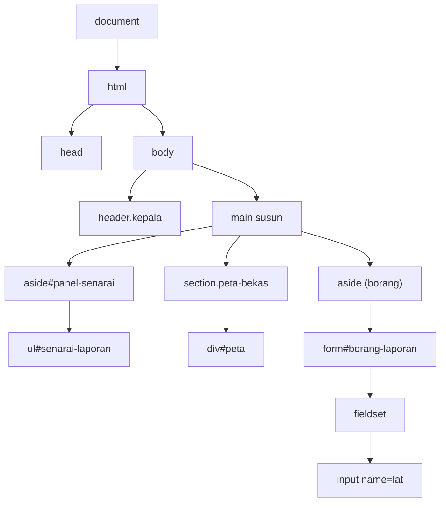
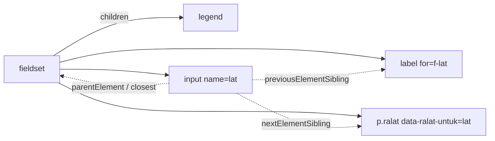
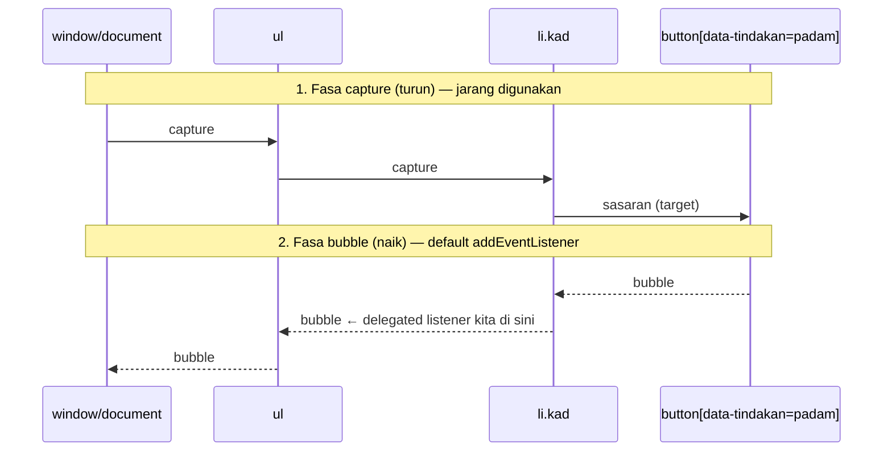
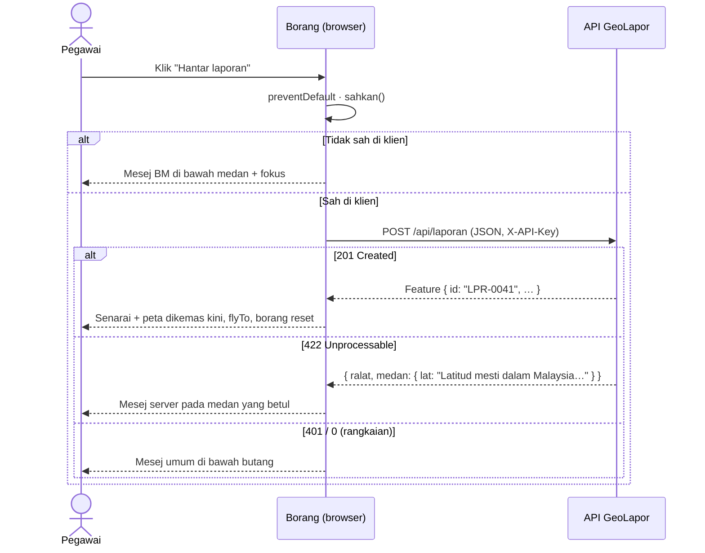

# Hari 3 — JavaScript DOM Manipulation & Event Handling

[📅 Jadual](../JADUAL.md) · [🧪 Lab Hari 3](./lab.md) · [💻 Latihan](../projek/latihan/hari-3/)

> Semalam anda membina `services/api.js`. Anda boleh `fetch` laporan, tetapi hasilnya hanya kelihatan di Console. Hari ini data itu **muncul di skrin**: senarai laporan, peta Leaflet dengan titik berwarna ikut kategori, layer rujukan (zon, sungai, kemudahan), dan borang untuk menghantar laporan baharu. Pegawai hanya perlu klik peta untuk mengisi koordinat. Semuanya tanpa bundler, dengan HTML dan `<script type="module">` sahaja. Hujung hari: **halaman GeoLapor Hari 3** yang berfungsi sepenuhnya dengan mock API.

---

## 🎯 Objektif Pembelajaran

Di akhir hari ini, peserta boleh:

| # | Objektif (boleh diukur) | Sesi | Bukti |
|---|------------------------|------|-------|
| O1 | **Memilih** elemen dengan `getElementById`, `querySelector(All)` dan `form.elements`, serta **merentas** pokok DOM (`closest`, `parentElement`, `children`, `nextElementSibling`, `dataset`) | S1 | Latihan 01: 16/16 ✅ di Console |
| O2 | **Merender** senarai laporan daripada API dengan `<template>`, `DocumentFragment` dan `textContent`, dan **menerangkan** dengan contoh kenapa `innerHTML` + data pengguna = XSS | S2 | Latihan 02: 5/5 ✅; tajuk `` dipapar sebagai teks |
| O3 | **Memaparkan** laporan dan 3 layer rujukan di peta **Leaflet** dengan `L.geoJSON` (`pointToLayer`, `style`, `onEachFeature`), popup selamat dan kawalan layer, serta **menukar** `[lng, lat]` ↔ `[lat, lng]` dengan betul | S2 | Latihan 03: 6/6 ✅; 40 titik di sekitar Putrajaya (bukan di Lautan Hindi) |
| O4 | **Membandingkan** Leaflet, MapLibre GL JS, OpenLayers dan ArcGIS Maps SDK, serta **menerangkan** 3 cara menyepadukan peta ke sistem sedia ada (iframe, pustaka, layer WMS/WMTS dari GeoServer) | S2 | Semakan kendiri S4; ⭐ layer WMS dalam Lab 3.2 |
| O5 | **Mengendali** event `click`/`change`/`input`/`keyup` dengan **delegasi**, **debounce** carian, dan event peta (klik peta → isi lat/lng, klik senarai → `flyTo`) | S3 | Latihan 04: 7/7 ✅ |
| O6 | **Membina** borang dengan Constraint Validation API dan mesej BM, **menghantar** `FormData` sebagai JSON (POST), dan **memaparkan** error 422 server pada medan yang betul | S4 | Latihan 05: 7/7 ✅ (dengan `&uji`); laporan baharu muncul di peta |

---

## 📅 Jadual Hari Ini

| Masa | Sesi | Aktiviti (aturcara) | Objektif sesi | Benang tambahan |
|------|------|---------------------|---------------|-----------------|
| 9.00 – 11.00 pagi | S1 | **DOM Selection & Traversal** | Memilih elemen & merentas pokok DOM | Rangka halaman GeoLapor |
| 11.00 – 1.00 tgh | S2 | **DOM Element Manipulation** | Mencipta/mengubah elemen, atribut, kelas, gaya; render senarai dari API dengan selamat | Senarai laporan + **peta Leaflet** + `L.geoJSON` |
| 1.00 – 2.30 ptg | — | Makan tengah hari | | |
| 2.30 – 3.30 ptg | S3 | **Event Handling** | `click/change/keyup/input`, delegasi event, event peta | Klik peta → isi koordinat; klik senarai → zum marker |
| 3.30 – 5.00 ptg | S4 | **Form Handling** | Borang dengan validasi asas & `FormData`; POST JSON; papar error 422 | Borang laporan baharu → API → peta dikemas kini |

---

## 🧭 Kenapa hari ini penting

Hampir setiap sistem di PGN yang dilihat pengguna ialah **halaman web yang mengubah dirinya sendiri**: portal peta, borang permohonan data, papan pemuka status. Semua itu dibina daripada tiga perkara yang kita belajar hari ini: pilih elemen, ubah elemen, dan balas tindakan pengguna.

| Tanpa hari ini | Dengan hari ini |
|----------------|-----------------|
| Data API hanya di Console | Senarai + peta dikemas kini secara langsung |
| `el.innerHTML = '<li>' + tajuk + '</li>'` | `li.textContent = tajuk`, dan XSS tidak berpeluang |
| Pegawai menaip koordinat secara manual (dan tersilap susunan) | Klik peta → lat/lng diisi automatik, 6 tempat perpuluhan |
| 40 listener `click`, satu untuk setiap kad | **Satu** listener pada `<ul>` (delegasi), berfungsi juga untuk kad baharu |
| Borang gagal → "Error 422" | Mesej BM di bawah medan yang salah, fokus berpindah ke situ |
| "Peta? Kena beli ArcGIS dulu" | Leaflet (percuma, 42 KB gzip) + WMS dari GeoServer sedia ada |

> 💡 **Satu peraturan emas hari ini:** *data dari luar (pengguna, API, fail) masuk ke DOM melalui `textContent`, tidak pernah melalui `innerHTML`.* Peraturan projek mewajibkannya, dan ESLint akan menguatkuasakannya esok.

---

## S1 — DOM Selection & Traversal (9.00 – 11.00 pagi)

### 1.1 Apa itu DOM?

Browser membaca HTML dan membina **pokok objek** dalam memori, iaitu *Document Object Model*. JavaScript tidak mengubah fail HTML. Ia mengubah pokok ini, dan browser melukis semula skrin.



| Istilah | Maksud | Contoh |
|---------|--------|--------|
| **Node** | Apa-apa dalam pokok: elemen, teks, komen | ruang kosong antara tag ialah *text node* |
| **Element** | Node yang ialah tag HTML | `<ul>`, `<input>` |
| `document` | Akar pokok, titik mula semua pemilihan | `document.getElementById(…)` |
| `window` | Objek global browser (tab) | `window.location`, `window.localStorage` |

### 1.2 Memilih elemen

```js
// 1) Ikut id — pantas, jelas, pulangkan SATU elemen atau null
const senarai = document.getElementById('senarai-laporan'); // ⚠️ tanpa '#'

// 2) Pemilih CSS — fleksibel, pulangkan elemen PERTAMA yang sepadan atau null
const borang = document.querySelector('#borang-laporan');
const inputLat = document.querySelector('form input[name="lat"]');

// 3) Semua yang sepadan — NodeList STATIK (gambar pada saat dipanggil)
const pilihan = document.querySelectorAll('#tapis-status option');
pilihan.forEach((o) => console.log(o.value)); // NodeList ada forEach…
const nilai = Array.from(pilihan, (o) => o.value); // …tetapi TIADA map/filter → tukar ke array

// 4) Cari dalam elemen tertentu sahaja (scope lebih kecil = lebih pantas & tepat)
const ralatTajuk = borang.querySelector('[data-ralat-untuk="tajuk"]');
```

| Method | Pulangkan | Hidup (*live*)? | Bila guna |
|--------|-----------|-----------------|-----------|
| `getElementById('x')` | `Element \| null` | — | Elemen unik ada `id` |
| `querySelector('css')` | `Element \| null` | — | Pemilih kompleks, satu elemen |
| `querySelectorAll('css')` | `NodeList` | ❌ statik | Banyak elemen |
| `getElementsByClassName('k')` | `HTMLCollection` | ✅ hidup | Jarang; berubah sendiri bila DOM berubah |
| `el.closest('css')` | `Element \| null` | — | Cari **ke atas**: diri sendiri → induk → … |
| `el.matches('css')` | `boolean` | — | "Adakah elemen ini sepadan?" |

> ⚠️ **Kesilapan lazim:** `document.getElementById('#peta')` → `null`. `getElementById` menerima **id sahaja**, tanpa `#`. `querySelector` pula perlukan `#`.

> ⚠️ **Kesilapan lazim:** `document.querySelector('.kad').textContent = …` → `TypeError: Cannot set properties of null`. Pemilih tidak sepadan dan `querySelector` memulangkan `null`. Periksa pemilih di tab **Elements** DevTools (Ctrl+F menerima pemilih CSS).

### 1.3 Merentas pokok (*traversal*)

```js
const lat = borang.elements.lat; // <input name="lat">

lat.parentElement; // induk terdekat → <fieldset>
lat.closest('fieldset'); // naik sehingga jumpa <fieldset> (termasuk diri sendiri)
lat.closest('form') === borang; // true
lat.nextElementSibling; // adik seterusnya → <p class="ralat" data-ralat-untuk="lat">
lat.previousElementSibling; // abang sebelumnya → <label for="f-lat">

document.querySelector('main').children; // HTMLCollection: 3 anak elemen
document.querySelector('main').firstElementChild; // <aside id="panel-senarai">
```



> 💡 **Tip:** Guna versi **`…Element…`** (`nextElementSibling`, `firstElementChild`, `children`). Versi tanpa "Element" (`nextSibling`, `firstChild`, `childNodes`) turut memulangkan *text node* ruang kosong, dan itu punca kekeliruan klasik.

### 1.4 `form.elements` dan `dataset`

```js
// form.elements: akses medan ikut atribut name — tidak perlu querySelector untuk setiap medan
const { tajuk, kategori, catatan, lat, lng } = borang.elements;
tajuk.required; // true (atribut HTML → property JS)
lat.min; // "0.8" — sentiasa STRING

// data-* → dataset (kebab-case → camelCase)
// <p class="ralat" data-ralat-untuk="lat">
lat.nextElementSibling.dataset.ralatUntuk; // "lat"
// <li class="kad" data-id="LPR-0001">
li.dataset.id; // "LPR-0001"
```

Atribut `data-*` ialah cara standard **menyimpan data kecil pada elemen**, misalnya id laporan pada kad. Esok, apabila pengguna klik kad, kita tahu laporan mana yang dimaksudkan tanpa variable global.

### 1.5 `<template>`: HTML yang belum wujud

```html
<template id="tpl-laporan">
  <li class="kad" data-id="">
    <h3 class="kad-tajuk"></h3> …
  </li>
</template>
```

Kandungan `<template>` **tidak dirender dan tidak kelihatan** kepada `document.querySelector`. Ia hanya wujud dalam `tpl.content` (sebuah `DocumentFragment`). Kita akan mengklonnya dalam S2 dan mengisi setiap klon dengan data.

### 1.6 Bila skrip saya berjalan?

| Cara muat | Bila berjalan | DOM sedia? |
|-----------|---------------|------------|
| `<script src>` dalam `<head>` | Serta-merta, menyekat HTML | ❌ `null` di mana-mana |
| `<script src defer>` | Selepas HTML di-parse | ✅ |
| `<script type="module">` | Seperti `defer` secara automatik | ✅ |
| `document.addEventListener('DOMContentLoaded', …)` | Selepas HTML di-parse | ✅ |

Semua latihan kita guna `type="module"`, jadi DOM sentiasa sedia. Modul juga membolehkan `import`/`export` dan **top-level `await`**.

> ⚠️ **Kesilapan lazim:** Dwiklik `index.html` → URL bermula `file://` → *"Access to script … from origin 'null' has been blocked by CORS policy"*. Modul ES **mesti** dihidang melalui `http://`. Guna `node serve.mjs` (lihat [README latihan](../projek/latihan/hari-3/README.md)).

### 1.7 Rangka halaman GeoLapor

```text
┌──────────────────────────── header.kepala ─────────────────────────────┐
│ GeoLapor · 01 02 03 04 05 · [ ] Penyelesaian                  API OK   │
├──────── aside#panel-senarai ──┬──── div#peta ────┬──── form#borang ────┤
│ input#carian                  │                  │ tajuk               │
│ select#tapis-kategori         │   Leaflet        │ kategori            │
│ select#tapis-status           │                  │ catatan             │
│ p#kiraan                      │                  │ fieldset: lat, lng  │
│ ul#senarai-laporan            │                  │ [Hantar laporan]    │
│   <template id=tpl-laporan>   │                  │ p#mesej-borang      │
└───────────────────────────────┴──────────────────┴─────────────────────┘
```

Rangka ini **tetap** sepanjang hari. JavaScript mengisi dan menghidupkannya. Pemisahan ini (HTML = struktur, CSS = rupa, JS = tingkah laku) akan diformalkan menjadi layer `ui/` pada Hari 5.

---

## S2 — DOM Element Manipulation (11.00 pagi – 1.00 tgh)

### 2.1 Cipta, sisip, ganti, buang

```js
const li = document.createElement('li'); // wujud dalam memori, belum di skrin
li.className = 'kosong';
li.textContent = 'Tiada laporan.';

ul.append(li); // tambah di hujung (boleh banyak argumen, boleh string)
ul.prepend(li2); // tambah di awal
li.before(pemisah); // sebelum li (adik-beradik)
li.after(pemisah);
ul.replaceChildren(a, b, c); // buang semua anak lama, letak yang baharu — cara terbaik "render semula"
ul.replaceChildren(); // kosongkan
li.remove(); // buang diri sendiri
```

### 2.2 Kandungan: `textContent` vs `innerText` vs `innerHTML`

| Property | Baca | Tulis | Tafsir HTML? | Guna untuk |
|-------|------|-------|--------------|-----------|
| `textContent` | Semua teks (termasuk tersembunyi) | Teks biasa | ❌ **Tidak** | **Data pengguna/API — sentiasa** |
| `innerText` | Teks yang *kelihatan* (ikut CSS) | Teks biasa | ❌ | Jarang; lebih perlahan (kira layout) |
| `innerHTML` | HTML sebagai string | **Di-parse sebagai HTML** | ✅ **Ya** | HTML statik **anda sendiri** sahaja |

### 2.3 Atribut, kelas dan gaya

```js
li.dataset.id = 'LPR-0001'; // data-id="LPR-0001"
input.setAttribute('aria-invalid', 'true');
input.removeAttribute('aria-invalid');
button.disabled = true; // property boolean: lebih ringkas daripada setAttribute

li.classList.add('aktif'); // tambah kelas
li.classList.remove('aktif');
li.classList.toggle('aktif', syarat); // tambah jika syarat benar, buang jika palsu
li.classList.contains('aktif'); // boolean

li.style.borderLeftColor = '#e6550d'; // gaya sebaris, camelCase
li.style.setProperty('--warna', '#e6550d'); // variable CSS
```

> 💡 **Tip:** Utamakan **kelas** berbanding `style`. `classList.add('status-selesai')` membiarkan CSS menentukan rupa, dan pereka boleh mengubah warna tanpa menyentuh JS. `style` sesuai untuk nilai yang datang daripada **data**, contohnya warna kategori dari `/api/kategori`.

### 2.4 Render senarai dengan selamat dan pantas

```js
// ui/senarai.js (versi siap Latihan 02)
export function kadLaporan(feature, kategori) {
  const tpl = document.getElementById('tpl-laporan');
  const li = tpl.content.firstElementChild.cloneNode(true); // (1) klon templat — true = termasuk anak
  const { id, tajuk, kategori: kod, status } = feature.properties; // (2) destructuring (Hari 1!)

  li.dataset.id = id; // (3) data untuk event kemudian
  li.querySelector('.kad-tajuk').textContent = tajuk; // (4) TEKS, bukan HTML
  li.querySelector('.kad-kategori').textContent = kategori.get(kod)?.nama ?? kod;
  li.querySelector('.kad-status').classList.add(`status-${status}`); // (5) kelas → CSS tentukan warna
  li.querySelector('.kad-koordinat').textContent = `📍 ${formatKoordinat(feature.geometry.coordinates)}`;
  li.style.borderLeftColor = kategori.get(kod)?.warna ?? ''; // (6) nilai dari data → style
  return li;
}

export function renderSenarai(ul, features, kategori) {
  const serpihan = document.createDocumentFragment(); // (7) "bekas" di luar dokumen
  for (const f of features) serpihan.append(kadLaporan(f, kategori));
  ul.replaceChildren(serpihan); // (8) SATU operasi DOM → satu reflow
}
```

| Pendekatan | 40 kad | 4,000 kad |
|------------|--------|-----------|
| `ul.append(li)` dalam loop | 40 perubahan DOM | Tersekat-sekat |
| `DocumentFragment` + `replaceChildren` | 1 perubahan DOM | Lancar |
| `innerHTML += '<li>…'` dalam loop | Parse semula **semua** HTML setiap pusingan, **dan XSS** | ❌ |

### 2.5 ⚠️ Kenapa `innerHTML` dengan data pengguna = XSS

Bayangkan seorang pengguna menaip ini sebagai **tajuk laporan**:

```text

```

API menyimpannya dengan setia (itu kerja API). Kemudian **setiap pegawai** yang membuka senarai laporan menjalankan:

```js
ul.innerHTML += `<li>${f.properties.tajuk}</li>`; // ❌ browser parse , gagal muat src=x, jalankan onerror
```

Kod penyerang kini berjalan **dalam sesi pegawai lain**, dengan akses kepada kuki, `localStorage` dan semua API yang pegawai itu boleh panggil. Serangan ini dipanggil **Stored XSS** dan ia antara kelemahan web paling lazim (OWASP Top 10: *Injection*).

```js
li.querySelector('.kad-tajuk').textContent = f.properties.tajuk; // ✅ dipapar sebagai teks literal ""
```

| Situasi | Cara selamat |
|---------|--------------|
| Teks dari pengguna/API/fail | `textContent`, `createElement`, `new Option(teks, nilai)` |
| Atribut dari data | `el.dataset.x = …`, `el.setAttribute('title', …)`. **Jangan** `href`/`src` dari pengguna tanpa semak skema (`javascript:`!) |
| **Benar-benar** perlu HTML kaya (cth catatan berformat) | Sanitasi dengan pustaka seperti **DOMPurify** dahulu. Jangan tulis penapis sendiri |
| Popup/tooltip **Leaflet** | Beri **elemen DOM**, bukan string: `bindPopup(string)` = `innerHTML`! |

Latihan 02 menanam satu laporan palsu dengan tajuk ``. Dengan `textContent`, anda nampak teks itu. Tukar sekejap kepada `innerHTML` dan `alert` akan muncul. **Pulihkan selepas itu.**

### 2.6 Konsep peta web dalam 10 minit

**(a) Tile (*tiles*).** Peta dunia dipotong menjadi imej 256×256 px dalam bentuk piramid. Pada zum `z`, dunia = 2^z × 2^z tile. URL `…/{z}/{x}/{y}.png` meminta satu tile. Peta "bergerak" dengan memuat tile yang kelihatan sahaja.

| Zum | Tile sedunia | Kira-kira 1 px = | Sesuai untuk |
|-----|---------------|------------------|--------------|
| 6 | 4,096 | 2.4 km | Seluruh Semenanjung |
| 13 | 67 juta | 19 m | Putrajaya (pandangan awal GeoLapor) |
| 17 | 17 bilion | 1.2 m | Satu bangunan (`flyTo` laporan) |

**(b) Tile raster vs vektor.** Tile raster (PNG, contohnya OSM) ialah gambar siap. Tile vektor (MVT/PBF) ialah data geometri yang dilukis oleh browser, jadi gaya boleh ditukar dan teks tetap tajam semasa diputar. Leaflet = raster (asas). MapLibre = vektor.

**(c) Sistem rujukan koordinat (CRS).**

| EPSG | Nama | Unit | Di mana anda jumpa |
|------|------|------|-------------------|
| **4326** | WGS84 geografi | darjah (lng, lat) | GeoJSON, GPS, API GeoLapor, input pengguna |
| **3857** | Web Mercator | meter | Tile peta web (OSM, Google). Leaflet **memapar** dalam 3857 |
| **3375** | GDM2000 / Peninsula RSO | meter | Data rasmi Semenanjung (Shapefile JUPEM/PGN). **Hari 4** |

Leaflet menerima lat/lng (4326) dan menukarkannya ke 3857 untuk dilukis. Anda jarang perlu menyentuh 3857 secara langsung.

**(d) SUSUNAN KOORDINAT: punca pepijat #1 dalam kod peta.**

| Tempat | Susunan | Contoh Putrajaya |
|--------|---------|------------------|
| **GeoJSON** (`geometry.coordinates`), Turf, API GeoLapor, `bbox=` | **`[lng, lat]`** | `[101.6958, 2.9264]` |
| **Leaflet** (`setView`, `L.marker`, `flyTo`, `LatLng`) | **`[lat, lng]`** | `[2.9264, 101.6958]` |
| `e.latlng` (event peta) | objek `{ lat, lng }` | `{ lat: 2.9264, lng: 101.6958 }` |

```js
export const keLatLng = ([lng, lat]) => [lat, lng]; // GeoJSON → Leaflet, tulis SEKALI, guna di mana-mana
```

> ⚠️ **Kesilapan lazim:** `L.marker([101.6958, 2.9264])` (susunan GeoJSON diberi kepada Leaflet) → lat 101.7° tidak wujud. Projection Mercator mengepitnya ke ~85°N, jadi titik muncul di **hujung atas peta, berhampiran Greenwich**, bukan di Putrajaya. Jika titik anda "hilang", semak susunan dahulu. `dalamMalaysia([lng, lat])` dari Hari 1 ialah pengesan pantas.

> 💡 **Tip:** `L.geoJSON` membuat penukaran `[lng, lat]` → `LatLng` untuk anda. Risiko hanya timbul apabila anda mencipta `L.marker([...])` atau `flyTo([...])` **secara manual** daripada `coordinates`.

### 2.7 Leaflet tanpa build: CDN dengan sandaran luar talian

```js
// lib/leaflet.js
const CDN = 'https://unpkg.com/leaflet@1.9.4/dist/leaflet-src.esm.js'; // versi DIPIN
const TEMPATAN = new URL('../vendor/leaflet/leaflet-src.esm.js', import.meta.url).href;

let L;
try {
  L = await import(CDN); // dynamic import + top-level await (modul ES)
} catch {
  L = await import(TEMPATAN); // bilik latihan tanpa internet → salinan tempatan
}
export default L;
```

```html
<!-- CSS: CDN dengan SRI; onerror → salinan tempatan -->
<link rel="stylesheet" href="https://unpkg.com/leaflet@1.9.4/dist/leaflet.css"
      integrity="sha256-p4NxAoJBhIIN+hmNHrzRCf9tD/miZyoHS5obTRR9BMY=" crossorigin=""
      onerror="this.onerror=null; this.removeAttribute('integrity'); this.href='vendor/leaflet/leaflet.css'" />
```

| Cara | Kelebihan | Kekurangan |
|------|-----------|------------|
| `<script src="…/leaflet.js">` → global `L` | Paling mudah; semua plugin lama berfungsi | Variable global; tertib `<script>` penting |
| `import` ESM dari CDN (kita) | Modul moden, tiada global | Perlu internet (maka sandaran `vendor/`) |
| `npm i leaflet` + Vite (**Hari 4**) | Versi dikunci dalam lockfile, luar talian, dibundel | Perlu langkah build |

> ⚠️ **Kesilapan lazim:** Lupa CSS Leaflet → tile bertaburan seperti mozek pecah, kawalan zum tiada gaya. Peta Leaflet **mesti** ada CSS dan bekas dengan **ketinggian** (`#peta { height: … }`). Bekas setinggi 0 px = peta tidak kelihatan tanpa sebarang error.

> 💡 **Tip (luar talian):** Tanpa internet, tile OSM gagal dan latar menjadi kelabu, tetapi layer **vektor** dari mock API tetap dipapar. Untuk rangkaian tertutup, hidangkan tile sendiri (GeoServer/GeoWebCache, atau fail MBTiles/PMTiles).

### 2.8 Peta pertama, marker dan popup

```js
import L from './lib/leaflet.js';

const peta = L.map('peta').setView([2.9264, 101.6958], 13); // [LAT, LNG], zum 13

L.tileLayer('https://tile.openstreetmap.org/{z}/{x}/{y}.png', {
  maxZoom: 19,
  attribution: '&copy; <a href="https://www.openstreetmap.org/copyright">OpenStreetMap</a>', // WAJIB (lesen ODbL)
}).addTo(peta);

L.control.scale({ imperial: false }).addTo(peta);

// Marker: ikon imej default. circleMarker: bulatan vektor (tiada fail imej, boleh diwarnakan)
const m = L.marker([2.9264, 101.6958]).addTo(peta);
m.bindPopup(kandunganPopup(feature)); // ✅ elemen DOM
// m.bindPopup(`<b>${tajuk}</b>`);    // ❌ string = innerHTML = XSS
```

```js
// Popup SELAMAT: bina elemen, isi dengan textContent
function kandunganPopup(feature) {
  const { id, tajuk, kategori, status } = feature.properties;
  const div = document.createElement('div');
  const b = document.createElement('strong');
  b.textContent = tajuk;
  const p = document.createElement('p');
  p.textContent = `${id} · ${kategori} · ${status}`;
  div.append(b, p);
  return div;
}
```

### 2.9 `L.geoJSON`: satu baris, 40 titik

```js
const warna = new Map(senaraiKat.map((k) => [k.kod, k.warna])); // dari GET /api/kategori

const lapisanLaporan = L.geoJSON(fc, {
  // Point → layer apa? (default: L.marker). Kita mahu bulatan berwarna ikut kategori.
  pointToLayer: (feature, latlng) =>              // latlng SUDAH ditukar ke [lat, lng] oleh Leaflet
    L.circleMarker(latlng, {
      radius: 7, color: '#fff', weight: 2,
      fillColor: warna.get(feature.properties.kategori) ?? '#616e7c',
      fillOpacity: 0.9,
    }),
  // Dipanggil sekali bagi SETIAP feature → popup, tooltip, indeks
  onEachFeature: (feature, layer) => {
    layer.bindPopup(() => kandunganPopup(feature)); // fungsi → popup dibina hanya bila dibuka
  },
  // Untuk LineString/Polygon (bukan Point): gaya garis & isian
  // style: (feature) => ({ color: '#7b61ff', weight: 2, fillOpacity: 0.1 }),
  // filter: (feature) => feature.properties.status !== 'ditolak',
}).addTo(peta);

peta.fitBounds(lapisanLaporan.getBounds(), { padding: [20, 20] }); // zum supaya semua kelihatan
```

| Pilihan | Dipanggil untuk | Pulangkan |
|---------|-----------------|-----------|
| `pointToLayer(feature, latlng)` | Setiap **Point** | Satu `L.Layer` (marker/circleMarker) |
| `style(feature)` | Setiap **LineString/Polygon** | Objek gaya `{ color, weight, fillColor, fillOpacity, dashArray }` |
| `onEachFeature(feature, layer)` | **Setiap** feature | — (ikat popup/tooltip/event) |
| `filter(feature)` | Setiap feature | `true` = papar |

Setiap layer yang dicipta **mengingati** feature asalnya: `layer.feature.properties.id`. Ini kunci untuk menghubungkan peta ↔ senarai dalam S3.

### 2.10 Layer rujukan dan kawalan layer

```js
const osm = L.tileLayer(/* … */).addTo(peta);
const kawalan = L.control.layers({ OpenStreetMap: osm }, {}, { collapsed: false }).addTo(peta);
//                                 ↑ base layers (radio)   ↑ overlays (checkbox)

const meta = await senaraiLapisan(); // [{ id: 'sempadan-zon', nama, jenis, url }, …]
const hasil = await Promise.allSettled(meta.map((m) => dapatkanLapisan(m.id))); // Hari 2!
hasil.forEach((h, i) => {
  if (h.status === 'rejected') return; // satu layer gagal ≠ seluruh peta gagal
  const lapisan = L.geoJSON(h.value, { style: () => GAYA[meta[i].id] });
  kawalan.addOverlay(lapisan, meta[i].nama);
});
```

### 2.11 Menyepadukan peta ke sistem sedia ada

Permintaan klien: *"macamana nak adapt dalam sistem atau JS"*. Terdapat tiga corak:

| Corak | Cara | Bila sesuai | Had |
|-------|------|-------------|-----|
| **1. `<iframe>`** | `<iframe src="https://portal.example/peta?lapisan=zon">` | Paparkan peta sedia ada dalam CMS/intranet dengan cepat | Hampir tiada interaksi dengan halaman induk (kecuali `postMessage`); gaya dan saiz terhad |
| **2. Pustaka JS dalam halaman** | `L.map('peta')` dalam mana-mana `<div>`, dalam PHP/Laravel/CodeIgniter/.NET/JSP sekalipun | Peta ialah sebahagian daripada aliran kerja (borang, senarai, klik → isi medan) | Anda menyelenggara kod peta |
| **3. Servis OGC dari server GIS** | GeoServer/MapServer/ArcGIS Server menerbitkan **WMS/WMTS/WFS**, dan pustaka JS menggunakannya sebagai layer | Data besar/sensitif kekal di server; banyak sistem kongsi satu sumber | Perlu server GIS; CORS & pengesahan |

**WMS dari GeoServer**, iaitu corak yang paling mungkin wujud di PGN:

```js
// Server menjana IMEJ untuk kotak peta semasa. Data mentah tidak dihantar ke browser.
const zonWms = L.tileLayer.wms('https://geoserver.contoh.gov.my/geoserver/latihan/wms', {
  layers: 'latihan:sempadan_zon', // workspace:layer (lihat GetCapabilities)
  format: 'image/png',
  transparent: true,
  version: '1.3.0',
  attribution: 'Data sintetik latihan',
});
kawalan.addOverlay(zonWms, 'Zon (WMS)');
```

```js
// WMTS/XYZ (tile pra-jana, lebih pantas): templat URL biasa
// GeoServer GeoWebCache (gridset EPSG:900913 = 3857). Sahkan templat dengan GetCapabilities server anda.
L.tileLayer(
  'https://geoserver.contoh.gov.my/geoserver/gwc/service/wmts/rest/latihan:sempadan_zon/{style}/EPSG:900913/EPSG:900913:{z}/{y}/{x}?format=image/png',
  { style: '', maxZoom: 20 },
);
```

| Servis OGC | Server hantar | Leaflet | Guna |
|------------|----------------|---------|------|
| **WMS** | Imej (PNG) dijana ikut request | `L.tileLayer.wms()` (terbina) | Paparan layer; gaya SLD di server |
| **WMTS / TMS / XYZ** | Tile imej pra-jana (cache) | `L.tileLayer(templat)` | Peta asas, ortofoto: paling pantas |
| **WFS** | Data vektor (GeoJSON jika diminta) | `fetch(…&outputFormat=application/json)` → `L.geoJSON` | Perlu atribut/interaksi per feature |
| **WMS GetFeatureInfo** | Atribut pada piksel diklik | `fetch` manual pada `peta.on('click')` | "Apa di sini?" pada layer WMS |

> ⚠️ **Kesilapan lazim:** Layer WMS kosong dan Console menunjukkan error CORS atau 401. Server GIS mesti membenarkan asal (*origin*) aplikasi anda, dan jika layer dilindungi, jangan letak kata laluan dalam JS. Gunakan proksi di server aplikasi.

**Memilih pustaka peta:**

| | **Leaflet 1.9** | **MapLibre GL JS** | **OpenLayers** | **ArcGIS Maps SDK for JS** |
|---|---|---|---|---|
| Lesen | BSD-2 (percuma) | BSD-3 (percuma) | BSD-2 (percuma) | Proprietari (perlu akaun/lesen Esri untuk kebanyakan kegunaan) |
| Saiz | ~42 KB gzip | ~250 KB+ | ~150 KB+ (modular) | Besar (dimuat berperingkat) |
| Pemaparan | DOM/SVG/Canvas, tile raster | **WebGL**, tile **vektor**, 3D/putaran | Canvas/WebGL, raster & vektor | WebGL, 2D & 3D penuh |
| CRS selain 3857 | Terhad (plugin Proj4Leaflet) | 3857 sahaja (secara praktik) | **Terbaik**: mana-mana CRS via proj4 | Baik |
| OGC (WMS/WMTS/WFS) | WMS terbina; lain via plugin/fetch | Raster WMS via templat; lain terhad | **Sokongan paling lengkap** | Baik, terutamanya servis ArcGIS |
| Keluk pembelajaran | **Paling mudah** | Sederhana (gaya JSON) | Curam | Sederhana–curam |
| Pilih bila | Peta aplikasi biasa, prototaip, kursus ini | Peta asas vektor cantik, data besar, 3D | GIS web serius, CRS tempatan (RSO), OGC berat | Organisasi sudah dalam ekosistem ArcGIS Enterprise |

> 💡 **Tip:** Konsep hari ini (layer, GeoJSON, `[lng, lat]`, event klik, popup selamat) **boleh dipindahkan** ke semua empat pustaka. Hanya sintaks yang berbeza. Hari 5 menunjukkan contoh MapLibre.

---

## S3 — Event Handling (2.30 – 3.30 ptg)

### 3.1 `addEventListener` dan objek event

```js
butang.addEventListener('click', (e) => {
  e.type; // "click"
  e.target; // elemen SEBENAR yang diklik (mungkin <span> dalam butang)
  e.currentTarget; // elemen yang MEMASANG listener (butang)
});

carian.addEventListener('keyup', (e) => {
  if (e.key === 'Escape') carian.value = ''; // e.key: "Enter", "Escape", "a", "ArrowDown"
});

// Pilihan berguna
el.addEventListener('click', fn, { once: true }); // auto-buang selepas sekali
const pengawal = new AbortController();
el.addEventListener('click', fn, { signal: pengawal.signal });
pengawal.abort(); // buang SEMUA listener yang berkongsi isyarat ini
```

| Event | Bila | Contoh GeoLapor |
|-------|------|-----------------|
| `click` | Klik tetikus / Enter pada butang | Kad laporan, butang Padam |
| `change` | Nilai **disahkan** (select dipilih, input hilang fokus) | Tapisan kategori/status |
| `input` | **Setiap** perubahan nilai (taip, tampal, ✕ kosongkan) | Carian tajuk; kosongkan error medan |
| `keyup` / `keydown` | Kekunci dilepas/ditekan | Escape → kosongkan carian |
| `submit` | Borang dihantar (Enter atau butang submit) | Borang laporan (S4) |

> ⚠️ **Kesilapan lazim:** Guna `keyup` untuk carian. `keyup` terlepas tampalan dengan tetikus (klik kanan → Paste) dan butang ✕ dalam `type="search"`. Guna **`input`** untuk "nilai berubah", dan `keyup`/`keydown` untuk **kekunci tertentu** sahaja.

### 3.2 Perambatan (*propagation*): capture → target → bubble



```js
e.stopPropagation(); // hentikan event daripada naik lagi (guna berhati-hati)
e.preventDefault(); // batalkan tindakan DEFAULT browser (hantar borang, ikut pautan, menu klik kanan)
```

`stopPropagation` dan `preventDefault` ialah dua perkara **berbeza**. Yang pertama menghentikan event naik ke induk. Yang kedua membatalkan tindakan browser.

### 3.3 Delegasi event: satu listener untuk semua

```js
// ❌ Satu listener setiap kad: 40 listener, dan kad yang dirender SEMULA kehilangan listener
for (const li of ul.querySelectorAll('li.kad')) li.addEventListener('click', …);

// ✅ Delegasi: SATU listener pada induk yang KEKAL
ul.addEventListener('click', async (e) => {
  const kad = e.target.closest('li.kad'); // naik dari elemen diklik ke kad
  if (!kad || !ul.contains(kad)) return; // klik di ruang kosong
  const id = kad.dataset.id; // ← data-id dari S2
  const tindakan = e.target.closest('button[data-tindakan]')?.dataset.tindakan ?? 'zum';

  if (tindakan === 'zum') zumKe(id);
  if (tindakan === 'padam' && confirm(`Padam ${id}?`)) {
    await padamLaporan(id); // DELETE → 204 (Hari 2)
    await muatSemula();
  }
});
```

Kelebihan delegasi: (1) satu listener, (2) **berfungsi untuk elemen yang belum wujud** (kad selepas tapisan / laporan baharu), (3) tiada kebocoran memori apabila senarai dirender semula.

### 3.4 Debounce: jangan panggil API pada setiap ketukan kekunci

Pengguna menaip "papan" = 5 event `input` = 5 request API, dan response mungkin tiba **tidak mengikut tertib**. Debounce menunggu pengguna **berhenti** menaip.

```js
function debounce(fn, ms = 300) {
  let pemasa; // closure (Hari 1) — kekal antara panggilan
  return (...args) => {
    clearTimeout(pemasa); // batalkan jadual sebelumnya
    pemasa = setTimeout(() => fn(...args), ms); // jadual semula
  };
}

const cariTertunda = debounce((nilai) => {
  tapisan.q = nilai.trim();
  muatSemula();
}, 300);
carian.addEventListener('input', (e) => cariTertunda(e.target.value));
```

```text
Taip:      p   a   p   a   n                (setiap 100 ms)
Tanpa:     ↓   ↓   ↓   ↓   ↓   → 5 permintaan
Debounce:                      ···300ms··· ↓ → 1 permintaan ("papan")
```

Walaupun dengan debounce, request lama masih boleh tiba **selepas** yang baharu. Batalkan yang lama dengan `AbortController` (Hari 2):

```js
let pengawal = null;
async function muatSemula() {
  pengawal?.abort(); // batal request sebelumnya
  pengawal = new AbortController();
  try {
    const fc = await senaraiLaporan(tapisan, { signal: pengawal.signal });
    renderSenarai(ul, fc.features, kategori);
  } catch (e) {
    if (e.name === 'AbortError') return; // sengaja dibatalkan — bukan error untuk dipapar
    throw e;
  }
}
```

| Teknik | Maksud | Guna |
|--------|--------|------|
| **Debounce** | Jalan **sekali**, selepas senyap `ms` | Carian, autosimpan draf (Hari 4) |
| **Throttle** | Jalan **paling kerap sekali setiap** `ms` | `scroll`, `mousemove`, peta `move` |

### 3.5 Event peta Leaflet

Leaflet mempunyai sistem event sendiri (`on`/`off`/`fire`), dengan konsep yang sama.

```js
// Klik peta → isi borang
peta.on('click', (e) => {
  const { lat, lng } = e.latlng; // objek {lat, lng} — BUKAN array
  borang.elements.lat.value = lat.toFixed(6); // 6 d.p. ≈ 0.1 m
  borang.elements.lng.value = lng.toFixed(6);
  penanda ??= L.marker(e.latlng, { draggable: true }).addTo(peta); // ??= : cipta sekali sahaja
  penanda.setLatLng(e.latlng);
});

// Klik senarai → terbang ke marker
function zumKe(id) {
  const layer = indeks.get(id); // Map id → layer, dibina dalam onEachFeature
  peta.flyTo(layer.getLatLng(), 17, { duration: 0.8 }); // LatLng → tiada isu susunan
  layer.openPopup();
}

// Klik marker → sorot kad. Event layer "naik" ke kumpulan L.GeoJSON (seperti bubbling DOM)
lapisan.on('click', (e) => sorotKad(e.layer.feature.properties.id));
```

| Event Leaflet | Data | Guna |
|---------------|------|------|
| `click` (peta) | `e.latlng` | Pilih lokasi laporan |
| `click` (layer / kumpulan) | `e.layer`, `e.latlng` | Sorot kad sepadan |
| `moveend`, `zoomend` | `peta.getBounds()` | Muat laporan ikut `bbox` (⭐) |
| `popupopen` | `e.popup` | Analitik, muat butiran |
| `dragend` (marker) | `marker.getLatLng()` | Laras lokasi |

> 💡 **Tip:** `peta.getBounds().toBBoxString()` memulangkan `"minLng,minLat,maxLng,maxLat"`, iaitu **tepat** format `bbox=` API kita (susunan GeoJSON). Gabungkan dengan `moveend` + debounce untuk memuat hanya laporan dalam paparan.

### 3.6 (Preview Hari 5) Event tersuai

```js
document.dispatchEvent(new CustomEvent('laporan:dicipta', { detail: feature }));
document.addEventListener('laporan:dicipta', (e) => statistik.kemasKini(e.detail));
```

Komponen yang tidak saling mengenali boleh berkomunikasi melalui event. Idea ini (*publish/subscribe*) ialah asas **store** pada Hari 5.

---

## S4 — Form Handling (3.30 – 5.00 ptg)

### 4.1 Anatomi borang yang baik

```html
<form id="borang-laporan" novalidate>            <!-- novalidate: kita papar mesej sendiri -->
  <label for="f-tajuk">Tajuk</label>             <!-- for ↔ id: klik label fokus input; pembaca skrin -->
  <input id="f-tajuk" name="tajuk" required minlength="5" maxlength="120" />
  <p class="ralat" data-ralat-untuk="tajuk" aria-live="polite"></p>
  …
  <input name="lat" type="number" step="any" min="0.8" max="7.5" required />
  <button type="submit">Hantar laporan</button>
</form>
```

| Atribut | Fungsi |
|---------|--------|
| `name` | **Key** dalam `FormData`. Tanpa `name`, medan diabaikan! |
| `required`, `minlength`, `maxlength`, `min`, `max`, `pattern`, `type` | Peraturan validasi terbina (Constraint Validation) |
| `step="any"` | Benarkan perpuluhan pada `type="number"` (default `step=1`: 2.9264 dianggap tidak sah!) |
| `novalidate` | Matikan gelembung validasi default browser; API validasi **masih** berfungsi |
| `aria-live="polite"` | Pembaca skrin mengumumkan error message baharu |

### 4.2 Event `submit` dan `preventDefault`

```js
borang.addEventListener('submit', async (e) => {
  e.preventDefault(); // ❗ tanpa ini: browser hantar borang (GET ?tajuk=…) & MUAT SEMULA halaman
  // … validasi, hantar dengan fetch
});

borang.requestSubmit(); // cetuskan submit SECARA PROGRAM (dengan event + validasi)
// borang.submit();     // ❌ pintas event submit & validasi
```

> 💡 **Tip:** Dengar `submit` pada **borang**, bukan `click` pada butang. `submit` juga dicetuskan oleh kekunci **Enter** dalam medan teks, dan pengguna papan kekunci bergantung padanya.

### 4.3 `FormData` → objek → JSON

```js
const fd = new FormData(borang); // baca SEMUA medan ber-name
const data = Object.fromEntries(fd); // { tajuk: "…", kategori: "tanah", catatan: "", lat: "2.93", lng: "101.69" }

// ⚠️ Semua nilai FormData ialah STRING. API mahu nombor untuk lat/lng:
const badan = { ...data, tajuk: data.tajuk.trim(), lat: Number(data.lat), lng: Number(data.lng) };

const feature = await ciptaLaporan(badan); // POST /api/laporan, JSON.stringify di dalam mintaJson (Hari 2)
```

> ⚠️ **Kesilapan lazim:** Hantar `lat: "2.93"` (string). API GeoLapor menolaknya dengan 422 *"Latitud wajib nombor"*. Tukar dengan `Number()` dan semak `Number.isFinite()`.

> ⚠️ **Kesilapan lazim:** `fetch(url, { body: new FormData(borang) })` menghantar `multipart/form-data`, **bukan** JSON. Ini sesuai untuk muat naik fail, tetapi API JSON kita tidak memahaminya.

### 4.4 Constraint Validation API

Setiap medan mempunyai `validity`, iaitu objek `ValidityState` dengan bendera boolean:

| Bendera | Benar apabila | Atribut |
|---------|--------------|---------|
| `valueMissing` | Kosong tetapi `required` | `required` |
| `tooShort` / `tooLong` | Panjang di luar had (**hanya selepas pengguna menaip**) | `minlength` / `maxlength` |
| `rangeUnderflow` / `rangeOverflow` | Nombor < `min` / > `max` | `min` / `max` |
| `typeMismatch` | Bukan e-mel/URL sah | `type="email"` / `"url"` |
| `patternMismatch` | Tidak sepadan regex | `pattern` |
| `badInput` | Browser tidak dapat menukar input (cth "abc" dalam number) | `type="number"` |
| `customError` | Anda memanggil `setCustomValidity('…')` | — |
| `valid` | Semua di atas palsu | — |

```js
const MESEJ = {
  tajuk: { valueMissing: 'Tajuk wajib diisi.', customError: 'Tajuk sekurang-kurangnya 5 aksara (tanpa ruang kosong).' },
  lat: { valueMissing: 'Klik peta untuk memilih lokasi.', rangeUnderflow: 'Lat di luar Malaysia (0.8–7.5).', rangeOverflow: 'Lat di luar Malaysia (0.8–7.5).' },
};

function mesejUntuk(el) {
  const jadual = MESEJ[el.name] ?? {};
  const kunci = Object.keys(jadual).find((k) => el.validity[k]); // bendera pertama yang benar
  return kunci ? jadual[kunci] : el.validationMessage; // jatuh balik ke mesej browser
}

function sahkan() {
  const { tajuk } = borang.elements;
  // Peraturan tersuai: "     ab     " lulus minlength (12 aksara) tetapi tidak bermakna
  tajuk.setCustomValidity(tajuk.value && tajuk.value.trim().length < 5 ? 'pendek' : ''); // '' = sah semula

  let pertamaSalah = null;
  for (const el of borang.elements) {
    if (!el.name || !el.willValidate) continue; // langkau butang/fieldset
    const salah = !el.checkValidity();
    paparRalat(el.name, salah ? mesejUntuk(el) : '');
    if (salah) pertamaSalah ??= el;
  }
  pertamaSalah?.focus(); // bawa pengguna terus ke masalah
  return pertamaSalah === null;
}

function paparRalat(nama, teks) {
  borang.querySelector(`[data-ralat-untuk="${nama}"]`).textContent = teks; // textContent!
  borang.elements[nama]?.setAttribute('aria-invalid', teks ? 'true' : 'false');
}
```

> ⚠️ **Kesilapan lazim:** Lupa `setCustomValidity('')` apabila nilai sudah betul. Selagi mesej tersuai tidak kosong, medan **kekal tidak sah** selama-lamanya.

> 💡 **Tip:** CSS `input:user-invalid { border-color: red; }` hanya menandakan medan **selepas pengguna berinteraksi**, jadi borang kosong tidak "menjerit merah" semasa dibuka. Ia lebih baik daripada `:invalid`.

### 4.5 Validasi klien ≠ keselamatan



Validasi klien = **pengalaman pengguna** (maklum balas segera). Validasi server = **keselamatan & integriti** (sesiapa boleh memintas browser dengan `curl`). Anda **mesti** ada kedua-duanya, dan UI mesti mampu memaparkan server error:

```js
try {
  const feature = await ciptaLaporan(badan);
  // … berjaya
} catch (ralat) {
  if (ralat instanceof ApiError && ralat.status === 422) {
    for (const [nama, teks] of Object.entries(ralat.medan ?? {})) paparRalat(nama, teks);
    mesej.textContent = '⚠️ Semak medan bertanda merah.';
  } else if (ralat.status === 401) {
    mesej.textContent = '⚠️ Kunci API tidak sah.';
  } else {
    mesej.textContent = `⚠️ ${ralat.message}`; // 0 = rangkaian/timeout (Hari 2)
  }
}
```

### 4.6 Selepas berjaya: tutup loop

```js
butang.disabled = true; // SEBELUM await — elak dua laporan jika pengguna klik dua kali
try {
  const feature = await ciptaLaporan(badan); // 201 → Feature penuh, id dijana server
  await muatSemula(); // senarai + peta segar dari API (satu sumber kebenaran)
  const layer = indeks.get(feature.properties.id);
  peta.flyTo(layer.getLatLng(), 17);
  layer.openPopup();
  borang.reset();
  mesej.textContent = `✅ ${feature.properties.id} dicipta.`;
} finally {
  butang.disabled = false; // SENTIASA dipulihkan, berjaya atau gagal
}
```

> 💡 **Tip:** Kita memuat semula dari API selepas POST: mudah dan sentiasa betul. Hari 5 memperkenalkan **optimistic update** (papar dahulu, sahkan kemudian) dan **store** supaya tidak perlu memuat semula semuanya.

---

## 📦 Hasil Hari Ini

- [ ] `projek/latihan/hari-3/` berjalan di `http://localhost:5500` dengan mock API di `:3000`
- [ ] Latihan 01: pemilihan & perentasan DOM, 16/16 ✅
- [ ] Latihan 02: senarai dari API dengan `<template>` + `DocumentFragment`; demo XSS dipapar sebagai teks
- [ ] Latihan 03: peta Leaflet + `L.geoJSON` (40 laporan berwarna ikut kategori) + 3 layer rujukan + kawalan layer
- [ ] Latihan 04: tapisan `change`, carian `input` + debounce, delegasi (zum/padam), klik peta → lat/lng, klik marker → sorot kad
- [ ] Latihan 05: borang dengan validasi BM, POST JSON, error 422 per medan; laporan baharu terus di peta
- [ ] Boleh menerangkan: `[lng, lat]` vs `[lat, lng]`, kenapa `bindPopup(string)` berbahaya, dan iframe vs pustaka vs WMS

---

## 🧠 Semakan Kendiri

1. Kenapa `document.querySelectorAll('.kad').map(…)` gagal, dan bagaimana membetulkannya?
   <details><summary>Jawapan</summary><code>querySelectorAll</code> memulangkan <code>NodeList</code>, bukan <code>Array</code>. <code>NodeList</code> ada <code>forEach</code> tetapi tiada <code>map</code>/<code>filter</code>. Tukar dahulu: <code>Array.from(nodeList, fn)</code> atau <code>[...nodeList].map(fn)</code>.</details>

2. Laporan dengan tajuk `` disimpan dalam API. Terangkan apa berlaku jika senarai dirender dengan `innerHTML`, dan dua tempat dalam kod peta yang mempunyai risiko sama.
   <details><summary>Jawapan</summary><code>innerHTML</code> parse string sebagai HTML. Browser cuba memuat <code>src=x</code>, gagal, lalu menjalankan <code>onerror</code>, iaitu kod penyerang dalam sesi <b>setiap</b> pegawai yang membuka senarai (Stored XSS). Dalam Leaflet, <code>bindPopup(string)</code> dan <code>bindTooltip(string)</code> juga menggunakan <code>innerHTML</code>. Beri elemen DOM (atau <code>document.createTextNode</code>) yang diisi dengan <code>textContent</code>.</details>

3. `L.marker(feature.geometry.coordinates)` meletakkan laporan Putrajaya di luar Malaysia. Kenapa? Tulis pembetulan satu baris.
   <details><summary>Jawapan</summary>GeoJSON menyimpan <code>[lng, lat]</code> = <code>[101.69, 2.93]</code>; Leaflet menjangka <code>[lat, lng]</code>. Leaflet membaca lat = 101.69 (tidak sah). Betulkan: <code>const [lng, lat] = feature.geometry.coordinates; L.marker([lat, lng])</code>, atau guna <code>L.geoJSON</code> yang menukar secara automatik.</details>

4. Senarai dirender semula selepas setiap tapisan. Kenapa listener `click` yang dipasang pada setiap `<li>` berhenti berfungsi, dan apakah penyelesaiannya?
   <details><summary>Jawapan</summary><code>replaceChildren</code> membuang <code>&lt;li&gt;</code> lama (bersama pendengarnya) dan memasukkan <code>&lt;li&gt;</code> baharu tanpa listener. Penyelesaian: <b>delegasi</b>, iaitu satu listener pada <code>&lt;ul&gt;</code> (yang kekal), guna <code>e.target.closest('li.kad')</code> dan <code>dataset.id</code>.</details>

5. PGN sudah menerbitkan layer zon di GeoServer. Sebuah sistem PHP lama mahu memaparkannya di sebelah borang, dan klik pada peta mesti mengisi koordinat borang. Pilih antara iframe, pustaka JS dan WMS, dan jelaskan.
   <details><summary>Jawapan</summary>Gabungan <b>pustaka JS + WMS</b>. Iframe tidak boleh berinteraksi dengan borang induk (klik → isi koordinat) dengan mudah. Letak <code>&lt;div id="peta"&gt;</code> dalam halaman PHP, muat Leaflet, tambah <code>L.tileLayer.wms('…/geoserver/wms', { layers: 'ws:zon', transparent: true, format: 'image/png' })</code>, dan guna <code>peta.on('click', e =&gt; …)</code> untuk mengisi medan. Data kekal di GeoServer (satu sumber); pastikan CORS dibenarkan dan tiada kelayakan dalam JS.</details>

---

## ➡️ Esok: Hari 4 — Web Development Tooling & Ecosystem

Esok halaman ini berpindah ke **Vite + npm**: `lib/leaflet.js` diganti dengan `import L from 'leaflet'`, `API_URL` menjadi `import.meta.env.VITE_API_URL`, dan ESLint akan menangkap `innerHTML` secara automatik. Anda juga akan **membaca dan menulis fail geospatial** (Shapefile dalam RSO, GeoPackage, KML/KMZ, GeoTIFF, LAS) terus dalam browser.

- Pastikan `node -v` ≥ 22 dan `npm -v` berfungsi. Jika rangkaian pejabat menggunakan proksi, sediakan tetapan proksi (`npm config get proxy`).
- Simpan kod Latihan 04–05 anda. Kita akan memindahkannya ke `projek/geolapor-mula/src/`.
- Jika sempat, pasang **QGIS** (percuma), kerana ia berguna untuk melihat fail `projek/data/` dan menukar ECW.
- Baca sepintas: [`../projek/data/`](../projek/data/). Perhatikan `sempadan-zon-rso.zip` dan fikir: kenapa Shapefile perlu di-zip?
