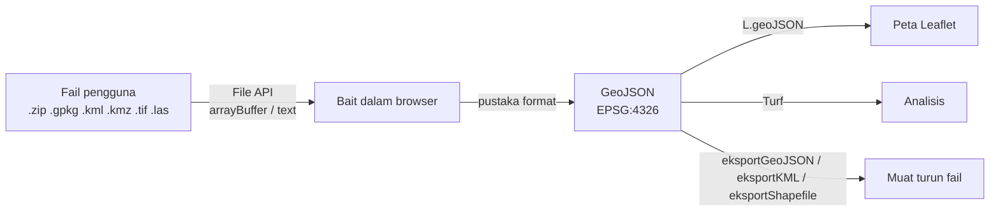

# Nota Pelajar — Hari 4: Web Development Tooling & Ecosystem

Nota rujukan penuh untuk Hari 4. Baca bersama slaid dan lab hari ini.

**Kandungan:**

- Nota 11 — Tooling: npm, Vite, ESLint & Prettier
- Nota 09 — Format Data Geospatial: Baca, Tulis & Tukar dalam JavaScript
- Nota 12 — Browser Storage: localStorage, sessionStorage, IndexedDB & Cache API
- Nota 10 — Analisis Ruang di Browser dengan Turf.js 7

**Nota sokongan:** Nota 03 (Edaran Hari 1) — JavaScript Moden (ES6+) — Template Literal, Destructuring, Spread/Rest, `?.`, `??` & ES Modules.

---

## 11 · Tooling: npm, Vite, ESLint & Prettier

> Nota topikal · Indeks: `./README.md`

### Objektif nota

Selepas membaca nota ini, anda boleh:

- **Menggunakan** npm untuk memulakan projek, memasang pakej (`dependencies` vs `devDependencies`), membaca semver (`^`, `~`) dan **menerangkan** peranan `package-lock.json` serta `npm ci`.
- **Mencipta** projek Vite 7 (vanilla), menjalankan `dev`/`build`/`preview`, dan **mengkonfigur** `import.meta.env.VITE_API_URL` serta `server.proxy` untuk mengelak CORS semasa pembangunan.
- **Menulis** `eslint.config.js` (ESLint 9 flat config) dan konfigurasi Prettier 3 yang tidak bercanggah, lalu **membaiki** amaran lint.
- **Mengikut** konvensyen penamaan kursus (fungsi/variable, kelas, constant, fail).

---

### 1. Kenapa perlu tooling? (Hari 1–3 vs Hari 4–5)

Hari 1–3 kita menulis HTML + `<script type="module">` terus — tiada pemasangan, tiada build. Itu sengaja: supaya anda faham **JavaScript sebenar** tanpa "sihir".

Tetapi apabila aplikasi membesar:

| Masalah tanpa tooling | Penyelesaian |
|-----------------------|-------------|
| Salin `leaflet.js`, `turf.min.js`, `proj4.js` secara manual; versi tidak diketahui | **npm** — senarai dependency + versi tepat dalam `package.json` & lockfile |
| Puluhan `<script>` / `import` dari CDN; lambat, tidak boleh luar talian | **Vite** — gabung & kecilkan (*bundle & minify*) menjadi beberapa fail |
| URL API ditulis keras (`http://localhost:3000`) — perlu ubah untuk produksi | **`.env`** + `import.meta.env` |
| Setiap orang gaya kod berbeza; pepijat `==` vs `===` terlepas | **ESLint** (kualiti) + **Prettier** (format) |

---

### 2. npm

#### 2.1 Arahan teras

```bash
node -v                 # v22.x (LTS) atau lebih baharu
npm -v

npm init -y             # cipta package.json asas
npm install leaflet@1.9 @turf/turf@7 proj4            # → dependencies (dihantar ke browser)
npm install -D vite@7 eslint@9 @eslint/js@9 globals prettier@3 eslint-config-prettier
                                                       # → devDependencies (alat pembangunan sahaja)
npm uninstall tokml
npm ls --depth=0        # apa yang dipasang
npm outdated            # versi lebih baharu yang ada
npm audit               # kelemahan keselamatan diketahui dalam dependency
npx eslint .            # jalankan binari pakej tempatan (node_modules/.bin)
```

#### 2.2 `package.json` GeoLapor (contoh)

```json
{
  "name": "geolapor",
  "private": true,
  "version": "0.1.0",
  "type": "module",
  "scripts": {
    "dev": "vite",
    "build": "vite build",
    "preview": "vite preview",
    "lint": "eslint .",
    "format": "prettier --write .",
    "test": "node --test"
  },
  "dependencies": {
    "@turf/turf": "^7.2.0",
    "leaflet": "^1.9.4",
    "proj4": "^2.15.0"
  },
  "devDependencies": {
    "@eslint/js": "^9.39.0",
    "eslint": "^9.39.0",
    "eslint-config-prettier": "^10.1.0",
    "globals": "^16.0.0",
    "prettier": "^3.6.0",
    "vite": "^7.3.0"
  }
}
```

- `"type": "module"` → fail `.js` dianggap ES module (`import`/`export`) dalam Node.
- `"private": true` → elak `npm publish` tidak sengaja.
- `scripts` → `npm run dev`, `npm run lint`, `npm test` (singkatan untuk `npm run test`).

#### 2.3 Semver: `MAJOR.MINOR.PATCH`

| Julat | Maksud | Contoh `^1.9.4` / `~1.9.4` membenarkan |
|-------|--------|----------------------------------------|
| `^1.9.4` | Serasi — MINOR & PATCH boleh naik | `1.9.5`, `1.10.0` — **bukan** `2.0.0` |
| `~1.9.4` | PATCH sahaja | `1.9.5` — **bukan** `1.10.0` |
| `1.9.4` | Tepat | `1.9.4` sahaja |
| `^0.4.3` | Untuk `0.x`, `^` hanya benarkan PATCH | `0.4.4` — **bukan** `0.5.0` |

MAJOR naik = **perubahan memecah** (*breaking change*). Contoh sebenar: Turf 6 → 7 menukar gaya import; ESLint 8 → 9 menukar format konfigurasi; Vite dan ESLint kini sudah ada versi major lebih baharu (Vite 8, ESLint 10) — sebab itu kursus ini **menyemat** `vite@7` dan `eslint@9`.

#### 2.4 `package-lock.json` & `npm ci`

- `package.json` = **julat** yang dibenarkan. `package-lock.json` = **versi tepat** yang benar-benar dipasang (termasuk dependency transitif).
- **Commit** lockfile ke Git. Tanpanya, dua komputer boleh memasang versi berbeza → "berfungsi di mesin saya".
- `npm install` — boleh mengemas kini lockfile. `npm ci` — pasang **tepat** mengikut lockfile, padam `node_modules` dahulu, gagal jika tidak sepadan. Guna `npm ci` untuk CI, server, dan **persediaan kit luar talian** kursus.

> 💡 **Tip (bilik latihan tanpa internet):** Sediakan repo dengan `npm ci` **sebelum** hari kursus; salin keseluruhan folder termasuk `node_modules/`. Lihat `../docs/persediaan.md`.

---

### 3. Vite 7

#### 3.1 Cipta projek

```bash
npm create vite@7 geolapor -- --template vanilla   # semat versi 7 (latest kini 8)
cd geolapor
npm install
npm run dev        # http://localhost:5173 — hot module replacement (HMR)
npm run build      # → dist/ (fail diminify + hash nama)
npm run preview    # hidang dist/ untuk semakan sebelum deploy
```

Struktur template vanilla (disahkan dengan create-vite 7):

```text
geolapor/
├── index.html          ← titik masuk (BUKAN dalam public/) — Vite baca <script type="module" src="/src/main.js">
├── package.json
├── public/             ← disalin APA ADANYA ke dist/ (tiada hash): favicon, data/ statik besar
│   └── vite.svg
└── src/                ← kod & aset yang diproses (import, hash, minify)
    ├── main.js
    ├── counter.js      ← padam (demo)
    ├── javascript.svg
    └── style.css
```

| Letak di | Bila | Rujuk sebagai |
|----------|------|---------------|
| `src/` | Diimport oleh JS/CSS; mahu hash cache-busting | `import url from './ikon.png'` |
| `public/` | Fail yang dirujuk dengan URL tetap, tidak diimport | `/data/sempadan-zon.geojson` (laluan akar) |

#### 3.2 Environment variable

```bash
# .env                  — default semua mod
VITE_API_URL=http://localhost:3000
# .env.production       — hanya untuk `vite build`
VITE_API_URL=/api
```

```js
// src/services/api.js
const ASAS = import.meta.env.VITE_API_URL ?? '';     // string, diganti semasa build
console.log(import.meta.env.MODE, import.meta.env.DEV); // 'development' true (dev) · 'production' false (build)
```

Diuji dengan Vite 7.3: variable **tanpa** prefiks `VITE_` (cth `KUNCI_RAHSIA`) menjadi `undefined` dalam bundle — Vite sengaja menyekatnya. Tetapi ingat:

> ⚠️ **Semua `VITE_*` ada dalam JavaScript yang dihantar ke browser — boleh dibaca sesiapa.** `.env` frontend **bukan** tempat rahsia. Key mock `latihan-pgn-2026` boleh diletak di sini *hanya kerana ia palsu*. Key sebenar → server/proxy. Tambah `.env.local` dan `.env.*.local` ke `.gitignore`.

#### 3.3 `vite.config.js` — proxy untuk mengelak CORS

```js
import { defineConfig } from 'vite';

export default defineConfig({
  server: {
    port: 5173,
    proxy: {
      // Browser minta http://localhost:5173/api/laporan → Vite hantar ke http://localhost:3000/api/laporan
      // Browser nampak ASAL SAMA → tiada semakan CORS langsung.
      '/api': { target: 'http://localhost:3000', changeOrigin: true },
      '/data': { target: 'http://localhost:3000', changeOrigin: true },
      // Contoh GeoServer tempatan:
      // '/geoserver': { target: 'http://localhost:8080', changeOrigin: true },
    },
  },
  build: {
    sourcemap: true, // peta sumber → DevTools tunjuk kod asal (nota 14)
  },
});
```

Dengan proxy, `VITE_API_URL` boleh dikosongkan (`''`) dan kod memanggil `/api/laporan` secara relatif. Dalam produksi, web server (Nginx/IIS) melakukan tugas proxy yang sama.

> 💡 **Tip:** Proxy **hanya** berfungsi untuk `npm run dev`. `npm run preview` juga menyokong `preview.proxy`, tetapi `dist/` yang dihantar ke server sebenar bergantung pada konfigurasi server itu.

#### 3.4 Import pustaka dalam Vite

```js
import L from 'leaflet';
import 'leaflet/dist/leaflet.css';        // CSS pun boleh diimport
import * as turf from '@turf/turf';
import proj4 from 'proj4';
import wasmUrl from 'sql.js/dist/sql-wasm.wasm?url'; // ?url → dapatkan URL fail, bukan kandungan
import dataZon from './data/zon.json';      // JSON diimport sebagai objek
```

---

### 4. ESLint 9 (flat config)

ESLint mengesan **pepijat & amalan buruk** (bukan gaya). ESLint 9 menggunakan satu fail `eslint.config.js` (format `.eslintrc` lama tidak lagi default).

```js
// eslint.config.js — diuji dengan ESLint 9.39
import js from '@eslint/js';
import globals from 'globals';
import prettier from 'eslint-config-prettier';

export default [
  // 1. Abaikan output build & salinan vendor
  { ignores: ['dist/', 'node_modules/', 'public/vendor/'] },

  // 2. Peraturan disyorkan (no-undef, no-unused-vars, no-unreachable, ...)
  js.configs.recommended,

  // 3. Kod aplikasi (browser)
  {
    files: ['src/**/*.js'],
    languageOptions: {
      ecmaVersion: 2024,
      sourceType: 'module',
      globals: { ...globals.browser },     // window, document, fetch, localStorage ...
    },
    rules: {
      'no-unused-vars': ['warn', { argsIgnorePattern: '^_' }],   // _param dibenarkan tidak digunakan
      'no-console': ['warn', { allow: ['warn', 'error'] }],
      eqeqeq: ['error', 'always'],                                // == dilarang
      'prefer-const': 'error',
      'no-var': 'error',
      // Peraturan projek: larang innerHTML
      'no-restricted-syntax': [
        'error',
        {
          selector: "AssignmentExpression[left.property.name='innerHTML']",
          message: 'Jangan guna innerHTML dengan data — guna textContent / createElement.',
        },
      ],
    },
  },

  // 4. Fail ujian & konfigurasi berjalan dalam Node
  {
    files: ['**/*.test.js', 'vite.config.js', 'eslint.config.js'],
    languageOptions: { globals: { ...globals.node } },
  },

  // 5. MESTI terakhir — matikan peraturan gaya yang bercanggah dengan Prettier
  prettier,
];
```

Output sebenar pada fail contoh:

```text
src/contoh.js
  1:1   error    Unexpected var, use let or const instead                          no-var
  3:9   error    Expected '===' and instead saw '=='                               eqeqeq
  3:17  warning  Unexpected console statement. Only these console methods ...      no-console
  4:3   error    Jangan guna innerHTML dengan data — guna textContent / createElement  no-restricted-syntax
  5:7   error    'y' is never reassigned. Use 'const' instead                      prefer-const
```

> 💡 Varian lebih ketat wujud: `no-restricted-properties` untuk `innerHTML` **dan** `outerHTML` (menangkap sebarang akses, bukan hanya tugasan). Kedua-dua cara sah; pilih satu untuk pasukan anda.

> 💡 Menariknya, template Vite sendiri (`main.js`, `counter.js`) melanggar peraturan `innerHTML` kita. Itu markup **statik** (tiada data pengguna) jadi tidak berbahaya — tetapi kita padam fail demo itu dan membina UI dengan `createElement`.

```bash
npx eslint .            # semak
npx eslint . --fix      # baiki automatik yang selamat (cth prefer-const)
```

---

### 5. Prettier 3

Prettier **memformat** kod (inden, petikan, koma) — tiada perbincangan gaya lagi dalam semakan kod.

```json
// .prettierrc.json
{
  "singleQuote": true,
  "semi": true,
  "printWidth": 100,
  "trailingComma": "all"
}
```

```text
# .prettierignore
dist
node_modules
public/vendor
package-lock.json
```

```bash
npx prettier --check .   # CI: gagal jika ada fail belum diformat
npx prettier --write .   # format semua
```

**ESLint vs Prettier:** ESLint = *adakah kod ini betul/selamat?* · Prettier = *adakah kod ini kemas?* `eslint-config-prettier` memastikan ESLint tidak mengadu tentang perkara yang Prettier uruskan.

#### VS Code

Pasang sambungan **ESLint** (`dbaeumer.vscode-eslint`) dan **Prettier** (`esbenp.prettier-vscode`), kemudian `.vscode/settings.json`:

```json
{
  "editor.formatOnSave": true,
  "editor.defaultFormatter": "esbenp.prettier-vscode",
  "editor.codeActionsOnSave": { "source.fixAll.eslint": "explicit" }
}
```

---

### 6. Konvensyen penamaan kursus

| Jenis | Gaya | Contoh |
|-------|------|--------|
| Variable & fungsi | `camelCase` (BM dibenarkan) | `senaraiLaporan`, `jarakKm`, `lapisanAktif` |
| Fungsi boolean | awalan `adakah`/`is`/`has` atau kata sifat | `dalamMalaysia`, `adakahSah` |
| Kelas / pembina | `PascalCase` | `ApiError` |
| Constant | `UPPER_SNAKE_CASE` | `RSO_PROJ`, `KUNCI_API`, `WARNA_KATEGORI` |
| Fail modul | `kebab-case` atau satu perkataan huruf kecil | `store.js`, `geo.js`, `peta.js`, `sempadan-zon.geojson` |
| Medan data API | ikut kontrak API tepat (lihat `projek/api/README.md`) | `tajuk`, `kategori`, `dikemaskini` |
| Variable DOM | nama jelas + jenis | `butangHantar`, `borangLaporan`, `elSenarai` |

> ⚠️ Jangan campur bahasa dalam **satu** nama (`getLaporanList`). Pilih satu gaya per nama; kursus ini menetapkan nama BM untuk fungsi modul GeoLapor.

---

### ⚠️ Kesilapan lazim

| Simptom | Punca | Pembetulan |
|---------|-------|------------|
| `Cannot use import statement outside a module` (Node) | Tiada `"type": "module"` | Tambah dalam `package.json` atau guna `.mjs` |
| `npm create vite@latest` memasang Vite 8 | `latest` telah bergerak | `npm create vite@7 …` |
| ESLint: `Could not find config file` / `.eslintrc` diabaikan | ESLint 9 perlukan `eslint.config.js` | Tulis flat config (§4) |
| `'document' is not defined` (no-undef) | `globals.browser` tidak ditetapkan | Tambah `languageOptions.globals` |
| `import.meta.env.API_URL` → `undefined` | Tiada prefiks `VITE_` | Namakan `VITE_API_URL`; restart `npm run dev` selepas ubah `.env` |
| CORS error dalam dev walaupun API jalan | Memanggil `http://localhost:3000` terus | Guna `server.proxy` + URL relatif `/api/...` |
| `dist/` kosong/rosak selepas `npm run build` dibuka terus (file://) | Modul ES tidak dimuat dari `file://` | `npm run preview` atau hidang melalui server |
| Pasukan dapat versi pakej berbeza | Lockfile tidak di-commit / guna `npm install` | Commit `package-lock.json`, guna `npm ci` |
| `node_modules/` masuk Git | `.gitignore` tiada | Tambah `node_modules`, `dist`, `.env.local` |

---

### Rujukan rasmi

- npm — `package.json`: <https://docs.npmjs.com/cli/v11/configuring-npm/package-json> · `npm ci`: <https://docs.npmjs.com/cli/v11/commands/npm-ci> · `npm audit`: <https://docs.npmjs.com/cli/v11/commands/npm-audit> · Semver: <https://docs.npmjs.com/about-semantic-versioning> · <https://semver.org/>
- Node.js — keluaran & LTS: <https://nodejs.org/en/about/previous-releases>
- Vite — Panduan: <https://vite.dev/guide/> · Env & mod: <https://vite.dev/guide/env-and-mode> · `server.proxy`: <https://vite.dev/config/server-options> · Aset statik: <https://vite.dev/guide/assets>
- ESLint — Konfigurasi flat: <https://eslint.org/docs/latest/use/configure/configuration-files> · Bermula: <https://eslint.org/docs/latest/use/getting-started>
- Prettier — Konfigurasi: <https://prettier.io/docs/configuration> · eslint-config-prettier: <https://github.com/prettier/eslint-config-prettier>
- globals: <https://github.com/sindresorhus/globals>

*Diuji untuk nota ini: create-vite 7.1, Vite 7.3.6, ESLint 9.39.5, Prettier 3.x, Node 26 (serasi Node 22 LTS).*

### Digunakan pada Hari N

- **Hari 4 (utama)** — S1: npm; S2: Vite + `.env` + proxy; S3: ESLint + Prettier + konvensyen penamaan.
- **Hari 5** — S2: struktur folder & build; S3: `npm run lint`, `npm test`, `npm audit` dalam senarai semak.

---

## 09 · Format Data Geospatial: Baca, Tulis & Tukar dalam JavaScript

> Nota topikal · Indeks: `./README.md`

### Objektif nota

Selepas membaca nota ini, anda boleh:

- **Mengelaskan** format geospatial kepada vektor, raster dan khusus, dan **menyatakan** kelebihan/kekurangan setiap satu (Shapefile, GeoPackage, GeoJSON, GeoTIFF, ECW, KML/KMZ, LAS/LAZ + COG, FlatGeobuf, PMTiles, MBTiles, WKT/WKB, CSV).
- **Memilih** pustaka JavaScript yang betul untuk membaca/menulis setiap format dan **menukarnya** kepada GeoJSON untuk dipaparkan dalam Leaflet.
- **Menukar** koordinat antara WGS84 (EPSG:4326), GDM2000 (EPSG:4742), Peninsula RSO (EPSG:3375) dan Borneo RSO (EPSG:3376) menggunakan proj4.
- **Menggunakan** GDAL/ogr2ogr untuk kerja penukaran yang tidak sesuai dibuat dalam browser (ECW, fail besar, projection rumit).

---

### 1. Kenapa format penting untuk pembangun web?

Pegawai PGN bekerja dengan data dalam pelbagai format — Shapefile daripada kontraktor, GeoPackage daripada QGIS, KML daripada Google Earth, GeoTIFF/ECW daripada imejan udara, LAS daripada survei LiDAR. Browser pula hanya faham **JSON, teks, imej dan bait mentah (`ArrayBuffer`)**.

Kerja kita di Hari 4 ialah menjadi **penterjemah**:



> **Prinsip:** Dalam aplikasi, **GeoJSON dalam EPSG:4326** ialah "bahasa perantaraan". Semua format dibaca → ditukar ke GeoJSON 4326 → baru digunakan. Eksport dibuat dari GeoJSON juga.

---

### 2. Peta format (ringkasan)

| Format | Jenis | Satu fail? | Teks/Binari | Baca dalam JS | Tulis dalam JS | Catatan |
|--------|-------|-----------|-------------|---------------|----------------|---------|
| **GeoJSON** `.geojson/.json` | Vektor | Ya | Teks (JSON) | `JSON.parse` | `JSON.stringify` | Natif web; wajib WGS84 (RFC 7946) |
| **Shapefile** `.shp .shx .dbf .prj` | Vektor | **Tidak** (≥3 fail; biasa di-zip) | Binari | **shpjs** | **@mapbox/shp-write** | Nama medan ≤10 aksara, 2 GB had |
| **GeoPackage** `.gpkg` | Vektor + raster | Ya | SQLite | **sql.js** (+ nyahkod WKB) | (lanjutan: GDAL/server) | Standard OGC moden |
| **KML / KMZ** `.kml .kmz` | Vektor (+ overlay) | Ya | XML / ZIP | **@tmcw/togeojson** (+ **JSZip** untuk KMZ) | **tokml** | Google Earth; sentiasa WGS84 |
| **GeoTIFF** `.tif` | Raster | Ya | Binari | **geotiff** (geotiff.js) | geotiff.js `writeArrayBuffer` (asas) | Imej + georujukan |
| **COG** `.tif` | Raster | Ya | Binari | geotiff.js (`fromUrl` + HTTP Range) | GDAL `-of COG` | GeoTIFF disusun untuk web |
| **ECW** `.ecw` | Raster | Ya | Binari proprietari | **Tiada pustaka JS** | — | Tukar dengan GDAL/QGIS → GeoTIFF/COG |
| **LAS / LAZ** `.las .laz` | Point cloud | Ya | Binari | **@loaders.gl/las** | (PDAL) | LAZ = LAS mampat |
| **FlatGeobuf** `.fgb` | Vektor | Ya | Binari | **flatgeobuf** | flatgeobuf | Strim + indeks ruang, pantas |
| **PMTiles** `.pmtiles` | Tile | Ya | Binari | **pmtiles** | (tippecanoe/go-pmtiles) | Satu fail tile, dihidang HTTP Range |
| **MBTiles** `.mbtiles` | Tile | Ya | SQLite | sql.js (asas) / server | (tippecanoe, GDAL) | Perlu tile server biasanya |
| **WKT / WKB** | Geometri | — | Teks / Binari | **wellknown**, **wkx** | sama | Format dalam DB (PostGIS) |
| **CSV lat/lng** | Titik | Ya | Teks | **papaparse** | papaparse `unparse` | Paling biasa dari Excel |
| **GML** `.gml` | Vektor | Ya | XML | (OpenLayers `ol/format/GML`) | sama | Output default WFS |

---

### 3. Vektor

#### 3.1 GeoJSON — asas semua

```json
{
  "type": "FeatureCollection",
  "features": [
    {
      "type": "Feature",
      "id": "LPR-0001",
      "geometry": { "type": "Point", "coordinates": [101.6958, 2.9264] },
      "properties": { "tajuk": "Papan tanda sempadan rosak", "kategori": "infrastruktur" }
    }
  ]
}
```

- ✅ Mudah dibaca manusia, natif dalam JS, disokong semua pustaka peta.
- ❌ Besar (teks), tiada indeks ruang, **mesti** WGS84 `[lng, lat]` — tiada medan `crs` dalam RFC 7946 (versi lama 2008 ada; jangan bergantung padanya).

```js
// io/format.js — eksportGeoJSON (nama TANPA sambungan; fungsi menambah .geojson)
export function eksportGeoJSON(fc, nama = 'laporan') {
  const blob = new Blob([JSON.stringify(fc, null, 2)], { type: 'application/geo+json' });
  muatTurun(blob, `${nama}.geojson`);
}

// Pembantu dalaman — cipta <a download> sementara
function muatTurun(blob, namaFail) {
  const url = URL.createObjectURL(blob);
  const a = document.createElement('a');
  a.href = url;
  a.download = namaFail;
  document.body.append(a);
  a.click();
  a.remove();
  setTimeout(() => URL.revokeObjectURL(url), 1000); // beri masa browser mula muat turun, kemudian bebaskan ingatan
}
```

#### 3.2 Shapefile — "standard lama" yang masih ada di mana-mana

| Fail | Isi |
|------|-----|
| `.shp` | Geometri |
| `.shx` | Indeks kedudukan geometri |
| `.dbf` | Atribut (dBase) — nama medan **≤ 10 aksara**, tiada jenis tarikh-masa penuh |
| `.prj` | Sistem koordinat (WKT) — **tanpanya, anda tidak tahu projection!** |
| `.cpg` | Pengekodan aksara (cth `UTF-8`) — tanpanya huruf jawi/aksen boleh rosak |

Kerana berbilang fail, pengguna web biasanya memuat naik **`.zip`**.

```js
import shp from 'shpjs';

// Baca .zip Shapefile → GeoJSON. Jika .prj ada DAN proj4 faham, shpjs tukar ke WGS84 automatik.
const buf = await fail.arrayBuffer();
const hasil = await shp(buf);
// ⚠️ Satu layer → FeatureCollection; berbilang .shp dalam zip → ARRAY FeatureCollection
const senarai = Array.isArray(hasil) ? hasil : [hasil];
```

```js
import shpwrite from '@mapbox/shp-write';

// io/format.js — eksportShapefile
export async function eksportShapefile(fc, nama = 'laporan') {
  // Nama medan DBF maksimum 10 aksara; satu jenis geometri per fail .shp
  const blob = await shpwrite.zip(fc, {
    outputType: 'blob',
    compression: 'DEFLATE',
    types: { point: nama, polygon: `${nama}-poligon`, polyline: `${nama}-garisan` },
  });
  muatTurun(blob, `${nama}.zip`); // mengandungi .shp .shx .dbf .prj (WGS84)
}
```

> ⚠️ **Perangkap `.prj` RSO (diuji):** `shp(buf)` menggunakan proj4 untuk mentafsir `.prj`. Fail `.prj` gaya **OGC WKT** EPSG:3375 ditukar dengan betul, tetapi **ESRI WKT** (`PROJECTION["Rectified_Skew_Orthomorphic_Natural_Origin"]`, lazim daripada ArcGIS/QGIS "ESRI") menyebabkan error `Could not get projection name`. Tanpa `.prj` langsung, koordinat kekal dalam meter RSO.

Pendekatan yang disyorkan: `io/format.js` anda patut **membaca `.prj` sendiri** dan memilih bila hendak reproject:

```js
// io/format.js (petikan) — kawal projection secara eksplisit
import JSZip from 'jszip';
import { parseShp, parseDbf, combine } from 'shpjs';
import { keWgs84, prjIalahRso, prjIalahGeografi } from '../utils/unjuran.js';

const zip = await JSZip.loadAsync(arrayBuffer);
// ... cari .shp, .dbf, .prj, .cpg dengan nama asas yang sama ...
let fc = combine([parseShp(shpBuf), dbfBuf ? parseDbf(dbfBuf, cpgTeks) : undefined]); // koordinat MENTAH

if (prjTeks && prjIalahRso(prjTeks)) {
  fc = keWgs84(fc, 'EPSG:3375');   // kenal pasti RSO dengan regex (OGC atau ESRI WKT) → WGS84
} else if (prjTeks && !prjIalahGeografi(prjTeks)) {
  fc = keWgs84(fc, prjTeks);       // CRS terunjur lain: cuba WKT terus dengan proj4
}
```

#### 3.3 GeoPackage — pengganti moden Shapefile

GeoPackage (OGC) ialah **fail SQLite** dengan jadual metadata piawai:

| Jadual | Guna |
|--------|------|
| `gpkg_contents` | Senarai layer (`table_name`, `data_type` = `features`/`tiles`) |
| `gpkg_geometry_columns` | Lajur geometri & `srs_id` setiap layer |
| `gpkg_spatial_ref_sys` | Definisi CRS |
| *(jadual anda)* | cth `kemudahan` — setiap baris satu feature; geometri = **blob GPKG** (header `GP` + WKB) |

- ✅ Satu fail, tiada had 10 aksara, berbilang layer, boleh simpan raster, disokong QGIS/ArcGIS.
- ❌ Perlu enjin SQLite — dalam browser = **sql.js** (WebAssembly, ~1 MB).

```js
import initSqlJs from 'sql.js';
import wasmUrl from 'sql.js/dist/sql-wasm.wasm?url'; // Vite: dapatkan URL fail wasm

/** Nyahkod geometri GeoPackage (header GP + WKB) — Point sahaja (tahap asas kursus). */
function gpkgKeTitik(blob) {
  const dv = new DataView(blob.buffer, blob.byteOffset, blob.byteLength);
  if (dv.getUint8(0) !== 0x47 || dv.getUint8(1) !== 0x50) throw new Error('Bukan geometri GPKG'); // 'G','P'
  const bendera = dv.getUint8(3);
  const jenisEnvelope = (bendera >> 1) & 0b111;            // 0 = tiada, 1 = xy, 2/3 = xyz/xym, 4 = xyzm
  const saizEnvelope = [0, 32, 48, 48, 64][jenisEnvelope];
  const o = 8 + saizEnvelope;                              // WKB bermula selepas header 8 bait + envelope
  const wkbLe = dv.getUint8(o) === 1;                      // 1 = little-endian
  const jenis = dv.getUint32(o + 1, wkbLe);
  if (jenis !== 1) throw new Error(`Jenis WKB ${jenis} belum disokong`);
  return [dv.getFloat64(o + 5, wkbLe), dv.getFloat64(o + 13, wkbLe)]; // [x, y] = [lng, lat] jika 4326
}

// Versi ringkas (titik sahaja). Boleh dilanjutkan menjadi parser WKB penuh:
// Point, LineString, Polygon, Multi*, GeometryCollection + reprojection jika srs_id = 3375.
async function bacaGeoPackageTitik(arrayBuffer) {
  const SQL = await initSqlJs({ locateFile: () => wasmUrl });
  const db = new SQL.Database(new Uint8Array(arrayBuffer));
  try {
    const [{ values }] = db.exec(`
      SELECT c.table_name, g.column_name, c.srs_id
      FROM gpkg_contents c JOIN gpkg_geometry_columns g USING (table_name)
      WHERE c.data_type = 'features'`);
    const [jadual, lajurGeom] = values[0];               // layer pertama (asas)
    const stmt = db.prepare(`SELECT * FROM "${jadual}"`);
    const features = [];
    while (stmt.step()) {
      const { [lajurGeom]: geom, ...properties } = stmt.getAsObject(); // asingkan geometri daripada atribut
      features.push({ type: 'Feature', geometry: { type: 'Point', coordinates: gpkgKeTitik(geom) }, properties });
    }
    stmt.free();
    return { type: 'FeatureCollection', features };
  } finally {
    db.close();
  }
}
```

> 💡 **Tip:** Kod di atas sengaja terhad kepada **Point** (cukup untuk `kemudahan.gpkg`) supaya struktur header `GP` + WKB jelas. Untuk poligon/garisan, lanjutkan `bacaWkb()` sendiri, gunakan pustaka WKB (`wkx`), atau tukar GPKG → GeoJSON di server dengan `ogr2ogr`.

#### 3.4 KML / KMZ

KML = XML (Google Earth). KMZ = **ZIP** yang mengandungi `doc.kml` (+ ikon/imej).

```js
import { kml } from '@tmcw/togeojson';
import JSZip from 'jszip';

function bacaKml(teks) {
  const dokumen = new DOMParser().parseFromString(teks, 'text/xml'); // DOMParser natif browser
  if (dokumen.querySelector('parsererror')) throw new Error('Fail KML tidak sah (XML rosak)');
  return kml(dokumen); // FeatureCollection; properties termasuk name, description + ExtendedData
}

async function bacaKmz(arrayBuffer) {
  const zip = await JSZip.loadAsync(arrayBuffer);
  // Konvensyen: fail utama ialah doc.kml; jika tiada, ambil .kml pertama
  const utama = zip.file('doc.kml') ?? zip.file(/\.kml$/i)[0];
  if (!utama) throw new Error('Tiada fail .kml dalam KMZ');
  return bacaKml(await utama.async('string'));
}
```

```js
import tokml from 'tokml';

export function eksportKML(fc, nama = 'laporan') {
  const teks = tokml(fc, {
    name: 'tajuk',          // properties.tajuk → <name>
    description: 'catatan', // properties.catatan → <description>
    documentName: nama,
  });
  muatTurun(new Blob([teks], { type: 'application/vnd.google-earth.kml+xml' }), `${nama}.kml`);
}
```

Kedua-dua arah diuji: `tokml` → `togeojson` memulangkan geometri & atribut yang sama, ditambah `name`/`description`.

#### 3.5 Format vektor lain yang patut dikenali

| Format | Kenapa relevan | JS |
|--------|---------------|-----|
| **FlatGeobuf** `.fgb` | Binari, ada indeks ruang; boleh strim hanya feature dalam bbox melalui HTTP Range — sangat pantas untuk set data besar | `import { deserialize } from 'flatgeobuf/lib/mjs/geojson.js'` → `for await (const f of deserialize(url, bbox))` |
| **WKT** | `POINT (101.6958 2.9264)` — cara geometri ditulis dalam SQL/PostGIS | `wellknown.parse(wkt)` → GeoJSON geometry; `wellknown.stringify(geom)` |
| **WKB** | Binari WKT — lajur `geometry` dalam PostGIS/GeoPackage | `wkx` (`Geometry.parse(buffer).toGeoJSON()`) |
| **CSV lat/lng** | Eksport Excel paling biasa | `Papa.parse(teks, { header: true, dynamicTyping: true, skipEmptyLines: true })` |
| **GML** | Output default WFS; XML verbose | minta `outputFormat=application/json` sahaja jika boleh |

```js
import Papa from 'papaparse';

// CSV → GeoJSON (diuji). Perhatikan tukar susunan: CSV ada lat,lng → GeoJSON [lng, lat]
export function csvKeGeoJSON(teks) {
  const { data, errors } = Papa.parse(teks, { header: true, dynamicTyping: true, skipEmptyLines: true });
  if (errors.length) throw new Error(`CSV rosak baris ${errors[0].row}: ${errors[0].message}`);
  return {
    type: 'FeatureCollection',
    features: data
      .filter((r) => Number.isFinite(r.lat) && Number.isFinite(r.lng))
      .map(({ lat, lng, ...properties }) => ({
        type: 'Feature',
        geometry: { type: 'Point', coordinates: [lng, lat] },
        properties,
      })),
  };
}
```

---

### 4. Raster

#### 4.1 GeoTIFF & COG

GeoTIFF = TIFF biasa + **tag georujukan** (titik ikat, saiz piksel, key CRS). Setiap piksel ialah nilai (cth ketinggian, suhu, reflektans).

```js
import { fromArrayBuffer } from 'geotiff';

// io/raster.js — bacaGeoTIFF(arrayBuffer) (diuji dengan GeoTIFF 4×3 Float32 sintetik)
export async function bacaGeoTIFF(arrayBuffer) {
  const tiff = await fromArrayBuffer(arrayBuffer);
  const imej = await tiff.getImage();           // imej (IFD) pertama
  const [nilai] = await imej.readRasters();     // band pertama: TypedArray (cth Float32Array) lebar×tinggi
  const noData = imej.getGDALNoData();          // null jika tiada
  let min = Infinity;
  let max = -Infinity;
  for (const v of nilai) {                      // loop, BUKAN Math.min(...nilai) — elak RangeError
    if (Number.isNaN(v) || v === noData) continue;
    if (v < min) min = v;
    if (v > max) max = v;
  }
  return {
    lebar: imej.getWidth(),
    tinggi: imej.getHeight(),
    bbox: imej.getBoundingBox(),                // [minX, minY, maxX, maxY] dalam CRS fail
    min,
    max,
    nilai,
  };
}

// Pemerhatian lain yang berguna semasa meneroka fail:
//   imej.getResolution()     → [saizX, -saizY, 0]   (Y negatif: baris bergerak ke selatan)
//   imej.getGeoKeys()        → { GeographicTypeGeoKey: 4326 } atau { ProjectedCSTypeGeoKey: 3375 }
//   imej.getSamplesPerPixel()→ bilangan band
```

**COG (Cloud Optimized GeoTIFF)** ialah GeoTIFF yang disusun dengan tile dalaman + overview supaya browser boleh membaca **hanya bahagian yang diperlukan** melalui HTTP Range:

```js
import { fromUrl } from 'geotiff';
const cog = await fromUrl('http://localhost:3000/data/dem-putrajaya.tif'); // server mesti sokong Range
const imej = await cog.getImage();
const tetingkap = await imej.readRasters({ window: [0, 0, 50, 50] });     // baca 50×50 piksel sahaja
```

> 💡 **Tip:** Untuk memaparkan GeoTIFF di atas Leaflet, pilihan paling ringkas ialah (1) lukis nilai ke `<canvas>` (lihat `rasterKeDataUrl()` dalam `io/raster.js`) → `L.imageOverlay(dataUrl, [[minLat, minLng], [maxLat, maxLng]])`, atau (2) terbitkan melalui GeoServer sebagai WMS. Plugin seperti `georaster-layer-for-leaflet` wujud untuk kes lanjutan.

#### 4.2 ECW — tiada pustaka JavaScript

ECW (Enhanced Compression Wavelet, kini milik Hexagon) digunakan untuk imejan udara/satelit besar (mampatan tinggi). **Tiada pustaka JS** yang boleh membacanya, dan pemacu GDAL untuk ECW memerlukan **ERDAS ECW/JP2 SDK** (terma lesen Hexagon — penyahkodan dibenarkan untuk kegunaan desktop, penggunaan server mungkin perlu lesen). Aliran kerja yang disyorkan:

```bash
# Semak sokongan ECW dalam GDAL anda (QGIS di Windows/OSGeo4W biasanya disertakan)
gdalinfo --formats | grep -i ecw

# Tukar ECW → Cloud Optimized GeoTIFF (sesuai web), reproject ke 3857 untuk tile web
gdalwarp -t_srs EPSG:3857 -r bilinear imej.ecw sementara.tif
gdal_translate -of COG -co COMPRESS=JPEG -co QUALITY=85 sementara.tif imej_cog.tif
```

Atau dalam QGIS: klik kanan layer → *Export → Save As…* → GeoTIFF. Kemudian terbitkan melalui GeoServer (WMS/WMTS) atau baca COG dengan geotiff.js.

---

### 5. Format khusus

#### 5.1 LAS / LAZ (point cloud LiDAR)

LAS (standard ASPRS) = header 227+ bait (versi, bilangan titik, skala, offset, min/max) + rekod titik (X, Y, Z sebagai integer berskala, intensiti, klasifikasi, pulangan, RGB bagi format tertentu). **LAZ** = LAS dimampatkan tanpa kehilangan (LASzip, ~7–20% saiz).

```js
import { parse } from '@loaders.gl/core';
import { LASLoader } from '@loaders.gl/las';

// io/lidar.js — bacaLAS(arrayBuffer): asas sahaja (versi, bilangan titik, bbox, julat Z)
export async function bacaLAS(arrayBuffer) {
  // Header LAS: bait 0–3 = "LASF", bait 24/25 = versi major/minor
  const dv = new DataView(arrayBuffer);
  const tandatangan = String.fromCharCode(...new Uint8Array(arrayBuffer, 0, 4));
  if (tandatangan !== 'LASF') throw new Error('Bukan fail LAS (tiada tandatangan "LASF")');
  const versi = `${dv.getUint8(24)}.${dv.getUint8(25)}`;

  // worker: false → parse dalam thread utama (fail kecil; elak konfigurasi worker)
  const data = await parse(arrayBuffer, LASLoader, { worker: false, las: { shape: 'mesh' } });
  const { mins, maxs } = data.loaderData;   // min/maks dari header LAS
  return {
    versi,
    bilanganTitik: data.header.vertexCount,
    bbox: [mins[0], mins[1], maxs[0], maxs[1]], // dalam CRS fail (selalunya RSO meter, BUKAN darjah!)
    julatZ: [mins[2], maxs[2]],                 // ketinggian min/maks
  };
}
// Diuji dengan LAS 1.2 sintetik (5 titik): data.header.vertexCount = 5,
// data.attributes = { POSITION (Float32Array x,y,z…), intensity, classification }
```

> ⚠️ Koordinat LAS biasanya dalam projection projek (cth RSO meter — `sampel.las` kursus dalam EPSG:3375). `bbox` di atas **bukan** lat/lng — tukar penjuru dengan `rsoKeLngLat([minX, minY])` dan `rsoKeLngLat([maxX, maxY])` sebelum dilukis di Leaflet. Untuk memvisualkan jutaan titik dalam 3D, gunakan deck.gl `PointCloudLayer`, Potree, atau CesiumJS (di luar skop kursus).

#### 5.2 Tile dalam satu fail: MBTiles & PMTiles

| | MBTiles | PMTiles |
|---|---|---|
| Bekas | SQLite (`tiles(zoom_level, tile_column, tile_row, tile_data)`) | Fail binari tunggal + direktori |
| Hidang | Perlu tile server (cth TileServer GL, GeoServer plugin) | **Terus dari storage statik/HTTP Range** — tiada tile server |
| Guna | Peta asas luar talian, aplikasi mudah alih | Peta asas vektor/raster statik, murah dihos |
| JS | (server) | `pmtiles` + MapLibre (`maplibregl.addProtocol`) atau `protomaps-leaflet` |

> ⚠️ `tile_row` dalam MBTiles menggunakan skema **TMS** (y terbalik berbanding XYZ). `y_xyz = 2^z − 1 − tile_row`.

---

### 6. Sistem koordinat di Malaysia

| EPSG | Nama rasmi (EPSG) | Jenis | Guna |
|------|-------------------|-------|------|
| **4326** | WGS 84 | Geografi (darjah) | GPS, GeoJSON, web |
| **4742** | GDM2000 | Geografi (darjah) | Datum geosentrik nasional Malaysia (GRS80); dalam amalan ≈ WGS84 (beza sentimeter) |
| **3375** | GDM2000 / Peninsula RSO | Projection (meter) — Hotine Oblique Mercator | Pemetaan Semenanjung |
| **3376** | GDM2000 / East Malaysia BRSO | Projection (meter) | Pemetaan Sabah & Sarawak |
| **3377–3385** | GDM2000 / *Negeri* Grid — Johor (3377), Sembilan and Melaka (3378), Pahang (3379), Selangor (3380), Terengganu (3381), Pinang (3382), Kedah and Perlis (3383), Perak (3384), Kelantan (3385) | Projection **Cassini-Soldner** (meter) | Pemetaan kadaster negeri |
| 3168 | Kertau (RSO) / RSO Malaya (m) | Projection (datum lama Kertau) | Data warisan sebelum GDM2000 |
| 29873 | Timbalai 1948 / RSO Borneo (m) | Projection (datum lama Timbalai) | Data warisan Borneo |
| **3857** | WGS 84 / Pseudo-Mercator | Projection (meter) | **Paparan** tile web sahaja — jangan simpan data dalam 3857 |

*(Semua kod & nama disahkan terhadap epsg.io pada 26 Sep 2026.)*

#### 6.1 proj4 — `utils/unjuran.js`

```js
import proj4 from 'proj4';

/** Definisi proj4 EPSG:3375 (Hotine Oblique Mercator varian A, elipsoid GRS80) — setara https://epsg.io/3375.proj4 */
export const RSO_PROJ =
  '+proj=omerc +lat_0=4 +lonc=102.25 +alpha=323.0257964666666 +k=0.99984 ' +
  '+x_0=804671 +y_0=0 +no_uoff +gamma=323.1301023611111 +ellps=GRS80 ' +
  '+towgs84=0,0,0,0,0,0,0 +units=m +no_defs';

proj4.defs('EPSG:3375', RSO_PROJ);
// EPSG:4326 dan EPSG:3857 sudah terbina dalam proj4.

/** Unjur semula SELURUH FeatureCollection ke WGS84 — pulangkan FC BAHARU (asal tidak diubah). */
export function keWgs84(fc, dariEpsg = 'EPSG:3375') {
  const penukar = proj4(dariEpsg, 'EPSG:4326');
  const tukar = ([x, y, ...lain]) => [...penukar.forward([x, y]), ...lain]; // kekalkan Z jika ada
  return {
    ...fc,
    features: fc.features.map((f) => ({ ...f, geometry: petaKoordinat(f.geometry, tukar) })),
    // petaKoordinat: jalan setiap aras array koordinat (Point … MultiPolygon) — lihat fail penuh
  };
}

/** Satu titik [x, y] RSO (meter) → [lng, lat] */
export function rsoKeLngLat([x, y]) {
  return proj4('EPSG:3375', 'EPSG:4326', [x, y]);
}

/** Satu titik [lng, lat] → [x, y] RSO (meter) */
export function lngLatKeRso([lng, lat]) {
  return proj4('EPSG:4326', 'EPSG:3375', [lng, lat]);
}

// Diuji (proj4 2.22):
lngLatKeRso([101.6958, 2.9264]);                     // → [411007.11, 323878.55]  (Putrajaya dalam RSO)
rsoKeLngLat([411007.11, 323878.55]);                 // → [101.695800, 2.926400]
keWgs84(zonRso).features[0].geometry.coordinates[0][0]; // [410000, 323000] → [101.68676, 2.918434]
proj4('EPSG:4326', 'EPSG:3857', [101.6958, 2.9264]); // → [11320724.67, 325907.09]
```

String lain (daripada epsg.io, untuk rujukan — epsg.io menulis parameter dalam susunan berbeza tetapi hasilnya sama):

```text
EPSG:3376  +proj=omerc +no_uoff +lat_0=4 +lonc=115 +alpha=53.31580995 +gamma=53.1301023611111 +k=0.99984 +x_0=0 +y_0=0 +ellps=GRS80 +towgs84=0,0,0,0,0,0,0 +units=m +no_defs +type=crs
EPSG:3380  +proj=cass +lat_0=3.68464905 +lon_0=101.389107913889 +x_0=-34836.161 +y_0=56464.049 +ellps=GRS80 +towgs84=0,0,0,0,0,0,0 +units=m +no_defs +type=crs
EPSG:4742  +proj=longlat +ellps=GRS80 +no_defs +type=crs
```

> 💡 **Tip — kenal pasti CRS dengan nombor:** Jika koordinat kelihatan seperti `[101.69, 2.92]` → darjah (4326/4742). Jika `[411007, 323878]` → meter RSO Semenanjung. Jika `[11320724, 325907]` → 3857. Jika nombor kecil/negatif puluhan ribu → mungkin Cassini negeri.

> ⚠️ Datum lama (Kertau, Timbalai) memerlukan parameter anjakan datum (`+towgs84`) yang tepat — string epsg.io menggunakan anjakan 3-parameter (ketepatan ~beberapa meter). Untuk kerja kadaster/ukur, ikut parameter rasmi JUPEM dan jalankan penukaran dalam GIS desktop/server, bukan dalam browser.

---

### 7. GDAL / OGR — helaian ringkas

GDAL ialah "pisau Swiss" data geospatial (dipakej bersama QGIS). Guna untuk kerja berat **sebelum** data sampai ke aplikasi web.

```bash
# --- Maklumat ---
ogrinfo -so data.gpkg                         # senarai layer (ringkasan)
ogrinfo -so data.gpkg kemudahan               # medan, CRS, bilangan feature, extent
gdalinfo dem.tif                              # saiz, CRS, band, statistik (tambah -stats)

# --- Vektor (ogr2ogr: -f format_output  output  input) ---
ogr2ogr -f GeoJSON -t_srs EPSG:4326 zon.geojson sempadan-zon-rso.shp        # SHP (RSO) → GeoJSON WGS84
ogr2ogr -f GPKG zon.gpkg sempadan-zon-rso.shp -nln sempadan_zon             # SHP → GeoPackage (nama layer)
ogr2ogr -f GeoJSON kemudahan.geojson kemudahan.kml                          # KML → GeoJSON
ogr2ogr -f GeoJSON kemudahan.geojson /vsizip/kemudahan.kmz                  # KMZ terus (vsizip)
ogr2ogr -f "ESRI Shapefile" -lco ENCODING=UTF-8 keluar.shp laporan.geojson  # GeoJSON → SHP
ogr2ogr -f CSV -lco GEOMETRY=AS_XY titik.csv kemudahan.gpkg                 # → CSV dengan lajur X,Y
ogr2ogr -f GeoJSON -where "kategori='tanah'" tanah.geojson laporan.geojson  # tapis atribut
ogr2ogr -f FlatGeobuf zon.fgb zon.geojson                                   # → FlatGeobuf
ogr2ogr -f GeoJSON -s_srs EPSG:3375 -t_srs EPSG:4326 out.geojson in.csv \
  -oo X_POSSIBLE_NAMES=x -oo Y_POSSIBLE_NAMES=y                             # CSV RSO → GeoJSON

# --- Raster ---
gdalwarp -t_srs EPSG:4326 dem_rso.tif dem_4326.tif                          # unjur semula raster
gdal_translate -of COG -co COMPRESS=DEFLATE dem.tif dem_cog.tif             # → Cloud Optimized GeoTIFF
gdal_translate -of GTiff imej.ecw imej.tif                                  # ECW → GeoTIFF (perlu pemacu ECW)
gdal_translate -of MBTILES dem_warna.tif dem.mbtiles                        # raster → MBTiles

# --- Point cloud: gunakan PDAL (bukan GDAL) ---
pdal info sampel.las --summary                                              # bilangan titik, bbox, CRS
pdal translate sampel.laz sampel.las                                        # LAZ → LAS
```

---

### 8. `bacaFail` — satu pintu masuk untuk semua format

Idea di sebalik `io/format.js`: pengguna seret apa-apa fail → satu fungsi memilih pembaca berdasarkan sambungan → sentiasa pulangkan GeoJSON 4326.

```js
// io/format.js — bacaFail(file)
const sambungan = (nama) => nama.slice(nama.lastIndexOf('.')).toLowerCase();

export async function bacaFail(file) {
  const ext = sambungan(file.name);
  switch (ext) {
    case '.geojson':
    case '.json':
      return keFeatureCollection(JSON.parse(await file.text())); // terima FC, Feature atau geometri
    case '.zip':
      return bacaShapefileZip(await file.arrayBuffer());       // §3.2 (+ reprojection RSO)
    case '.gpkg':
      return bacaGeoPackage(await file.arrayBuffer());         // §3.3
    case '.kml':
      return bacaKml(await file.text());                       // §3.4
    case '.kmz':
      return bacaKmz(await file.arrayBuffer());
    default:
      throw new Error(`Format fail tidak disokong: ${ext} (guna .geojson, .json, .zip, .gpkg, .kml, .kmz)`);
  }
}
```

Raster dan point cloud **tidak** melalui `bacaFail` kerana hasilnya bukan FeatureCollection: panggil `bacaGeoTIFF(await file.arrayBuffer())` atau `bacaLAS(await file.arrayBuffer())` terus. CSV (§3.5) ialah ⭐ cabaran — tambah `case '.csv'` sendiri.

```js
// ui: <input type="file" accept=".geojson,.json,.zip,.kml,.kmz,.gpkg,.csv">
input.addEventListener('change', async () => {
  const [fail] = input.files;
  if (!fail) return;
  try {
    const fc = await bacaFail(fail);
    lapisanImport.clearLayers().addData(fc);
    notis(`${fc.features.length} ciri dimuat daripada ${fail.name}`, 'berjaya');
  } catch (err) {
    notis(err.message, 'ralat'); // ui/notis.js — textContent, selamat
  }
});
```

---

### ⚠️ Kesilapan lazim

| Simptom | Punca | Pembetulan |
|---------|-------|------------|
| Poligon Shapefile muncul di tengah Afrika/lautan | Koordinat RSO (meter) dianggap darjah | Semak `.prj`; `keWgs84(fc, 'EPSG:3375')` atau `ogr2ogr -t_srs EPSG:4326` |
| shpjs: `Could not get projection name` | `.prj` ESRI WKT untuk RSO | Baca `.prj` sendiri + `prjIalahRso()` → `keWgs84()` (§3.2) |
| Hanya `.shp` dimuat naik, atribut hilang | `.dbf` tidak disertakan | Minta pengguna zip `.shp .shx .dbf .prj .cpg` bersama |
| Nama medan terpotong `keluasan_h` | Had 10 aksara `.dbf` | Guna GeoPackage/GeoJSON; atau nama pendek |
| Huruf rosak dalam atribut | Tiada `.cpg`/pengekodan salah | Tambah `.cpg` `UTF-8`; `-lco ENCODING=UTF-8` |
| KMZ gagal dibaca sebagai XML | KMZ ialah ZIP, bukan XML | JSZip dahulu, kemudian `doc.kml` |
| Browser beku semasa baca GeoTIFF/LAS besar | Semua dibaca serentak di thread utama | Guna COG + `window`, Web Worker, atau proses di server |
| `Math.min(...band)` → `RangeError` | Terlalu banyak argumen | Loop `for…of` |
| sql.js: `both async and sync fetching of the wasm failed` | Fail `.wasm` tidak dijumpai | `locateFile` → URL wasm yang betul (Vite `?url`) |
| Titik CSV terbalik | Lajur `lat,lng` dimasukkan terus ke `coordinates` | `[lng, lat]` untuk GeoJSON |

---

### Rujukan rasmi

- RFC 7946 GeoJSON: <https://datatracker.ietf.org/doc/html/rfc7946>
- Esri Shapefile Technical Description: <https://www.esri.com/content/dam/esrisites/sitecore-archive/Files/Pdfs/library/whitepapers/pdfs/shapefile.pdf>
- OGC GeoPackage: <https://www.ogc.org/standards/geopackage/> · <https://www.geopackage.org/>
- OGC KML: <https://www.ogc.org/standards/kml/> · Google KML Reference: <https://developers.google.com/kml/documentation/kmlreference>
- ASPRS LAS (spesifikasi di GitHub): <https://github.com/ASPRSorg/LAS>
- COG: <https://www.cogeo.org/> · FlatGeobuf: <https://flatgeobuf.org/> · PMTiles: <https://github.com/protomaps/PMTiles> · MBTiles: <https://github.com/mapbox/mbtiles-spec>
- Pustaka: shpjs <https://github.com/calvinmetcalf/shapefile-js> · shp-write <https://github.com/mapbox/shp-write> · togeojson <https://github.com/tmcw/togeojson> · tokml <https://github.com/mapbox/tokml> · JSZip <https://stuk.github.io/jszip/> · sql.js <https://sql.js.org/> · geotiff.js <https://geotiffjs.github.io/> · loaders.gl LAS <https://loaders.gl/docs/modules/las> · wellknown <https://github.com/mapbox/wellknown> · wkx <https://github.com/cschwarz/wkx> · Papa Parse <https://www.papaparse.com/> · proj4js <https://proj4js.org/>
- GDAL: ogr2ogr <https://gdal.org/en/stable/programs/ogr2ogr.html> · gdal_translate <https://gdal.org/en/stable/programs/gdal_translate.html> · gdalwarp <https://gdal.org/en/stable/programs/gdalwarp.html> · pemacu ECW <https://gdal.org/en/stable/drivers/raster/ecw.html> · pemacu COG <https://gdal.org/en/stable/drivers/raster/cog.html>
- PDAL: <https://pdal.io/>
- EPSG.io (semak kod & string proj4): <https://epsg.io/3375>

*Versi yang diuji untuk nota ini: shpjs 6.2, @mapbox/shp-write 0.4.3, @tmcw/togeojson 7.1, tokml 0.4, geotiff 3.x, @loaders.gl/las 4.5, sql.js 1.14, proj4 2.22, papaparse 5.7, wellknown 0.5.*

### Digunakan pada Hari N

- **Hari 1** — GeoJSON sebagai objek JS (§3.1).
- **Hari 2** — layer GeoJSON daripada API; `JSON` hantar/terima.
- **Hari 4 (utama)** — S1: pasang pustaka format; S2: `bacaFail`, eksport, proj4/RSO, GeoTIFF, LAS (§2–§8).
- **Hari 5** — S2: menyesuaikan data PGN (GDAL → COG/GeoServer) ke dalam sistem web (§4.2, §7).

---

## 12 · Browser Storage: localStorage, sessionStorage, IndexedDB & Cache API

> Nota topikal · Indeks: `./README.md`

### Objektif nota

Selepas membaca nota ini, anda boleh:

- **Membandingkan** `localStorage`, `sessionStorage`, IndexedDB dan Cache API dari segi saiz, jenis data, hayat dan API sync/async.
- **Menulis** pembalut JSON `simpanLocal()`/`bacaLocal()` yang selamat (try/catch, `QuotaExceededError`, mod peribadi) seperti dalam `services/cache.js`.
- **Membina** cache layer GeoJSON dalam IndexedDB dengan **TTL** (`dapatkanCache`/`simpanCache`) dan **menerangkan** bila perlu versi cache.
- **Menyimpan** draf borang laporan supaya tidak hilang apabila halaman dimuat semula atau rangkaian terputus.
- **Menerangkan** kenapa token/kata laluan/API key **tidak boleh** disimpan dalam browser storage.

---

### 1. Kenapa simpan data di browser?

Pegawai lapangan GeoLapor bekerja di tapak dengan liputan rangkaian yang lemah. Tanpa storage tempatan:

- setiap kali buka aplikasi, layer `sempadan-zon` (mungkin beratus KB) dimuat turun semula;
- tapisan yang dipilih hilang selepas muat semula;
- laporan separuh siap hilang jika tab tertutup atau bateri habis.

Browser storage menyelesaikan masalah **kemudahan & prestasi** — bukan pengganti pangkalan data server. **Server kekal sumber kebenaran**; browser storage ialah *cache* atau *draf*.

---

### 2. Perbandingan

| | `localStorage` | `sessionStorage` | IndexedDB | Cache API |
|---|---|---|---|---|
| Jenis data | **String sahaja** | String sahaja | Objek JS (structured clone), Blob, ArrayBuffer | Pasangan `Request` → `Response` |
| Saiz (anggaran) | ~5 MB per asal | ~5 MB per asal per tab | Besar (peratus ruang cakera; kongsi kuota asal) | Kongsi kuota yang sama |
| API | **Sync** (menyekat thread utama) | Sync | **Async** (event/Promise) | Async (Promise) |
| Hayat | Kekal sehingga dipadam | Tamat bila **tab ditutup** | Kekal (boleh diusir jika cakera penuh) | Kekal (boleh diusir) |
| Dikongsi antara tab | Ya (asal sama) | Tidak | Ya | Ya |
| Sesuai untuk | Tetapan kecil: penapis, tema, layer aktif | Keadaan sementara satu sesi | Layer GeoJSON besar, antrian luar talian, fail | Response HTTP (Service Worker / PWA) |

> 💡 **Tip:** Lihat & ubah semua storage dalam **DevTools → Application** (Chrome/Edge): *Local storage*, *Session storage*, *IndexedDB*, *Cache storage*, dan *Storage → Clear site data*.

---

### 3. localStorage & sessionStorage

#### 3.1 API asas

```js
localStorage.setItem('tema', 'gelap');
localStorage.getItem('tema');      // 'gelap'
localStorage.getItem('tiada');     // null (bukan undefined)
localStorage.removeItem('tema');
localStorage.clear();              // ⚠️ padam SEMUA untuk asal ini (termasuk aplikasi lain pada localhost:5173!)

sessionStorage.setItem('langkah', '2'); // API sama; hilang bila tab ditutup
```

#### 3.2 Perangkap "string sahaja"

```js
localStorage.setItem('penapis', { kategori: 'tanah' });
localStorage.getItem('penapis');   // '[object Object]'  ← data hilang!

localStorage.setItem('bilangan', 5);
localStorage.getItem('bilangan') + 1; // '51'  ← gabungan string, bukan 6
```

#### 3.3 Pembalut JSON yang selamat

`setItem` boleh **melontar** error (storage penuh → `QuotaExceededError`; sesetengah browser dalam mod peribadi/dasar organisasi menyekat storage). `JSON.parse` boleh melontar jika data rosak (diubah manual dalam DevTools, versi lama). Jadi **bungkus**:

```js
// src/services/cache.js (bahagian localStorage) — diuji dalam Node dengan stub localStorage
export function bacaLocal(kunci, lalai = null) {
  try {
    const teks = localStorage.getItem(kunci);
    return teks === null ? lalai : JSON.parse(teks);
  } catch {
    return lalai; // data rosak / storage disekat → guna nilai default, jangan ranapkan aplikasi
  }
}

export function simpanLocal(kunci, nilai) {
  try {
    localStorage.setItem(kunci, JSON.stringify(nilai));
  } catch (err) {
    // QuotaExceededError (penuh) atau SecurityError (disekat dasar/mod peribadi)
    console.warn('localStorage gagal:', err); // aplikasi TERUS berfungsi, cuma tanpa ingatan
  }
}

export function buangLocal(kunci) {
  try {
    localStorage.removeItem(kunci);
  } catch {
    /* abaikan */
  }
}
```

```js
// Guna (main.js): ingat tapisan pengguna. Awalan 'geolapor:' elak bertembung dengan aplikasi lain
// pada asal yang sama (semua projek di localhost:5173 berkongsi localStorage!)
const KUNCI_TAPISAN = 'geolapor:tapisan';
simpanLocal(KUNCI_TAPISAN, { kategori: 'tanah', status: '', q: '' });
const tapisanAwal = { kategori: '', status: '', q: '', ...bacaLocal(KUNCI_TAPISAN, {}) };
```

> 💡 Mahu tahu sama ada simpanan berjaya? Versi lanjutan boleh memulangkan `true`/`false` dan membezakan `err.name === 'QuotaExceededError'` untuk memaparkan notis "Storan penuh".

> ⚠️ `localStorage` adalah **sync**. Menyimpan `JSON.stringify` GeoJSON 3 MB akan membekukan UI beberapa ratus milisaat dan cepat mencecah had 5 MB. Data besar → IndexedDB.

#### 3.4 Sync antara tab — event `storage`

```js
// Dipanggil dalam tab LAIN apabila localStorage berubah (bukan dalam tab yang menukar)
window.addEventListener('storage', (e) => {
  if (e.key === 'geolapor:penapis') console.log('Penapis ditukar di tab lain', JSON.parse(e.newValue));
});
```

---

### 4. IndexedDB — untuk layer GeoJSON & data besar

IndexedDB ialah pangkalan data objek dalam browser: **store** (≈ jadual), **key**, **transaksi**, **indeks**. API aslinya berasaskan event (lama); kita bungkus dengan Promise.

#### 4.1 Pembalut Promise minimum (tanpa pustaka)

```js
// src/services/cache.js (bahagian IndexedDB) — logik yang sama diuji dengan fake-indexeddb dalam Node
const NAMA_DB = 'geolapor';
const VERSI_DB = 1;
const STOR = 'lapisan';
const TTL_MS = 24 * 60 * 60 * 1000; // cache sah 1 hari

let dbJanji;                           // buka DB SEKALI, guna semula Promise yang sama
function bukaDb() {
  dbJanji ??= new Promise((resolve, reject) => {
    if (!('indexedDB' in globalThis)) return reject(new Error('IndexedDB tidak disokong'));
    const req = indexedDB.open(NAMA_DB, VERSI_DB);
    // Dipanggil kali pertama / bila VERSI_DB dinaikkan — SATU-SATUNYA tempat cipta object store
    req.onupgradeneeded = () => req.result.createObjectStore(STOR);
    req.onsuccess = () => resolve(req.result);
    req.onerror = () => reject(req.error);
  });
  return dbJanji;
}

function transaksi(mod, kerja) {           // mod: 'readonly' | 'readwrite'
  return bukaDb().then(
    (db) =>
      new Promise((resolve, reject) => {
        const tx = db.transaction(STOR, mod);
        const req = kerja(tx.objectStore(STOR));
        tx.oncomplete = () => resolve(req.result); // tunggu TRANSAKSI siap, bukan sekadar request
        tx.onerror = () => reject(tx.error);
      }),
  );
}
```

> 💡 **Tip:** Untuk produksi, pustaka kecil **idb-keyval** (`get`, `set`, `del`) memberi API yang sama dalam ~600 bait. Kita tulis sendiri di sini supaya anda faham apa yang berlaku di bawahnya.

#### 4.2 Cache layer dengan TTL

Cache tanpa tarikh luput = data basi selamanya. Simpan **metadata** (masa disimpan) bersama data:

```js
// src/services/cache.js (sambungan)
/** Dapatkan nilai cache (null jika tiada / luput / IndexedDB gagal). */
export async function dapatkanCache(kunci) {
  try {
    const rekod = await transaksi('readonly', (s) => s.get(kunci));
    if (!rekod || Date.now() - rekod.masa > TTL_MS) return null; // luput → anggap tiada
    return rekod.nilai;
  } catch {
    return null;              // IndexedDB gagal → pemanggil terus ke rangkaian
  }
}

/** Simpan nilai (objek disimpan TERUS — tiada JSON.stringify, tidak seperti localStorage). */
export async function simpanCache(kunci, nilai) {
  try {
    await transaksi('readwrite', (s) => s.put({ nilai, masa: Date.now() }, kunci)); // put = insert atau ganti
  } catch (err) {
    console.warn('IndexedDB gagal:', err);
  }
}

/** Kosongkan semua cache layer (butang "Kosongkan cache" dalam UI). */
export async function kosongkanCache() {
  try {
    await transaksi('readwrite', (s) => s.clear());
  } catch {
    /* abaikan */
  }
}
```

```js
// src/ui/lapisan.js — "cache dahulu, rangkaian jika perlu"
import { dapatkanLapisan } from '../services/api.js';
import { dapatkanCache, simpanCache } from '../services/cache.js';

export async function muatLapisan(id) {
  const kunci = `lapisan:${id}`;
  const cache = await dapatkanCache(kunci);
  if (cache) return { fc: cache, dariCache: true };
  const fc = await dapatkanLapisan(id);
  await simpanCache(kunci, fc);
  return { fc, dariCache: false };
}
```

Keputusan ujian (logik yang sama, fake-indexeddb): panggilan 1 → rangkaian; panggilan 2 (1 s kemudian) → cache; selepas 24 jam → rangkaian semula.

**Versi cache.** Jika bentuk data layer berubah (cth server menambah medan wajib), cache lama boleh merosakkan kod baharu. Dua cara mudah: (1) masukkan versi dalam key — `lapisan:v2:sempadan-zon`; atau (2) naikkan `VERSI_DB` dan kosongkan store dalam `onupgradeneeded`.

> 💡 **Menguji TTL tanpa menunggu 24 jam:** jadikan masa sebagai parameter (`sekarang = Date.now()`) atau palsukan `Date.now` dalam ujian (`node:test` menyediakan `mock.timers`). Ini *dependency injection* ringkas — corak yang sama digunakan untuk `ciptaTindakan(store, api)` pada Hari 5.

---

### 5. Draf borang luar talian

```js
// Contoh draf borang — simpan setiap kali pengguna menaip, pulihkan bila halaman dibuka
import { simpanLocal, bacaLocal, buangLocal } from '../services/cache.js';
import { nyahlantun } from './penapis.js'; // debounce — sama seperti carian penapis

const KUNCI_DRAF = 'geolapor:draf-laporan';

export function pasangDraf(borang) {
  // Pulihkan
  const draf = bacaLocal(KUNCI_DRAF);
  if (draf) {
    for (const [nama, nilai] of Object.entries(draf)) {
      const medan = borang.elements.namedItem(nama);
      if (medan) medan.value = nilai;
    }
  }

  // Simpan — nyahlantun (debounce) elak tulis pada setiap ketukan kekunci
  borang.addEventListener(
    'input',
    nyahlantun(() => simpanLocal(KUNCI_DRAF, Object.fromEntries(new FormData(borang))), 400),
  );

  // Pulangkan fungsi padam draf — panggil selepas POST berjaya (201)
  return () => buangLocal(KUNCI_DRAF);
}
```

Untuk **menghantar** laporan ketika luar talian, simpan dalam store IndexedDB `antrian` dan cuba hantar semula bila `window.addEventListener('online', …)`. (Konsep sahaja dalam kursus — penyegerakan sebenar memerlukan pengendalian konflik.)

---

### 6. Cache API (sebutan)

Cache API menyimpan pasangan **Request/Response** — digunakan oleh **Service Worker** untuk membina PWA yang berfungsi luar talian (cache HTML, JS, tile peta).

```js
const cache = await caches.open('geolapor-v1');
await cache.add('/data/sempadan-zon.geojson');          // fetch + simpan
const res = await cache.match('/data/sempadan-zon.geojson');
const fc = res ? await res.json() : null;
```

Service Worker dan strategi cache (*cache-first*, *network-first*, *stale-while-revalidate*) di luar skop 5 hari — tetapi inilah langkah seterusnya jika aplikasi lapangan perlu berfungsi sepenuhnya tanpa rangkaian.

---

### 7. Kuota & pengusiran

```js
if (navigator.storage?.estimate) {
  const { usage, quota } = await navigator.storage.estimate();
  console.log(`Guna ${(usage / 1e6).toFixed(1)} MB daripada ~${(quota / 1e6).toFixed(0)} MB`);
}
// Minta supaya data tidak diusir secara automatik (browser mungkin tolak/tanya pengguna)
await navigator.storage?.persist?.();
```

- Browser boleh **mengusir** IndexedDB/Cache apabila cakera hampir penuh (kecuali storage "persistent").
- **Mod peribadi/Incognito:** storage wujud tetapi **dipadam** bila tetingkap ditutup; kuota lebih kecil.
- Pengguna boleh *Clear site data* bila-bila masa → kod mesti **sentiasa** boleh berfungsi tanpa cache.

---

### 8. Keselamatan

| Jangan simpan | Kenapa |
|---------------|--------|
| Kata laluan | Mana-mana skrip pada asal yang sama (termasuk skrip XSS atau pustaka pihak ketiga yang terjejas) boleh membaca `localStorage` |
| Token akses jangka panjang / API key sebenar | Sama — dan ia kekal selepas log keluar |
| Data peribadi/terperingkat | Tidak disulitkan pada cakera; komputer kongsi |

Amalan disyorkan:

- Sesi log masuk → **kuki `HttpOnly; Secure; SameSite`** yang ditetapkan server (JavaScript tidak boleh membacanya).
- Jika terpaksa guna token dalam JS (SPA + SSO), simpan **dalam ingatan** (variable) dan perbaharui dengan kuki refresh `HttpOnly`.
- Padam storage berkaitan pengguna semasa log keluar.
- Key `latihan-pgn-2026` dalam kursus ialah key **palsu** untuk mock API — itu satu-satunya sebab ia boleh berada dalam kod frontend.
- Anggap semua data yang **dibaca** dari storage sebagai **tidak dipercayai** (boleh diubah dalam DevTools) — sahkan sebelum guna, jangan masukkan ke `innerHTML`.

---

### ⚠️ Kesilapan lazim

| Simptom | Punca | Pembetulan |
|---------|-------|------------|
| Nilai jadi `'[object Object]'` | `setItem` objek tanpa `JSON.stringify` | Guna `simpanLocal()`/`bacaLocal()` |
| `'5' + 1 = '51'` | Nombor disimpan sebagai string | `JSON.parse` atau `Number()` |
| Aplikasi ranap pada muat awal: `Unexpected token` | Data rosak dalam storage | `try/catch` di sekitar `JSON.parse` + nilai default |
| `QuotaExceededError` | GeoJSON besar dalam localStorage | Pindah ke IndexedDB |
| UI tersekat seketika bila simpan | `localStorage` sync + data besar | IndexedDB (async) |
| Store IndexedDB "tidak wujud" | Cuba `createObjectStore` di luar `onupgradeneeded`, atau versi DB tidak dinaikkan selepas ubah skema | Naikkan nombor versi dalam `indexedDB.open` |
| Data layer lama walaupun server sudah dikemas kini | Tiada TTL/versi | Simpan `masa`; semak TTL semasa baca; versi dalam key; butang `kosongkanCache()` |
| `localStorage.clear()` memadam data aplikasi lain | Semua aplikasi `localhost:5173` berkongsi asal | Awalan key + padam key sendiri sahaja |
| Draf muncul semula selepas berjaya hantar | Draf tidak dipadam | Panggil fungsi padam selepas 201 |

---

### Rujukan rasmi

- MDN — Web Storage API: <https://developer.mozilla.org/en-US/docs/Web/API/Web_Storage_API> · `localStorage`: <https://developer.mozilla.org/en-US/docs/Web/API/Window/localStorage>
- MDN — IndexedDB API: <https://developer.mozilla.org/en-US/docs/Web/API/IndexedDB_API> · Menggunakan IndexedDB: <https://developer.mozilla.org/en-US/docs/Web/API/IndexedDB_API/Using_IndexedDB>
- MDN — Kuota & pengusiran storage: <https://developer.mozilla.org/en-US/docs/Web/API/Storage_API/Storage_quotas_and_eviction_criteria> · `StorageManager.estimate()`: <https://developer.mozilla.org/en-US/docs/Web/API/StorageManager/estimate> · `persist()`: <https://developer.mozilla.org/en-US/docs/Web/API/StorageManager/persist>
- MDN — Cache API: <https://developer.mozilla.org/en-US/docs/Web/API/Cache>
- idb-keyval: <https://github.com/jakearchibald/idb-keyval>
- OWASP — HTML5 Security Cheat Sheet (Local Storage): <https://cheatsheetseries.owasp.org/cheatsheets/HTML5_Security_Cheat_Sheet.html>

### Digunakan pada Hari N

- **Hari 4 (utama)** — S4 Browser Storage: `bacaLocal`/`simpanLocal`, `dapatkanCache`/`simpanCache` + `muatLapisan`, draf borang (§3–§5).
- **Hari 5** — S1: penapis boleh diingat (bersama URL state, nota 13); S3: senarai semak keselamatan (§8).

---

## 10 · Analisis Ruang di Browser dengan Turf.js 7

> Nota topikal · Indeks: `./README.md`

### Objektif nota

Selepas membaca nota ini, anda boleh:

- **Menerangkan** bila analisis ruang patut dibuat di browser (Turf) dan bila di server (PostGIS/GeoServer).
- **Menggunakan** fungsi Turf teras — `distance`, `buffer`, `booleanPointInPolygon`, `pointsWithinPolygon`, `bbox`, `centroid`, `area`, `length`, `along`, `nearestPoint` — dengan unit yang betul.
- **Menjawab** soalan GeoLapor seperti "laporan mana dalam zon Z1?" dan "laporan mana dalam 1 km dari sungai?".
- **Mempercepat** peta dengan `simplify` dan **mengelompokkan** titik dengan `clustersKmeans` / `clustersDbscan`.

---

### 1. Kenapa Turf?

GeoJSON hanyalah objek JavaScript. Untuk soalan "berapa jauh", "di dalam atau di luar", "berapa luas", kita perlukan **geometri sfera** — bukan Pythagoras biasa (1° longitud di Putrajaya ≈ 111 km, tetapi di Kutub ≈ 0 km).

**Turf.js** ialah pustaka analisis ruang modular untuk JavaScript yang:

- menerima & memulangkan **GeoJSON** (tiada format baharu untuk dipelajari),
- berfungsi di browser **dan** Node.js (jadi boleh diuji dengan `node --test`),
- modular — boleh import satu fungsi (`@turf/distance`) atau semua (`@turf/turf`).

| Buat di browser (Turf) | Buat di server (PostGIS/GeoServer) |
|------------------------|-------------------------------------|
| Ratusan–puluhan ribu feature yang sudah dimuat | Jutaan rekod / seluruh negara |
| Interaksi segera (klik → "zon mana?") | Hasil mesti konsisten untuk semua pengguna/laporan rasmi |
| Preview sebelum hantar | Keputusan yang disimpan (audit) |
| Luar talian | Data sulit yang tidak patut dihantar ke browser |

```bash
npm install @turf/turf@7
```

```js
import * as turf from '@turf/turf';              // semua (mudah untuk kursus)
// atau lebih kecil untuk produksi:
import { distance } from '@turf/distance';
import { booleanPointInPolygon } from '@turf/boolean-point-in-polygon';
```

> 💡 **Tip:** Turf 7 menggunakan **named export** untuk pakej individu (`import { distance } from '@turf/distance'`). Contoh lama di internet (`import distance from '@turf/distance'`) ialah gaya Turf 6.

---

### 2. Data contoh (sintetik, Putrajaya)

Semua output di bawah **diuji** dengan `@turf/turf` 7.4 dalam Node.

```js
import * as turf from '@turf/turf';

// Pembantu Turf mencipta GeoJSON yang sah — [lng, lat] seperti biasa
const a = turf.point([101.6958, 2.9264], { id: 'LPR-0001' });
const b = turf.point([101.7100, 2.9400], { id: 'LPR-0003' });
const c = turf.point([101.6500, 2.9200], { id: 'LPR-0002' });
const laporan = turf.featureCollection([a, b, c]);

// Satu zon segi empat (cincin poligon MESTI tertutup: titik pertama = titik terakhir)
const zon = turf.polygon(
  [[[101.68, 2.91], [101.72, 2.91], [101.72, 2.95], [101.68, 2.95], [101.68, 2.91]]],
  { kod: 'Z1', nama: 'Zon Presint Sintetik' },
);

const sungai = turf.lineString(
  [[101.66, 2.90], [101.69, 2.93], [101.73, 2.96]],
  { nama: 'Sungai Sintetik A' },
);
```

---

### 3. Ukuran

#### 3.1 Jarak & unit

```js
turf.distance(a, b);                        // 2.185  (default: kilometers)
turf.distance(a, b, { units: 'meters' });   // 2185
```

Unit yang diterima: `kilometers` (default), `meters`, `miles`, `nauticalmiles`, `degrees`, `radians`, dan lain-lain. Jarak Turf ialah **jarak bulatan besar (haversine)** — sama seperti `jarakKm()` yang anda tulis pada Hari 1. Bandingkan hasilnya sebagai ujian!

#### 3.2 Panjang, keluasan, titik sepanjang garisan

```js
turf.length(sungai);                         // 10.270  km
turf.along(sungai, 1).geometry.coordinates;  // [101.66636, 2.90636] — titik 1 km dari hulu
turf.area(zon);                              // meter persegi → 19757091
(turf.area(zon) / 10_000).toFixed(1);        // '1975.7' hektar
```

> ⚠️ `turf.area()` **sentiasa** memulangkan **meter persegi** (tiada pilihan `units`). Bahagi 10 000 untuk hektar, 1 000 000 untuk km².

#### 3.3 Kotak sempadan & pusat

```js
turf.bbox(laporan);                          // [101.65, 2.92, 101.71, 2.94]  → [minLng, minLat, maxLng, maxLat]
turf.centroid(zon).geometry.coordinates;     // [101.7, 2.93]
turf.bboxPolygon(turf.bbox(laporan));        // bbox → Polygon (untuk dilukis)
```

`bbox` Turf ialah susunan yang sama dengan `bboxDari()` (Hari 1) dan parameter `?bbox=` mock API. Untuk Leaflet, tukar:

```js
const [minLng, minLat, maxLng, maxLat] = turf.bbox(laporan);
peta.fitBounds([[minLat, minLng], [maxLat, maxLng]]);  // Leaflet: [[lat, lng], [lat, lng]]
```

---

### 4. Hubungan ruang (di dalam / berdekatan)

#### 4.1 Titik dalam poligon

```js
turf.booleanPointInPolygon(a, zon);                                // true
turf.booleanPointInPolygon(turf.point([101.65, 2.92]), zon);       // false

// Tapis banyak titik sekali gus
turf.pointsWithinPolygon(laporan, zon).features.map((f) => f.properties.id);
// ['LPR-0001', 'LPR-0003']
```

**Kes GeoLapor — "zon mana laporan ini?"** (klik marker → papar nama zon):

```js
/** @returns {string|null} kod zon yang mengandungi laporan, atau null */
function cariZon(laporanFeature, zonFC) {
  const jumpa = zonFC.features.find((z) => turf.booleanPointInPolygon(laporanFeature, z));
  return jumpa?.properties.kod ?? null;
}
```

**Kes GeoLapor — kira laporan per zon** (untuk statistik):

```js
function kiraLaporanIkutZon(laporanFC, zonFC) {
  return Object.fromEntries(
    zonFC.features.map((z) => [z.properties.kod, turf.pointsWithinPolygon(laporanFC, z).features.length]),
  );
}
```

#### 4.2 Penampan (buffer) — "dalam 1 km dari sungai"

```js
const zonPenampan = turf.buffer(sungai, 1, { units: 'kilometers' }); // Feature<Polygon>
turf.pointsWithinPolygon(laporan, zonPenampan).features.map((f) => f.properties.id);
// ['LPR-0001', 'LPR-0003']
```

Alternatif tanpa poligon — jarak terus ke garisan:

```js
turf.pointToLineDistance(c, sungai, { units: 'meters' }); // 2357 → LPR-0002 di luar 1 km
```

> 💡 **Tip:** Untuk papar zon penampan di peta: `L.geoJSON(zonPenampan, { style: { color: '#0284c7', dashArray: '4', fillOpacity: 0.1 } })`. Pengguna faham analisis bila mereka **nampak** kawasannya.

#### 4.3 Titik terdekat

```js
const lokasiSaya = turf.point([101.70, 2.935]);
const terdekat = turf.nearestPoint(lokasiSaya, laporan);
terdekat.properties;
// { id: 'LPR-0001', featureIndex: 0, distanceToPoint: 1.0639... }  ← km
```

> ⚠️ `nearestPoint` **menambah** `featureIndex` dan `distanceToPoint` ke `properties` feature yang dipulangkan. Jangan hantar objek ini terus ke API sebagai laporan — medan tambahan itu akan ikut.

---

### 5. Prestasi: `simplify`

Poligon sempadan sebenar boleh ada puluhan ribu verteks. Pada zum 10, kebanyakan verteks jatuh dalam piksel yang sama — membazir memori, CPU dan lebar jalur.

`turf.simplify` menggunakan algoritma **Ramer–Douglas–Peucker**: buang verteks yang tidak mengubah bentuk lebih daripada `tolerance` (dalam **darjah** untuk data 4326).

```js
// Garisan berbelit 500 verteks (sintetik)
const berbelit = turf.lineString(
  Array.from({ length: 500 }, (_, i) => [101.6 + i * 0.0005, 2.9 + Math.sin(i / 10) * 0.01]),
);
const ringkas = turf.simplify(berbelit, { tolerance: 0.0005, highQuality: false });
berbelit.geometry.coordinates.length; // 500
ringkas.geometry.coordinates.length;  // 72  — asal TIDAK diubah (mutate: false secara default)
```

| `tolerance` (darjah) | ≈ meter di Malaysia | Sesuai zum |
|----------------------|---------------------|-----------|
| 0.00001 | ~1 m | 18+ |
| 0.0001 | ~11 m | 14–16 |
| 0.001 | ~110 m | 10–12 |
| 0.01 | ~1.1 km | 6–8 |

> ⚠️ `simplify` boleh menghasilkan poligon **bertindih sendiri** atau jurang antara poligon jiran (kerana setiap poligon dipermudah berasingan). Untuk **paparan** sahaja — jangan simpan hasil simplify sebagai data rasmi, dan jangan kira `area` daripadanya. Untuk sempadan berkongsi (topologi), permudahkan di server (mapshaper / PostGIS `ST_SimplifyPreserveTopology`).

---

### 6. Pengelompokan (clustering) analitik

Berbeza dengan *Leaflet.markercluster* (paparan — nota 13), kluster Turf ialah **analisis**: ia menambah atribut `cluster` ke setiap titik.

```js
const titik = turf.randomPoint(50, { bbox: [101.6, 2.85, 101.75, 3.0] }); // data rawak sintetik

// K-means: anda tetapkan BILANGAN kluster
const km = turf.clustersKmeans(titik, { numberOfClusters: 4 });
km.features[0].properties; // { cluster: 0..3, centroid: [lng, lat] }

// DBSCAN: anda tetapkan JARAK maksimum & minimum titik → bilangan kluster ditemui sendiri
const db = turf.clustersDbscan(titik, 2, { units: 'kilometers', minPoints: 3 });
db.features[0].properties; // { dbscan: 'core' | 'edge' | 'noise', cluster?: n }
```

| | K-means | DBSCAN |
|---|---|---|
| Input utama | bilangan kluster `k` | jarak `maxDistance` + `minPoints` |
| Titik terpencil | tetap dimasukkan ke kluster | ditanda `noise` |
| Guna GeoLapor | bahagikan laporan kepada 4 pasukan lapangan | kesan "titik panas" aduan (≥3 laporan dalam 2 km) |

---

### 7. Menguji fungsi ruang anda dengan Turf

Turf berguna sebagai **oracle** untuk menguji fungsi anda sendiri (`utils/geo.js`):

```js
// utils/geo.turf.test.js — contoh; jalankan: node --test
import { test } from 'node:test';
import assert from 'node:assert/strict';
import * as turf from '@turf/turf';
import { jarakKm, bboxDari } from './geo.js';

test('jarakKm sepadan dengan turf.distance (±1 m)', () => {
  const p1 = [101.6958, 2.9264];
  const p2 = [101.7100, 2.9400];
  assert.ok(Math.abs(jarakKm(p1, p2) - turf.distance(p1, p2)) < 0.001);
});

test('bboxDari sepadan dengan turf.bbox', () => {
  const fc = turf.featureCollection([turf.point([101.65, 2.92]), turf.point([101.71, 2.94])]);
  assert.deepEqual(bboxDari(fc.features), turf.bbox(fc));
});
```

> Nota: `turf.distance` menerima `Feature<Point>` **atau** array koordinat `[lng, lat]` terus.

---

### 8. Senarai rujukan pantas

| Soalan | Fungsi | Pulangan |
|--------|--------|----------|
| Berapa jauh A ke B? | `distance(a, b, {units})` | nombor |
| Panjang garisan? | `length(line, {units})` | nombor |
| Luas poligon? | `area(poly)` | m² |
| Kotak sempadan? | `bbox(geojson)` | `[minX, minY, maxX, maxY]` |
| Titik tengah? | `centroid(geojson)` / `center(geojson)` | Feature<Point> |
| Titik dalam poligon? | `booleanPointInPolygon(pt, poly)` | boolean |
| Titik mana dalam poligon? | `pointsWithinPolygon(pts, poly)` | FeatureCollection |
| Kawasan dalam jarak X? | `buffer(geojson, X, {units})` | Feature<Polygon> |
| Titik terdekat? | `nearestPoint(pt, pts)` | Feature<Point> (+`distanceToPoint`) |
| Jarak titik ke garisan? | `pointToLineDistance(pt, line, {units})` | nombor |
| Titik pada jarak X sepanjang garisan? | `along(line, X, {units})` | Feature<Point> |
| Kurangkan verteks? | `simplify(geojson, {tolerance})` | GeoJSON |
| Kelompok? | `clustersKmeans`, `clustersDbscan` | FeatureCollection (+`cluster`) |
| Titik rawak (ujian)? | `randomPoint(n, {bbox})` | FeatureCollection |

---

### ⚠️ Kesilapan lazim

| Simptom | Punca | Pembetulan |
|---------|-------|------------|
| Jarak ribuan km untuk dua titik di Putrajaya | Koordinat `[lat, lng]` diberi | Turf = GeoJSON = `[lng, lat]` |
| `Error: First and last Position are not equivalent` | Cincin poligon tidak ditutup | Ulang titik pertama di hujung |
| Keputusan jarak/keluasan mengarut untuk data RSO | Turf mengandaikan **WGS84 darjah** | Tukar ke 4326 dahulu (`keWgs84`) |
| `buffer` 1 = buffer 1 km sedangkan mahu 1 m | Unit default `kilometers` | Sentiasa tulis `{ units: 'meters' }` secara eksplisit |
| `import distance from '@turf/distance'` → undefined | Gaya Turf 6 | Turf 7: `import { distance } from '@turf/distance'` |
| Browser beku semasa `pointsWithinPolygon` besar | O(titik × verteks) di thread utama | Tapis dahulu dengan `bbox`, gunakan Web Worker, atau pindah ke PostGIS |
| Keluasan poligon berbeza daripada QGIS | Turf guna model sfera; QGIS mungkin elipsoid/projection | Untuk nilai rasmi, kira dalam GIS/server dengan CRS yang betul |

---

### Rujukan rasmi

- Turf.js (dokumentasi & senarai modul): <https://turfjs.org/>
- `simplify`: <https://turfjs.org/docs/api/simplify> · `booleanPointInPolygon`: <https://turfjs.org/docs/api/booleanPointInPolygon> · `buffer`: <https://turfjs.org/docs/api/buffer>
- RFC 7946 GeoJSON: <https://datatracker.ietf.org/doc/html/rfc7946>

### Digunakan pada Hari N

- **Hari 1** — bandingkan `jarakKm`/`bboxDari` anda dengan konsep Turf (§3).
- **Hari 4 (utama)** — S1/S2: pasang `@turf/turf`, analisis laporan dalam zon & dalam 1 km sungai (§4).
- **Hari 5** — S2: prestasi peta dengan `simplify` (§5), kluster analitik (§6); S3: Turf sebagai oracle ujian `node --test` (§7).
