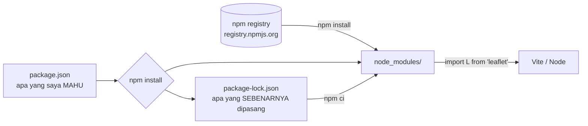
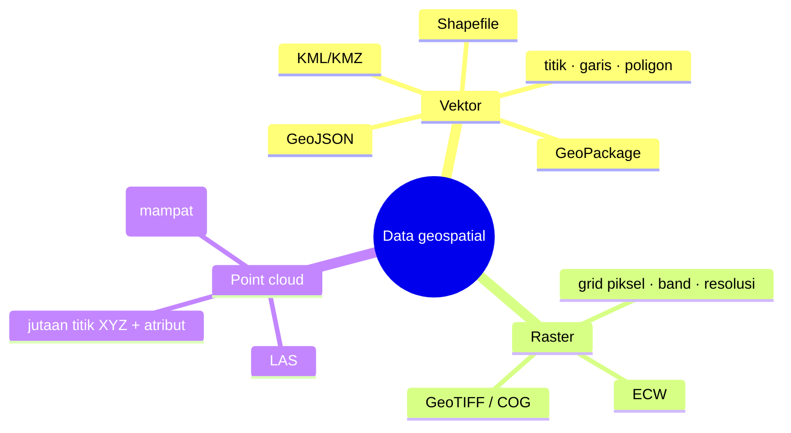
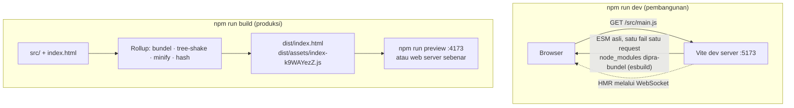
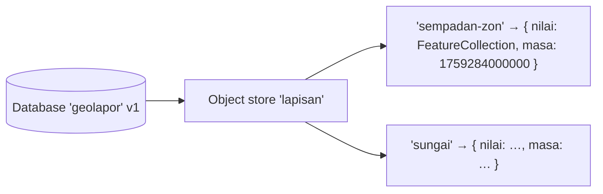
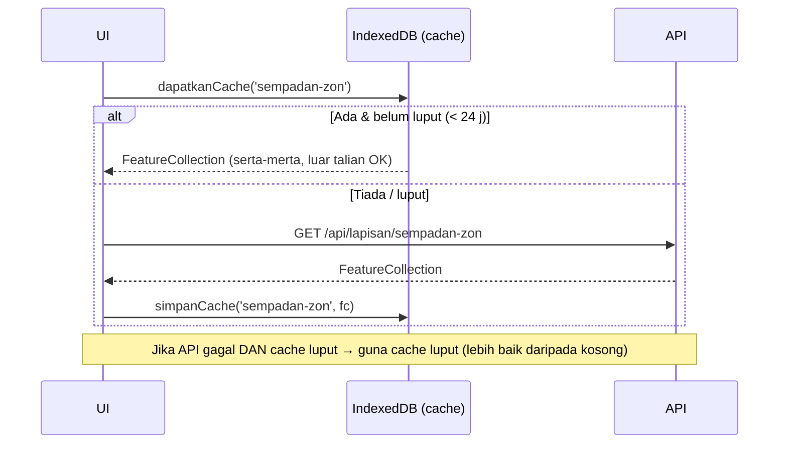

# Hari 4 — Web Development Tooling & Ecosystem

[📅 Jadual](../JADUAL.md) · [🧪 Lab Hari 4](./lab.md) · [🗂️ Data sampel](../projek/data/)

> Semalam GeoLapor berjalan dengan `<script type="module">` dan Leaflet dari CDN. Itu cukup untuk satu halaman, tetapi sistem sebenar ada puluhan modul, pustaka npm yang perlu dikunci versinya, konfigurasi berbeza untuk ujian dan produksi, piawaian kod pasukan, dan pengguna lapangan yang kehilangan liputan. Hari ini kita memasang **perkakas** itu: npm, Vite, ESLint + Prettier, dan browser storage. Kemudian kita menggunakannya untuk permintaan utama klien: **membaca dan menulis fail geospatial** (Shapefile dalam RSO, GeoPackage, KML/KMZ, GeoTIFF, LAS) terus dalam browser. Hujung hari: GeoLapor berjalan di atas Vite, boleh mengimport dan mengeksport fail, lulus lint, dan terus berfungsi apabila rangkaian terputus.

---

## 🎯 Objektif Pembelajaran

Di akhir hari ini, peserta boleh:

| # | Objektif (boleh diukur) | Sesi | Bukti |
|---|------------------------|------|-------|
| O1 | **Mengurus** pakej dengan npm (`init`, `install`, `-D`, semver `^`/`~`, lockfile + `npm ci`, `scripts`, `npx`, `audit`) dan **memadankan** setiap format geospatial dengan pakej baca/tulisnya | S1 | `latihan-npm/` dengan `npm run periksa` mencetak koordinat RSO; jadual format → pakej |
| O2 | **Mencipta** projek Vite 7, menggunakan dev server, `import.meta.env` (`VITE_API_URL`), aset statik, `import()` dinamik, dan **membina** untuk produksi (`build` + `preview`) | S2 | GeoLapor (`projek/geolapor-mula`) berjalan di `:5173`; `npm run build` → `dist/`; `preview` berfungsi |
| O3 | **Membaca** GeoJSON, Shapefile (termasuk reprojection EPSG:3375 → 4326 dengan proj4), GeoPackage dan KML/KMZ melalui File API / seret-lepas, dan **mengeksport** GeoJSON/KML/Shapefile melalui `Blob` | S2 | `sempadan-zon-rso.zip` → 5 zon **di Putrajaya** (bukan di Laut Atlantik); fail `.geojson`/`.kml`/`.zip` dimuat turun |
| O4 | **Menerangkan** vektor vs raster vs point cloud; **membaca** metadata GeoTIFF & LAS; **menerangkan** laluan ECW → GDAL → COG; **menggunakan** Turf (`pointsWithinPolygon`, `buffer`, `area`) | S2 (lanjutan) | DEM: ketinggian di LPR-0001 = 23.46 m; LAS: 1,000 titik, v1.2, Z 22.20–50.98 m; ZON-E = 15 laporan |
| O5 | **Mengkonfigur** ESLint 9 (flat config) + Prettier, **membaiki** amaran sebenar dan **menerangkan** konvensyen penamaan projek | S3 | `npm run lint` → 0 error; `semak-lint.js` 10 → 0 masalah |
| O6 | **Menggunakan** `localStorage`, `sessionStorage` dan IndexedDB dengan betul (JSON, kuota, `try…catch`), **menyenaraikan** apa yang tidak boleh disimpan, dan **membina** cache layer + draf borang luar talian | S4 | DevTools → Application menunjukkan `geolapor` IDB + `geolapor:draf-borang`; mod *Offline*, layer masih dimuat, draf dipulihkan |

---

## 📅 Jadual Hari Ini

| Masa | Sesi | Aktiviti (aturcara) | Objektif sesi | Benang tambahan (gunaan) |
|------|------|---------------------|---------------|--------------------------|
| 9.00 – 11.00 pagi | S1 | **Package Management** | npm `init`, `install`, semver, lockfile, `scripts` | Pasang leaflet, turf, proj4, shpjs, togeojson, geotiff; **peta format → pakej** |
| 11.00 – 1.00 tgh | S2 | **Module Bundlers & Build Tools** | Projek Vite, dev server, `import.meta.env`, build produksi | Pindah GeoLapor ke Vite; **baca/tulis format geospatial** |
| 1.00 – 2.30 ptg | — | Makan tengah hari | | |
| 2.30 – 3.30 ptg | S3 | **Code Quality & Coding Standards** | ESLint + Prettier; membaiki amaran; konvensyen penamaan | Lint modul `geo`, `api`, `io` |
| 3.30 – 5.00 ptg | S4 | **Browser Storage** | `localStorage`, `sessionStorage`, IndexedDB; had & keselamatan | Cache layer GeoJSON & draf borang luar talian |

> **Susun atur format geospatial:** konsep dan pemetaan pakej dalam **S1**; baca/tulis vektor (GeoJSON, Shapefile + proj4, GeoPackage, KML/KMZ) sebagai lab gunaan **S2**; raster (GeoTIFF, ECW), point cloud (LAS/LAZ) dan Turf sebagai **lanjutan S2** (§2.B.8–2.B.11). Jika masa S2 tidak cukup, lanjutan disambung selepas S4 atau sebagai kerja rumah. Tajuk sesi aturcara kekal sebagai fokus utama setiap sesi.

---

## 🧭 Kenapa hari ini penting

| Tanpa hari ini | Dengan hari ini |
|----------------|-----------------|
| "Leaflet versi berapa? Ambil dari CDN je" | `package-lock.json` mengunci **setiap** versi; `npm ci` memberi hasil yang sama di semua mesin |
| `API_URL` ditulis keras dalam kod | `VITE_API_URL` berbeza untuk dev / UAT / produksi tanpa mengubah kod |
| 15 fail `<script>` dimuat satu per satu | Satu bundle kecil dengan nama ber-hash, dan pustaka format dimuat **hanya bila diperlukan** |
| Shapefile dari JUPEM → "buka dalam QGIS dulu, export GeoJSON, hantar emel" | Seret `.zip` ke browser → RSO ditukar ke WGS84 → terus di peta |
| Setiap orang menulis gaya kod sendiri; `innerHTML` terlepas semakan | ESLint menangkap `innerHTML`, `==`, variable tak guna **sebelum** kod dihantar |
| Pegawai lapangan hilang liputan → borang separuh diisi hilang | Draf disimpan automatik; layer rujukan dari cache IndexedDB |

Permintaan klien secara literal: *"Convert/read/write file geospatial dalam bentuk berikut (asas je x perlu deep)"*. Hari ini meliputi **ketujuh-tujuh** format pada tahap asas yang praktikal: apa ia, bila digunakan, cara membacanya dalam JS, dan cara menulis/menukarnya (dalam browser jika munasabah, dengan GDAL jika tidak).

---

## S1 — Package Management (9.00 – 11.00 pagi)

### 1.1 npm dalam satu gambar



| Istilah | Maksud |
|---------|--------|
| **Pakej** | Folder dengan `package.json` yang diterbitkan ke registry (cth `leaflet`, `@turf/turf`) |
| **Scope** `@nama/` | Ruang nama organisasi: `@turf/turf`, `@mapbox/shp-write`, `@loaders.gl/las` |
| `node_modules/` | Salinan tempatan semua pakej. **Jangan commit** (`.gitignore`) dan jangan edit |
| `package.json` | Manifest projek: nama, skrip, julat versi yang dibenarkan |
| `package-lock.json` | Rekod **tepat** versi setiap pakej (termasuk dependency tidak langsung). **Commit** |

### 1.2 `npm init` dan anatomi `package.json`

```bash
mkdir latihan-npm && cd latihan-npm
npm init -y                      # jana package.json default
npm pkg set type=module          # benarkan import/export dalam .js (Node)
```

```jsonc
{
  "name": "latihan-npm",
  "version": "1.0.0",
  "type": "module",                     // .js = ES module (import/export)
  "private": true,                      // elak `npm publish` tidak sengaja
  "engines": { "node": ">=22" },        // dokumentasi keperluan runtime
  "scripts": {                          // npm run <nama>
    "periksa": "node periksa.mjs"
  },
  "dependencies": {                     // diperlukan oleh aplikasi semasa BERJALAN
    "proj4": "^2.22.0",
    "@turf/turf": "^7.4.0"
  },
  "devDependencies": {                  // hanya semasa MEMBANGUN (build, lint, ujian)
    "eslint": "^9.39.5"
  }
}
```

### 1.3 `install`: dependencies vs devDependencies

```bash
npm install proj4 @turf/turf        # → dependencies     (singkatan: npm i)
npm install -D eslint@9 prettier@3  # → devDependencies  (-D = --save-dev)
npm install                         # pasang SEMUA dalam package.json (selepas git clone)
npm uninstall proj4                 # buang
npm ls --depth=0                    # apa yang dipasang
```

| Soalan | `dependencies` | `devDependencies` |
|--------|----------------|-------------------|
| Diperlukan dalam browser/produksi? | ✅ leaflet, proj4, shpjs, geotiff | ❌ vite, eslint, prettier |
| Contoh GeoLapor | `leaflet`, `@turf/turf`, `sql.js` | `vite`, `eslint`, `prettier` |

> 💡 **Tip:** Dalam projek Vite, perbezaan ini lebih kepada **dokumentasi**, kerana Vite membundel apa sahaja yang di-`import`. Namun ia penting untuk projek Node (`npm ci --omit=dev` di server) dan untuk pembaca kod.

### 1.4 Semver: `MAJOR.MINOR.PATCH`

```text
   2   .  22  .  0
 MAJOR   MINOR   PATCH
 pecah   ciri    baiki pepijat
 API     baharu  (serasi)
         (serasi)
```

| Julat dalam `package.json` | Maksud | Contoh `^2.22.0` / `~2.22.0` membenarkan |
|----------------------------|--------|------------------------------------------|
| `^2.22.0` (default `npm i`) | Sama **MAJOR** | 2.22.1, 2.23.0, 2.99.0; ❌ 3.0.0 |
| `~2.22.0` | Sama **MAJOR.MINOR** | 2.22.1, 2.22.9; ❌ 2.23.0 |
| `2.22.0` | Tepat | 2.22.0 sahaja |
| `>=7 <8` | Julat eksplisit | 7.x sahaja |
| `*` / `latest` | Apa sahaja | ⚠️ Jangan |

```bash
npm view proj4 version              # versi terkini
npm view vite versions --json       # semua versi
npm install vite@7                  # pasang MAJOR tertentu (kursus ini: Vite 7, walaupun Vite 8 sudah keluar)
npm outdated                        # apa yang ketinggalan
npm update                          # naik taraf dalam julat yang dibenarkan
```

> ⚠️ **Kesilapan lazim:** `npm create vite@latest` pada September 2026 memberi **Vite 8**. Kursus ini dikunci pada **Vite 7** dan **ESLint 9**. Pin versi secara eksplisit: `npm create vite@8.3.0` (template Vite ^7.3) dan `npm i -D eslint@9`. Inilah semver dalam dunia sebenar: MAJOR baharu **boleh** memecahkan konfigurasi anda.

### 1.5 Lockfile: `npm install` vs `npm ci`

| | `npm install` | `npm ci` |
|---|---|---|
| Baca | `package.json` (julat) | `package-lock.json` (tepat) |
| Boleh ubah lockfile? | ✅ Ya | ❌ Tidak. Gagal jika tidak sepadan |
| `node_modules` lama | Dikemas kini | **Dipadam** dan dipasang semula |
| Guna bila | Menambah/menaik taraf pakej | CI/CD, server, mesin rakan, **hari demo** |

> 💡 **Tip:** "Ia berfungsi di mesin saya" selalunya bermaksud lockfile tidak di-commit atau `npm install` menaik taraf sesuatu secara senyap. Commit `package-lock.json`; guna `npm ci` untuk pemasangan yang boleh diulang.

### 1.6 `scripts` dan `npx`

```jsonc
"scripts": {
  "dev": "vite",
  "build": "vite build",
  "preview": "vite preview",
  "lint": "eslint .",
  "format": "prettier --write .",
  "test": "node --test \"tests/**/*.test.js\""
}
```

```bash
npm run dev             # jalankan skrip "dev"
npm start / npm test    # singkatan (tanpa "run") untuk start & test sahaja
npm run lint -- --fix   # "--" menghantar argumen tambahan kepada eslint
npx eslint --version    # jalankan binari dari node_modules/.bin (atau muat turun sementara)
npx serve -l 5500 .     # jalankan alat tanpa memasangnya ke projek
```

Skrip npm boleh memanggil binari dalam `node_modules/.bin` **tanpa** `npx`, dan inilah sebabnya `"dev": "vite"` berfungsi walaupun `vite` tidak dipasang secara global.

### 1.7 `npm audit` dan keselamatan supply chain

```bash
npm audit                 # senarai kerentanan yang diketahui dalam dependency tree
npm audit --omit=dev      # hanya yang sampai ke produksi
npm audit fix             # naik taraf dalam julat semver yang selamat
# npm audit fix --force   # ⚠️ boleh naik MAJOR dan memecahkan aplikasi. Baca dahulu
```

| Amalan | Kenapa |
|--------|--------|
| Semak ejaan nama pakej (`leaflet` bukan `leafIet`) | *Typosquatting*: pakej palsu dengan nama hampir sama |
| Lihat muat turun mingguan, tarikh kemas kini, repo GitHub | Pakej terbiar = risiko |
| Kurangkan dependency | Setiap pakej ialah kod orang lain yang berjalan dalam sistem anda |
| `npm ci` dalam CI | Lockfile menghalang versi berniat jahat baharu masuk secara senyap |

### 1.8 Rangkaian pejabat: proksi dan registry

```bash
npm config get registry                             # default: https://registry.npmjs.org/
npm config set proxy http://proksi.jabatan:8080     # jika rangkaian menggunakan proksi
npm config set https-proxy http://proksi.jabatan:8080
npm config set registry https://nexus.jabatan/repository/npm/   # cermin dalaman (Nexus/Artifactory)
npm install --prefer-offline                        # guna cache ~/.npm dahulu
```

### 1.9 Dari format ke pakej: peta pakej geospatial

Sebelum memasang, fahami **jenis data**. Permintaan klien menyenaraikan tiga keluarga:



| Keluarga | Mewakili | Contoh PGN | Soalan tipikal |
|----------|----------|------------|----------------|
| **Vektor** | Objek diskret dengan sempadan jelas + atribut | Sempadan lot/mukim, jalan, sungai, titik kemudahan | "Berapa laporan dalam zon ini?" |
| **Raster** | Fenomena berterusan sebagai grid sel | DEM, ortofoto, imej satelit, suhu | "Berapa ketinggian di titik ini?" |
| **Point cloud** | Sampel 3D mentah daripada LiDAR/fotogrametri | Tinjauan LiDAR bandar, hutan, koridor | "Berapa tinggi bangunan/pokok ini?" |

| Format | Pakej npm (baca) | Pakej npm (tulis) | Pasang |
|--------|------------------|-------------------|--------|
| GeoJSON | *(tiada. `JSON.parse`)* | *(tiada. `JSON.stringify`)* | — |
| Shapefile (.zip) | `shpjs` + `jszip` | `@mapbox/shp-write` | `npm i shpjs jszip @mapbox/shp-write` |
| GeoPackage | `sql.js` (SQLite → WebAssembly) | *(asas: guna GDAL/QGIS)* | `npm i sql.js` |
| KML / KMZ | `@tmcw/togeojson` (+ `jszip` untuk KMZ) | `tokml` | `npm i @tmcw/togeojson tokml` |
| GeoTIFF | `geotiff` | `geotiff` (`writeArrayBuffer`, asas) | `npm i geotiff` |
| ECW | ❌ **tiada** (proprietari) | ❌ | Tukar dengan GDAL/QGIS → COG |
| LAS / LAZ | `@loaders.gl/las` + `@loaders.gl/core` | *(guna PDAL/LAStools)* | `npm i @loaders.gl/core @loaders.gl/las` |
| Projection | `proj4` | — | `npm i proj4` |
| Analisis | `@turf/turf` | — | `npm i @turf/turf` |
| Peta | `leaflet` | — | `npm i leaflet` |

---

## S2 — Module Bundlers & Build Tools (11.00 pagi – 1.00 tgh)

### 2.A.1 Kenapa perlu bundler?

```js
import L from 'leaflet'; // ❌ dalam browser tanpa build: "Failed to resolve module specifier 'leaflet'"
```

Browser hanya memahami URL (`./x.js`, `https://…`). Nama pakej "kosong" (*bare specifier*) seperti `'leaflet'` perlu **di-resolve** ke fail dalam `node_modules`. Bundler melakukan itu dan banyak lagi:

| Kerja | Tanpa bundler (Hari 1–3) | Dengan Vite (Hari 4–5) |
|-------|--------------------------|------------------------|
| Selesaikan `import 'leaflet'` | ❌ CDN / `vendor/` manual | ✅ dari `node_modules` |
| `import './style.css'` | ❌ | ✅ disuntik sebagai `<style>` / fail CSS |
| Konfigurasi ikut persekitaran | Ubah kod | `.env` → `import.meta.env` |
| Kemas kini semasa menaip | Muat semula manual | **HMR** (*Hot Module Replacement*) |
| Produksi | 20+ request HTTP | Beberapa fail kecil, *minified*, nama ber-hash (cache kekal) |
| Pustaka berat (sql.js, geotiff) | Sentiasa dimuat | `import()` → dimuat **bila diperlukan** |

### 2.A.2 Vite: dua mod



### 2.A.3 Mencipta projek Vite 7

```bash
npm create vite@8.3.0 demo-vite -- --template vanilla --no-interactive   # create-vite 8.3 → Vite ^7.3
cd demo-vite
npm install
npm run dev          # → http://localhost:5173
```

```text
demo-vite/
├── index.html        ← TITIK MASUK (bukan dalam public/). <script type="module" src="/src/main.js">
├── package.json      ← scripts: dev, build, preview
├── public/           ← disalin APA ADANYA ke dist/ (favicon, fail data statik)
└── src/
    ├── main.js       ← kod anda; boleh import pakej npm, CSS, imej
    ├── style.css
    └── counter.js
```

### 2.A.4 Environment variable

```bash
# .env                 → semua mod
# .env.development     → npm run dev
# .env.production      → npm run build
# .env.local           → tempatan sahaja, JANGAN commit (dalam .gitignore)
VITE_API_URL=http://localhost:3000
VITE_API_KEY=latihan-pgn-2026
RAHSIA_DB=abc   # ← TIDAK didedahkan (tiada awalan VITE_)
```

```js
// services/api.js (Hari 4)
// `?.` kerana import.meta.env hanya wujud dalam Vite. Dalam `node --test` (Hari 5) ia undefined.
const API_URL = import.meta.env?.VITE_API_URL ?? 'http://localhost:3000';
const API_KEY = import.meta.env?.VITE_API_KEY ?? 'latihan-pgn-2026';

import.meta.env.MODE; // "development" | "production"
import.meta.env.DEV; // true semasa npm run dev
import.meta.env.PROD; // true dalam build
```

> ⚠️ **Kesilapan lazim (keselamatan):** `VITE_*` **dibenamkan sebagai teks** dalam bundle JavaScript. Sesiapa boleh membacanya di DevTools → Sources. `VITE_API_KEY` sesuai untuk key **mock** latihan sahaja. Rahsia sebenar (kata laluan DB, API key berbayar) **mesti** kekal di server.

> ⚠️ **Kesilapan lazim:** Meletakkan `VITE_API_URL` dalam `.env.development` sahaja. `npm run build` menggunakan mod **production**, jadi `import.meta.env.VITE_API_URL` menjadi `undefined` dalam build. (Kami mengujinya: dev betul, build `undefined`.) Guna `.env` untuk nilai default, dan `.env.production` untuk nilai produksi.

### 2.A.5 Aset statik: `public/` vs `import`

| Cara | Contoh | Hasil build | Guna untuk |
|------|--------|-------------|-----------|
| `public/` | `public/data/zon.geojson` → `fetch('/data/zon.geojson')` | Disalin apa adanya, URL tetap | Fail besar / dirujuk dengan URL tetap |
| `import` biasa | `import 'leaflet/dist/leaflet.css'` | Dibundel, nama ber-hash | CSS, modul |
| `?url` | `import wasmUrl from 'sql.js/dist/sql-wasm.wasm?url'` | Fail disalin + URL ber-hash dipulangkan | WASM, fail yang pustaka perlu muat sendiri |
| `?raw` | `import teks from './contoh.kml?raw'` | Kandungan sebagai string | Data kecil terbenam |
| `new URL(…, import.meta.url)` | `new URL('./ikon.png', import.meta.url).href` | Disalin + URL | Aset dinamik |

### 2.A.6 `import()` dinamik: muat pustaka berat bila diperlukan

```js
// ❌ Semua pengguna memuat sql.js (650 KB wasm) + geotiff walaupun tidak pernah mengimport fail
import { bacaFail } from './io/format.js';

// ✅ Muat hanya apabila pengguna menjatuhkan fail
zon.addEventListener('drop', async (e) => {
  const { bacaFail } = await import('./io/format.js'); // Vite → chunk berasingan (format-XXXX.js)
  const fc = await bacaFail(e.dataTransfer.files[0]);
});
```

Selepas `npm run build`, perhatikan output: `format-*.js`, `raster-*.js`, `lidar-*.js` dan `sql-wasm-*.wasm` ialah **chunk berasingan**. Amaran *"Some chunks are larger than 500 kB"* ialah isyarat untuk memisahkan kod dengan `import()`.

### 2.A.7 Leaflet dalam Vite

```js
import 'leaflet/dist/leaflet.css'; // CSS kini di-import, bukan <link>
import L from 'leaflet'; // tiada lagi lib/leaflet.js + vendor/
```

> ⚠️ **Kesilapan lazim, "berfungsi dalam dev, pecah dalam build":** ikon default `L.marker` dipapar dalam `npm run dev` tetapi menjadi **imej pecah** selepas `npm run build` (kami mengesahkannya dengan Vite 7.3). Punca: Leaflet meneka laluan imej daripada CSS, dan Vite menukar imej kecil itu menjadi `data:` URL dalam build. Dua penyelesaian:
>
> ```js
> // (a) GeoLapor: guna L.circleMarker. Tiada fail imej, boleh diwarnakan ikut kategori.
> // (b) Jika perlu L.marker: beri URL ikon secara eksplisit
> import iconUrl from 'leaflet/dist/images/marker-icon.png';
> import iconRetinaUrl from 'leaflet/dist/images/marker-icon-2x.png';
> import shadowUrl from 'leaflet/dist/images/marker-shadow.png';
> delete L.Icon.Default.prototype._getIconUrl; // matikan tekaan laluan
> L.Icon.Default.mergeOptions({ iconUrl, iconRetinaUrl, shadowUrl });
> ```
>
> Pengajaran umum: **sentiasa uji `npm run build && npm run preview`** sebelum menyerahkan.

### 2.A.8 Memindahkan GeoLapor Hari 3 → Vite

| Hari 3 (tanpa build) | Hari 4 (`projek/geolapor-mula`, Vite) |
|----------------------|---------------------------------------|
| `lib/leaflet.js` + `vendor/leaflet/` | `import L from 'leaflet'` + `import 'leaflet/dist/leaflet.css'` |
| `<link href="https://unpkg…/leaflet.css">` | Dibuang |
| `export const API_URL = 'http://localhost:3000'` | `import.meta.env?.VITE_API_URL ?? 'http://localhost:3000'` |
| `const API_KEY = 'latihan-pgn-2026'` | `import.meta.env.VITE_API_KEY` (dalam `.env`, dari `.env.example`) |
| `node serve.mjs` → `:5500` | `npm run dev` → `:5173` |
| `latihan-05.js` (satu fail besar) | `src/main.js` + `src/ui/*.js` + `src/services/*.js` + `src/utils/*.js` + `src/io/*.js` |

---

### 2.B Modul gunaan: Format fail geospatial (asas)

#### 2.B.1 File API: dari cakera pengguna ke `ArrayBuffer`

```html
<input type="file" id="pilih-fail" accept=".geojson,.json,.zip,.gpkg,.kml,.kmz,.tif,.tiff,.las,.laz" />
<div id="zon-lepas" class="zon-lepas">Seret fail ke sini</div>
```

```js
const pilih = document.getElementById('pilih-fail');
pilih.addEventListener('change', () => proses(pilih.files[0]));

const zon = document.getElementById('zon-lepas');
zon.addEventListener('dragover', (e) => {
  e.preventDefault(); // ❗ WAJIB, tanpanya 'drop' tidak akan berlaku (browser buka fail)
  zon.classList.add('aktif');
});
zon.addEventListener('dragleave', () => zon.classList.remove('aktif'));
zon.addEventListener('drop', (e) => {
  e.preventDefault();
  zon.classList.remove('aktif');
  for (const fail of e.dataTransfer.files) proses(fail); // FileList → boleh banyak fail
});

async function proses(fail) {
  console.log(fail.name, fail.size, fail.type); // "kemudahan.kml" 4261 "…" (type selalunya KOSONG untuk .geojson/.gpkg → guna sambungan nama fail)
  const teks = await fail.text(); // untuk format teks (GeoJSON, KML)
  const buf = await fail.arrayBuffer(); // untuk format binari (zip, gpkg, tif, las)
}
```

> 💡 **Tip:** Semua pemprosesan berlaku **dalam browser**. Fail tidak dimuat naik ke mana-mana server, dan ini kelebihan besar untuk data yang sensitif. (Muat naik ke API ialah langkah berasingan dan sengaja.)

**Menulis (eksport):** bina `Blob`, cipta URL sementara, klik `<a download>`:

```js
function muatTurun(blob, namaFail) {
  const url = URL.createObjectURL(blob); // "blob:http://localhost:5173/3f9c…"
  const a = document.createElement('a');
  a.href = url;
  a.download = namaFail; // cadangan nama fail
  document.body.append(a);
  a.click();
  a.remove();
  setTimeout(() => URL.revokeObjectURL(url), 1000); // bebaskan memori
}
```

#### 2.B.2 GeoJSON (`.geojson`, `.json`): format asli web

| Perkara | Nilai |
|---------|-------|
| Jenis | Vektor, teks (JSON), piawai **RFC 7946** |
| CRS | **WGS84 sahaja** (`[lng, lat]`). Medan `crs` sudah dimansuhkan |
| Kelebihan | Dibaca terus oleh Leaflet, Turf, API; boleh `diff` dalam git |
| Kelemahan | Besar (teks); tiada indeks ruang; tidak sesuai untuk jutaan feature |

```js
// Baca
const fc = JSON.parse(await fail.text());
if (fc.type !== 'FeatureCollection') throw new Error('Bukan FeatureCollection');

// Tulis
eksportGeoJSON(fc, 'laporan'); // → Blob([JSON.stringify(fc, null, 2)], { type: 'application/geo+json' })
```

#### 2.B.3 Shapefile (`.shp` `.shx` `.dbf` `.prj`): piawai industri lama

| Fail | Kandungan | Wajib? |
|------|-----------|--------|
| `.shp` | Geometri | ✅ |
| `.shx` | Indeks kedudukan geometri | ✅ (spesifikasi) |
| `.dbf` | Jadual atribut (format dBASE) | ✅ |
| `.prj` | Sistem koordinat (WKT) | Tidak, **tetapi tanpanya anda perlu meneka CRS** |
| `.cpg` | Pengekodan aksara `.dbf` (cth `UTF-8`) | Tidak |

**Kenapa zip?** Satu "Shapefile" sebenarnya **3–5 fail** yang mesti bergerak bersama. Browser dan e-mel mengendalikan satu fail dengan lebih baik, jadi konvensyen web ialah `.zip` yang mengandungi semuanya.

**Had yang akan anda temui** (dan sebab GeoPackage dicipta):

| Had | Kesan |
|-----|-------|
| Nama medan DBF **maksimum 10 aksara** | `keluasan_ha` → **`keluasan_h`** (lihat sendiri dalam lab!) |
| Satu jenis geometri setiap fail | Titik & poligon = dua Shapefile |
| Saiz ≤ 2 GB setiap komponen | Data nasional perlu dipecah |
| Tiada jenis tarikh-masa / boolean yang baik; pengekodan teks bermasalah | `.cpg` sering hilang → huruf rosak |

**Membaca dalam browser (dengan reprojection):**

```js
import JSZip from 'jszip';
import { parseShp, parseDbf, combine } from 'shpjs';
import { keWgs84 } from '../utils/unjuran.js';

async function bacaShapefileZip(arrayBuffer) {
  const zip = await JSZip.loadAsync(arrayBuffer);
  const shp = zip.file(/\.shp$/i)[0];
  const dbf = zip.file(/\.dbf$/i)[0];
  const prj = zip.file(/\.prj$/i)[0];
  const [shpBuf, dbfBuf, prjTeks] = await Promise.all([
    shp.async('arraybuffer'),
    dbf?.async('arraybuffer'),
    prj?.async('string'),
  ]);

  let fc = combine([parseShp(shpBuf), dbfBuf ? parseDbf(dbfBuf) : undefined]); // koordinat MENTAH dari fail
  if (prjTeks && /3375|RSO|Rectified_Skew|Hotine/i.test(prjTeks)) {
    fc = keWgs84(fc, 'EPSG:3375'); // meter RSO → [lng, lat]
  }
  return fc;
}
```

> ⚠️ **Kesilapan lazim, "Shapefile saya di Laut Atlantik / tidak kelihatan":** koordinat masih dalam **meter** (RSO: `[407029.9, 325142.5]`), tetapi Leaflet menganggapnya darjah. **Semak pantas:** `Math.abs(x) > 180` → bukan darjah → perlu reprojection.

> ⚠️ **Kesilapan lazim, bergantung pada `shp(zip)` "all-in-one":** `shpjs` melakukan reprojection secara automatik **jika** proj4 memahami `.prj`. Dengan `.prj` bentuk **OGC WKT** (`PROJECTION["Hotine_Oblique_Mercator"]` … `AUTHORITY["EPSG","3375"]`, seperti `sempadan-zon-rso.zip`) ia berjaya. Tetapi `.prj` bentuk **ESRI** untuk RSO (`Rectified_Skew_Orthomorphic_Natural_Origin`, lazim dari ArcGIS) menyebabkan error *"Could not get projection name"* (kami menguji kedua-duanya dengan shpjs 6.2 + proj4 2.22). Oleh itu GeoLapor membaca `.shp` + `.dbf` secara berasingan (`parseShp`/`parseDbf`/`combine`), mengesan RSO dari `.prj`, dan melakukan reprojection sendiri dengan proj4. Cara ini berfungsi untuk **kedua-dua** bentuk, dan anda **tahu** bila reprojection berlaku.

**Menulis:**

```js
import shpwrite from '@mapbox/shp-write';
const blob = await shpwrite.zip(fc, { outputType: 'blob', compression: 'DEFLATE', types: { point: 'laporan' } });
muatTurun(blob, 'laporan.zip'); // laporan.shp/.shx/.dbf/.prj (EPSG:4326)
```

#### 2.B.4 Projection: EPSG:3375 GDM2000 / Peninsula RSO → WGS84

Data rasmi Semenanjung Malaysia lazimnya dalam **GDM2000 / Peninsula RSO (EPSG:3375)**: projection *Hotine Oblique Mercator* dalam **meter**, direka supaya herotan minimum sepanjang paksi Semenanjung yang condong. Peta web mahukan **EPSG:4326** (darjah).

```js
// utils/unjuran.js (API dikunci)
import proj4 from 'proj4';

export const RSO_PROJ =
  '+proj=omerc +lat_0=4 +lonc=102.25 +alpha=323.0257964666666 +k=0.99984 ' +
  '+x_0=804671 +y_0=0 +no_uoff +gamma=323.1301023611111 +ellps=GRS80 ' +
  '+towgs84=0,0,0,0,0,0,0 +units=m +no_defs';
proj4.defs('EPSG:3375', RSO_PROJ); // 4326 & 3857 sudah terbina dalam proj4

proj4('EPSG:4326', 'EPSG:3375', [101.6958, 2.9264]); // → [411007.11, 323878.55]  (LPR-0001, meter)
proj4('EPSG:3375', 'EPSG:4326', [411007.11, 323878.55]); // → [101.6958, 2.9264]
proj4('EPSG:4326', 'EPSG:3857', [101.6958, 2.9264]); // → [11320724.67, 325907.09]  (Web Mercator)

// keWgs84(fc, dariEpsg = 'EPSG:3375'): gunakan penukar pada SETIAP koordinat, semua jenis geometri
```

| Koordinat | EPSG:4326 | EPSG:3375 (RSO) | EPSG:3857 |
|-----------|-----------|-----------------|-----------|
| LPR-0001 | `[101.6958, 2.9264]` | `[411007.11, 323878.55]` | `[11320724.67, 325907.09]` |
| Unit | darjah | meter | meter ("palsu" di latitud tinggi) |
| Guna | GeoJSON, GPS, API | Ukur, kadaster, data JUPEM/PGN | Tile peta web |

> 💡 **Tip:** Nilai `towgs84=0,…` menganggap GDM2000 ≈ WGS84. Beza sebenar pada tahap sentimeter–desimeter, jadi boleh diabaikan untuk paparan web tetapi **tidak** untuk kerja ukur. Untuk kerja jitu, gunakan GDAL/PROJ dengan grid transformasi rasmi.

#### 2.B.5 GeoPackage (`.gpkg`): piawai terbuka moden (SQLite)

| Perkara | Nilai |
|---------|-------|
| Jenis | **Satu fail** SQLite, piawai **OGC**; vektor **dan** raster (tile) dalam fail sama |
| Kelebihan | Tiada had 10 aksara, banyak layer dalam satu fail, indeks ruang (R-tree), CRS jelas |
| Jadual penting | `gpkg_contents` (senarai layer), `gpkg_geometry_columns` (lajur geometri + `srs_id`), `gpkg_spatial_ref_sys` (definisi CRS) |
| Geometri | BLOB: header `"GP"` + envelope pilihan + **WKB** (Well-Known Binary) |

```js
import initSqlJs from 'sql.js';
import sqlWasmUrl from 'sql.js/dist/sql-wasm.wasm?url'; // ← aset Vite (§2.A.5)

const SQL = await initSqlJs({ locateFile: () => sqlWasmUrl }); // muat enjin SQLite (WebAssembly)
const db = new SQL.Database(new Uint8Array(await fail.arrayBuffer()));

db.exec('SELECT table_name, data_type, srs_id FROM gpkg_contents');
// → [{ columns: [...], values: [['kemudahan', 'features', 4326]] }]

const stmt = db.prepare('SELECT * FROM "kemudahan"');
while (stmt.step()) {
  const { geom, ...properties } = stmt.getAsObject(); // geom = Uint8Array (GP + WKB)
  // gpkgKeGeometri(geom) → { type: 'Point', coordinates: [lng, lat] }
}
stmt.free();
db.close();
```

```js
// Header GeoPackageBinary → offset WKB (versi asas untuk Point)
function wkbTitik(blob) {
  const dv = new DataView(blob.buffer, blob.byteOffset, blob.byteLength);
  const flags = dv.getUint8(3); // bait 0-1 "GP", 2 versi, 3 flags
  const envelope = [0, 32, 48, 48, 64][(flags >> 1) & 0b111]; // saiz envelope ikut bit 1-3
  const o = 8 + envelope; // selepas "GP"+versi+flags+srs_id(4)
  const le = dv.getUint8(o) === 1; // WKB: 1 = little-endian
  const jenis = dv.getUint32(o + 1, le); // 1 = Point
  return [dv.getFloat64(o + 5, le), dv.getFloat64(o + 13, le)]; // [x, y] = [lng, lat]
}
```

**Menulis GeoPackage** memerlukan jadual metadata, pencetus R-tree dan sebagainya. Ini boleh dilakukan dengan sql.js, tetapi di luar skop "asas". Gunakan `ogr2ogr -f GPKG` atau QGIS (lihat §2.B.12), atau pustaka penuh seperti `@ngageoint/geopackage` jika benar-benar perlu dalam browser.

#### 2.B.6 KML / KMZ: visualisasi ringkas (Google Earth)

| Perkara | KML | KMZ |
|---------|-----|-----|
| Jenis | XML teks (piawai OGC) | **Zip** yang mengandungi `doc.kml` (+ ikon/imej) |
| CRS | Sentiasa WGS84, `lng,lat[,alt]` dalam `<coordinates>` | Sama |
| Kuat dalam | Gaya, ikon, `<description>` HTML, lawatan 3D Google Earth | Saiz lebih kecil, aset terbungkus |
| Lemah dalam | Analisis; atribut tidak berstruktur (`ExtendedData`) | — |

```js
import { kml } from '@tmcw/togeojson';
import JSZip from 'jszip';

// KML
const dom = new DOMParser().parseFromString(await fail.text(), 'text/xml'); // DOMParser terbina dalam browser
if (dom.querySelector('parsererror')) throw new Error('KML rosak');
const fc = kml(dom); // → FeatureCollection, properties: name, description, + ExtendedData

// KMZ
const zip = await JSZip.loadAsync(await fail.arrayBuffer());
const utama = zip.file('doc.kml') ?? zip.file(/\.kml$/i)[0];
const fc2 = kml(new DOMParser().parseFromString(await utama.async('string'), 'text/xml'));
```

```js
// Tulis KML
import tokml from 'tokml';
const teks = tokml(fc, { name: 'tajuk', description: 'catatan', documentName: 'Laporan GeoLapor' });
muatTurun(new Blob([teks], { type: 'application/vnd.google-earth.kml+xml' }), 'laporan.kml');
```

> ⚠️ **Kesilapan lazim:** Memaparkan `properties.description` daripada KML dengan `innerHTML`. KML **membenarkan HTML** dalam `<description>`, dan fail dari luar boleh mengandungi skrip. Peraturan Hari 3 masih terpakai: `textContent`.

#### 2.B.7 Helaian ringkas: format vektor dalam browser

| | GeoJSON | Shapefile | GeoPackage | KML/KMZ |
|---|---|---|---|---|
| Fail | 1 teks | 3–5 (zip) | 1 SQLite | 1 XML / 1 zip |
| CRS | WGS84 sahaja | Apa-apa (`.prj`) | Apa-apa (`srs_id`) | WGS84 sahaja |
| Banyak layer | ❌ | ❌ (satu setiap set) | ✅ | ✅ (Folder) |
| Nama medan | Bebas | ≤ 10 aksara | Bebas | Bebas |
| Baca JS | `JSON.parse` | `shpjs` | `sql.js` + WKB | `@tmcw/togeojson` |
| Tulis JS | `JSON.stringify` | `@mapbox/shp-write` | GDAL (asas) | `tokml` |
| Guna bila | API, web, git | Tukaran dengan sistem lama / ArcGIS | Simpanan & pertukaran moden | Kongsi dengan Google Earth / orang awam |

#### 2.B.8 GeoTIFF (`.tif`): raster bergeorujukan *(lanjutan)*

```text
       101.66°E                      101.74°E
 2.97°N ┌──┬──┬──┬── … ──┐   ← asal (tiepoint) = sudut kiri atas
        ├──┼──┼──┼── … ──┤   setiap sel = 0.0008° × 0.0009° (≈ 89 m × 100 m)
        │  │  │▓▓│       │   nilai sel = ketinggian (Float32), satu BAND
 2.88°N └──┴──┴──┴── … ──┘   100 × 100 piksel
```

| Konsep | Maksud | geotiff.js |
|--------|--------|------------|
| Lebar × tinggi | Bilangan piksel | `imej.getWidth()`, `getHeight()` |
| Band | Layer nilai (DEM = 1; RGB = 3) | `getSamplesPerPixel()` |
| Georujukan | Asal + saiz piksel → koordinat dunia | `getOrigin()`, `getResolution()`, `getBoundingBox()` |
| NoData | Nilai "tiada data" | `getGDALNoData()` |
| **COG** | *Cloud-Optimized GeoTIFF*: tile dalaman + ringkasan, boleh dibaca **sebahagian** melalui HTTP Range | `fromUrl(url)` |

```js
// io/raster.js (API dikunci)
import { fromArrayBuffer } from 'geotiff';

export async function bacaGeoTIFF(arrayBuffer) {
  const tiff = await fromArrayBuffer(arrayBuffer);
  const imej = await tiff.getImage();
  const [nilai] = await imej.readRasters(); // band pertama → Float32Array(10000)
  let min = Infinity, max = -Infinity;
  for (const v of nilai) if (!Number.isNaN(v)) { if (v < min) min = v; if (v > max) max = v; }
  return { lebar: imej.getWidth(), tinggi: imej.getHeight(), bbox: imej.getBoundingBox(), min, max, nilai };
}
// dem-putrajaya.tif → { lebar: 100, tinggi: 100, bbox: [101.66, 2.88, 101.74, 2.97], min: 13.36, max: 89.27 }
```

**Nilai di satu titik** (cth ketinggian di laporan):

```js
function nilaiDi({ lebar, tinggi, bbox: [minX, minY, maxX, maxY], nilai }, [lng, lat]) {
  const lajur = Math.floor(((lng - minX) / (maxX - minX)) * lebar);
  const baris = Math.floor(((maxY - lat) / (maxY - minY)) * tinggi); // baris 0 = UTARA (atas)
  if (lajur < 0 || lajur >= lebar || baris < 0 || baris >= tinggi) return null;
  return nilai[baris * lebar + lajur];
}
nilaiDi(raster, [101.6958, 2.9264]); // → 23.46 (m) di LPR-0001
```

**Papar di peta:** lukis ke `<canvas>` → `toDataURL()` → `L.imageOverlay(url, [[minLat, minLng], [maxLat, maxLng]])`. ⚠️ Perhatikan susunan **Leaflet** `[lat, lng]` sekali lagi.

**Menulis:** `geotiff` mempunyai `writeArrayBuffer(nilai, metadata)` untuk GeoTIFF ringkas (kami mengujinya: 10×8 Float32 + georujukan). Untuk kerja sebenar (pemampatan, COG, projection), guna `gdal_translate`.

#### 2.B.9 ECW (`.ecw`): raster proprietari *(lanjutan)*

| Perkara | Nilai |
|---------|-------|
| Apa | *Enhanced Compression Wavelet* (kini milik Hexagon). Nisbah mampatan sangat tinggi untuk **ortofoto & imej udara** bersaiz puluhan GB |
| Dalam JS/browser | ❌ **Tiada pustaka JavaScript.** Format tertutup; penyahkod memerlukan SDK berlesen |
| Laluan praktikal | **Tukar di server/desktop** → GeoTIFF / **COG** → (a) terbit sebagai **WMS/WMTS** melalui GeoServer, atau (b) baca COG terus dengan `geotiff.js fromUrl()` |
| Alat | GDAL dengan pemacu ECW (semak `gdalinfo --formats \| grep -i ecw`), atau QGIS (*Raster → Conversion → Translate*) |
| Menulis ECW | Memerlukan lesen SDK. Elakkan untuk data baharu dan gunakan COG (terbuka) |

```bash
gdal_translate -of COG -co COMPRESS=JPEG -co QUALITY=85 ortofoto.ecw ortofoto_cog.tif   # imej RGB
gdal_translate -of COG -co COMPRESS=DEFLATE dem.ecw dem_cog.tif                        # data (DEM)
```

#### 2.B.10 LAS / LAZ: point cloud LiDAR *(lanjutan)*

| Perkara | Nilai |
|---------|-------|
| Apa | Piawai ASPRS untuk point cloud: **header** + jutaan rekod titik (X, Y, Z, intensiti, klasifikasi, nombor pulangan, warna, masa GPS…) |
| LAZ | LAS yang dimampatkan tanpa kehilangan (≈ 7–20% saiz asal); piawai de facto untuk pengedaran |
| Header | `"LASF"` (bait 0–3), versi (bait 24–25), bilangan titik, skala & ofset, min/max XYZ |
| CRS | Dalam VLR (GeoKey/WKT). `sampel.las` = **EPSG:3375** (meter) |
| Klasifikasi lazim | 2 = tanah, 3–5 = tumbuhan rendah/sederhana/tinggi, 6 = bangunan, 9 = air |

```js
// io/lidar.js (API dikunci)
import { parse } from '@loaders.gl/core';
import { LASLoader } from '@loaders.gl/las';

export async function bacaLAS(arrayBuffer) {
  const dv = new DataView(arrayBuffer);
  const versi = `${dv.getUint8(24)}.${dv.getUint8(25)}`; // baca header sendiri: "1.2"
  const data = await parse(arrayBuffer, LASLoader, { worker: false, las: { shape: 'mesh' } });
  const { mins, maxs } = data.loaderData; // min/max dari header (float64)
  return {
    versi,
    bilanganTitik: data.header.vertexCount, // 1000
    bbox: [mins[0], mins[1], maxs[0], maxs[1]], // meter RSO
    julatZ: [mins[2], maxs[2]], // ketinggian
  };
}
// sampel.las → { versi: '1.2', bilanganTitik: 1000, bbox: [410918.88, 323724.13, 411529.19, 324331.09], julatZ: [22.2, 50.98] }
// data.attributes: POSITION (Float32Array x,y,z), intensity, classification (sampel: 791 × kelas 2 tanah, 209 × kelas 5 tumbuhan tinggi)
```

> 💡 **Tip:** `@loaders.gl/las` turut membaca **LAZ** (penyahmampat WebAssembly, dan anda akan nampak `laz_rs_wasm_bg-*.wasm` dalam output build). Untuk paparan 3D penuh, gunakan Potree, deck.gl `PointCloudLayer` atau CesiumJS (di luar skop "asas"). **Menulis/menukar** LAS/LAZ lebih sesuai dengan PDAL atau LAStools (§2.B.12).

> ⚠️ **Kesilapan lazim:** Menganggap `POSITION` ialah lng/lat. Nilai itu dalam CRS fail (meter RSO), dan loaders.gl menyimpannya sebagai **Float32**, jadi kejituan hilang pada nilai besar (sentimeter). Untuk paparan 2D: ambil sampel titik → `proj4('EPSG:3375', 'EPSG:4326', [x, y])`.

#### 2.B.11 Turf.js: analisis ruang asas *(lanjutan)*

```js
import { pointsWithinPolygon, buffer, area, featureCollection } from '@turf/turf'; // import terpilih → tree-shaking

// 1) Berapa laporan dalam setiap zon?
for (const zon of zonFc.features) {
  const dalam = pointsWithinPolygon(featureCollection(laporan), zon); // [lng, lat]! (GeoJSON)
  console.log(zon.properties.kod, dalam.features.length);
} // ZON-A 5 · ZON-B 7 · ZON-C 10 · ZON-D 3 · ZON-E 15  (jumlah 40)

// 2) Laporan dalam radius 500 m dari LPR-0001
const kawasan = buffer(lpr0001, 500, { units: 'meters' }); // Polygon (bulatan anggaran, 33 bucu default)
pointsWithinPolygon(featureCollection(laporan), kawasan); // → LPR-0001, LPR-0011

// 3) Keluasan zon (hektar)
(area(zonA) / 10_000).toFixed(2); // "1425.09" = properties.keluasan_ha ✔
```

| Fungsi | Guna |
|--------|------|
| `pointsWithinPolygon(titik, poligon)` | Titik dalam kawasan |
| `booleanPointInPolygon(titik, poligon)` | Ya/tidak untuk satu titik |
| `buffer(geom, jarak, { units })` | Kawasan penampan |
| `area(poligon)` | m² (geodesik) |
| `distance(a, b, { units })` · `length(garis)` | Jarak / panjang |
| `bbox(fc)` · `centroid(poligon)` | Kotak sempadan / pusat |

#### 2.B.12 Di luar browser: GDAL, PDAL dan QGIS (satu baris)

Browser sesuai untuk **membaca dan memapar** data bersaiz sederhana. Untuk penukaran pukal, fail berpuluh GB atau format proprietari, gunakan alat baris arahan (percuma, disertakan dengan **QGIS/OSGeo4W** di Windows):

```bash
# ── Periksa ──────────────────────────────────────────────────────────────
ogrinfo -so -al /vsizip/sempadan-zon-rso.zip          # ringkasan vektor: CRS, bilangan, medan
gdalinfo -stats dem-putrajaya.tif                      # raster: saiz, georujukan, min/max
gdalsrsinfo EPSG:3375 -o proj4                         # string proj4 untuk EPSG:3375
pdal info sampel.las --summary                         # point cloud: bilangan, bbox, CRS

# ── Vektor ───────────────────────────────────────────────────────────────
ogr2ogr -f GeoJSON -t_srs EPSG:4326 zon.geojson /vsizip/sempadan-zon-rso.zip   # SHP(RSO) → GeoJSON(WGS84)
ogr2ogr -f "ESRI Shapefile" -t_srs EPSG:3375 zon_rso.shp zon.geojson           # GeoJSON → SHP(RSO)
ogr2ogr -f GPKG data.gpkg zon.geojson -nln sempadan_zon                         # GeoJSON → GeoPackage (layer baharu)
ogr2ogr -f GPKG -update data.gpkg sungai.geojson -nln sungai                    # tambah layer ke GPKG sedia ada
ogr2ogr -f KML kemudahan.kml kemudahan.gpkg kemudahan                          # GPKG → KML
ogr2ogr -f GeoJSON kemudahan.geojson /vsizip/kemudahan.kmz/doc.kml             # KMZ → GeoJSON
ogr2ogr -f GeoJSON laporan.geojson laporan.csv -oo X_POSSIBLE_NAMES=lng -oo Y_POSSIBLE_NAMES=lat -a_srs EPSG:4326  # CSV → GeoJSON

# ── Raster ───────────────────────────────────────────────────────────────
gdal_translate -of COG -co COMPRESS=DEFLATE dem-putrajaya.tif dem_cog.tif      # GeoTIFF → COG
gdal_translate -of COG -co COMPRESS=JPEG ortofoto.ecw ortofoto_cog.tif         # ECW → COG (pemacu ECW diperlukan)
gdalwarp -t_srs EPSG:3857 -of COG dem-putrajaya.tif dem_3857.tif               # unjur semula raster

# ── Point cloud ──────────────────────────────────────────────────────────
pdal translate sampel.las sampel.laz                                           # LAS → LAZ (mampat)
pdal translate sampel.las sampel_4326.las reprojection --filters.reprojection.out_srs="EPSG:4326"
```

> 💡 **Tip:** GDAL ≥ 3.11 turut memperkenalkan CLI bersatu `gdal …` (cth `gdal vector convert`). Arahan klasik di atas masih disokong dan paling banyak didokumenkan. Dalam **QGIS**: klik kanan layer → *Export → Save Features As…* (vektor) atau *Raster → Conversion → Translate* (raster).

#### 2.B.13 Helaian ringkas format (cetak & tampal)

| Format | Sambungan | Keluarga | CRS lazim | Baca (JS) | Tulis (JS) | Tukar (CLI) | Nota asas |
|--------|-----------|----------|-----------|-----------|------------|-------------|-----------|
| **GeoJSON** | `.geojson` `.json` | Vektor | WGS84 sahaja | `JSON.parse` | `JSON.stringify` | `ogr2ogr -f GeoJSON` | Format asli web; `[lng, lat]` |
| **Shapefile** | `.shp` `.shx` `.dbf` `.prj` (`.zip`) | Vektor | Apa-apa (`.prj`) | `shpjs` (`parseShp`+`parseDbf`) | `@mapbox/shp-write` | `ogr2ogr -f "ESRI Shapefile"` | Medan ≤ 10 aksara; semak meter vs darjah |
| **GeoPackage** | `.gpkg` | Vektor + raster | Apa-apa (`srs_id`) | `sql.js` + WKB | GDAL/QGIS | `ogr2ogr -f GPKG` | SQLite; `gpkg_contents` |
| **KML** | `.kml` | Vektor (+gaya) | WGS84 | `@tmcw/togeojson` | `tokml` | `ogr2ogr -f KML` | `description` boleh HTML → `textContent` |
| **KMZ** | `.kmz` | Vektor (+aset) | WGS84 | `jszip` → `doc.kml` → togeojson | `jszip` + `tokml` | `/vsizip/x.kmz/doc.kml` | Zip KML |
| **GeoTIFF / COG** | `.tif` `.tiff` | Raster | Apa-apa | `geotiff` | `geotiff` (asas) | `gdal_translate -of COG` | Band, resolusi, NoData |
| **ECW** | `.ecw` | Raster | Apa-apa | ❌ | ❌ | `gdal_translate` (pemacu ECW) | Proprietari → COG/WMS |
| **LAS** | `.las` | Point cloud | Dalam VLR | `@loaders.gl/las` | PDAL/LAStools | `pdal translate` | Header "LASF"; klasifikasi |
| **LAZ** | `.laz` | Point cloud (mampat) | Dalam VLR | `@loaders.gl/las` (wasm) | PDAL/`laszip` | `pdal translate x.las x.laz` | Pengedaran LiDAR |

---

## S3 — Code Quality & Coding Standards (2.30 – 3.30 ptg)

### 3.1 Linter vs formatter

| | **ESLint** (linter) | **Prettier** (formatter) |
|---|---|---|
| Menjawab | "Adakah kod ini **mungkin salah** atau melanggar peraturan pasukan?" | "Adakah kod ini **tersusun** secara seragam?" |
| Contoh | `==`, variable tak guna, `innerHTML`, kod tak tercapai | Inden, koma, petikan, panjang baris |
| Boleh baiki automatik? | Sebahagian (`--fix`) | Semua (`--write`) |
| Konfigurasi | `eslint.config.js` (flat config, ESLint 9) | `.prettierrc` |

### 3.2 ESLint 9: flat config

```bash
npm i -D eslint@9 @eslint/js@9 globals eslint-config-prettier prettier@3
```

```js
// eslint.config.js: array objek konfigurasi, digunakan dari atas ke bawah
import js from '@eslint/js';
import globals from 'globals';
import prettier from 'eslint-config-prettier';

export default [
  { ignores: ['dist/', 'node_modules/'] }, // (1) abaikan output build

  js.configs.recommended, // (2) set peraturan asas (no-undef, no-unused-vars, no-unreachable…)

  {
    files: ['**/*.js'], // (3) kod aplikasi (browser)
    languageOptions: {
      ecmaVersion: 2024,
      sourceType: 'module',
      globals: { ...globals.browser }, // window, document, fetch, localStorage… dikenali
    },
    rules: {
      'no-var': 'error',
      'prefer-const': 'error',
      eqeqeq: ['error', 'always'],
      'no-unused-vars': ['warn', { argsIgnorePattern: '^_', ignoreRestSiblings: true }],
      'no-console': ['warn', { allow: ['warn', 'error', 'info'] }],
      'no-restricted-properties': [ // (4) kuatkuasakan peraturan innerHTML secara automatik
        'error',
        { property: 'innerHTML', message: 'Guna textContent atau createElement (elak XSS).' },
        { property: 'outerHTML', message: 'Guna textContent atau createElement (elak XSS).' },
      ],
    },
  },

  { files: ['tests/**/*.js', '*.config.js'], languageOptions: { globals: { ...globals.node } } }, // (5) fail Node

  prettier, // (6) TERAKHIR: matikan peraturan gaya yang bertembung dengan Prettier
];
```

| Tahap | Maksud | Kesan pada `npm run lint` |
|-------|--------|---------------------------|
| `'off'` / `0` | Matikan | — |
| `'warn'` / `1` | Amaran | Kod keluar 0 (CI lulus) |
| `'error'` / `2` | Error | Kod keluar 1 (CI gagal) |

> 💡 **Tip:** ESLint 9.22+ juga menyediakan `defineConfig()` dari `'eslint/config'` untuk autolengkap editor. Array biasa (seperti di atas) sama sah. Format lama `.eslintrc.*` **tidak lagi disokong secara default** dalam ESLint 9.

### 3.3 Membaca & membaiki amaran

```text
src/semak-lint.js
   5:1   error    Unexpected var, use let or const instead          no-var
  11:29  error    Expected '===' and instead saw '=='               eqeqeq
  13:5   error    'innerHTML' is restricted from being used. …      no-restricted-properties
  17:10  error    'jumlh' is not defined                            no-undef
  ↑ baris:lajur  ↑ tahap  ↑ mesej                                   ↑ nama peraturan (Google-kan ini)
```

| Peraturan | Pepijat sebenar yang dicegah |
|-----------|------------------------------|
| `no-undef` | Salah ejaan (`jumlh`) → `ReferenceError` hanya semasa laluan itu dilalui |
| `eqeqeq` | `'0' == 0` → `true`; `null == undefined` → `true` |
| `no-unused-vars` | Import sisa, logik separuh siap yang terlupa |
| `no-unreachable` | Kod selepas `return`/`break` yang anda sangka berjalan |
| `prefer-const` / `no-var` | Penetapan semula tidak sengaja; function scope `var` (Hari 1) |
| `no-restricted-properties` (innerHTML) | XSS (Hari 3) |

```js
// Matikan secara BERTANGGUNGJAWAB: satu baris, satu peraturan, dengan sebab
// eslint-disable-next-line no-console -- log permulaan disengajakan untuk sokongan lapangan
console.log(`GeoLapor ${versi} @ ${import.meta.env.MODE}`);
```

> ⚠️ **Kesilapan lazim:** `/* eslint-disable */` di atas fail untuk "menghilangkan merah". Ini menutup **semua** amaran, termasuk yang akan menyelamatkan anda esok.

### 3.4 Prettier

```json
// .prettierrc
{ "singleQuote": true, "semi": true, "printWidth": 110, "trailingComma": "all", "arrowParens": "always" }
```

```bash
npx prettier --check .    # CI: gagal jika ada fail tidak berformat
npx prettier --write .    # formatkan semua
```

VS Code: pasang sambungan **ESLint** dan **Prettier**, kemudian `"editor.formatOnSave": true` dan `"editor.defaultFormatter": "esbenp.prettier-vscode"`.

### 3.5 Konvensyen penamaan GeoLapor

| Jenis | Konvensyen | Contoh |
|-------|------------|--------|
| Variable, fungsi | `camelCase`, **BM**, fungsi bermula dengan **kata kerja** | `senaraiLaporan`, `bacaFail`, `muatSemula`, `paparRalat` |
| Boolean | awalan `ada`/`adalah`/`boleh`/`sedang` | `sedangMuat`, `adaRalat`, `bolehHantar` |
| Kelas, konstruktor | `PascalCase` | `ApiError` |
| Constant sebenar | `UPPER_SNAKE_CASE` | `API_URL`, `RSO_PROJ`, `TTL_MS` |
| Fail modul | huruf kecil, satu perkataan/kebab | `api.js`, `unjuran.js`, `format.js` |
| Istilah teknikal | Kekal English | `fetch`, `bbox`, `FeatureCollection`, `signal` |
| **Nama API dikunci** | **Dikunci. Jangan tukar** | `formatKoordinat`, `keWgs84`, `bacaGeoTIFF`, `ciptaStore` |

> 💡 **Tip:** Campuran BM (domain) + English (teknikal) disengajakan dan dikunci merentas modul. Peraturannya ialah **konsisten dalam satu projek**, bukan "BM sahaja" atau "English sahaja". Nama yang baik menjadikan komen kurang diperlukan: `const k = await s(t)` vs `const koleksi = await senaraiLaporan(tapisan)`.

---

## S4 — Browser Storage (3.30 – 5.00 ptg)

### 4.1 Pilihan storage

| | **localStorage** | **sessionStorage** | **IndexedDB** | Cache API | Kuki |
|---|---|---|---|---|---|
| Kapasiti (lazim) | ~5 MB / asal | ~5 MB / tab | **Besar** (% ruang cakera; ratusan MB+) | Besar (kongsi kuota IDB) | ~4 KB |
| Jenis data | **String sahaja** | String sahaja | Objek, `Blob`, `ArrayBuffer`, `Date`, `Map` (*structured clone*) | Response HTTP | String |
| API | **Sync** (menyekat) | Sync | **Async** (event/Promise) | Promise | `document.cookie` |
| Hayat | Kekal sehingga dipadam | **Tutup tab = hilang** | Kekal | Kekal | Tarikh luput |
| Dihantar ke server? | ❌ | ❌ | ❌ | ❌ | ✅ setiap request |
| GeoLapor guna untuk | Draf borang, penapis | (Alternatif) penapis berasingan bagi setiap tab | **Cache layer GeoJSON** (⭐ fail diimport sebagai `Blob`) | (Hari 5 ⭐: PWA) | — (server urus sesi) |

### 4.2 `localStorage` / `sessionStorage` dengan selamat

```js
// services/cache.js
export function simpanLocal(kunci, nilai) {
  try {
    localStorage.setItem(kunci, JSON.stringify(nilai)); // objek → string
  } catch (err) {
    console.warn('localStorage gagal:', err); // QuotaExceededError / mod peribadi / disekat polisi
  }
}

export function bacaLocal(kunci, lalai = null) {
  try {
    const teks = localStorage.getItem(kunci); // null jika tiada
    return teks === null ? lalai : JSON.parse(teks); // JSON rosak → catch
  } catch {
    return lalai;
  }
}
```

| Nilai asal | `JSON.stringify` → `JSON.parse` | Perangkap |
|------------|--------------------------------|-----------|
| `{ a: 1 }` | `{ a: 1 }` | ✅ |
| `new Date()` | `"2026-10-01T02:15:00.000Z"` (**string**) | Perlu `new Date(teks)` semula |
| `new Map([['a', 1]])` | `{}` | **Data hilang** |
| `{ a: undefined }` | `{}` | Key hilang |
| `NaN`, `Infinity` | `null` | |
| `localStorage.setItem('n', 5)` | `"5"` | Semua ditukar ke string |

> 💡 **Tip:** Awalkan key dengan nama aplikasi (`geolapor:draf-borang`, `geolapor:penapis`), kerana semua aplikasi pada **asal yang sama** (cth `localhost:5173`) berkongsi storage.

### 4.3 Kuota

```js
const { usage, quota } = await navigator.storage.estimate();
console.log(`${(usage / 1e6).toFixed(1)} MB digunakan daripada ${(quota / 1e9).toFixed(1)} GB`);
await navigator.storage.persist(); // minta browser tidak membuang data apabila cakera hampir penuh
```

Browser boleh **membuang** data IndexedDB/Cache apabila ruang cakera rendah (*eviction*), jadi cache mesti sentiasa boleh dibina semula dari API.

### 4.4 ⚠️ Apa yang TIDAK boleh disimpan

| Jangan simpan | Kenapa | Gantian |
|---------------|--------|---------|
| Token akses / sesi, API key, kata laluan | **Mana-mana XSS** (Hari 3) boleh membaca `localStorage` sepenuhnya dengan satu baris | Kuki `HttpOnly; Secure; SameSite` yang diurus server (JS tidak boleh membacanya) |
| Data peribadi (No. KP, alamat, telefon) | Kekal di mesin kongsi; tertakluk kepada **PDPA 2010** & polisi keselamatan jabatan | Jangan cache; atau sessionStorage + kosongkan semasa log keluar |
| Data terperingkat | Tiada penyulitan pada browser storage | Jangan |
| "Sumber kebenaran" | Browser boleh membuang data | API ialah sumber; storage ialah **cache** |

### 4.5 IndexedDB: pangkalan data dalam browser



```js
// services/cache.js (versi ringkas)
let dbJanji;
function bukaDb() {
  dbJanji ??= new Promise((resolve, reject) => {
    const req = indexedDB.open('geolapor', 1);
    req.onupgradeneeded = () => req.result.createObjectStore('lapisan'); // kali pertama / versi naik
    req.onsuccess = () => resolve(req.result);
    req.onerror = () => reject(req.error);
  });
  return dbJanji;
}

async function transaksi(mod, kerja) {
  const db = await bukaDb();
  return new Promise((resolve, reject) => {
    const tx = db.transaction('lapisan', mod); // 'readonly' | 'readwrite'
    const req = kerja(tx.objectStore('lapisan'));
    tx.oncomplete = () => resolve(req.result);
    tx.onerror = () => reject(tx.error);
  });
}

const TTL_MS = 24 * 60 * 60 * 1000; // 1 hari
export async function dapatkanCache(kunci) {
  try {
    const rekod = await transaksi('readonly', (s) => s.get(kunci));
    return rekod && Date.now() - rekod.masa < TTL_MS ? rekod.nilai : null;
  } catch {
    return null;
  }
}
export async function simpanCache(kunci, nilai) {
  try {
    await transaksi('readwrite', (s) => s.put({ nilai, masa: Date.now() }, kunci)); // objek terus, TIADA stringify
  } catch (err) {
    console.warn('IndexedDB gagal:', err);
  }
}
```

> 💡 **Tip:** API IndexedDB asli berasaskan event dan panjang. Dalam projek sebenar, pembalut kecil seperti **`idb-keyval`** (`get`/`set`, ~1 KB) atau **`idb`** menjimatkan banyak baris. Kita menulis pembalut sendiri sekali untuk **memahami** transaksi dan object store.

### 4.6 Strategi cache layer



```js
export async function muatLapisan(id) {
  const cache = await dapatkanCache(id);
  if (cache) return { fc: cache, sumber: 'cache' };
  const fc = await dapatkanLapisan(id); // services/api.js
  await simpanCache(id, fc);
  return { fc, sumber: 'api' };
}
```

| Strategi | Aliran | Sesuai untuk |
|----------|--------|--------------|
| **Cache-first + TTL** (kita) | Cache → jika tiada/luput → rangkaian | Layer rujukan yang jarang berubah (zon, sungai) |
| Network-first | Rangkaian → jika gagal → cache | Senarai laporan (mesti terkini) |
| Stale-while-revalidate | Papar cache **serta-merta**, ambil baharu di latar, kemas kini | Papan pemuka, statistik |

### 4.7 Draf borang luar talian

```js
const KUNCI_DRAF = 'geolapor:draf-borang';

// 1) Autosimpan: debounce (Hari 3) supaya tidak menulis pada setiap ketukan kekunci
//    debounce di sini ada .batal() → clearTimeout(pemasa) (lihat lab 4.4)
const simpanDraf = debounce(() => simpanLocal(KUNCI_DRAF, Object.fromEntries(new FormData(borang))), 500);
borang.addEventListener('input', simpanDraf);

// 2) Pulihkan semasa halaman dibuka
const draf = bacaLocal(KUNCI_DRAF);
if (draf) {
  for (const [nama, nilai] of Object.entries(draf)) {
    if (borang.elements[nama]) borang.elements[nama].value = nilai;
  }
  notis('Draf sebelum ini dipulihkan.');
}

// 3) Buang selepas berjaya dihantar (borang.reset() → listener 'reset')
borang.addEventListener('reset', () => {
  simpanDraf.batal(); // ❗ batalkan simpanan yang masih tertunda
  buangLocal(KUNCI_DRAF);
});

// 4) Maklumkan status rangkaian
window.addEventListener('offline', () => notis('Luar talian: draf disimpan dalam pelayar.'));
window.addEventListener('online', () => notis('Kembali dalam talian.'));
```

```js
// GeoLapor menyimpan penapis dalam localStorage (dikongsi semua tab, kekal selepas browser ditutup):
simpanLocal('geolapor:penapis', { kategori: 'tanah', status: '', q: '' });
// Alternatif sessionStorage: penapis BERASINGAN bagi setiap tab (tab A: "tanah", tab B: "utiliti"),
// hilang apabila tab ditutup. Pilih ikut kehendak pengguna, bukan ikut kebiasaan.
sessionStorage.setItem('geolapor:penapis', JSON.stringify(penapis));
```

> ⚠️ **Kesilapan lazim (pepijat sebenar yang kami temui semasa menguji lab ini):** pengguna memilih kategori lalu terus menekan **Hantar**. POST berjaya dalam ~100 ms, `reset` membuang draf, **tetapi** simpanan draf yang di-debounce 500 ms masih tertunda, lalu berjalan dan menulis semula draf (kosong). Setiap pemasa yang anda cipta mesti boleh **dibatalkan**: `simpanDraf.batal()` sebelum `buangLocal`.

> ⚠️ **Kesilapan lazim:** Menganggap `navigator.onLine === true` bermaksud API boleh dicapai. Ia hanya bermaksud ada sambungan rangkaian (mungkin Wi-Fi tanpa internet). Sumber kebenaran ialah: **adakah `fetch` berjaya?**

### 4.8 DevTools untuk storage

| Tab | Guna |
|-----|------|
| **Application → Local/Session Storage** | Lihat/ubah/padam key `geolapor:*` |
| **Application → IndexedDB → geolapor → lapisan** | Lihat rekod cache, dan padam untuk menguji "cache kosong" |
| **Application → Storage** | Penggunaan & kuota; *Clear site data* |
| **Network → Throttling → Offline** | Uji tingkah laku luar talian tanpa mencabut kabel |

---

## 📦 Hasil Hari Ini

- [ ] `latihan-npm/` dengan `package.json`, lockfile, skrip `periksa` (proj4 + Turf dalam Node)
- [ ] `demo-vite/`: dev, build, preview; `.env` dengan `VITE_API_URL`
- [ ] `projek/geolapor-mula` berjalan di Vite: peta + senarai + borang (dari Hari 3) dengan `import L from 'leaflet'`
- [ ] Import fail: `.geojson`, `.zip` (RSO → WGS84), `.gpkg`, `.kml`, `.kmz` → di peta; eksport GeoJSON/KML/Shapefile
- [ ] (Lanjutan) GeoTIFF: metadata + nilai di titik; LAS: versi/bilangan/bbox; Turf: laporan per zon
- [ ] `eslint.config.js` + `.prettierrc`; `npm run lint` 0 error; `semak-lint.js` bersih
- [ ] Cache layer IndexedDB (TTL 24 j) + draf borang & penapis `localStorage`; diuji dengan API dimatikan / mod *Offline*

---

## 🧠 Semakan Kendiri

1. `package.json` menyatakan `"proj4": "^2.22.0"`. Rakan anda menjalankan `npm install` dan mendapat 2.24.1, tetapi anda masih 2.22.0. Kenapa, dan bagaimana memastikan semua mesin sama?
   <details><summary>Jawapan</summary><code>^2.22.0</code> membenarkan sebarang 2.x ≥ 2.22.0. Tanpa <code>package-lock.json</code> (atau dengan <code>npm install</code> yang me-resolve semula), mesin berbeza boleh mendapat MINOR berbeza. Commit <code>package-lock.json</code> dan guna <code>npm ci</code>, yang memasang versi <b>tepat</b> dari lockfile dan gagal jika tidak sepadan.</details>

2. Selepas `npm run build`, aplikasi memanggil `undefined/api/laporan`. Dalam `npm run dev` semuanya betul. Apakah punca paling mungkin?
   <details><summary>Jawapan</summary><code>VITE_API_URL</code> ditakrifkan hanya dalam <code>.env.development</code>. Build menggunakan mod <b>production</b> dan tidak membaca fail itu. Letak nilai dalam <code>.env</code> (semua mod) atau <code>.env.production</code>, dan guna jatuh balik <code>?? 'http://localhost:3000'</code>. Ingat: nilai <code>VITE_*</code> dibenamkan dalam bundle dan <b>tidak rahsia</b>.</details>

3. Anda memuatkan `sempadan-zon-rso.zip` dan tiada apa-apa di Putrajaya. `console.log(fc.features[0].geometry.coordinates[0][0])` → `[407029.9, 325142.5]`. Terangkan dan betulkan.
   <details><summary>Jawapan</summary>Koordinat dalam <b>meter EPSG:3375 (GDM2000 / Peninsula RSO)</b>, bukan darjah (|x| &gt; 180). Unjur semula: <code>keWgs84(fc, 'EPSG:3375')</code> (proj4 dengan <code>RSO_PROJ</code>) → <code>[101.66, 2.9377]</code>. Kesan dari <code>.prj</code> (<code>AUTHORITY["EPSG","3375"]</code> / <code>Hotine_Oblique_Mercator</code>, atau <code>Rectified_Skew_Orthomorphic</code> dalam bentuk ESRI). Bonus: medan <code>keluasan_ha</code> menjadi <code>keluasan_h</code> kerana had 10 aksara DBF.</details>

4. Pengurus meminta ortofoto ECW 40 GB dipaparkan dalam GeoLapor. Apakah laluan yang anda cadangkan dan kenapa bukan "baca ECW dalam JS"?
   <details><summary>Jawapan</summary>ECW proprietari dan tiada pustaka JavaScript; 40 GB juga terlalu besar untuk browser. Tukar di server dengan GDAL (pemacu ECW) / QGIS: <code>gdal_translate -of COG -co COMPRESS=JPEG in.ecw out.tif</code>. Kemudian (a) terbitkan melalui GeoServer sebagai WMS/WMTS → <code>L.tileLayer.wms</code>, atau (b) hidangkan COG dan baca sebahagian dengan <code>geotiff.js fromUrl()</code> (HTTP Range). Browser hanya mengambil piksel yang kelihatan.</details>

5. Seorang pembangun menyimpan token log masuk dalam `localStorage` "supaya tidak perlu log masuk semula", dan draf borang dalam cookie. Apa masalah setiap satu?
   <details><summary>Jawapan</summary>Token dalam <code>localStorage</code> boleh dibaca oleh <b>mana-mana</b> skrip dalam halaman, jadi satu XSS mencuri sesi. Guna kuki <code>HttpOnly; Secure; SameSite</code> yang diurus server. Draf dalam cookie dihantar ke server pada <b>setiap</b> request dan terhad ~4 KB, jadi ia membazir dan boleh terpotong. Draf lebih sesuai dalam <code>localStorage</code> (JSON, debounce, dipadam selepas berjaya).</details>

---

## ➡️ Esok: Hari 5 — State Management & Modern Frontend Architecture

GeoLapor kini mempunyai banyak "keadaan" yang tersebar: senarai laporan, tapisan, layer aktif, fail diimport, draf. Setiap `ui/*.js` mengemas kini DOM sendiri. Esok kita memusatkannya dalam **`state/store.js` → `ciptaStore(awal)` → `{ dapat, set, langgan }`**: satu sumber kebenaran, aliran data satu hala, dan komponen yang **melanggan** perubahan. Kita juga akan melihat prestasi peta (clustering, simplify), MapLibre/OpenLayers, gambaran React/Vue/Svelte, dan **demo projek akhir**.

- Pastikan `projek/geolapor-mula` (atau salinan anda) berjalan dengan `npm run dev` dan `npm run lint` bersih.
- Senaraikan (atas kertas) semua tempat dalam kod anda yang **mengubah** senarai laporan atau tapisan. Esok kita menggantikannya dengan `store.set(...)`.
- Ingat: **Jumaat**, sesi tamat 4.30 ptg; makan tengah hari & solat Jumaat 12.30–3.00.
