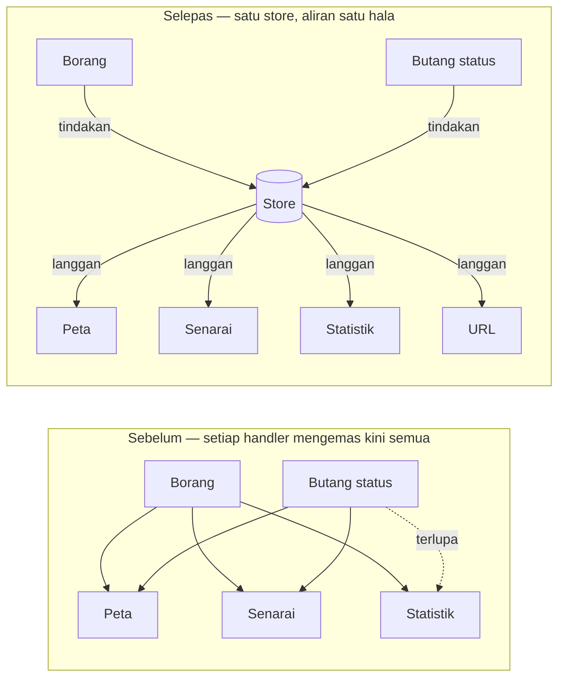
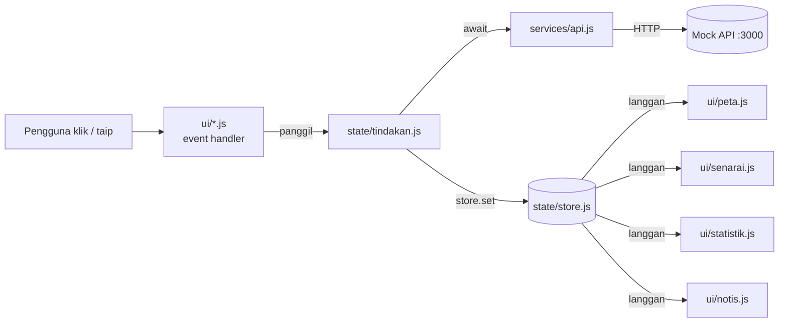
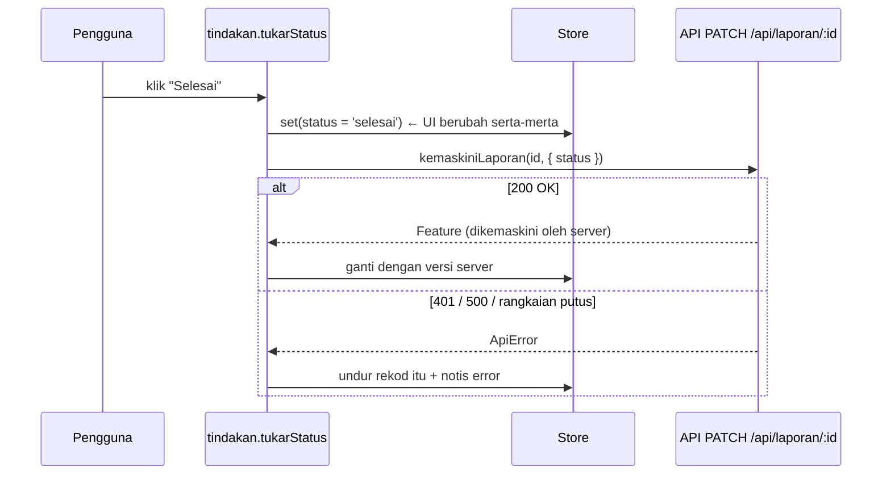
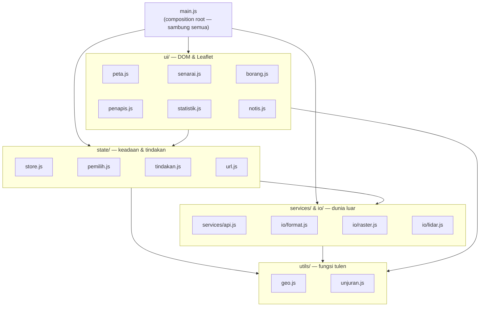
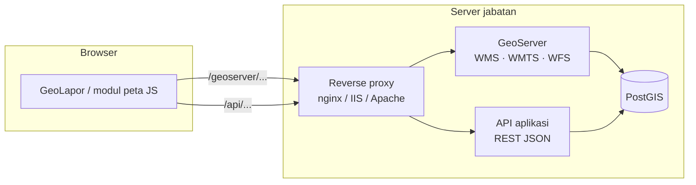

# Hari 5 — State Management & Modern Frontend Architecture

[← Jadual](../JADUAL.md) · [🧪 Lab Hari 5](./lab.md) · [📋 Rubrik Projek Akhir](../docs/rubrik-projek-akhir.md) · [← Hari 4](../hari-4/README.md)

> **Hari terakhir (5 jam, Jumaat).** Empat hari lepas kita menambah ciri pada GeoLapor satu demi satu: fungsi geo, service API, peta, borang, import/eksport fail. Hasilnya berfungsi — tetapi data laporan kini wujud di **beberapa tempat** (peta, senarai, statistik, borang) dan setiap modul saling memanggil. Hari ini kita **menyusun semula**: satu sumber kebenaran (*store*), layer yang jelas, prestasi peta yang munasabah — dan kemudian kita **membuktikan** kod itu dengan debugging, ujian ringkas dan demo.

---

## 🎯 Objektif Pembelajaran

Di akhir hari ini, peserta boleh:

| # | Objektif (boleh diukur) | Sesi |
|---|-------------------------|------|
| O1 | **Menerangkan** masalah "keadaan berselerak" dan **membina** store berpusat `ciptaStore(keadaanAwal)` dengan `dapat()`, `set()` dan `langgan()` yang lulus 5 ujian. | S1 |
| O2 | **Mengemas kini** keadaan secara *immutable* (spread, `map`, `toSorted`) dan **menulis** sekurang-kurangnya 2 *selector* untuk keadaan terbitan (laporan ditapis, ringkasan statistik). | S1 |
| O3 | **Menyegerakkan** peta, senarai, penapis dan URL (`URLSearchParams`) melalui aliran data satu hala — tukar penapis sekali, keempat-empat bahagian berubah. | S1 |
| O4 | **Melaksanakan** *optimistic update* untuk tukar status laporan dengan *rollback* apabila API gagal (`?gagal=1`), dan **menerangkan** bila corak ini tidak sesuai. | S1 |
| O5 | **Menyusun** GeoLapor kepada layer `ui/ · state/ · services/ · io/ · utils/` dan **melukis** arah dependency yang sah (UI → state → service → util, bukan sebaliknya). | S2 |
| O6 | **Menggunakan** sekurang-kurangnya 2 teknik prestasi peta (clustering, `turf.simplify`, pemuatan ikut `bbox`, debounce) dan **menerangkan** bagaimana memasukkan layer WMS/WFS GeoServer ke dalam aplikasi JS. | S2 |
| O7 | **Mengesan** pepijat menggunakan DevTools (breakpoint, Network, console) dan **menulis** ujian `node --test` untuk `utils/geo.js` dan `state/store.js`. | S3 |
| O8 | **Mendemokan** GeoLapor dalam 7 minit (6 demo + 1 soalan) mengikut rubrik dan **menerangkan** satu baris kod yang dipilih panel. | S3 |

---

## 📅 Jadual Hari Ini

| Masa | Sesi | Aktiviti (aturcara) | Objektif |
|------|------|---------------------|----------|
| 9.00 – 11.00 pagi | **S1** | State Management | O1–O4 |
| 11.00 – 12.30 tgh | **S2** | Modern Frontend Architecture | O5, O6 |
| 12.30 – 3.00 ptg | — | Makan tengah hari (& solat Jumaat) | — |
| 3.00 – 4.30 ptg | **S3** | Best Practices & Conclusion | O7, O8 |

> 💡 Aturcara tidak menyenaraikan rehat pagi. Jurulatih boleh memberi rehat ringkas 10 minit sekitar 10.00 pagi tanpa mengubah masa sesi rasmi.

---

## 🧭 Kenapa hari ini penting

Cuba ingat Hari 3 dan Hari 4. Selepas pengguna menghantar borang laporan baharu, kita perlu:

1. tambah marker pada peta,
2. tambah baris pada senarai,
3. kemas kini kiraan statistik,
4. kosongkan borang,
5. (Hari 4) kemas kini cache layer.

Setiap langkah itu ditulis dalam **handler borang**. Kemudian ciri "tukar status" ditambah — dan kita salin 3 langkah yang sama ke handler lain. Kemudian ciri "padam". Kemudian ciri "import KML". Lama-kelamaan salah satu terlupa, dan pengguna melihat **peta menunjukkan 41 laporan, senarai 40, statistik 39**. Pepijat jenis ini tidak memaparkan error merah di console — ia hanya **data yang tidak konsisten**, jenis pepijat yang paling sukar dikesan dan paling cepat menghilangkan kepercayaan pengguna.

Hari ini kita membalikkan aliran: **UI tidak lagi mengemas kini UI lain.** UI hanya (a) meminta perubahan dan (b) melukis semula apabila keadaan berubah.



Selepas makan tengah hari, fokus bertukar daripada **membina** kepada **membuktikan**: debugging bersistem, ujian pantas, senarai semak kualiti dan keselamatan, dan demo projek akhir.

---

## S1 · State Management (9.00 – 11.00 pagi)

> 📖 **Bacaan buku** — *JavaScript All-in-One For Dummies* (Minnick, 2023), pengayaan selepas sesi. Halaman PDF = muka surat cetak + 24.
>
> - **State vs props, reactivity** — B3 · Bab 3 (Building React Components), *Recognizing the Two Types of Data* — ms. 300–304 (**PDF 324–328**)
> - **Store pub/sub (`subscribe`, `set`, `update`)** — B5 · Bab 6 (Advanced Svelte Reactivity), *Constructing and Stocking the Store* — ms. 483–490 (**PDF 507–514**)
> - **Keadaan terbitan** — B4 · Bab 4 (Using Data and Reactivity), *Computing Properties* — ms. 405–408 (**PDF 429–432**)

### 1.1 Apa itu "state"?

**State (keadaan)** ialah semua data yang boleh berubah semasa aplikasi berjalan dan mempengaruhi apa yang dilihat pengguna.

| Jenis keadaan | Contoh GeoLapor | Di mana ia patut hidup |
|---------------|-----------------|------------------------|
| **Data server** (salinan) | senarai laporan, kategori, layer | store (di-sync dengan API) |
| **Keadaan UI** | laporan yang dipilih, sedang memuat, notis error | store |
| **Keadaan penapis/navigasi** | kategori, status, carian | store **+ URL** (boleh dikongsi/bookmark) |
| **Keadaan setempat komponen** | teks yang sedang ditaip, dropdown terbuka | dalam elemen DOM itu sendiri — tidak perlu store |
| **Keadaan terbitan** | laporan ditapis, kiraan ikut kategori | **tidak disimpan** — dikira oleh *selector* |

> 💡 **Soalan ujian mudah:** "Jika dua bahagian UI perlu tahu nilai ini, ia milik store. Jika hanya satu elemen yang peduli, biarkan di situ."

### 1.2 Satu sumber kebenaran (*single source of truth*)

Kita tentukan **bentuk keadaan** GeoLapor sekali, di satu tempat:

```js
// src/main.js (sebahagian) — bentuk keadaan awal GeoLapor
const keadaanAwal = {
  laporan: [],        // Feature[] — salinan daripada GET /api/laporan
  kategori: [],       // [{ kod, nama, warna }] — GET /api/kategori
  penapis: { kategori: '', status: '', q: '' },
  dipilihId: null,    // 'LPR-0001' | null
  lapisanAktif: ['sempadan-zon'],
  memuat: false,
  ralat: null,        // error message semasa muat (string) | null
  notis: null,        // { jenis: 'ralat' | 'berjaya', mesej } | null
};
```

Perhatikan apa yang **tiada**: `laporanDitapis`, `jumlahIkutKategori`, `bilanganDipapar`. Semua itu boleh **dikira** daripada `laporan` + `penapis`. Jika kita menyimpannya juga, kita kini ada **dua sumber** yang boleh bercanggah — masalah asal kembali.

### 1.3 Store pub/sub — 30 baris, tanpa pustaka

Corak **publish/subscribe**: store menyimpan keadaan; sesiapa yang berminat *melanggan* (subscribe); setiap kali keadaan berubah, store *menerbitkan* (publish) kepada semua pelanggan.

```js
// src/state/store.js — store berpusat pub/sub (tanpa pustaka)
/**
 * @template {object} T
 * @param {T} keadaanAwal
 */
export function ciptaStore(keadaanAwal) {
  let keadaan = { ...keadaanAwal };            // (1) salinan sendiri — pemanggil tidak boleh ubah dari luar
  const pelanggan = new Set();                 // (2) Set: tiada pendua, padam O(1)

  return {
    /** Keadaan semasa. Jangan ubah terus — guna set(). */
    dapat() {
      return keadaan;
    },

    /** Kemas kini keadaan (objek separa ATAU fungsi yang memulangkan objek separa). */
    set(kemaskiniAtauFungsi) {
      const tampalan =
        typeof kemaskiniAtauFungsi === 'function'
          ? kemaskiniAtauFungsi(keadaan)       // (3) bentuk fungsi: baca nilai TERKINI
          : kemaskiniAtauFungsi;
      if (!tampalan || typeof tampalan !== 'object') return;

      // (4) Tiada perubahan sebenar (semua nilai sama rujukan) → jangan maklumkan pelanggan
      const berubah = Object.keys(tampalan).some((k) => !Object.is(keadaan[k], tampalan[k]));
      if (!berubah) return;

      const lama = keadaan;
      keadaan = { ...keadaan, ...tampalan };   // (5) objek BAHARU (gabung cetek) — `lama` tidak diubah
      for (const fn of [...pelanggan]) fn(keadaan, lama); // (6) salinan Set: selamat jika pelanggan nyahlanggan semasa dipanggil
    },

    /** Daftar pelanggan. Memulangkan fungsi untuk berhenti melanggan. */
    langgan(fn) {
      pelanggan.add(fn);
      return () => pelanggan.delete(fn);       // (7) cleanup — elak kebocoran memori
    },
  };
}
```

| # | Keputusan reka bentuk | Kenapa |
|---|----------------------|--------|
| 1 | `{ ...keadaanAwal }` | Store memegang salinan sendiri; mengubah objek asal selepas itu tidak menyentuh store. |
| 3 | `set(fn)` | Dua kemas kini berturut-turut yang bergantung pada nilai semasa (cth kaunter, tambah ke array) mesti membaca keadaan **terkini**, bukan salinan lama yang ditangkap dalam closure. |
| 4 | Semak `Object.is` setiap key | `store.set({ memuat: false })` ketika ia sudah `false` tidak melukis semula seluruh UI. **Tetapi** ia juga bermakna mutasi (`push` pada array sama) dianggap "tiada perubahan" — lihat 1.4. |
| 5 | Gabung cetek `{ ...lama, ...tampalan }` | Kita hanya hantar medan yang berubah: `store.set({ memuat: true })`. Objek baharu setiap kali → `baru !== lama`. |
| 5 | Pelanggan terima `(baru, lama)` | Pelanggan boleh semak `baru.penapis === lama.penapis` dan **langkau kerja** jika medan yang diminati tidak berubah. Perbandingan rujukan (`===`) ini murah — dan hanya sah kerana kita *immutable*. |
| 6 | `[...pelanggan]` | Jika satu pelanggan memanggil `nyahlanggan()` (atau melanggan pelanggan baharu) semasa loop, loop tidak terganggu. |
| 7 | `langgan()` pulangkan `nyahlanggan` | Komponen yang dibuang mesti berhenti mendengar; jika tidak, ia terus melukis ke elemen yang sudah tiada. |

> 💡 **⭐ Mod ketat semasa pembangunan:** balut keadaan dengan `Object.freeze(...)` dalam `import.meta.env.DEV` supaya `store.dapat().memuat = true` melontar `TypeError` serta-merta. Ingat: `freeze` adalah **cetek** — `store.dapat().laporan.push()` masih berjaya.

```js
// Cuba dalam console (atau node --input-type=module)
const store = ciptaStore({ kiraan: 0 });
const nyahlanggan = store.langgan((baru, lama) => console.log(lama.kiraan, '→', baru.kiraan));
store.set({ kiraan: 1 });                       // 0 → 1
store.set((s) => ({ kiraan: s.kiraan + 1 }));   // 1 → 2
nyahlanggan();
store.set({ kiraan: 99 });                      // (senyap)
```

### 1.4 Kemas kini *immutable* — kenapa dan bagaimana

Store kita mengesan perubahan dengan `Object.is` (≈ `===`). Jika kita **mengubah** array sedia ada, rujukannya kekal sama — pelanggan fikir tiada apa berubah.

```js
// ❌ MUTASI — rujukan sama, pelanggan yang semak `baru.laporan !== lama.laporan` tidak nampak perubahan
const s = store.dapat();
s.laporan.push(laporanBaharu);            // mengubah array yang SAMA (tiada error — senyap)
store.set({ laporan: s.laporan });        // Object.is(lama.laporan, s.laporan) → true → pelanggan TIDAK dipanggil

// ✅ IMMUTABLE — cipta array/objek baharu
store.set((s) => ({ laporan: [...s.laporan, laporanBaharu] }));
```

| Operasi | ❌ Mutasi | ✅ Immutable |
|---------|----------|-------------|
| Tambah | `arr.push(x)` | `[...arr, x]` |
| Buang | `arr.splice(i, 1)` | `arr.filter((f) => f.id !== id)` atau `arr.toSpliced(i, 1)` (ES2023) |
| Ganti satu | `arr[i] = x` | `arr.map((f) => (f.id === id ? x : f))` atau `arr.with(i, x)` (ES2023) |
| Susun | `arr.sort(fn)` | `arr.toSorted(fn)` (ES2023) |
| Ubah medan bersarang | `f.properties.status = 'selesai'` | `{ ...f, properties: { ...f.properties, status: 'selesai' } }` |
| Salinan dalam penuh | — | `structuredClone(obj)` (mahal; guna jarang) |

> ⚠️ **Kesilapan lazim — `sort()` dalam selector.** `laporan.sort(...)` menyusun **array dalam store** di tempat. Guna `toSorted()`.

### 1.5 Keadaan terbitan & *selector*

**Selector** ialah fungsi tulen `(keadaan) => nilai`. Ia menjawab soalan tentang keadaan tanpa menyimpan jawapan.

```js
// src/state/pemilih.js — selector: kira keadaan terbitan daripada store
import { tapisLaporan, kiraIkut } from '../utils/geo.js';

/** Ingat hasil terakhir; kira semula hanya jika argumen (rujukan) berubah. */
export function memoAkhir(fn) {
  let argLama = null;
  let hasilLama;
  return (...arg) => {
    const sama = argLama !== null && arg.length === argLama.length && arg.every((a, i) => a === argLama[i]);
    if (!sama) {
      argLama = arg;
      hasilLama = fn(...arg);
    }
    return hasilLama;
  };
}

const tapisMemo = memoAkhir(tapisLaporan);

export const pilihLaporanDitapis = (s) => tapisMemo(s.laporan, s.penapis);

export const pilihLaporanDipilih = (s) =>
  s.laporan.find((f) => f.id === s.dipilihId) ?? null;

export const pilihRingkasan = (s) => {
  const ditapis = pilihLaporanDitapis(s);
  return {
    jumlah: s.laporan.length,
    dipapar: ditapis.length,
    ikutKategori: kiraIkut(ditapis, 'kategori'),
    ikutStatus: kiraIkut(ditapis, 'status'),
  };
};
```

- `tapisLaporan` dan `kiraIkut` ialah fungsi **Hari 1** (`utils/geo.js`) — digunakan semula tanpa perubahan. Inilah hasil menulis fungsi tulen sejak hari pertama.
- `memoAkhir` hanya berfungsi **kerana** kita immutable: jika `laporan` dan `penapis` rujukan yang sama, hasilnya pasti sama. Memilih laporan lain (`dipilihId`) tidak memaksa penapisan semula 40 (atau 40,000) rekod.

> 💡 Jangan memo semua benda. Mula tanpa memo; tambah hanya apabila profil (DevTools → Performance) menunjukkan selector itu mahal.

### 1.6 Aliran data satu hala: tindakan → store → pelanggan



**Tindakan (*action*)** ialah satu-satunya tempat yang (a) memanggil API dan (b) mengubah store. UI tidak memanggil `fetch` dan tidak memanggil `store.set` secara langsung untuk data server.

```js
// src/state/tindakan.js — tindakan: satu-satunya tempat yang memanggil API + mengubah store
const gantiLaporan = (senarai, id, fn) => senarai.map((f) => (f.id === id ? fn(f) : f));

/**
 * @param {ReturnType<import('./store.js').ciptaStore>} store
 * @param {typeof import('../services/api.js')} api  — disuntik supaya boleh diuji dengan API palsu
 */
export function ciptaTindakan(store, api) {
  return {
    async muatLaporan() {
      store.set({ memuat: true, ralat: null });
      try {
        const fc = await api.senaraiLaporan();
        store.set({ laporan: fc.features, memuat: false });
      } catch (ralat) {
        store.set({ memuat: false, ralat: ralat.message });
      }
    },

    pilih(id) {
      store.set({ dipilihId: id });
    },

    tukarPenapis(tampalan) {
      store.set((s) => ({ penapis: { ...s.penapis, ...tampalan } }));
    },

    // tukarStatus(id, statusBaru) — lihat 1.9
  };
}
```

> 💡 **Kenapa `api` disuntik (*dependency injection*) dan bukan di-`import`?** Supaya dalam ujian kita boleh hantar objek palsu `{ senaraiLaporan: async () => (...) }` — tiada server, tiada rangkaian, ujian berjalan dalam milisaat (S3).

### 1.7 Menyegerakkan peta + senarai + penapis

Setiap modul UI mengikut **kontrak yang sama**: `pasangX(elemen, { store, tindakan })` → pulangkan fungsi `cleanup`.

```js
// src/ui/senarai.js — senarai laporan (render dari store, tanpa innerHTML)
import { pilihLaporanDitapis } from '../state/pemilih.js';

export function pasangSenarai(ul, { store, tindakan }) {
  // Event delegation: satu listener untuk semua <li> (Hari 3)
  ul.addEventListener('click', (e) => {
    const li = e.target.closest('li[data-id]');
    if (li) tindakan.pilih(li.dataset.id);
  });

  let senaraiLama = null;
  function lukis(s) {
    const senarai = pilihLaporanDitapis(s);
    if (senarai !== senaraiLama) {                 // langkau jika hasil selector sama (memo)
      senaraiLama = senarai;
      ul.replaceChildren(
        ...senarai.map((f) => {
          const li = document.createElement('li');
          li.dataset.id = f.id;
          li.textContent = `${f.id} · ${f.properties.tajuk}`;  // textContent — selamat XSS
          li.className = `status-${f.properties.status}`;
          return li;
        }),
      );
    }
    for (const li of ul.children) li.classList.toggle('dipilih', li.dataset.id === s.dipilihId);
  }

  lukis(store.dapat());                 // lukisan pertama
  return store.langgan(lukis);          // pulangkan nyahlanggan sebagai cleanup
}
```

```js
// src/ui/peta.js (sebahagian) — layer laporan dilukis semula bila senarai ditapis berubah
import L from 'leaflet';
import { pilihLaporanDitapis, pilihLaporanDipilih } from '../state/pemilih.js';

export function pasangLapisanLaporan(peta, { store, tindakan }) {
  const lapisan = L.geoJSON(null, {
    // GeoJSON [lng, lat] → Leaflet L.latLng(lat, lng): L.geoJSON menukar untuk kita
    onEachFeature: (f, layer) => layer.on('click', () => tindakan.pilih(f.id)),
  }).addTo(peta);

  const lukis = (baru, lama) => {
    const ditapis = pilihLaporanDitapis(baru);
    if (!lama || ditapis !== pilihLaporanDitapis(lama)) {
      lapisan.clearLayers().addData(ditapis);
    }
    if (!lama || baru.dipilihId !== lama.dipilihId) {
      const f = pilihLaporanDipilih(baru);
      if (f) {
        const [lng, lat] = f.geometry.coordinates;   // ⚠️ GeoJSON: lng dahulu
        peta.flyTo([lat, lng], 16);                  // ⚠️ Leaflet: lat dahulu
      }
    }
  };
  lukis(store.dapat(), null);
  return store.langgan(lukis);
}
```

```js
// src/ui/penapis.js — borang penapis HANYA memanggil tindakan; ia tidak menyentuh peta/senarai
export function pasangPenapis(borang, { store, tindakan }) {
  borang.addEventListener('input', (e) => {
    const { name, value } = e.target;               // name="kategori" | "status" | "q"
    if (name) tindakan.tukarPenapis({ [name]: value });
  });
  // Selaraskan nilai kawalan borang dengan store (cth selepas Back/URL)
  const lukis = ({ penapis }) => {
    for (const [k, v] of Object.entries(penapis)) {
      const el = borang.elements.namedItem(k);
      if (el && el.value !== v) el.value = v;
    }
  };
  lukis(store.dapat());
  return store.langgan(lukis);
}
```

Tukar dropdown kategori → `tindakan.tukarPenapis` → `store.set` → **senarai, peta dan statistik** dilukis semula secara automatik. Tiada modul UI tahu modul UI lain wujud.

### 1.8 Keadaan dalam URL (`URLSearchParams`)

Pegawai A menapis "alam-sekitar, dalam-tindakan" dan mahu menghantar pautan kepada ketua unit. Jika penapis hanya dalam memori, pautan itu membuka peta kosong. Letak penapis dalam **query string**:

```js
// src/state/url.js — penapis <-> query string (?kategori=tanah&q=lampu)
const MEDAN_PENAPIS = ['kategori', 'status', 'q'];

export function penapisDariUrl(search) {
  const p = new URLSearchParams(search);
  return Object.fromEntries(MEDAN_PENAPIS.map((k) => [k, p.get(k) ?? '']));
}

export function queryDariPenapis(penapis) {
  const p = new URLSearchParams();
  for (const k of MEDAN_PENAPIS) if (penapis[k]) p.set(k, penapis[k]);  // abaikan nilai kosong
  const qs = p.toString();                  // pengekodan (ruang → +, & → %26) diurus untuk kita
  return qs ? `?${qs}` : '';
}

/** Browser sahaja: tulis penapis ke URL setiap kali ia berubah, baca semula bila Back/Forward. */
export function segerakUrl(store) {
  store.set({ penapis: penapisDariUrl(location.search) });   // URL menang semasa mula
  const nyahlanggan = store.langgan((baru, lama) => {
    if (baru.penapis === lama.penapis) return;               // bukan perubahan penapis
    const url = `${location.pathname}${queryDariPenapis(baru.penapis)}${location.hash}`;
    history.replaceState(null, '', url);                     // tiada reload, tiada entri sejarah baharu
  });
  const bilaPopstate = () => store.set({ penapis: penapisDariUrl(location.search) });
  window.addEventListener('popstate', bilaPopstate);
  return () => {
    nyahlanggan();
    window.removeEventListener('popstate', bilaPopstate);
  };
}
```

| Method | Kesan | Guna untuk |
|--------|-------|-----------|
| `history.replaceState` | Ganti URL semasa | Carian yang ditaip (elak 12 entri sejarah untuk "l-a-m-p-u") |
| `history.pushState` | Tambah entri sejarah; butang Back kembali ke penapis sebelum | Tukar kategori/status secara diskret (⭐ cabaran lab) |
| `popstate` | Dicetuskan oleh Back/Forward (bukan oleh `pushState`/`replaceState`) | Baca semula URL → `store.set` |

> ⚠️ **Kesilapan lazim — membina query dengan template literal.** `` `?q=${q}` `` rosak apabila `q` mengandungi `&` atau `#` ("Jalan 2 & 3"). `URLSearchParams` mengekod dengan betul.

### 1.9 *Optimistic update* dengan *rollback*

Pegawai menukar status laporan kepada "selesai". Pilihan:

- **Pesimistik:** tunggu server (200–800 ms di rangkaian kerajaan yang sibuk) → baru kemas kini UI. Selamat, tetapi terasa lambat.
- **Optimistik:** kemas kini UI **serta-merta**, hantar ke server, dan **undur** jika gagal.



```js
// src/state/tindakan.js (sambungan) — dalam objek yang dipulangkan ciptaTindakan()
    /** Optimistic update: ubah UI dahulu, sahkan dengan server, undur jika gagal. */
    async tukarStatus(id, statusBaru) {
      const asal = store.dapat().laporan.find((f) => f.id === id);
      if (!asal) return;

      // 1. Optimistik — pengguna nampak perubahan serta-merta
      store.set((s) => ({
        laporan: gantiLaporan(s.laporan, id, (f) => ({
          ...f,
          properties: { ...f.properties, status: statusBaru },
        })),
      }));

      try {
        // 2. Sahkan — server ialah sumber kebenaran muktamad
        const dariPelayan = await api.kemaskiniLaporan(id, { status: statusBaru });
        store.set((s) => ({ laporan: gantiLaporan(s.laporan, id, () => dariPelayan) }));
      } catch (ralat) {
        // 3. Rollback — undur HANYA rekod ini (bukan seluruh senarai)
        store.set((s) => ({
          laporan: gantiLaporan(s.laporan, id, () => asal),
          notis: { jenis: 'ralat', mesej: `Status ${id} tidak disimpan: ${ralat.message}` },
        }));
      }
    },
```

Tiga butiran yang membezakan pelaksanaan matang:

1. **Rollback sasaran.** Simpan `asal` (satu rekod), bukan `sebelum = store.dapat().laporan` (seluruh senarai). Jika pengguna menukar dua status serentak dan yang pertama gagal, rollback seluruh senarai akan **memadam** kejayaan yang kedua.
2. **Ganti dengan versi server** selepas berjaya — server mengisi `dikemaskini` dan mungkin menormalkan data.
3. **Beritahu pengguna** (`notis`) — rollback senyap lebih teruk daripada tiada optimistik.

| Sesuai untuk optimistik | Tidak sesuai |
|-------------------------|--------------|
| Tukar status, tanda kegemaran, susun semula | **Cipta** rekod (ID dijana server: `LPR-{0000}`) — guna ID sementara atau pesimistik |
| Kadar kejayaan tinggi, mudah diundur | Operasi kewangan / tidak boleh diundur / ada kesan sampingan (hantar e-mel) |
| Validasi sudah dibuat di klien | Validasi hanya di server (422 kerap) |

> 🧪 **Uji di bilik latihan:** `?gagal=1` pada mock API memaksa 500 — tanpa key `X-API-Key` pula anda dapat 401. Kedua-duanya mesti menyebabkan rollback + notis.

### 1.10 Bagaimana pustaka popular melakukan perkara yang sama

Store 30 baris kita mengandungi idea teras semua pustaka state moden. Apabila anda bertemu mereka dalam projek lain, cari tiga perkara: **di mana keadaan disimpan, bagaimana ia dikemas kini, bagaimana UI dimaklumkan.**

| Pustaka | Ekosistem | Kemas kini | Dimaklumkan melalui | Ciri tambahan |
|---------|-----------|-----------|---------------------|---------------|
| **Store kita** | Vanilla | `set(tampalan \| fn)` | `langgan(fn)` | — |
| **Redux Toolkit** | Umumnya React | `dispatch(action)` → *reducer* tulen (Immer membenarkan sintaks "mutasi") | `useSelector` | DevTools *time-travel*, middleware, RTK Query |
| **Zustand** | React (juga vanilla) | `set(partial \| fn)` — **hampir sama dengan kita** | hook / `subscribe` | Sangat kecil, middleware `persist` |
| **Pinia** | Vue | ubah `state` terus dalam *actions* (reaktiviti Vue mengesan) | reaktiviti automatik | *getters* = selector, DevTools Vue |
| **Signals** (Preact Signals, SolidJS, Angular; cadangan TC39) | Pelbagai | `nilai.value = x` | Dependency tracking automatik — hanya bahagian yang membaca isyarat itu dilukis semula | `computed()` = selector dengan memo automatik |

```js
// Zustand (vanilla) — bandingkan dengan ciptaStore kita
import { createStore } from 'zustand/vanilla';
const store = createStore(() => ({ penapis: { kategori: '' } }));
store.setState((s) => ({ penapis: { ...s.penapis, kategori: 'tanah' } }));
store.subscribe((baru, lama) => console.log(baru.penapis));

// Signals (@preact/signals-core)
import { signal, computed, effect } from '@preact/signals-core';
const penapis = signal({ kategori: '' });
const laporan = signal([]);
const ditapis = computed(() => tapisLaporan(laporan.value, penapis.value)); // memo automatik
effect(() => console.log(ditapis.value.length));                          // "langgan" automatik
penapis.value = { ...penapis.value, kategori: 'tanah' };
```

> 💡 **Nasihat untuk projek PGN:** jika aplikasi anda satu halaman peta dengan 3–6 panel, store vanilla seperti ini **mencukupi** dan tiada dependency untuk diselenggara. Beralih ke pustaka apabila anda sudah memilih framework (React → Zustand/Redux Toolkit; Vue → Pinia).

📘 Nota mendalam: [`nota/13-state-dan-arkitektur.md`](../nota/13-state-dan-arkitektur.md) · 🧪 [Lab 5.1](./lab.md#lab-51--store-berpusat-selector-url--optimistic-update-s1)

---

## S2 · Modern Frontend Architecture (11.00 tgh – 12.30 tgh)

> 📖 **Bacaan buku** — *JavaScript All-in-One For Dummies* (Minnick, 2023), pengayaan selepas sesi. Halaman PDF = muka surat cetak + 24.
>
> - **Komponen & komposisi** — B3 · Bab 3 (Building React Components), *Thinking in Components; Composing Components* — ms. 298–300, 321–325 (**PDF 322–324, 345–349**)
> - **React, Vue, Svelte — perbandingan** — B3 · Bab 1; B4 · Bab 1; B5 · Bab 1, *Distilling "Thinking in React" (B3); Comparing Vue to React (B4); What Makes Svelte Different? (B5)* — ms. 264–271, 343–344, 423–425 (**PDF 288–295, 367–368, 447–449**)
> - **Node.js secara ringkas** — B7 · Bab 1 (Node.js Fundamentals), *Learning What Makes Node.js Tick; Recognizing What Node.js Is Good For* — ms. 560–562, 566–567 (**PDF 584–586, 590–591**)

### 2.1 Layer dan arah dependency



**Peraturan dependency** (anak panah = "boleh `import`"):

| Layer | Boleh import | **Tidak boleh** import | Boleh diuji dengan `node --test`? |
|---------|--------------|------------------------|----------------------------------|
| `utils/` | (tiada — atau pustaka tulen seperti proj4, Turf) | apa-apa lain dalam `src/`, `document`, `L` | ✅ mudah |
| `services/`, `io/` | `utils/`, pustaka I/O | `state/`, `ui/`, `document` | ✅ dengan `fetch` palsu |
| `state/` | `utils/`; `services/` **melalui suntikan** | `ui/`, `document`, `L` | ✅ (lihat S3) |
| `ui/` | `state/` (selector), `utils/`, Leaflet, DOM | `services/` terus (guna tindakan) | ⚠️ perlu browser/jsdom |
| `main.js` | semua | — | — |

Kenapa arah itu penting:

- **Ganti UI tanpa sentuh logik.** Esok PGN mahu versi OpenLayers? Hanya `ui/peta.js` berubah.
- **Ganti backend tanpa sentuh UI.** Mock API → API sebenar → GeoServer WFS: hanya `services/`.
- **Uji tanpa browser.** Semakin banyak logik di layer bawah, semakin banyak yang boleh diuji dalam milisaat.

> 💡 Semak pantas pelanggaran: `grep -rn "from '../ui" src/state src/services src/utils` — mesti **kosong**.

### 2.2 Struktur folder GeoLapor (akhir)

```text
projek/geolapor-mula/
├── index.html
├── package.json            "type": "module" · scripts: dev, build, preview, lint, format, test
├── eslint.config.js
├── .env.example            VITE_API_URL=http://localhost:3000
└── src/
    ├── main.js             composition root: cipta store, tindakan, pasang UI
    ├── style.css
    ├── services/
    │   └── api.js          ApiError, mintaJson, senaraiLaporan, … dapatkanStatistik
    ├── state/
    │   ├── store.js        ciptaStore
    │   ├── pemilih.js      selector (+ memoAkhir)
    │   ├── tindakan.js     ciptaTindakan(store, api)
    │   └── url.js          penapis ↔ URLSearchParams
    ├── io/
    │   ├── format.js       bacaFail, eksportGeoJSON, eksportKML, eksportShapefile
    │   ├── raster.js       bacaGeoTIFF
    │   └── lidar.js        bacaLAS
    ├── utils/
    │   ├── geo.js          formatKoordinat, jarakKm, tapisLaporan, kiraIkut, bboxDari, dalamMalaysia
    │   ├── unjuran.js      RSO_PROJ, keWgs84
    │   └── masa.js         debounce
    └── ui/
        ├── peta.js  senarai.js  borang.js  penapis.js  statistik.js  notis.js
tests/                      *.test.js — node --test (utils/ & state/ sahaja, tanpa DOM)
```

> ⚠️ **Nama fail & fungsi ikut struktur di atas.** Jika anda menamakan semula `senaraiLaporan` kepada `getReports`, rubrik "kualiti kod" tidak menolak markah — tetapi rakan sepasukan (dan jurulatih) akan tersesat. Konsistensi mengatasi citarasa.

### 2.3 Komponen sebagai fungsi

Framework memberi kita "komponen". Dalam vanilla JS, **fungsi pemasang** sudah cukup:

```js
/**
 * Kontrak komponen GeoLapor:
 *   pasangX(elemenAkar, { store, tindakan, ...pilihan }) → cleanup()
 * - Menerima elemen (bukan mencari dengan querySelector global) → boleh dipasang dua kali
 * - Membaca keadaan melalui selector, menulis melalui tindakan
 * - Memulangkan cleanup (nyahlanggan + buang listener)
 */
```

```js
// src/ui/notis.js — komponen kecil lengkap
export function pasangNotis(kotak, { store }) {
  let pemasa;
  const lukis = (baru, lama) => {
    if (lama && baru.notis === lama.notis) return;
    clearTimeout(pemasa);
    kotak.hidden = !baru.notis;
    if (!baru.notis) return;
    kotak.textContent = baru.notis.mesej;           // textContent — error message mungkin mengandungi input pengguna
    kotak.dataset.jenis = baru.notis.jenis;          // CSS: [data-jenis="ralat"] { … }
    kotak.setAttribute('role', baru.notis.jenis === 'ralat' ? 'alert' : 'status');
    pemasa = setTimeout(() => store.set({ notis: null }), 5000);
  };
  lukis(store.dapat(), null);
  const nyahlanggan = store.langgan(lukis);
  return () => {
    clearTimeout(pemasa);
    nyahlanggan();
  };
}
```

### 2.4 `main.js` — *composition root*

```js
// src/main.js — satu-satunya fail yang tahu SEMUA bahagian
import 'leaflet/dist/leaflet.css';
import './style.css';
import * as api from './services/api.js';
import { ciptaStore } from './state/store.js';
import { ciptaTindakan } from './state/tindakan.js';
import { segerakUrl } from './state/url.js';
import { ciptaPeta, pasangLapisanLaporan } from './ui/peta.js';
import { pasangSenarai } from './ui/senarai.js';
import { pasangPenapis } from './ui/penapis.js';
import { pasangStatistik } from './ui/statistik.js';
import { pasangNotis } from './ui/notis.js';

const store = ciptaStore({
  laporan: [], kategori: [], penapis: { kategori: '', status: '', q: '' },
  dipilihId: null, lapisanAktif: ['sempadan-zon'], memuat: false, ralat: null, notis: null,
});
const tindakan = ciptaTindakan(store, api);
const deps = { store, tindakan };

const peta = ciptaPeta(document.getElementById('peta'));
pasangLapisanLaporan(peta, deps);
pasangSenarai(document.getElementById('senarai'), deps);
pasangPenapis(document.getElementById('penapis'), deps);
pasangStatistik(document.getElementById('statistik'), deps);
pasangNotis(document.getElementById('notis'), deps);
segerakUrl(store);

tindakan.muatLaporan();

if (import.meta.env.DEV) window.__geolapor = { store, tindakan }; // bantuan debugging (dev sahaja)
```

> 💡 `window.__geolapor.store.dapat()` dalam console DevTools = "Redux DevTools versi miskin". Ia hanya wujud dalam `npm run dev` — Vite membuang cabang `import.meta.env.DEV` semasa `build`.

### 2.5 Prestasi aplikasi peta

GeoLapor ada ≈40 laporan. Sistem sebenar PGN mungkin ada 40,000 titik atau poligon sempadan dengan 200,000 bucu. Empat teknik, ikut masalah:

| Gejala | Punca | Teknik | Pustaka |
|--------|-------|--------|---------|
| Peta tersekat bila zum keluar; ribuan marker bertindih | Satu elemen DOM per marker | **Clustering** | `leaflet.markercluster` (Leaflet) · `cluster` source (MapLibre) · `supercluster` |
| Poligon sempadan lambat dilukis, fail besar | Terlalu banyak bucu untuk skala paparan | **Simplify** | `turf.simplify` · (server) `ogr2ogr -simplify` · mapshaper |
| Muat semua 40,000 rekod pada permulaan | Mengambil data di luar skrin | **Muat ikut `bbox`** | `?bbox=minLng,minLat,maxLng,maxLat` (mock API menyokong) |
| Request bertubi-tubi semasa pan/taip | Setiap event mencetuskan fetch | **Debounce** + `AbortController` | fungsi 6 baris (di bawah) |

**a) Clustering — Leaflet.markercluster**

```bash
npm install leaflet.markercluster
```

```js
// src/ui/peta.js — kelompok marker
import L from 'leaflet';                 // MESTI sebelum markercluster (ia menampal global L)
import 'leaflet.markercluster';
import 'leaflet.markercluster/dist/MarkerCluster.css';
import 'leaflet.markercluster/dist/MarkerCluster.Default.css';

const kelompok = L.markerClusterGroup({ disableClusteringAtZoom: 17 });
const lapisan = L.geoJSON(null, { onEachFeature: (f, layer) => layer.bindTooltip(f.id) });
kelompok.addTo(peta);

function lukisLaporan(features) {
  lapisan.clearLayers().addData(features);
  kelompok.clearLayers().addLayer(lapisan);   // markercluster menerima LayerGroup/GeoJSON
}
```

**b) Simplify — Turf**

```js
import { simplify } from '@turf/turf';

// tolerance dalam DARJAH (unit koordinat) — 0.001° ≈ 110 m di khatulistiwa
const zonRingkas = simplify(zonGeoJSON, { tolerance: 0.001, highQuality: false, mutate: false });
// Contoh sintetik: poligon 181 bucu → 20 bucu; luas 15.59 km² → 15.19 km² (≈2.6% beza)
```

> ⚠️ Simplify untuk **paparan** sahaja. Jangan kira luas rasmi, semak persempadanan atau eksport daripada geometri yang telah diringkaskan. Simpan geometri asal dalam store; ringkaskan di layer UI.

**c) Muat ikut `bbox` + debounce + batal request lama**

```js
// src/utils/masa.js
export function debounce(fn, ms = 300) {
  let pemasa;
  return (...arg) => {
    clearTimeout(pemasa);
    pemasa = setTimeout(() => fn(...arg), ms);
  };
}
```

```js
// src/ui/peta.js — ambil hanya laporan dalam paparan
import { senaraiLaporan } from '../services/api.js'; // ⭐ dalam aplikasi penuh: pindahkan ke tindakan.muatDalamBbox()
import { debounce } from '../utils/masa.js';

let pengawal = null;
const muatDalamPaparan = debounce(async () => {
  pengawal?.abort();                               // batal request sebelum yang belum selesai
  pengawal = new AbortController();
  const b = peta.getBounds();
  // ⚠️ susunan bbox: minLng,minLat,maxLng,maxLat (Barat, Selatan, Timur, Utara)
  const bbox = [b.getWest(), b.getSouth(), b.getEast(), b.getNorth()].map((n) => Number(n.toFixed(5)));
  try {
    const fc = await senaraiLaporan({ bbox }, { signal: pengawal.signal }); // api.js menyambung array → "101.6,2.9,101.7,3.0"
    lukisLaporan(fc.features);
  } catch (ralat) {
    if (ralat.name !== 'AbortError') console.error(ralat);   // abort bukan error sebenar
  }
}, 300);

peta.on('moveend', muatDalamPaparan);
```

> 💡 `mintaJson` (Hari 2) melontar semula `AbortError` asal apabila **pemanggil** membatalkan, tetapi menukar *timeout* kepada `ApiError` dengan `status: 0`. Jadi semakan `ralat.name !== 'AbortError'` mengabaikan pembatalan sahaja — timeout tetap dilaporkan.

### 2.6 React, Vue, Svelte — ciri yang sama, tiga sintaks

Ciri: dropdown kategori + teks "*N laporan dipapar*". Perhatikan bahawa **idea** sama dengan S1: keadaan → terbitan → paparan; event → kemas kini keadaan.

```jsx
// React 19 (JSX)
import { useState, useMemo } from 'react';
import { tapisLaporan } from './utils/geo.js';

export function PenapisKategori({ laporan }) {
  const [kategori, setKategori] = useState('');
  const ditapis = useMemo(() => tapisLaporan(laporan, { kategori }), [laporan, kategori]);
  return (
    <>
      <select value={kategori} onChange={(e) => setKategori(e.target.value)}>
        <option value="">Semua</option>
        <option value="tanah">Tanah</option>
      </select>
      <p>{ditapis.length} laporan dipapar</p>
    </>
  );
}
```

```vue
<!-- Vue 3 (Single File Component, <script setup>) -->
<script setup>
import { ref, computed } from 'vue';
import { tapisLaporan } from './utils/geo.js';
const props = defineProps({ laporan: Array });
const kategori = ref('');
const ditapis = computed(() => tapisLaporan(props.laporan, { kategori: kategori.value }));
</script>
<template>
  <select v-model="kategori"><option value="">Semua</option><option value="tanah">Tanah</option></select>
  <p>{{ ditapis.length }} laporan dipapar</p>
</template>
```

```svelte
<!-- Svelte 5 (runes) -->
<script>
  import { tapisLaporan } from './utils/geo.js';
  let { laporan } = $props();
  let kategori = $state('');
  let ditapis = $derived(tapisLaporan(laporan, { kategori }));
</script>
<select bind:value={kategori}><option value="">Semua</option><option value="tanah">Tanah</option></select>
<p>{ditapis.length} laporan dipapar</p>
```

| | Vanilla (GeoLapor) | React | Vue | Svelte |
|--|-------------------|-------|-----|--------|
| Keadaan | `store` | `useState` | `ref` | `$state` |
| Terbitan | selector + memo | `useMemo` | `computed` | `$derived` |
| Lukis semula | `langgan` → kod DOM manual | render semula komponen (Virtual DOM) | reaktiviti halus | dikompil kepada kemas kini DOM tepat |
| Build diperlukan | Tidak (atau Vite) | Ya (JSX) | Ya untuk SFC | Ya (pengkompil) |
| Integrasi Leaflet | terus | `react-leaflet` atau `useEffect` | `vue-leaflet` atau `onMounted` | `onMount` / action |

> 💡 **Perhatikan baris `import { tapisLaporan } from './utils/geo.js'` dalam ketiga-tiga contoh.** Layer `utils/` dan `services/` anda boleh dibawa ke mana-mana framework tanpa perubahan. Inilah pulangan pelaburan seni bina berlapis.

**Bila perlu framework?** Apabila UI anda mempunyai banyak skrin, borang kompleks, dan pasukan > 2 orang. Untuk satu halaman peta yang ditanam dalam sistem sedia ada, vanilla + Vite selalunya lebih ringan dan lebih tahan lama.

### 2.7 Node.js & backend — secara ringkas

Anda sudah menggunakan Node.js sepanjang minggu tanpa menyedarinya:

| Anda guna | Itu ialah Node.js yang… |
|-----------|-------------------------|
| `node projek/api/server.mjs` | menjalankan server HTTP (modul `node:http`, tanpa dependency) |
| `npm install`, `npm run dev` | mengurus pakej & menjalankan Vite |
| `node --test` (S3) | menjalankan ujian |

JavaScript yang sama (sintaks, `async/await`, `fetch`, modul ES) berjalan di server. Bezanya: tiada `document`/`window`, tetapi ada akses fail (`node:fs`), rangkaian dan proses.

Corak backend yang relevan untuk sistem peta PGN:

- **API REST** — Express, Fastify, atau `node:http` terus (seperti mock API kita).
- **BFF / proxy (*Backend for Frontend*)** — server kecil yang menyimpan API key/token sebenar, memanggil GeoServer/perkhidmatan dalaman, dan hanya mendedahkan apa yang frontend perlu. Inilah jawapan kepada "**di mana letak API key sebenar?**" — **bukan** dalam kod frontend.
- **Pemprosesan data** — skrip Node menukar format (cth `shpjs` di server), menjana tile, atau memanggil GDAL (`child_process`).
- **Pangkalan data ruang** — PostgreSQL + **PostGIS** (pertanyaan `ST_Intersects`, `ST_DWithin`) dicapai melalui pustaka `pg`.

### 2.8 Menyesuaikan pemetaan JS ke dalam sistem PGN sedia ada

Sistem sedia ada biasanya sudah mempunyai **GeoServer** (atau ArcGIS Server), pangkalan data ruang, dan aplikasi web (PHP/Java/.NET). JavaScript masuk sebagai layer paparan:



**a) Layer WMS (imej siap dilukis server)** — sesuai untuk layer besar yang hanya perlu dilihat.

```js
// Host contoh sahaja — ganti dengan GeoServer dalaman jabatan anda
const sempadanWms = L.tileLayer.wms('https://geoserver.contoh.test/geoserver/pgn/wms', {
  layers: 'pgn:sempadan_zon',      // workspace:layer
  format: 'image/png',
  transparent: true,
  version: '1.3.0',
  attribution: 'Data sintetik latihan',
});
L.control.layers(null, { 'Sempadan (WMS)': sempadanWms }).addTo(peta);
```

**b) Layer WFS (data vektor sebenar)** — sesuai apabila anda perlu klik, tapis, atau analisis dengan Turf.

```js
const params = new URLSearchParams({
  service: 'WFS', version: '2.0.0', request: 'GetFeature',
  typeNames: 'pgn:kemudahan',
  outputFormat: 'application/json',   // GeoServer memulangkan GeoJSON
  srsName: 'EPSG:4326',
  bbox: `${bbox},EPSG:4326`,          // hadkan kepada paparan (lihat 2.5c)
  count: '1000',                      // WFS 2.0 — elak memuat sejuta rekod
});
const fc = await mintaJson(`https://geoserver.contoh.test/geoserver/wfs?${params}`);
```

> ⚠️ **Susunan paksi EPSG:4326 dalam OGC.** Takrif rasmi EPSG:4326 ialah **lat, lng**, dan WMS 1.3.0 / WFS 2.0 yang menggunakan bentuk URN (`urn:ogc:def:crs:EPSG::4326`) mematuhinya. GeoServer menganggap bentuk ringkas `EPSG:4326` sebagai **lng, lat** (seperti GeoJSON dan WMS 1.1.1). Server lain mungkin berbeza. Jika titik atau kotak anda muncul di Lautan Hindi, ini puncanya — uji dahulu dengan satu titik yang anda tahu lokasinya. Nota penuh: [`nota/08-web-mapping-leaflet.md`](../nota/08-web-mapping-leaflet.md).

**c) Menanam (*embedding*) ke dalam aplikasi sedia ada**

| Cara | Bila | Catatan |
|------|------|---------|
| `<iframe src="/geolapor/">` | Aplikasi lama sukar diubah; mahu pengasingan penuh | Mudah; komunikasi melalui `postMessage`; saiz/gaya terhad |
| Modul dipasang pada `<div>` | Anda boleh tambah `<script type="module">` pada halaman sedia ada | Eksport `pasangGeoLapor(elemen, { apiUrl })` dari build Vite (*library mode*) |
| Web Component `<geo-lapor>` | Banyak sistem berbeza (PHP, Java, .NET) mahu guna semula | Pengasingan gaya (Shadow DOM); API melalui atribut |

**d) Pengesahan (*auth*) ke API & GeoServer**

- **Sesi kuki yang sama domain** — paling mudah jika peta dihidang dari domain sama dengan sistem sedia ada (proxy membantu).
- **Token Bearer (JWT/OIDC)** — sistem SSO jabatan memberi token; ubah `mintaJson` supaya menambah `Authorization: Bearer …`. Simpan token dalam memori, bukan `localStorage` (risiko XSS — Hari 4).
- **API key** (seperti `X-API-Key: latihan-pgn-2026`) — **hanya untuk latihan**. Apa-apa rahsia dalam JavaScript frontend boleh dibaca sesiapa melalui DevTools. Key sebenar duduk di BFF/proxy.

**e) CORS dan proxy**

Browser menyekat `fetch` merentas asal (*origin*) melainkan server membalas dengan `Access-Control-Allow-Origin`. Pilihan, ikut keutamaan:

1. **Hidang dari asal yang sama** melalui reverse proxy (`/geoserver/` dan `/api/` di bawah domain aplikasi) — tiada CORS langsung.
2. **Semasa pembangunan** — `server.proxy` dalam `vite.config.js` (Hari 4).
3. **Aktifkan CORS di GeoServer** (filter CORS dalam `web.xml`) — senaraikan asal tertentu, **jangan** `*` untuk data dalaman.

> ⚠️ **CORS bukan keselamatan.** Ia melindungi *pengguna browser* daripada laman jahat — bukan melindungi server anda. `curl` tidak peduli CORS. Kawalan akses sebenar ialah pengesahan di server.

📘 Nota mendalam: [`nota/13-state-dan-arkitektur.md`](../nota/13-state-dan-arkitektur.md) · [`nota/08-web-mapping-leaflet.md`](../nota/08-web-mapping-leaflet.md) · [`nota/10-analisis-ruang-turf.md`](../nota/10-analisis-ruang-turf.md) · 🧪 [Lab 5.2](./lab.md#lab-52--susun-layer--prestasi-peta-s2)

---

## 12.30 – 3.00 ptg · Makan tengah hari & solat Jumaat

> 💡 Sebelum keluar: pastikan kod anda **disimpan dan berjalan** (`npm run dev`). Jika anda menggunakan Git: `git add -A && git commit -m "Hari 5: store + seni bina"`. Demo bermula sejurus selepas S3 dibuka.

---

## S3 · Best Practices & Conclusion (3.00 – 4.30 ptg)

> 📖 **Bacaan buku** — *JavaScript All-in-One For Dummies* (Minnick, 2023), pengayaan selepas sesi. Halaman PDF = muka surat cetak + 24.
>
> - **Debugging (breakpoint, watch)** — B6 · Bab 3 (Testing Your JavaScript), *Debugging in Chrome* — ms. 542–547 (**PDF 566–571**)
> - **Ujian unit** — B6 · Bab 3 (Testing Your JavaScript), *Unit Testing* — ms. 547–553 (**PDF 571–577**)
> - **Objek `Error`, `try…catch`, handler** — B7 · Bab 7 (Error Handling and Debugging), *Understanding Node.js's Error Object; Handling Exceptions* — ms. 653–660 (**PDF 677–684**)

### 3.1 Debugging bersistem

Debugging bukan meneka. Ikut kitaran: **hasilkan semula → sempitkan → hipotesis → sahkan → baiki → uji.**

**Method `console` yang jarang digunakan (tetapi sangat berguna):**

| Method | Guna | Contoh GeoLapor |
|--------|------|-----------------|
| `console.table(arr)` | Array objek sebagai jadual | `console.table(store.dapat().laporan.map((f) => f.properties))` |
| `console.group(label)` / `groupEnd()` | Kumpul log berkaitan | log setiap `store.set` dengan keadaan lama/baru |
| `console.time(l)` / `timeEnd(l)` | Ukur tempoh | `console.time('tapis'); pilihLaporanDitapis(s); console.timeEnd('tapis')` |
| `console.assert(syarat, mesej)` | Log hanya jika syarat palsu | `console.assert(dalamMalaysia(f.geometry.coordinates), 'Koordinat terbalik?', f.id)` |
| `console.trace()` | Siapa yang memanggil fungsi ini? | dalam `store.set` — cari siapa mengubah `penapis` |
| `console.dir(obj)` | Objek sebagai pokok property | `console.dir(peta)` — lihat property dalaman Leaflet |

```js
// Logger store — pasang hanya dalam mod dev (main.js)
if (import.meta.env.DEV) {
  store.langgan((baru, lama) => {
    const berubah = Object.keys(baru).filter((k) => baru[k] !== lama[k]);
    console.groupCollapsed(`store: ${berubah.join(', ')}`);
    for (const k of berubah) console.log(k, lama[k], '→', baru[k]);
    console.groupEnd();
  });
}
```

**DevTools (Chrome/Edge) — tiga panel utama:**

| Panel | Soalan yang dijawab | Teknik |
|-------|---------------------|--------|
| **Sources** | "Apa nilai variable pada baris ini?" | Breakpoint baris · **breakpoint bersyarat** (`id === 'LPR-0007'`) · **logpoint** (log tanpa ubah kod) · *Pause on exceptions* · `debugger;` · Step over/into/out · panel *Scope* & *Watch* |
| **Network** | "Adakah request dihantar? Apa jawapan server?" | Tapis *Fetch/XHR* · lihat *Headers* (adakah `X-API-Key` dihantar?), *Payload*, *Response* · status 401/422/500 · *Throttling* "Slow 4G" untuk uji loading · *Copy as cURL* |
| **Console** | "Apa keadaan sekarang?" | `window.__geolapor.store.dapat()` · `$0` (elemen dipilih dalam Elements) · error merah → klik pautan fail:baris |

> 💡 Vite menjana *source map* dalam mod dev — breakpoint diletak pada fail asal `src/state/tindakan.js`, bukan kod yang dibundel.

### 3.2 `try…catch`, error tersuai & handler global

```js
// src/services/api.js — ApiError Hari 2, dipertingkat dengan parameter ke-4 `pilihan` ({ cause })
// (serasi ke belakang: new ApiError(mesej, status, medan) masih berfungsi)
export class ApiError extends Error {
  constructor(mesej, status = 0, medan = null, pilihan) {
    super(mesej, pilihan);          // pilihan = { cause } — chain ke error asal (ES2022)
    this.name = 'ApiError';
    this.status = status;           // 0 = rangkaian/timeout, 401, 404, 422, 500 …
    this.medan = medan;             // 422: { tajuk: 'Wajib diisi', … }
  }
}

// Membungkus error peringkat rendah tanpa kehilangan punca
try {
  data = JSON.parse(teks);
} catch (e) {
  throw new ApiError('Respons pelayan bukan JSON', res.status, null, { cause: e });
}
```

```js
// Mengendali ikut jenis — dalam tindakan
try {
  await api.ciptaLaporan(data);
} catch (ralat) {
  if (ralat instanceof ApiError && ralat.status === 422) {
    store.set({ ralatBorang: ralat.medan });                 // papar di sebelah medan
  } else if (ralat instanceof ApiError && ralat.status === 401) {
    store.set({ notis: { jenis: 'ralat', mesej: 'Sesi/kunci API tidak sah.' } });
  } else {
    throw ralat;                                             // bukan urusan kita — lontar semula
  }
}
```

Peraturan `try…catch`:

1. **Tangkap hanya apa yang anda boleh kendalikan.** `catch (e) {}` kosong ialah pepijat yang disorokkan.
2. **Lontar semula** apa yang bukan urusan anda.
3. **`finally`** untuk pembersihan yang mesti berlaku (matikan spinner, `clearTimeout`).
4. **Pengguna melihat mesej BM yang berguna; console melihat butiran teknikal** (`cause`, stack).

**Jaring keselamatan terakhir — handler global:**

```js
// src/main.js — tangkap apa yang terlepas (bukan pengganti try…catch!)
window.addEventListener('error', (e) => {
  console.error('Ralat tidak ditangkap:', e.error ?? e.message);
  store.set({ notis: { jenis: 'ralat', mesej: 'Ralat tidak dijangka. Sila muat semula halaman.' } });
});
window.addEventListener('unhandledrejection', (e) => {
  console.error('Promise ditolak tanpa catch:', e.reason);
  store.set({ notis: { jenis: 'ralat', mesej: 'Operasi gagal. Cuba lagi.' } });
});
```

> 💡 Dalam sistem produksi, handler global inilah yang menghantar laporan error ke server log (cth Sentry atau endpoint dalaman) — jangan sertakan data peribadi.

### 3.3 Ujian pantas dengan `node --test`

Node.js 22 datang dengan *test runner* terbina — **tiada pakej untuk dipasang.** Layer `utils/` dan `state/` boleh diuji kerana ia tidak menyentuh DOM (hasil S2).

```js
// tests/geo.test.js
import { test, describe } from 'node:test';
import assert from 'node:assert/strict';
import { jarakKm, tapisLaporan, kiraIkut, bboxDari, dalamMalaysia } from '../src/utils/geo.js';

const titik = (id, lng, lat, kategori, status, tajuk) => ({
  type: 'Feature', id,
  geometry: { type: 'Point', coordinates: [lng, lat] },
  properties: { id, kategori, status, tajuk },
});
const SAMPEL = [
  titik('LPR-0001', 101.6958, 2.9264, 'infrastruktur', 'baharu', 'Papan tanda sempadan rosak'),
  titik('LPR-0002', 101.6500, 2.9200, 'tanah', 'selesai', 'Tanah runtuh kecil'),
  titik('LPR-0003', 101.7100, 2.9400, 'infrastruktur', 'dalam-tindakan', 'Lampu jalan padam'),
];

describe('jarakKm', () => {
  test('titik sama = 0', () => assert.equal(jarakKm([101.7, 2.9], [101.7, 2.9]), 0));
  test('1 darjah latitud ≈ 111.19 km', () => {
    assert.ok(Math.abs(jarakKm([101.7, 2], [101.7, 3]) - 111.19) < 0.01);
  });
});
describe('tapisLaporan', () => {
  test('tanpa penapis pulangkan semua', () => assert.equal(tapisLaporan(SAMPEL).length, 3));
  test('ikut kategori + carian tanpa huruf besar/kecil', () => {
    const hasil = tapisLaporan(SAMPEL, { kategori: 'infrastruktur', q: 'LAMPU' });
    assert.deepEqual(hasil.map((f) => f.id), ['LPR-0003']);
  });
  test('tidak mengubah array asal', () => {
    tapisLaporan(SAMPEL, { status: 'selesai' });
    assert.equal(SAMPEL.length, 3);
  });
});
test('kiraIkut kategori', () => {
  assert.deepEqual(kiraIkut(SAMPEL, 'kategori'), { infrastruktur: 2, tanah: 1 });
});
test('bboxDari [minLng, minLat, maxLng, maxLat]', () => {
  assert.deepEqual(bboxDari(SAMPEL), [101.65, 2.92, 101.71, 2.94]);
  assert.equal(bboxDari([]), null);
});
test('dalamMalaysia menolak koordinat terbalik [lat, lng]', () => {
  assert.equal(dalamMalaysia([101.6958, 2.9264]), true);
  assert.equal(dalamMalaysia([2.9264, 101.6958]), false);
});
```

```js
// tests/store.test.js
import { test } from 'node:test';
import assert from 'node:assert/strict';
import { ciptaStore } from '../src/state/store.js';

test('dapat() memulangkan keadaan awal', () => {
  const store = ciptaStore({ kiraan: 0 });
  assert.deepEqual(store.dapat(), { kiraan: 0 });
});

test('set(objek) menggabung dan mencipta objek baharu', () => {
  const store = ciptaStore({ a: 1, b: 2 });
  const sebelum = store.dapat();
  store.set({ b: 3 });
  assert.deepEqual(store.dapat(), { a: 1, b: 3 });
  assert.notEqual(store.dapat(), sebelum); // rujukan berbeza
  assert.equal(sebelum.b, 2);              // yang lama tidak berubah
});

test('set(fungsi) menerima keadaan semasa', () => {
  const store = ciptaStore({ kiraan: 1 });
  store.set((s) => ({ kiraan: s.kiraan + 1 }));
  assert.equal(store.dapat().kiraan, 2);
});

test('langgan dipanggil dengan (baharu, lama) dan boleh nyahlanggan', () => {
  const store = ciptaStore({ n: 0 });
  const panggilan = [];
  const nyahlanggan = store.langgan((baru, lama) => panggilan.push([lama.n, baru.n]));
  store.set({ n: 1 });
  nyahlanggan();
  store.set({ n: 2 });
  assert.deepEqual(panggilan, [[0, 1]]);
});

test('set tanpa perubahan tidak memaklumkan pelanggan', () => {
  const store = ciptaStore({ n: 0 });
  let dipanggil = 0;
  store.langgan(() => dipanggil++);
  store.set({ n: 0 });          // nilai sama
  store.set(() => null);        // fungsi pulangkan null
  assert.equal(dipanggil, 0);
});
```

```bash
# package.json → "scripts": { "test": "node --test \"tests/**/*.test.js\"" }   (projek Vite sudah "type": "module")
npm test                                 # semua ujian dalam tests/
node --test --watch "tests/**/*.test.js" # jalankan semula setiap kali fail disimpan
node --test tests/store.test.js          # satu fail sahaja
node --test                              # tanpa argumen: cari *.test.js di mana-mana (abaikan node_modules)
```

```text
✔ dapat() memulangkan keadaan awal (0.4ms)
✔ set(objek) menggabung dan mencipta objek baharu (0.2ms)
...
ℹ tests 13
ℹ pass 13
ℹ fail 0
```

> ⚠️ **Kesilapan lazim — `node --test tests/`.** Memberi **folder** sebagai argumen gagal pada Node terkini (ia dianggap nama fail). Guna corak glob **berpetik** (`"tests/**/*.test.js"`) atau `node --test` tanpa argumen.
>
> ⚠️ **Kesilapan lazim — menguji modul yang mengimport Leaflet/`document`.** `node --test` tiada DOM → `ReferenceError: document is not defined`. Ini **isyarat seni bina**: logik itu patut dipindah ke `utils/` atau `state/`. Begitu juga `services/api.js` — ia membaca `import.meta.env` (hanya wujud dalam Vite), sebab itu `tindakan` menerima `api` melalui suntikan dan ujian memberi API palsu.

**Apa yang patut diuji dahulu?** Logik yang (a) mudah salah, (b) mahal jika salah: penukaran koordinat, penapisan, rollback optimistik. Ujian `tindakan.test.js` dengan API palsu ada dalam [Lab 5.3](./lab.md#lab-53--debugging-ujian--persediaan-demo-s3).

### 3.4 Senarai semak kod bersih

| # | Semak | Contoh GeoLapor |
|---|-------|-----------------|
| C1 | Nama fungsi = kata kerja, nama data = kata nama; konsisten | `muatLaporan()`, `laporanDitapis` — bukan `data2`, `doIt()` |
| C2 | Satu fungsi, satu tugas; ≤ ~30 baris | `pasangSenarai` tidak memanggil `fetch` |
| C3 | Tiada nombor/string ajaib | `const KUNCI_CACHE = 'geolapor:lapisan:v1'` |
| C4 | Fungsi tulen di `utils/`; kesan sampingan di tepi (`services/`, `ui/`) | `tapisLaporan` tidak menyentuh DOM |
| C5 | Immutable dalam store | `map`/spread — tiada `push` pada keadaan |
| C6 | Tiada `console.log` sisa (guna `if (import.meta.env.DEV)`) | `npm run lint` bersih |
| C7 | `const` secara default; `let` hanya jika ditugaskan semula; tiada `var` | ESLint `prefer-const`, `no-var` |
| C8 | `===` sentiasa | ESLint `eqeqeq` |
| C9 | Error dikendalikan di peringkat yang betul; tiada `catch {}` kosong | 3.2 |
| C10 | Prettier diformat; ESLint 0 amaran | `npm run lint && npx prettier --check .` |
| C11 | Komen menerangkan **kenapa**, bukan **apa** | `// [lng, lat] — susunan GeoJSON` |
| C12 | JSDoc pada fungsi awam modul | `@param {[number, number]} koordinat [lng, lat]` |

### 3.5 Senarai semak keselamatan

| # | Semak | Kenapa |
|---|-------|--------|
| K1 | **Tiada `innerHTML` dengan data pengguna/API** — guna `textContent`, `createElement`; popup Leaflet diberi elemen DOM, bukan string HTML bercampur data | XSS: tajuk laporan `` akan dijalankan |
| K2 | **Tiada rahsia dalam frontend** — `VITE_*` dibundel ke dalam JS awam | Sesiapa boleh buka DevTools → Sources |
| K3 | Key `latihan-pgn-2026` hanya untuk mock API latihan | Sistem sebenar: token SSO / BFF |
| K4 | **Validasi di server** — validasi klien hanya untuk UX | Penyerang memanggil API terus dengan `curl` |
| K5 | Token tidak disimpan dalam `localStorage` | Mana-mana skrip (XSS) boleh membacanya |
| K6 | CORS dihadkan kepada asal tertentu; **CORS ≠ auth** | 2.8e |
| K7 | HTTPS untuk semua request produksi | Key/token dalam header boleh dihidu pada HTTP |
| K8 | `npm audit` & kemas kini dependency; hanya pakej yang dikenali | Serangan *supply chain* |
| K9 | Fail yang diimport (SHP/KML/GeoTIFF) disemak saiz & jenis; tidak dihantar mentah ke server tanpa semakan | Fail 2 GB membekukan browser; KML boleh mengandungi HTML dalam `<description>` |
| K10 | Data sintetik sahaja dalam latihan; tiada data PGN/JUPEM sebenar dalam repo | Polisi data jabatan |
| K11 | Content-Security-Policy (CSP) dipertimbang untuk produksi | Layer pertahanan kedua terhadap XSS |

### 3.6 Demo GeoLapor

Setiap kumpulan mendemokan GeoLapor dalam **7 minit** (6 minit demo + 1 minit soalan panel; +1 minit pertukaran), dinilai mengikut [`docs/rubrik-projek-akhir.md`](../docs/rubrik-projek-akhir.md):

| Kriteria | Wajaran |
|----------|--------:|
| Fungsi API / CRUD (GET/POST/PATCH/DELETE, error 401/422/500 dikendali) | 25 |
| Peta & layer (laporan + ≥ 2 layer rujukan, klik → pilih, `[lng, lat]` betul) | 20 |
| Format fail geospatial (import ≥ 1 format bukan GeoJSON, eksport ≥ 1) | 15 |
| Kualiti kod (struktur, lint, ujian `node --test` lulus) | 15 |
| State & arkitektur (store, selector, aliran satu hala, layer) | 15 |
| Demo & penerangan (termasuk "terangkan baris ini") | 10 |
| **Jumlah** | **100** |

**Skrip demo cadangan** — rubrik §4 ialah rujukan muktamad; ini contoh aliran yang memuatkan ciri Hari 5 ke dalam 6 minit:

1. (0:00) Buka dengan URL berpenapis `?kategori=tanah` — peta + senarai + statistik konsisten.
2. (1:00) Klik peta → borang → POST → laporan muncul serta-merta. Tunjuk 422 dengan medan kosong.
3. (2:00) Tukar status → optimistik; ulang dengan request disekat (DevTools) → rollback + notis.
4. (3:00) Import KML/Shapefile → papar; eksport GeoJSON/KML.
5. (4:00) Buka `src/` — layer & arah dependency dalam 30 saat; `npm test` → hijau.
6. (5:00) Satu perkara yang anda akan tambah jika ada satu hari lagi.
7. (6:00–7:00) Soalan panel — "terangkan baris ini".

### 3.7 Rekap kursus — lima hari, satu aplikasi

| Hari | Tema | Apa yang GeoLapor dapat | Kemahiran yang dibawa pulang |
|------|------|--------------------------|------------------------------|
| 1 | Modern JavaScript (ES6+) | `utils/geo.js` | `let/const`, fungsi, destructuring, `map/filter/reduce`, modul, JSON |
| 2 | Async & Web API | `services/api.js` | Event loop, Promise, `async/await`, `fetch`, status HTTP, `AbortController` |
| 3 | DOM & Event | Halaman peta + senarai + borang | Pemilihan DOM, `textContent`, delegasi event, `FormData`, Leaflet |
| 4 | Tooling & ekosistem | Vite, import/eksport format, cache | npm, Vite, ESLint/Prettier, SHP/GPKG/KML/GeoTIFF/LAS, proj4, browser storage |
| 5 | State & arkitektur | Store, layer, prestasi, ujian | Pub/sub, immutable, selector, URL state, optimistik, debugging, `node --test` |

### 3.8 Laluan pembelajaran seterusnya

| Tempoh | Cadangan | Sumber |
|--------|----------|--------|
| **Minggu 1–2** | Siapkan cabaran ⭐ lab yang tertinggal; tambah ujian untuk `utils/unjuran.js` | [`hari-5/lab.md`](./lab.md) |
| **Bulan 1** | Perdalam JS: *javascript.info* bab Promise, modul, kelas; MDN *JavaScript Guide* | [`docs/pautan-rujukan.md`](../docs/pautan-rujukan.md) |
| **Bulan 1–2** | Sambung GeoLapor kepada GeoServer ujian (WMS + WFS) — Docker `docker.osgeo.org/geoserver` atau pemasangan dalaman | nota [08](../nota/08-web-mapping-leaflet.md) |
| **Bulan 2–3** | **TypeScript** (tambah jenis pada `Laporan`, `ApiError`) — JSDoc sedia ada ialah langkah pertama | typescriptlang.org |
| **Bulan 2–3** | Satu framework: **Vue** (lengkung pembelajaran landai) atau **React** (ekosistem terbesar) — bawa `utils/` & `services/` tanpa ubah | 2.6 |
| **Bulan 3+** | MapLibre GL JS + tile vektor (PMTiles); PostGIS; Node.js BFF | nota [08](../nota/08-web-mapping-leaflet.md), [09](../nota/09-format-data-geospatial.md) |
| **Berterusan** | Ujian: Vitest (serasi Vite) untuk komponen UI; Playwright untuk ujian hujung-ke-hujung | nota [14](../nota/14-debugging-dan-amalan-terbaik.md) |

### 3.9 Penilaian pasca kursus

1. Isi **borang penilaian kendiri** (lajur "Selepas") — [`docs/borang-penilaian-kendiri.md`](../docs/borang-penilaian-kendiri.md). Bandingkan dengan lajur "Sebelum" yang diisi pada pagi Hari 1.
2. Isi **borang penilaian kursus rasmi** penganjur (diedarkan oleh urus setia).
3. Salin folder projek anda (tanpa `node_modules/`) — anda boleh `npm ci` semula di mana-mana.

---

## 📦 Hasil Hari Ini

- [ ] `src/state/store.js` — `ciptaStore` (`set` objek/fungsi, langkau jika tiada perubahan, `langgan` → nyahlanggan) + `tests/store.test.js` hijau
- [ ] `src/state/pemilih.js` — ≥ 2 selector (`pilihLaporanDitapis`, `pilihRingkasan`)
- [ ] `src/state/tindakan.js` — `muatLaporan`, `pilih`, `tukarPenapis`, `tukarStatus` (optimistik + rollback)
- [ ] `src/state/url.js` — penapis disegerak dengan `?kategori=&status=&q=`
- [ ] UI (`peta`, `senarai`, `penapis`, `statistik`, `notis`) dipasang melalui `pasangX(elemen, { store, tindakan })` dan tidak saling memanggil
- [ ] ≥ 2 teknik prestasi: markercluster / simplify / bbox + debounce
- [ ] `grep` arah dependency kosong; `npm run lint` 0 amaran
- [ ] `npm test` hijau (`tests/geo.test.js`, `tests/store.test.js`, ⭐ `tests/tindakan.test.js`)
- [ ] Demo GeoLapor selesai; borang penilaian kendiri (Selepas) diisi 🎓

---

## 🧠 Semakan Kendiri

**1. Kenapa `laporanDitapis` tidak disimpan dalam store sedangkan ia dipaparkan di tiga tempat?**
<details><summary>Jawapan</summary>

Ia **keadaan terbitan** — boleh dikira sepenuhnya daripada `laporan` + `penapis`. Jika disimpan, kita ada dua sumber yang mesti sentiasa diselaraskan; lupa mengemas kininya selepas satu tindakan = paparan bercanggah. Selector `pilihLaporanDitapis` mengira apabila perlu, dan `memoAkhir` mengelakkan pengiraan semula jika `laporan` dan `penapis` tidak berubah.
</details>

**2. Kod ini tidak mengemas kini senarai walaupun laporan baharu ditambah. Kenapa?**
```js
const s = store.dapat();
s.laporan.push(baru);
store.set({ laporan: s.laporan });
```
<details><summary>Jawapan</summary>

`push` **memutasi** array yang sama, jadi `Object.is(lama.laporan, s.laporan)` masih `true` — store menganggap tiada perubahan dan **tidak** memanggil pelanggan langsung (selector memo juga akan memulangkan hasil lama). Betulkan: `store.set((s) => ({ laporan: [...s.laporan, baru] }))`.
</details>

**3. Dalam `tukarStatus`, kenapa kita menyimpan `asal` (satu rekod) untuk rollback dan bukan salinan seluruh `laporan`?**
<details><summary>Jawapan</summary>

Jika pengguna membuat dua perubahan serentak (A dan B) dan A gagal selepas B berjaya, memulihkan salinan seluruh senarai yang diambil sebelum A akan **memadam** perubahan B. Rollback sasaran hanya mengundur rekod yang gagal, dan dibuat dengan `set(fn)` supaya ia berdasarkan keadaan terkini.
</details>

**4. Rakan anda meletakkan `import { senaraiLaporan } from '../services/api.js'` dalam `ui/senarai.js` dan `import { pasangNotis } from '../ui/notis.js'` dalam `state/tindakan.js`. Mana satu melanggar arah dependency, dan apa kesannya?**
<details><summary>Jawapan</summary>

Kedua-duanya tidak ideal, tetapi yang kedua **melanggar** secara serius: `state/` mengimport `ui/` (arah terbalik). Kesannya `tindakan.js` kini bergantung pada DOM — tidak boleh diuji dengan `node --test`, dan menukar UI memaksa perubahan pada logik. Tindakan sepatutnya hanya `store.set({ notis })`; `ui/notis.js` melanggan dan memaparkannya. Yang pertama (UI memanggil service terus) memintas tindakan, jadi store tidak tahu tentang data itu — guna `tindakan.muatLaporan()`.
</details>

**5. Peta memaparkan 40,000 titik dan sempadan negeri dengan 300,000 bucu, dan tersekat. Cadangkan tiga langkah mengikut keutamaan.**
<details><summary>Jawapan</summary>

(1) **Muat ikut `bbox`** paparan (dengan debounce + `AbortController`) — jangan ambil data di luar skrin; (2) **clustering** titik (`leaflet.markercluster`) supaya DOM tidak menampung ribuan marker; (3) **simplify** sempadan untuk paparan (`turf.simplify` atau lebih baik di server/GeoServer), atau hidangkan sempadan sebagai **WMS/tile** kerana ia hanya perlu dilihat. Simpan geometri asal untuk analisis.
</details>

---

## ➡️ Selepas kursus

- Jalankan GeoLapor anda sekali lagi di rumah/pejabat daripada salinan bersih: `npm ci && npm run dev` + `cd projek/api && npm start`.
- Tersekat atau mahu bandingkan struktur projek anda? Tanya jurulatih.
- Semua nota topikal: [`nota/README.md`](../nota/README.md) · rujukan: [`docs/pautan-rujukan.md`](../docs/pautan-rujukan.md) · istilah: [`docs/glosari.md`](../docs/glosari.md).

> **Tiga amalan untuk dibawa pulang:** (1) **Satu sumber kebenaran** — kira yang lain. (2) **Layer dengan arah** — logik di bawah, DOM di atas. (3) **Buktikan** — ujian kecil hari ini menjimatkan mesyuarat panjang esok.
