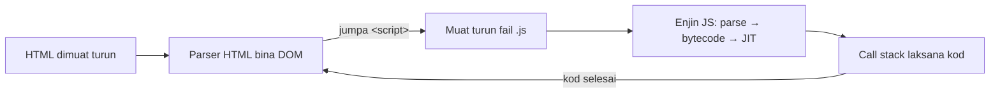

# 01 · Asas JavaScript — Cara JS Berjalan, Jenis Data, Operator & Kawalan Aliran

> Nota topikal (rujukan merentas hari) · Indeks: [`README.md`](./README.md)

## Objektif nota

- **Menerangkan** apa yang berlaku dari saat browser menerima fail `.js` hingga kod dilaksanakan (enjin, parse, call stack) dan **memilih** antara `<script>`, `defer` dan `type="module"`.
- **Membezakan** tujuh jenis primitif dan objek, serta **meramal** hasil `typeof` termasuk dua kejanggalannya (`null`, fungsi).
- **Menggunakan** operator aritmetik, perbandingan ketat (`===`) dan logik dengan betul, dan **menerangkan** kenapa `==` dielakkan.
- **Menulis** kawalan aliran (`if`/`else`, `switch`) dan loop (`for`, `while`, `do…while`, `for…of`, `for…in`) dengan `break`/`continue` yang sesuai.

---

## 1. Kenapa JavaScript?

JavaScript ialah **satu-satunya bahasa yang dijalankan secara asli oleh setiap browser web**. Jika anda mahu peta yang boleh dizum, borang yang menyemak input sebelum dihantar, atau senarai laporan yang dikemas kini tanpa muat semula halaman — anda perlukan JavaScript.

| Di mana JS berjalan | Contoh dalam kursus |
|---------------------|---------------------|
| **Browser** (Chrome, Edge, Firefox) | GeoLapor: peta Leaflet, borang laporan, senarai |
| **Node.js** (server / baris arahan) | Mock API `projek/api/server.mjs`, `npm`, Vite, `node --test` |
| Aplikasi desktop / mudah alih | Electron, React Native (sebutan sahaja) |

HTML memberi **struktur**, CSS memberi **rupa**, JavaScript memberi **tingkah laku**.

---

## 2. Bagaimana JavaScript berjalan dalam browser

### 2.1 Dari fail ke pelaksanaan



1. Browser membaca HTML dari atas ke bawah dan membina **DOM** (pokok elemen).
2. Apabila bertemu `<script>`, browser memuat turun fail itu dan menyerahkannya kepada **enjin JavaScript** (V8 dalam Chrome/Edge/Node.js, SpiderMonkey dalam Firefox).
3. Enjin **mem-parse** kod (semak sintaks — syntax error bermakna *tiada satu baris pun* dalam fail itu berjalan), menukarnya kepada bytecode, dan mengoptimumkan bahagian yang kerap berjalan (JIT).
4. Kod dilaksanakan menggunakan **call stack** — timbunan fungsi yang sedang berjalan. JavaScript adalah **single-threaded**: satu perkara pada satu masa. (Bagaimana ia masih boleh menunggu API tanpa membeku? Lihat [nota 05](./05-async-promise-await.md).)

```js
function kiraLuas(panjang, lebar) {
  return panjang * lebar;          // 3. kiraLuas di atas stack
}
function laporLuas() {
  const luas = kiraLuas(20, 5);    // 2. laporLuas memanggil kiraLuas
  console.log(`Luas: ${luas} m²`); // 4. console.log di atas stack
}
laporLuas();                       // 1. laporLuas masuk stack
// → Luas: 100 m²
```

> 💡 **Tip — lihat call stack sendiri.** Letak `debugger;` dalam `kiraLuas`, buka DevTools (F12) → Sources. Panel *Call Stack* menunjukkan `kiraLuas` → `laporLuas` → `(anonymous)`. Lihat [nota 14](./14-debugging-dan-amalan-terbaik.md).

### 2.2 Tiga cara memuatkan skrip

| Cara | Bila dimuat turun | Bila dilaksana | Susunan | Guna bila |
|------|-------------------|----------------|---------|-----------|
| `<script src="a.js">` (dalam `<head>`) | Serta-merta, **menyekat** parser | Serta-merta | Ikut susunan | Hampir tidak pernah lagi |
| `<script src="a.js" defer>` | Parallel dengan parse HTML | Selepas DOM siap, sebelum `DOMContentLoaded` | Ikut susunan | Skrip klasik (cth Leaflet dari CDN) |
| `<script type="module" src="main.js">` | Parallel | Selepas DOM siap (**defer secara default**) | Ikut susunan | **Kod kita Hari 1–3** — membolehkan `import`/`export` |

```html
<!doctype html>
<html lang="ms">
<head>
  <meta charset="utf-8">
  <title>GeoLapor</title>
  <!-- Pustaka klasik: defer supaya tidak menyekat -->
  <script src="vendor/leaflet/leaflet.js" defer></script>
  <!-- Kod kita: module = defer + strict mode + import/export -->
  <script type="module" src="main.js"></script>
</head>
<body>
  <div id="peta"></div>
</body>
</html>
```

> ⚠️ **Modul tidak berfungsi melalui `file://`.** Buka fail HTML dengan dwiklik → console: *"CORS policy… origin 'null'"*. Modul **mesti** dihidang melalui HTTP: guna **Live Server** (VS Code) atau `npx serve`. Lihat [`docs/persediaan.md`](../docs/persediaan.md).

> 💡 `type="module"` juga menghidupkan **strict mode** secara automatik: variable yang tidak diisytihar akan throw error dan bukannya mencipta global secara senyap.

---

## 3. Variable: `let`, `const`, `var` (ringkas)

```js
const KATEGORI_SAH = ['infrastruktur', 'alam-sekitar', 'tanah', 'utiliti', 'lain-lain'];
let bilanganLaporan = 0;   // nilai akan berubah
bilanganLaporan += 1;

// var — gaya lama; function scope & hoisting mengelirukan. Jangan guna dalam kod baharu.
```

**Peraturan kursus:** `const` secara default; `let` hanya jika nilai perlu ditukar; **jangan** `var`. Butiran scope & hoisting dalam [nota 02](./02-fungsi-skop-closure.md).

> ⚠️ `const` bermaksud **ikatan** tidak boleh ditukar, bukan nilai tidak boleh diubah. `const laporan = {}; laporan.status = 'baharu';` adalah sah. Untuk objek yang benar-benar beku guna `Object.freeze()`.

---

## 4. Jenis data

### 4.1 Tujuh primitif + objek

| Jenis | Contoh GeoLapor | `typeof` |
|-------|-----------------|----------|
| `string` | `'Papan tanda sempadan rosak'` | `'string'` |
| `number` | `101.6958`, `40`, `NaN` | `'number'` |
| `bigint` | `9007199254740993n` (jarang) | `'bigint'` |
| `boolean` | `true` (laporan disahkan?) | `'boolean'` |
| `undefined` | medan yang tidak diisi | `'undefined'` |
| `null` | "sengaja tiada nilai", cth `dipilih: null` | `'object'` ⚠️ |
| `symbol` | key unik (jarang dalam kursus) | `'symbol'` |
| **objek** | `{ tajuk: '…' }`, `[101.69, 2.92]`, fungsi | `'object'` / `'function'` |

```js
typeof 'LPR-0001';          // → 'string'
typeof 2.9264;              // → 'number'
typeof NaN;                 // → 'number'   (Not-a-Number masih jenis number!)
typeof undefined;           // → 'undefined'
typeof null;                // → 'object'   ⚠️ pepijat sejarah sejak 1995, kekal demi keserasian
typeof [101.69, 2.92];      // → 'object'   array ialah objek
typeof { type: 'Feature' }; // → 'object'
typeof function () {};      // → 'function' (objek khas yang boleh dipanggil)

// Cara yang betul:
Array.isArray([101.69, 2.92]); // → true
nilai === null;                 // semak null secara terus
Number.isNaN(Number('abc'));    // → true
```

### 4.2 Primitif disalin, objek dikongsi

```js
let a = 5;
let b = a;       // SALINAN nilai
b = 10;
console.log(a);  // → 5

const laporan1 = { status: 'baharu' };
const laporan2 = laporan1;      // RUJUKAN yang sama, bukan salinan
laporan2.status = 'selesai';
console.log(laporan1.status);   // → 'selesai'  ⚠️ kedua-duanya berubah
```

Ini sebab utama Hari 5 kita menekankan **kemas kini tidak boleh ubah** (salin dengan spread — lihat [nota 04](./04-array-objek-json.md) dan [nota 13](./13-state-dan-arkitektur.md)).

### 4.3 Nombor: perpuluhan terapung

```js
0.1 + 0.2;                        // → 0.30000000000000004
(0.1 + 0.2).toFixed(2);           // → '0.30'  (string!)
Number((0.1 + 0.2).toFixed(2));   // → 0.3
101.6958.toFixed(3);              // → '101.696'
Number('2.9264');                 // → 2.9264
Number('');                       // → 0      ⚠️ input kosong jadi 0, bukan error
Number('2,9264');                 // → NaN    koma bukan titik perpuluhan
parseFloat('2.9264abc');          // → 2.9264 (berhenti pada aksara tidak sah)
```

> ⚠️ **Koordinat dari `<input>` sentiasa string.** `'101.69' + 0.01` → `'101.690.01'`. Tukar dahulu: `Number(input.value)` dan semak `Number.isFinite(nilai)` — ingat `Number('')` memberi `0` yang **sah** tetapi salah.

---

## 5. Operator

### 5.1 Aritmetik & penugasan

```js
const jumlah = 40, selesai = 12;
const peratus = (selesai / jumlah) * 100;   // 30
const baki = jumlah % 7;                     // 5 (modulus)
const kuasaDua = 3 ** 2;                     // 9
let kiraan = 0;
kiraan += 1;  kiraan++;                      // 2
```

### 5.2 Perbandingan: selalu `===`

| Ungkapan | `==` (longgar, tukar jenis) | `===` (ketat) |
|----------|-----------------------------|---------------|
| `'1' vs 1` | `true` | `false` |
| `0 vs ''` | `true` | `false` |
| `0 vs false` | `true` | `false` |
| `null vs undefined` | `true` | `false` |
| `NaN vs NaN` | `false` | `false` ⚠️ guna `Number.isNaN` |

```js
const idDariUrl = '3';          // dari URLSearchParams — sentiasa string
const idDalamData = 3;
idDariUrl == idDalamData;       // → true  (kebetulan — pepijat menunggu masa)
idDariUrl === idDalamData;      // → false (jujur: jenis berbeza)
Number(idDariUrl) === idDalamData; // → true  (tukar secara SENGAJA)
```

> **Peraturan kursus:** sentiasa `===` / `!==`. ESLint (`eqeqeq`) akan menegur `==` pada Hari 4.

### 5.3 Logik, truthy & falsy

Dalam konteks boolean (`if`, `&&`, `||`, `!`), setiap nilai dianggap *truthy* atau *falsy*. Hanya **lapan** nilai adalah falsy:

`false`, `0`, `-0`, `0n`, `''`, `null`, `undefined`, `NaN`

Semua yang lain truthy — termasuk `'0'`, `'false'`, `[]` dan `{}`.

```js
const catatan = '';
if (!catatan) console.log('Tiada catatan');   // → dicetak

// && dan || memulangkan salah satu operand, bukan true/false
const nama = pengguna && pengguna.nama;        // pengguna falsy → pulang pengguna
const had = tetapan.had || 20;                 // ⚠️ jika had = 0, dapat 20!
const hadBetul = tetapan.had ?? 20;            // ✅ ?? hanya ganti null/undefined
```

> ⚠️ **`||` untuk nilai default menelan `0` dan `''`.** Latitud `0`, `had=0`, `catatan=''` semuanya digantikan. Guna `??` (nullish coalescing) — lihat [nota 03](./03-es6-moden.md).

### 5.4 Ternary

```js
const label = laporan.status === 'selesai' ? 'Selesai' : 'Belum selesai';
```

Guna ternary untuk **nilai** mudah; jangan bersarang lebih daripada satu tahap — tukar kepada `if` atau objek pemetaan.

---

## 6. Kawalan aliran

### 6.1 `if` / `else if` / `else`

```js
function tahapKeutamaan(laporan) {
  const { kategori, status } = laporan.properties;

  if (status === 'selesai' || status === 'ditolak') {
    return 'tiada';                   // keluar awal (guard clause)
  }
  if (kategori === 'infrastruktur') {
    return 'tinggi';
  } else if (kategori === 'utiliti') {
    return 'sederhana';
  }
  return 'rendah';
}
```

> 💡 **Guard clause** (pulang awal untuk kes khas) mengelakkan `if` bersarang 4 tahap. Kod dibaca dari atas ke bawah, kes biasa di hujung.

### 6.2 `switch`

```js
function labelStatus(status) {
  switch (status) {                 // perbandingan menggunakan ===
    case 'baharu':
      return 'Baharu';
    case 'dalam-tindakan':
      return 'Dalam tindakan';
    case 'selesai':
      return 'Selesai';
    case 'ditolak':
      return 'Ditolak';
    default:
      return 'Tidak diketahui';
  }
}
```

> ⚠️ **Terlupa `break`** (bila tidak guna `return`) → *fall-through*: kod `case` seterusnya turut berjalan. Jika sengaja, tulis komen `// fall through`.

> 💡 Untuk pemetaan nilai → nilai, **objek** selalunya lebih ringkas daripada `switch`:
> ```js
> const LABEL_STATUS = { baharu: 'Baharu', 'dalam-tindakan': 'Dalam tindakan', selesai: 'Selesai', ditolak: 'Ditolak' };
> const label = LABEL_STATUS[status] ?? 'Tidak diketahui';
> ```

---

## 7. Loop

### 7.1 Memilih loop yang betul

| Loop | Guna bila | Contoh GeoLapor |
|--------|-----------|-----------------|
| `for (let i = 0; i < n; i++)` | Perlu indeks / langkah khas | Titik ke-10, ke-20… sahaja |
| `for…of` | Ulang **nilai** dalam array/string/Map/Set | Setiap `feature` dalam `features` |
| `for…in` | Ulang **key** objek | Setiap medan dalam `properties` |
| `while` | Tidak tahu berapa kali; syarat di awal | Ambil halaman API sehingga habis |
| `do…while` | Mesti jalan sekurang-kurangnya sekali | Minta input sekurang-kurangnya sekali |
| `arr.forEach / map / filter` | Operasi pada setiap elemen (gaya fungsian) | [Nota 04](./04-array-objek-json.md) |

```js
const features = [
  { properties: { id: 'LPR-0001', kategori: 'infrastruktur', status: 'baharu' } },
  { properties: { id: 'LPR-0002', kategori: 'tanah', status: 'selesai' } },
  { properties: { id: 'LPR-0003', kategori: 'infrastruktur', status: 'ditolak' } },
];

// for klasik
for (let i = 0; i < features.length; i++) {
  console.log(i + 1, features[i].properties.id);
}

// for…of — paling mudah dibaca untuk array
let bilInfra = 0;
for (const f of features) {
  if (f.properties.status === 'ditolak') continue;   // langkau yang ditolak
  if (f.properties.kategori === 'infrastruktur') bilInfra++;
}
console.log(bilInfra);   // → 1

// for…in — key objek
const p = features[0].properties;
for (const medan in p) {
  console.log(`${medan}: ${p[medan]}`);
}
// → id: LPR-0001 / kategori: infrastruktur / status: baharu

// while — cari laporan pertama yang 'selesai'
let i = 0;
while (i < features.length && features[i].properties.status !== 'selesai') {
  i++;
}
console.log(i < features.length ? features[i].properties.id : 'tiada');  // → LPR-0002

// do…while — sekurang-kurangnya sekali
let cubaan = 0;
do {
  cubaan++;
  console.log(`Cubaan ${cubaan}`);
} while (cubaan < 3);
```

### 7.2 `break` dan `continue`

```js
// break — berhenti sebaik jumpa
let jumpa = null;
for (const f of features) {
  if (f.properties.id === 'LPR-0002') {
    jumpa = f;
    break;              // tiada gunanya teruskan
  }
}
// (Lebih ringkas: features.find(f => f.properties.id === 'LPR-0002') — nota 04)
```

> ⚠️ **`for…in` pada array** memberi indeks sebagai **string** (`'0'`, `'1'`) dan turut mengulang property tambahan. Untuk array, sentiasa `for…of` atau method array.

> ⚠️ **Infinite loop** — `while (i < n)` tanpa `i++`. Tab browser membeku; tutup tab dan baiki. Dalam `while`, pastikan syarat **pasti** berubah.

> ⚠️ **`forEach` tidak boleh `break`.** Jika perlu berhenti awal, guna `for…of`, `find`, atau `some`.

---

## 8. Semua sekali: ringkasan laporan

Satu fungsi yang menggabungkan jenis data, operator, kawalan aliran dan loop (versi "tangan" sebelum kita belajar `reduce`):

```js
function ringkasanLaporan(features) {
  const ikutStatus = {};
  let tanpaCatatan = 0;

  for (const { properties: p } of features) {
    ikutStatus[p.status] = (ikutStatus[p.status] ?? 0) + 1;
    if (!p.catatan?.trim()) tanpaCatatan++;
  }

  const jumlah = features.length;
  const selesai = ikutStatus.selesai ?? 0;
  const peratusSelesai = jumlah === 0 ? 0 : Math.round((selesai / jumlah) * 100);

  return { jumlah, ikutStatus, tanpaCatatan, peratusSelesai };
}

ringkasanLaporan([
  { properties: { status: 'baharu', catatan: 'Tiang condong' } },
  { properties: { status: 'selesai', catatan: '' } },
  { properties: { status: 'selesai' } },
  { properties: { status: 'baharu', catatan: '   ' } },
]);
// → { jumlah: 4, ikutStatus: { baharu: 2, selesai: 2 }, tanpaCatatan: 3, peratusSelesai: 50 }
```

Perhatikan `jumlah === 0 ? 0 : …` — tanpa kawalan ini, `0 / 0` memberi `NaN` dan UI memaparkan "NaN%".

---

## ⚠️ Kesilapan lazim

| Kesilapan | Gejala | Pembetulan |
|-----------|--------|------------|
| Buka HTML dengan `file://` | CORS error / `origin 'null'` untuk modul | Guna Live Server / `npx serve` |
| `<script>` di `<head>` tanpa `defer` | `document.getElementById(...)` → `null` | `defer` atau `type="module"` |
| `==` bukannya `===` | `'3' == 3` benar; pepijat tidak konsisten | `===` + tukar jenis secara sengaja |
| `typeof x === 'object'` untuk semak objek | `null` turut lulus | `x !== null && typeof x === 'object'` |
| `input.value + 1` | Gabungan string `'101.691'` | `Number(input.value)` + `Number.isFinite` |
| `nilai \|\| lalai` | `0`, `''` diganti | `nilai ?? lalai` |
| `for…in` pada array | Indeks string, property asing | `for…of` |
| `switch` tanpa `break` | Beberapa `case` berjalan | `break` / `return` dalam setiap `case` |
| Bahagi tanpa semak sifar | `NaN%`, `Infinity` | Guard `jumlah === 0` |

---

## 📖 Bacaan buku

> *JavaScript All-in-One For Dummies* (Minnick, 2023) — pengayaan selepas nota ini. Halaman PDF = muka surat cetak + 24.
>
> - **Cara menjalankan JS, `console`** — B1 · Bab 1 (Jumping into JavaScript), *Running Code in the Console; Running Code in a Browser Window* — ms. 33–40 (**PDF 57–64**)
> - **`let`/`const`, jenis data, scope** — B1 · Bab 3 (Using Data), *Making Variables with let; Making Constants with const; Taking a Look at the Data Types; Getting a Handle on Scope* — ms. 63–80 (**PDF 87–104**)
> - **Operator** — B1 · Bab 4 (Working with Operators and Expressions), *Operators: The Lineup* — ms. 83–90 (**PDF 107–114**)
> - **`if…else`, `switch`, loop** — B1 · Bab 5 (Controlling Flow), *Choosing a Path; Making Loops* — ms. 91–103 (**PDF 115–127**)
> - **Konvensyen penamaan** — B1 · Bab 1 & Bab 3, *JavaScript programmers use camelCase and underscores (Bab 1); Naming variables; Naming constants (Bab 3)* — ms. 32–33, 66–67 (**PDF 56–57, 90–91**)


## Rujukan rasmi

- MDN — JavaScript Guide: <https://developer.mozilla.org/en-US/docs/Web/JavaScript/Guide>
- MDN — `<script>` (`defer`, `type="module"`): <https://developer.mozilla.org/en-US/docs/Web/HTML/Reference/Elements/script>
- MDN — JavaScript data types and data structures: <https://developer.mozilla.org/en-US/docs/Web/JavaScript/Guide/Data_structures>
- MDN — `typeof`: <https://developer.mozilla.org/en-US/docs/Web/JavaScript/Reference/Operators/typeof>
- MDN — Equality comparisons and sameness: <https://developer.mozilla.org/en-US/docs/Web/JavaScript/Guide/Equality_comparisons_and_sameness>
- MDN — Falsy: <https://developer.mozilla.org/en-US/docs/Glossary/Falsy>
- MDN — Control flow and error handling: <https://developer.mozilla.org/en-US/docs/Web/JavaScript/Guide/Control_flow_and_error_handling>
- MDN — Loops and iteration: <https://developer.mozilla.org/en-US/docs/Web/JavaScript/Guide/Loops_and_iteration>
- V8 (enjin JS Chrome/Edge/Node.js): <https://v8.dev/>

## Digunakan pada Hari N

| Hari | Sesi | Bahagian nota |
|------|------|---------------|
| 1 | S1 · Variable Management & Scope | §2 (cara JS berjalan, `<script type="module">`), §3–4 (variable, jenis data), §5 (operator), §6–7 (kawalan aliran & loop), §8 |
| 1 | S3 · Destructuring & Operators | §5.2–5.3 (`===`, truthy/falsy, `\|\|` vs `??`) |
| 3 | S4 · Form Handling | §4.3 (input sentiasa string → `Number`) |
| 5 | S3 · Best Practices | §2.1 (call stack dalam DevTools) |
