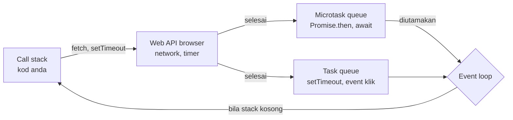

# 05 · Asynchronous JavaScript — Event Loop, Promise & `async`/`await`

> Nota topikal (rujukan merentas hari) · Indeks: [`README.md`](./README.md)

## Objektif nota

- **Menerangkan** bagaimana JavaScript yang *single-threaded* boleh menunggu API tanpa membekukan halaman (call stack, Web API, task queue, microtask queue, event loop).
- **Meramal** susunan output kod yang mencampurkan kod synchronous, `setTimeout`, `Promise.then` dan `await`.
- **Menukar** kod callback kepada Promise, dan Promise kepada `async`/`await` dengan `try…catch…finally`.
- **Memilih** `Promise.all`, `allSettled`, `race` atau `any` mengikut keperluan (cth memuat 3 layer GeoJSON serentak).
- **Membatalkan** request dengan `AbortController` dan menetapkan tamat masa dengan `AbortSignal.timeout()`.

---

## 1. Kenapa asynchronous?

`GET /api/laporan?lambat=2000` mengambil 2 saat. Jika JavaScript **menunggu secara synchronous**, selama 2 saat itu:

- peta tidak boleh diseret, butang tidak bertindak balas, animasi *spinner* pun beku;
- browser mungkin memaparkan "Halaman tidak bertindak balas".

JavaScript hanya ada **satu thread** untuk kod anda. Penyelesaiannya: **mulakan** kerja yang lambat (rangkaian, pemasa, baca fail), **serahkan** kepada browser, dan **teruskan** kod lain. Apabila kerja itu siap, browser menjadualkan *callback* anda untuk dijalankan kemudian.



---

## 2. Event loop — peraturan

1. Jalankan semua kod **synchronous** hingga call stack kosong.
2. Kosongkan **SEMUA microtask** (Promise `then/catch/finally`, sambungan selepas `await`, `queueMicrotask`).
3. Ambil **SATU task** (callback `setTimeout`, event `click`, mesej), jalankan.
4. Kosongkan semua microtask lagi. Browser mungkin melukis semula skrin.
5. Ulang dari 3.

```js
console.log('1 segerak mula');
setTimeout(() => console.log('5 task: setTimeout 0'), 0);
Promise.resolve().then(() => console.log('3 microtask: then'));
queueMicrotask(() => console.log('4 microtask: queueMicrotask'));
console.log('2 segerak tamat');

// Output (disahkan dengan Node 22+ dan Chrome):
// 1 segerak mula
// 2 segerak tamat
// 3 microtask: then
// 4 microtask: queueMicrotask
// 5 task: setTimeout 0
```

> 💡 **`setTimeout(fn, 0)` bukan "sekarang".** Ia bermaksud "selepas kod synchronous **dan** semua microtask selesai, dan sekurang-kurangnya 0 ms". Ia tetap menunggu giliran.

`await` juga memecahkan fungsi kepada dua: bahagian sebelum `await` berjalan secara synchronous; bahagian selepasnya ialah microtask.

```js
async function muat() {
  console.log('B dalam async sebelum await');
  await null;
  console.log('D selepas await');
}
console.log('A');
muat();
console.log('C');
// → A, B dalam async sebelum await, C, D selepas await
```

> ⚠️ **Kod synchronous yang berat tetap membekukan UI** walaupun dalam fungsi `async`. Mengira `turf.simplify` pada 50,000 verteks dalam loop ialah kerja CPU, bukan rangkaian — `async` tidak membantu. (Penyelesaian: kurangkan data, *Web Worker* — sebutan Hari 5.)

---

## 3. Dari callback ke Promise ke `async`/`await`

### 3.1 Callback — dan "callback hell"

```js
// Gaya lama: fungsi yang menerima callback (err, data)
function ambilJson(url, callback) {
  const xhr = new XMLHttpRequest();
  xhr.open('GET', url);
  xhr.onload = () => callback(null, JSON.parse(xhr.responseText));
  xhr.onerror = () => callback(new Error('Rangkaian gagal'));
  xhr.send();
}

// Muat kategori → laporan → layer zon, secara sequential:
ambilJson('/api/kategori', (err, kategori) => {
  if (err) return papar(err);
  ambilJson('/api/laporan', (err, laporan) => {
    if (err) return papar(err);
    ambilJson('/api/lapisan/sempadan-zon', (err, zon) => {
      if (err) return papar(err);
      lukis(kategori, laporan, zon);       // piramid → "callback hell"
    });
  });
});
```

Masalah: bersarang ke kanan, error perlu disemak di setiap tahap, dan sukar untuk menjalankan tiga request **serentak**.

### 3.2 Promise — objek "nilai masa depan"

Promise mempunyai tiga keadaan: **pending** → **fulfilled** (dengan nilai) atau **rejected** (dengan sebab). Sekali settled, keadaannya tidak berubah.

```js
// Mencipta Promise sendiri (jarang — fetch sudah memulangkan Promise)
function tunggu(ms) {
  return new Promise((resolve) => setTimeout(resolve, ms));
}

// Membalut API callback lama kepada Promise
function ambilJsonP(url) {
  return new Promise((resolve, reject) => {
    ambilJson(url, (err, data) => (err ? reject(err) : resolve(data)));
  });
}

// Chaining: setiap then menerima pulangan then sebelumnya
fetch('http://localhost:3000/api/laporan')
  .then((res) => {
    if (!res.ok) throw new Error(`HTTP ${res.status}`);   // throw → lompat ke catch
    return res.json();                                     // pulang Promise → di-chain
  })
  .then((fc) => console.log(`${fc.features.length} laporan`))
  .catch((ralat) => console.error('Gagal:', ralat.message))
  .finally(() => console.log('Sembunyikan spinner'));
```

> ⚠️ **Lupa `return` dalam `then`** → `then` seterusnya menerima `undefined`, dan error dari Promise dalaman tidak ditangkap.

### 3.3 `async` / `await` — Promise yang dibaca seperti kod synchronous

```js
async function muatLaporan() {
  const spinner = document.querySelector('#spinner');
  spinner.hidden = false;
  try {
    const res = await fetch('http://localhost:3000/api/laporan?lambat=1500');
    if (!res.ok) throw new Error(`HTTP ${res.status}`);
    const fc = await res.json();
    return fc.features;
  } catch (ralat) {
    console.error('Gagal memuat laporan:', ralat);
    return [];                     // default selamat untuk UI
  } finally {
    spinner.hidden = true;         // SENTIASA dijalankan — berjaya atau gagal
  }
}
```

| Peraturan | Penjelasan |
|-----------|------------|
| `async function` **sentiasa** memulangkan Promise | `muatLaporan()` → `Promise<Feature[]>`; pemanggil perlu `await` juga |
| `await` hanya dalam `async` (atau tahap atas modul) | `<script type="module">` membenarkan *top-level await* |
| `throw` dalam `async` = Promise di-reject | Ditangkap oleh `try…catch` pemanggil atau `.catch()` |
| `finally` untuk kerja pembersihan | Sembunyi spinner, aktifkan semula butang |

> 💡 **Hari 2 S3:** cuba `?gagal=1` (paksa 500) dan `?lambat=3000` pada URL di atas. Perhatikan spinner tetap disembunyikan oleh `finally` dalam kedua-dua kes.

---

## 4. Sequential vs parallel

```js
// ❌ SEQUENTIAL — jumlah masa = 1s + 1s + 1s = 3s (ketiga-tiganya bebas antara satu sama lain!)
const zon = await dapatkanLapisan('sempadan-zon');
const sungai = await dapatkanLapisan('sungai');
const kemudahan = await dapatkanLapisan('kemudahan');

// ✅ PARALLEL — mulakan semua, tunggu bersama: ≈ 1s
const [zon2, sungai2, kemudahan2] = await Promise.all([
  dapatkanLapisan('sempadan-zon'),
  dapatkanLapisan('sungai'),
  dapatkanLapisan('kemudahan'),
]);
```

Guna **sequential** hanya jika request kedua **memerlukan** hasil pertama (cth POST laporan → dapat `id` → GET `/api/laporan/:id`).

> ⚠️ **`await` dalam `forEach` tidak menunggu.** `ids.forEach(async (id) => await padamLaporan(id))` memulakan semua dan terus ke baris seterusnya. Guna `for…of` (sequential) atau `await Promise.all(ids.map(padamLaporan))` (parallel).

---

## 5. Pengumpul Promise

| Method | Resolve bila | Reject bila | Guna dalam GeoLapor |
|--------|--------------|--------------|---------------------|
| `Promise.all([...])` | **Semua** berjaya → array nilai (ikut susunan input) | **Satu** gagal (serta-merta) | Kategori + laporan + statistik — semua perlu untuk paparan awal |
| `Promise.allSettled([...])` | Semua settled (berjaya atau gagal) | Tidak pernah | 3 layer rujukan — papar yang berjaya, amaran untuk yang gagal |
| `Promise.race([...])` | **Pertama** settled (berjaya **atau** gagal) | Pertama gagal | Tamat masa manual (lama; kini guna `AbortSignal.timeout`) |
| `Promise.any([...])` | **Pertama berjaya** | Semua gagal → `AggregateError` | Cuba beberapa tile server/mirror, guna yang terpantas |

```js
const ID_LAPISAN = ['sempadan-zon', 'sungai', 'kemudahan'];

const keputusan = await Promise.allSettled(ID_LAPISAN.map((id) => dapatkanLapisan(id)));

keputusan.forEach((k, i) => {
  if (k.status === 'fulfilled') {
    tambahLapisan(ID_LAPISAN[i], k.value);           // k.value = FeatureCollection
  } else {
    notis(`Lapisan ${ID_LAPISAN[i]} gagal: ${k.reason.message}`);
  }
});
// Satu layer gagal TIDAK menghalang dua lagi dipaparkan.
```

Output disahkan (Node 22+): `allSettled` memulangkan `[{ status: 'fulfilled', value }, { status: 'rejected', reason }]`; `Promise.any` dengan semua gagal akan throw `AggregateError` dengan `errors` sebagai array.

---

## 6. Pembatalan & tamat masa: `AbortController`

### 6.1 Kenapa batal?

Pengguna menaip "papan" dalam carian → 5 request dihantar. Jawapan untuk "pa" mungkin tiba **selepas** jawapan "papan" (rangkaian tidak menjamin susunan) → senarai menunjukkan hasil yang salah. Penyelesaian: **batalkan** request lama sebelum menghantar yang baharu.

```js
let pengawalCari = null;

async function cari(q) {
  pengawalCari?.abort();                    // batal request sebelumnya (jika ada)
  pengawalCari = new AbortController();
  try {
    const res = await fetch(`http://localhost:3000/api/laporan?q=${encodeURIComponent(q)}&lambat=800`, {
      signal: pengawalCari.signal,
    });
    const fc = await res.json();
    paparSenarai(fc.features);
  } catch (ralat) {
    if (ralat.name === 'AbortError') return;  // dibatalkan sengaja — BUKAN error untuk pengguna
    notis('Carian gagal');
  }
}
```

### 6.2 Tamat masa

```js
// Moden (Chrome 103+, Node 17.3+): isyarat yang batal sendiri selepas N ms
try {
  const res = await fetch('http://localhost:3000/api/laporan?lambat=10000', {
    signal: AbortSignal.timeout(5000),
  });
} catch (ralat) {
  if (ralat.name === 'TimeoutError') notis('Pelayan terlalu lambat (5 s)');
  else if (ralat.name === 'AbortError') { /* dibatal pengguna */ }
  else notis('Rangkaian gagal');           // TypeError: Failed to fetch
}

// Gabung: batal oleh pengguna ATAU tamat masa (Chrome 116+, Node 20.3+)
const pengawal = new AbortController();
const isyarat = AbortSignal.any([pengawal.signal, AbortSignal.timeout(5000)]);
```

| `ralat.name` | Punca | Tindakan UI |
|--------------|-------|-------------|
| `AbortError` | `controller.abort()` dipanggil | Senyap |
| `TimeoutError` | `AbortSignal.timeout(ms)` tamat | "Pelayan lambat, cuba lagi" |
| `TypeError` | Network error, CORS, server mati | "Tidak dapat menghubungi pelayan" |

Inilah apa yang dibungkus oleh `mintaJson(laluan, { method, body, signal, timeoutMs })` dalam `services/api.js`: ia menerima `signal` pemanggil, menambah tamat masa `timeoutMs`, dan menukar semua error di atas kepada `ApiError(mesej, status, medan)`. Butiran penuh dalam [nota 06](./06-http-rest-fetch.md) §8.

---

## 7. Corak berguna

### 7.1 Tunggu + cuba semula (retry) dengan backoff

```js
const tunggu = (ms) => new Promise((r) => setTimeout(r, ms));

async function denganCubaSemula(fn, { cubaan = 3, asasMs = 300 } = {}) {
  for (let i = 1; ; i++) {
    try {
      return await fn();
    } catch (ralat) {
      const bolehUlang = ralat.status === undefined || ralat.status >= 500;  // rangkaian/5xx sahaja
      if (i >= cubaan || !bolehUlang) throw ralat;
      await tunggu(asasMs * 2 ** (i - 1));          // 300, 600, 1200 ms …
    }
  }
}
// const fc = await denganCubaSemula(() => senaraiLaporan());
```

> ⚠️ **Jangan retry POST secara automatik** — anda mungkin mencipta laporan pendua jika request pertama sebenarnya berjaya tetapi jawapan hilang. Retry hanya untuk GET (idempotent) — lihat [nota 06](./06-http-rest-fetch.md) §9.

### 7.2 Error yang tidak ditangkap

```js
// Promise di-reject tanpa catch → "Uncaught (in promise)" dalam console
muatLaporan();                    // jika muatLaporan throw, tiada siapa tangkap

// Jaring keselamatan global (Hari 5) — log, jangan ganti try…catch
window.addEventListener('unhandledrejection', (e) => {
  console.error('Promise tidak ditangkap:', e.reason);
});
```

---

## ⚠️ Kesilapan lazim

| Kesilapan | Gejala | Pembetulan |
|-----------|--------|------------|
| Lupa `await` | `fc.features` → `undefined`; console menunjukkan `Promise {<pending>}` | `await` setiap panggilan async |
| `await` dalam fungsi bukan `async` | `SyntaxError: await is only valid in async functions` | Tandakan fungsi `async` |
| `await` sequential untuk kerja bebas | Muat 3× lebih lambat | `Promise.all` |
| `forEach(async …)` | Kod terus berjalan sebelum selesai | `for…of` atau `Promise.all(map)` |
| `Promise.all` untuk layer pilihan | Satu gagal → semua hilang | `allSettled` |
| Anggap `fetch` akan throw pada 404/500 | Tiada error, data pelik | Semak `res.ok` (lihat nota 06) |
| Papar `AbortError` kepada pengguna | Notis "Ralat" setiap kali menaip | `if (ralat.name === 'AbortError') return;` |
| Tiada `finally` | Spinner kekal selepas error | Sembunyi dalam `finally` |
| Retry POST | Laporan pendua | Retry GET / 5xx sahaja |

---

## Rujukan rasmi

- MDN — Asynchronous JavaScript (pengenalan): <https://developer.mozilla.org/en-US/docs/Learn_web_development/Extensions/Async_JS>
- MDN — Using promises: <https://developer.mozilla.org/en-US/docs/Web/JavaScript/Guide/Using_promises>
- MDN — `async function`: <https://developer.mozilla.org/en-US/docs/Web/JavaScript/Reference/Statements/async_function>
- MDN — `Promise.allSettled()`: <https://developer.mozilla.org/en-US/docs/Web/JavaScript/Reference/Global_Objects/Promise/allSettled>
- MDN — `Promise.any()`: <https://developer.mozilla.org/en-US/docs/Web/JavaScript/Reference/Global_Objects/Promise/any>
- MDN — `AbortController`: <https://developer.mozilla.org/en-US/docs/Web/API/AbortController>
- MDN — `AbortSignal.timeout()`: <https://developer.mozilla.org/en-US/docs/Web/API/AbortSignal/timeout_static>
- MDN — In depth: Microtasks and the JavaScript runtime environment: <https://developer.mozilla.org/en-US/docs/Web/API/HTML_DOM_API/Microtask_guide/In_depth>
- HTML Standard — Event loops: <https://html.spec.whatwg.org/multipage/webappapis.html#event-loops>

## Digunakan pada Hari N

| Hari | Sesi | Bahagian nota |
|------|------|---------------|
| 2 | S1 · Asynchronous Programming Concepts | §1–2 (event loop, task/microtask), §3.1 (callback hell) |
| 2 | S2 · Promise Handling | §3.2 (mencipta & chaining), §5 (`all/allSettled/race/any`) → muat 3 layer GeoJSON serentak |
| 2 | S3 · Async / Await Syntax | §3.3 (`try…catch…finally`), §4 (sequential vs parallel) — simulasi `?lambat=` & `?gagal=` |
| 2 | S4 · Fetch API Integration | §6 (`AbortController`, `AbortSignal.timeout`) → `mintaJson` |
| 3 | S3 · Event Handling | §6.1 (batal carian lama) |
| 5 | S1 · State Management | §7.1 (retry), §7.2 (`unhandledrejection`) |
