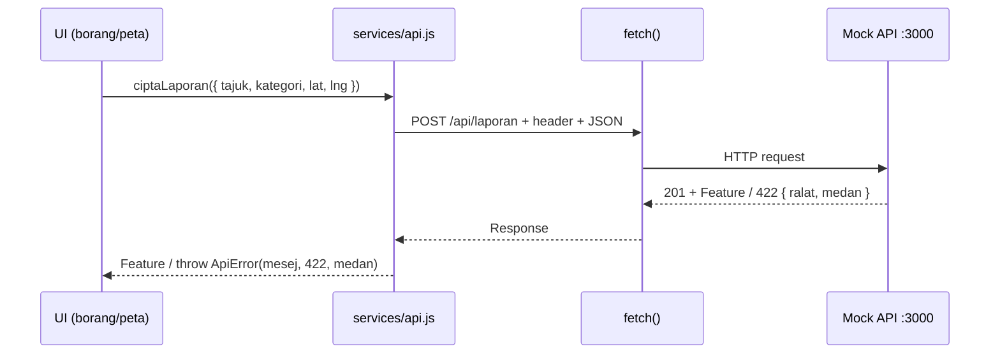
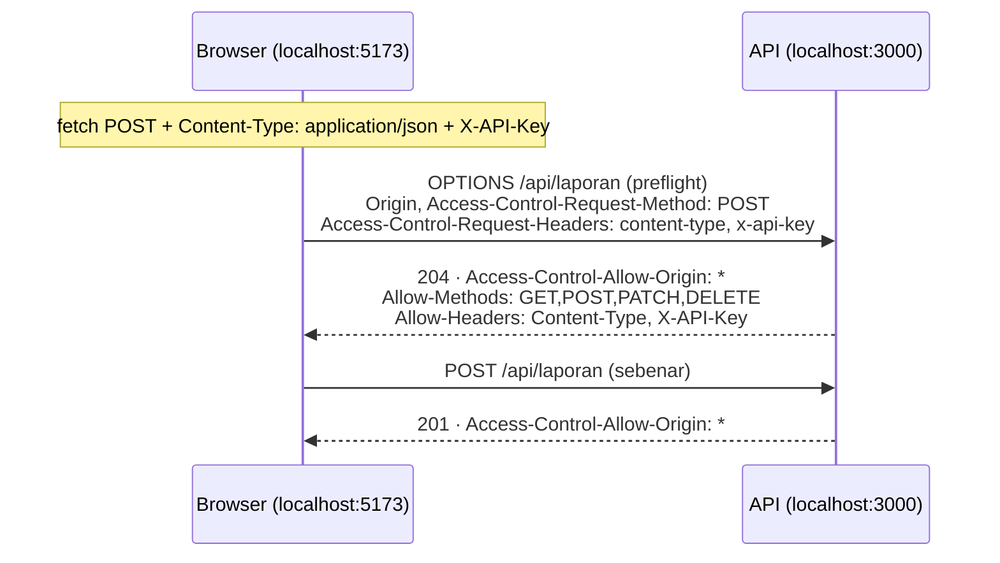

# 06 · HTTP, REST & Fetch API — Bekerja dengan API Secara Profesional

> Nota topikal (rujukan merentas hari) · Indeks: [`README.md`](./README.md)
> Nota ini ialah **nota paling penting** untuk benang API kursus. Ia dirujuk dari Hari 2 hingga Hari 5.

## Objektif nota

- **Menerangkan** anatomi request & response HTTP (method, URL, header, badan, kod status) dan **memetakan** setiap endpoint GeoLapor kepada method REST yang betul.
- **Menulis** panggilan `fetch` untuk GET/POST/PATCH/DELETE dengan header, badan JSON, semakan `res.ok`, tamat masa dan pembatalan — dan **membungkusnya** dalam `mintaJson()` + `ApiError`.
- **Menerangkan** CORS (termasuk preflight `OPTIONS`) dan **mendiagnos** CORS error dalam DevTools.
- **Membandingkan** corak pengesahan (API key, Bearer/JWT, cookie sesi) dan **menerangkan** kenapa key sebenar tidak boleh berada dalam kod frontend.
- **Menguji** setiap endpoint dengan `curl`, Postman / Thunder Client atau fail `.http` sebelum menulis kod UI.

---

## 1. Kenapa API ialah benang utama kursus?

Sistem geospatial moden jarang berdiri sendiri. Peta di browser mengambil **laporan** dari satu API, **layer** dari GeoServer, **data terbuka** dari `api.data.gov.my`, dan menghantar **kemas kini** kembali. Frontend yang baik:

1. tahu **apa** yang diminta (method + URL + query + header + badan),
2. tahu **apa** yang boleh dijawab (kod status + badan JSON + header),
3. mengendali **setiap jenis kegagalan** dengan mesej yang berguna kepada pengguna,
4. boleh **diuji tanpa UI** (curl/Postman) supaya pepijat dapat dipisahkan: *server* atau *browser*?



---

## 2. Anatomi HTTP

```http
POST /api/laporan?lambat=500 HTTP/1.1          ← method · laluan · query
Host: localhost:3000
Content-Type: application/json                 ← jenis badan yang DIHANTAR
Accept: application/json                       ← jenis badan yang DIMAHU
X-API-Key: latihan-pgn-2026                    ← pengesahan (latihan)

{"tajuk":"Longkang tersumbat","kategori":"utiliti","catatan":"","lat":2.9264,"lng":101.6958}
```

```http
HTTP/1.1 201 Created                           ← kod status
Content-Type: application/json
Access-Control-Allow-Origin: *                 ← CORS

{"type":"Feature","id":"LPR-0041","geometry":{…},"properties":{…}}
```

### 2.1 Method & REST

**REST** = sumber (*resource*) dikenal pasti oleh URL; method HTTP menyatakan **tindakan**.

| Method | Maksud | Idempotent? | Selamat? | GeoLapor |
|--------|--------|-------------|----------|----------|
| `GET` | Baca | ✅ | ✅ (tiada perubahan) | `GET /api/laporan`, `/api/laporan/:id`, `/api/kategori`, `/api/lapisan/:id`, `/api/statistik` |
| `POST` | Cipta (server jana ID) | ❌ (2× = 2 rekod) | ❌ | `POST /api/laporan` → 201 |
| `PUT` | Ganti keseluruhan | ✅ | ❌ | (tidak digunakan) |
| `PATCH` | Kemas kini sebahagian | ⚠️ biasanya | ❌ | `PATCH /api/laporan/:id` `{ status }` → 200 |
| `DELETE` | Padam | ✅ | ❌ | `DELETE /api/laporan/:id` → 204 |
| `OPTIONS` | Tanya kebenaran (CORS preflight) | ✅ | ✅ | Dihantar **browser**, bukan anda |

**Idempotent** = menghantar dua kali memberi keadaan akhir yang sama. Ini menentukan apa yang **selamat untuk dicuba semula** (§9).

### 2.2 Kod status

| Kod | Nama | Bila | Tindakan frontend |
|-----|------|------|-------------------|
| **200** | OK | GET/PATCH berjaya | Guna badan |
| **201** | Created | POST berjaya | Guna `Feature` baharu (ada `id`) |
| **204** | No Content | DELETE berjaya | **Jangan** `res.json()` — tiada badan |
| 301/302/307/308 | Redirect | URL berpindah | `fetch` ikut secara automatik |
| 304 | Not Modified | Cache sah (ETag) | Browser urus |
| **400** | Bad Request | JSON rosak, query tidak sah | Pepijat kod — log |
| **401** | Unauthorized | Tiada / salah key (`X-API-Key`) | "Sila log masuk" / semak key |
| **403** | Forbidden | Dikenal pasti tetapi tiada kebenaran | "Anda tiada akses" |
| **404** | Not Found | `LPR-9999` tiada / URL salah | "Laporan tidak dijumpai" |
| 405 | Method Not Allowed | `DELETE /api/kategori` | Pepijat kod |
| 409 | Conflict | Versi bercanggah | Muat semula & cuba lagi |
| **422** | Unprocessable Content | Validasi gagal → `{ ralat, medan }` | Papar error **di sebelah medan** borang |
| 429 | Too Many Requests | Had kadar (cth Nominatim 1 req/s) | Tunggu (`Retry-After`) |
| **500** | Internal Server Error | Pepijat server / `?gagal=1` | "Ralat pelayan, cuba lagi" — boleh retry |
| 502/503/504 | Bad Gateway / Unavailable / Timeout | Proksi / server sibuk | Boleh retry dengan backoff |

> 💡 **Ingat julat:** 2xx berjaya · 3xx pergi ke tempat lain · **4xx salah anda** (klien) · **5xx salah server**. `res.ok` = `true` untuk 200–299 sahaja.

### 2.3 Header penting

| Header | Arah | Contoh | Nota |
|--------|------|--------|------|
| `Content-Type` | Kedua-dua | `application/json`, `application/geo+json` | **Wajib** bila menghantar badan JSON |
| `Accept` | Request | `application/json` | Minta format tertentu |
| `X-API-Key` | Request | `latihan-pgn-2026` | Header tersuai (awalan `X-` konvensyen lama) |
| `Authorization` | Request | `Bearer eyJhbGci…` | Standard untuk token |
| `Access-Control-Allow-Origin` | Response | `*` / `http://localhost:5173` | CORS (§5) |
| `Cache-Control`, `ETag` | Response | `max-age=3600` | Cache layer statik |
| `Retry-After` | Response | `2` | Untuk 429/503 |
| `Link` | Response | `<…?mula=20>; rel="next"` | Pagination (§7) |
| `User-Agent` | Request | (browser tetapkan) | Nominatim memerlukan pengenalan aplikasi |

---

## 3. `fetch` — asas yang betul

### 3.1 GET dengan query

```js
const API = 'http://localhost:3000';

const qs = new URLSearchParams({ kategori: 'infrastruktur', status: 'baharu', had: '20' });
qs.set('bbox', [101.60, 2.88, 101.75, 2.98].join(','));  // minLng,minLat,maxLng,maxLat (koma → %2C, server nyahkod)
qs.set('q', 'papan tanda');                               // ruang dikod → 'papan+tanda'

const res = await fetch(`${API}/api/laporan?${qs}`);
if (!res.ok) throw new Error(`HTTP ${res.status}`);       // ⚠️ fetch TIDAK throw pada 404/500
const fc = await res.json();                               // FeatureCollection
console.log(fc.features.length);
```

> ⚠️ **Dua langkah, dua `await`.** `fetch()` selesai apabila **header** tiba; `res.json()` membaca dan mem-parse **badan**. Badan hanya boleh dibaca **sekali** (`res.json()` kemudian `res.text()` → `TypeError: body used already`).

### 3.2 POST JSON

```js
const res = await fetch(`${API}/api/laporan`, {
  method: 'POST',
  headers: {
    'Content-Type': 'application/json',          // tanpa ini server tidak tahu badan ialah JSON
    'X-API-Key': 'latihan-pgn-2026',
  },
  body: JSON.stringify({                          // ⚠️ mesti string, bukan objek
    tajuk: 'Longkang tersumbat',
    kategori: 'utiliti',
    catatan: 'Air bertakung selepas hujan.',
    lat: 2.9264,
    lng: 101.6958,
  }),
});
if (res.status === 422) {
  const { ralat, medan } = await res.json();      // { tajuk: 'Tajuk wajib diisi', … }
}
```

API membenarkan POST menerima `{ tajuk, kategori, catatan, lat, lng }` **atau** `Feature` penuh (lihat `projek/api/README.md`). Borang biasanya menghantar bentuk rata; import fail menghantar `Feature`.

### 3.3 PATCH & DELETE

```js
await fetch(`${API}/api/laporan/LPR-0001`, {
  method: 'PATCH',
  headers: { 'Content-Type': 'application/json', 'X-API-Key': 'latihan-pgn-2026' },
  body: JSON.stringify({ status: 'dalam-tindakan' }),   // HANYA medan yang berubah
});

const r = await fetch(`${API}/api/laporan/LPR-0001`, {
  method: 'DELETE',
  headers: { 'X-API-Key': 'latihan-pgn-2026' },
});
r.status;          // → 204 — jangan panggil r.json()
```

---

## 4. Membungkus: `services/api.js` (Hari 2 S4)

Kenapa satu modul? Kerana **setiap** komponen UI tidak patut tahu tentang URL asas, header, key, tamat masa, atau cara membaca badan error. Satu pintu = satu tempat untuk dibaiki, diuji dan diganti (cth bila bertukar dari mock API ke API sebenar).

```js
// src/services/api.js — satu-satunya pintu ke API
const API_ASAS = import.meta.env?.VITE_API_URL ?? 'http://localhost:3000'; // Hari 4: .env Vite
const KUNCI_API = 'latihan-pgn-2026';        // ⚠️ key LATIHAN sahaja — lihat §6

export class ApiError extends Error {
  /**
   * @param {string} mesej  mesej mesra pengguna (BM)
   * @param {number} status kod HTTP; 0 = rangkaian / tamat masa
   * @param {Record<string,string>|null} medan error validasi 422 ikut medan
   */
  constructor(mesej, status = 0, medan = null) {
    super(mesej);
    this.name = 'ApiError';
    this.status = status;
    this.medan = medan;
  }
  get bolehCubaSemula() {                     // rangkaian, 429, 5xx
    return this.status === 0 || this.status === 429 || this.status >= 500;
  }
}

export async function mintaJson(laluan, { method = 'GET', body, signal, timeoutMs = 8000 } = {}) {
  const headers = { Accept: 'application/json' };
  if (body !== undefined) headers['Content-Type'] = 'application/json';
  if (method !== 'GET') headers['X-API-Key'] = KUNCI_API;

  // Gabung isyarat pemanggil (batal) + tamat masa
  const isyarat = [signal, AbortSignal.timeout(timeoutMs)].filter(Boolean);

  let res;
  try {
    res = await fetch(`${API_ASAS}${laluan}`, {
      method,
      headers,
      body: body === undefined ? undefined : JSON.stringify(body),
      signal: AbortSignal.any(isyarat),
    });
  } catch (ralat) {
    if (ralat.name === 'AbortError') throw ralat;          // dibatal sengaja — biar pemanggil abaikan
    if (ralat.name === 'TimeoutError') {
      throw new ApiError(`Pelayan tidak menjawab dalam ${timeoutMs / 1000} saat`, 0);
    }
    throw new ApiError('Tidak dapat menghubungi pelayan. Semak sambungan atau mock API.', 0);
  }

  if (res.status === 204) return null;                     // DELETE berjaya — tiada badan

  const teks = await res.text();                           // baca SEKALI, parse sendiri
  let data = null;
  if (teks) {
    try {
      data = JSON.parse(teks);
    } catch {
      throw new ApiError(`Respons bukan JSON (HTTP ${res.status})`, res.status);
    }
  }

  if (!res.ok) {
    throw new ApiError(data?.ralat ?? `Permintaan gagal (HTTP ${res.status})`, res.status, data?.medan ?? null);
  }
  return data;
}

// ---- Satu fungsi bagi setiap endpoint ----
export function senaraiLaporan(penapis = {}, { signal } = {}) {
  const qs = new URLSearchParams();
  for (const [k, v] of Object.entries(penapis)) {          // langkau nilai kosong
    if (v !== undefined && v !== null && v !== '') qs.set(k, Array.isArray(v) ? v.join(',') : String(v));
  }
  const s = qs.toString();
  return mintaJson(`/api/laporan${s ? `?${s}` : ''}`, { signal });
}
export const dapatkanLaporan = (id) => mintaJson(`/api/laporan/${encodeURIComponent(id)}`);
export const ciptaLaporan = (data) => mintaJson('/api/laporan', { method: 'POST', body: data });
export const kemaskiniLaporan = (id, tampalan) =>
  mintaJson(`/api/laporan/${encodeURIComponent(id)}`, { method: 'PATCH', body: tampalan });
export const padamLaporan = (id) => mintaJson(`/api/laporan/${encodeURIComponent(id)}`, { method: 'DELETE' });
export const senaraiKategori = () => mintaJson('/api/kategori');
export const senaraiLapisan = () => mintaJson('/api/lapisan');
export const dapatkanLapisan = (id) => mintaJson(`/api/lapisan/${encodeURIComponent(id)}`);
export const dapatkanStatistik = () => mintaJson('/api/statistik');
```

Kod ini diuji terhadap server mock (Node 22+): 404 → `ApiError(…, 404)`; 422 → `medan = { tajuk: '…' }`; `?gagal=1` → status 500, `bolehCubaSemula === true`; tamat masa → status 0; halaman HTML → "Respons bukan JSON"; DELETE → `null`; batal → `AbortError` di-throw semula.

Penggunaan di UI:

```js
import { ciptaLaporan, ApiError } from './services/api.js';

try {
  const baharu = await ciptaLaporan({ tajuk, kategori, catatan, lat, lng });
  notis(`Laporan ${baharu.id} dihantar`);
} catch (ralat) {
  if (ralat instanceof ApiError && ralat.status === 422) paparRalatMedan(ralat.medan);  // nota 07
  else notis(ralat.message, 'ralat');
}
```

> 💡 **Kenapa `res.text()` + `JSON.parse` dan bukan terus `res.json()`?** Supaya kita boleh (a) mengendali badan kosong, dan (b) memberi mesej jelas bila server memulangkan HTML (punca `Unexpected token '<'`).

---

## 5. CORS — kenapa browser menyekat, bukan server

**Same-origin policy:** skrip dari `http://localhost:5173` (Vite) tidak boleh membaca response dari `http://localhost:3000` (API) — asal (*origin* = skema + hos + port) berbeza — **kecuali** server membenarkannya melalui header CORS.



| Request | Preflight? |
|------------|-----------|
| `GET` tanpa header tersuai | Tidak ("simple request") |
| `POST` dengan `Content-Type: application/json` | **Ya** |
| Mana-mana dengan `X-API-Key` atau `Authorization` | **Ya** |
| `PATCH`, `DELETE` | **Ya** |

**Fakta penting:**

1. CORS dikuatkuasa oleh **browser**. `curl` dan Postman tidak peduli CORS — jadi "berfungsi di Postman, gagal di browser" hampir selalu CORS.
2. CORS error **tidak boleh dibaiki dari frontend**. Server mesti menghantar header, **atau** request dihantar melalui proksi pada asal yang sama.
3. Dalam JavaScript, CORS error kelihatan sebagai `TypeError: Failed to fetch` tanpa butiran (sengaja, atas sebab keselamatan). Butiran penuh ada dalam **console** dan tab **Network**.
4. Mock API kursus menghantar `Access-Control-Allow-Origin: *` supaya anda boleh fokus pada JS.

### Proksi dev Vite (apabila API tiada CORS)

```js
// vite.config.js — browser bercakap dengan :5173; Vite meneruskan ke server
import { defineConfig } from 'vite';
export default defineConfig({
  server: {
    proxy: {
      '/api': 'http://localhost:3000',                        // /api/laporan → :3000/api/laporan
      '/geoserver': { target: 'http://geoserver.dalaman.test:8080', changeOrigin: true },
    },
  },
});
```

Dengan proksi, `VITE_API_URL` boleh jadi kosong dan kod memanggil `/api/laporan` (asal sama). Dalam produksi, peranan ini dimainkan oleh **reverse proxy** (Nginx/Apache/IIS) jabatan — corak biasa untuk mengintegrasi GeoServer atau API dalaman PGN tanpa membuka CORS (lihat [nota 08](./08-web-mapping-leaflet.md)).

> ⚠️ **`mode: 'no-cors'` bukan penyelesaian.** Ia menghasilkan response *opaque*: `res.ok === false`, `status === 0`, badan kosong. Request "berjaya" tetapi anda tidak boleh membaca apa-apa.

---

## 6. Corak pengesahan (auth)

| Corak | Bagaimana | Kelebihan | Risiko / nota |
|-------|-----------|-----------|---------------|
| **API key** dalam header (`X-API-Key`) | Key statik untuk aplikasi | Mudah; sesuai server-ke-server | Key dalam JS frontend = **awam**. Sesiapa boleh buka DevTools → Sources/Network dan salin |
| **Bearer token / JWT** (`Authorization: Bearer …`) | Pengguna log masuk → server beri token bertempoh | Per pengguna, tamat tempoh, boleh ditarik balik (dengan usaha) | Simpan di memori; `localStorage` terdedah kepada XSS; perlu *refresh* |
| **Cookie sesi** (`HttpOnly; Secure; SameSite`) | Server set cookie; browser hantar automatik | JS tidak boleh baca (`HttpOnly`) → tahan XSS | Perlu perlindungan CSRF; `fetch(url, { credentials: 'include' })` untuk asal lain |
| **OAuth 2.0 / OIDC** (SSO jabatan) | Log masuk melalui pembekal identiti | Satu log masuk, MFA | Konfigurasi lebih kompleks; guna pustaka rasmi |
| **Backend-for-Frontend (BFF) / proksi** | Browser → server anda → API luar (server tambah key) | Key sebenar **tidak pernah** sampai ke browser | Perlu komponen server (Node.js, PHP, dll.) |

### Kenapa `latihan-pgn-2026` "dibenarkan" dalam kursus?

Ia **key palsu untuk mock API tempatan** — tiada data sebenar, tiada perkhidmatan berbayar. Tujuannya mengajar **mekanik** header dan kod 401. Dalam sistem sebenar:

- **Jangan sekali-kali** letak key rahsia (Google Maps berbayar, API key dalaman, kata laluan DB) dalam JS frontend, `.env` Vite (`VITE_*` **dimasukkan ke dalam bundle** — awam!), atau repositori Git.
- Key yang *memang* awam (cth key peta yang dihadkan kepada domain anda) mesti dihadkan di konsol pembekal (*referrer restriction*, kuota).
- Key rahsia tinggal di **server** (proksi/BFF). Frontend hanya menghantar identiti pengguna (cookie/token).

```js
// Bearer token (corak — bukan untuk mock API)
const res = await fetch('/api/laporan', {
  headers: { Authorization: `Bearer ${tokenDalamMemori}` },
});
if (res.status === 401) arahkanKeLogMasuk();

// Cookie sesi merentas asal
await fetch('https://api.dalaman.test/laporan', { credentials: 'include' });
```

---

## 7. Pagination

`/api/laporan` hanya ada ≈40 rekod, tetapi sistem sebenar mungkin ada 400,000 titik. Jangan muat semua sekali gus.

### 7.1 Offset (`had` + `mula`) — digunakan mock API

```js
// Halaman 3 dengan 20 rekod sehalaman → mula = (3 - 1) × 20 = 40
const halaman = 3, saizHalaman = 20;
const fc = await senaraiLaporan({ had: saizHalaman, mula: (halaman - 1) * saizHalaman });

// Ambil SEMUA halaman (hati-hati — hanya untuk set kecil/eksport)
async function semuaLaporan(penapis = {}, had = 50) {
  const semua = [];
  for (let mula = 0; ; mula += had) {
    const { features } = await senaraiLaporan({ ...penapis, had, mula });
    semua.push(...features);
    if (features.length < had) break;          // halaman tidak penuh = halaman terakhir
  }
  return semua;
}
```

| Jenis | Contoh | Kelebihan | Kelemahan |
|-------|--------|-----------|-----------|
| **Offset** | `?had=20&mula=40` | Mudah; boleh lompat ke halaman N | Rekod baharu semasa menyelak → pendua/tertinggal; lambat pada offset besar |
| **Cursor** | `?had=20&selepas=LPR-0040` | Stabil, pantas | Tiada lompat ke halaman N |
| **Header `Link`** (RFC 8288) | `Link: <…?mula=60>; rel="next"` | Server beritahu URL seterusnya | Perlu parse header |
| **Spatial (bbox)** | `?bbox=minLng,minLat,maxLng,maxLat` | Muat hanya kawasan yang kelihatan di peta | Muat semula setiap `moveend` (guna debounce — Hari 5) |

```js
// Membaca header Link (jika API menyediakannya — cth GitHub API)
function pautanSeterusnya(res) {
  const link = res.headers.get('Link') ?? '';
  return link.match(/<([^>]+)>;\s*rel="next"/)?.[1] ?? null;
}
```

---

## 8. Taksonomi error → `ApiError`

Setiap kegagalan mesti dipetakan kepada **satu** bentuk yang UI faham.

| Jenis error | Bagaimana dikesan | `ApiError.status` | Mesej UI (contoh) | Retry? |
|-------------|-------------------|-------------------|-------------------|--------|
| **Network** (server mati, CORS, DNS, luar talian) | `fetch` throw `TypeError` | `0` | "Tidak dapat menghubungi pelayan" | ✅ (GET) |
| **Tamat masa** | `TimeoutError` dari `AbortSignal.timeout` | `0` | "Pelayan tidak menjawab dalam 8 saat" | ✅ (GET) |
| **Dibatal** | `AbortError` | — (dibaling semula, bukan `ApiError`) | *(senyap)* | ❌ |
| **401 / 403** | `res.status` | `401` / `403` | "Kunci API tidak sah" / "Tiada akses" | ❌ |
| **404** | `res.status` | `404` | "Laporan tidak dijumpai" | ❌ |
| **422 validasi** | `res.status` + badan `{ ralat, medan }` | `422`, `medan` diisi | Error di sebelah setiap medan | ❌ (baiki input) |
| **429** | `res.status` | `429` | "Terlalu banyak permintaan" | ✅ selepas `Retry-After` |
| **5xx** | `res.status` | `500–504` | "Ralat pelayan, cuba sebentar lagi" | ✅ (GET) |
| **Parse** (HTML/badan rosak) | `JSON.parse` throw | status asal | "Respons bukan JSON" | ❌ (pepijat konfigurasi) |

> 💡 **Status `0`** ialah konvensyen kursus untuk "tiada response HTTP langsung". Ia membezakan "server kata tidak" (4xx/5xx) daripada "server tidak dapat dihubungi".

---

## 9. Cuba semula (retry) dengan backoff — hanya bila selamat

```js
import { ApiError } from './services/api.js';

const tunggu = (ms) => new Promise((r) => setTimeout(r, ms));

/** Cuba semula fn() untuk error sementara sahaja (rangkaian, 429, 5xx). */
export async function denganCubaSemula(fn, { cubaan = 3, asasMs = 400 } = {}) {
  for (let i = 1; ; i++) {
    try {
      return await fn();
    } catch (ralat) {
      const sementara = ralat instanceof ApiError && ralat.bolehCubaSemula;
      if (!sementara || i >= cubaan) throw ralat;
      const jeda = asasMs * 2 ** (i - 1) + Math.random() * 100;   // backoff eksponen + jitter
      console.warn(`Cubaan ${i} gagal (${ralat.status}); cuba lagi dalam ${Math.round(jeda)} ms`);
      await tunggu(jeda);
    }
  }
}

// ✅ GET — idempotent
const fc = await denganCubaSemula(() => senaraiLaporan({ kategori: 'tanah' }));
// ❌ JANGAN: denganCubaSemula(() => ciptaLaporan(data))  → laporan pendua
```

**Peraturan:** retry automatik hanya untuk **GET (dan PUT/DELETE yang benar-benar idempotent)** dan hanya untuk **error sementara** (0, 429, 5xx). Jangan retry 4xx — request yang sama akan gagal sama. Untuk POST, biar pengguna menekan "Cuba lagi" selepas melihat keadaan, atau gunakan *idempotency key* jika API menyokong.

**Jitter** (rawak kecil) mengelakkan 30 peserta kursus mencuba semula pada milisaat yang sama selepas mock API dimulakan semula.

---

## 10. Menguji API tanpa UI

Uji endpoint **dahulu**. Jika `curl` berjaya tetapi browser gagal → masalah di frontend (atau CORS). Jika `curl` pun gagal → masalah di server atau data.

### 10.1 `curl` — semua endpoint GeoLapor

```bash
# Kesihatan
curl -s http://localhost:3000/api/kesihatan

# Kategori & layer
curl -s http://localhost:3000/api/kategori
curl -s http://localhost:3000/api/lapisan
curl -s http://localhost:3000/api/lapisan/sempadan-zon | head -c 300

# Senarai dengan penapis (petik URL — & ialah aksara khas shell)
curl -s "http://localhost:3000/api/laporan?kategori=infrastruktur&status=baharu&had=5&mula=0"
curl -s "http://localhost:3000/api/laporan?bbox=101.66,2.90,101.72,2.95"
curl -s -G http://localhost:3000/api/laporan --data-urlencode "q=papan tanda"   # kod ruang untuk anda

# Satu laporan + 404
curl -s -i http://localhost:3000/api/laporan/LPR-0001
curl -s -i http://localhost:3000/api/laporan/LPR-9999        # → 404 {"ralat": "…"}

# Cipta — tanpa key (401), tidak sah (422), sah (201)
curl -s -i -X POST http://localhost:3000/api/laporan \
  -H "Content-Type: application/json" \
  -d '{"tajuk":"Ujian curl","kategori":"utiliti","catatan":"","lat":2.9264,"lng":101.6958}'
curl -s -i -X POST http://localhost:3000/api/laporan \
  -H "Content-Type: application/json" -H "X-API-Key: latihan-pgn-2026" \
  -d '{"tajuk":"","kategori":"bukan-kategori","lat":101.6958,"lng":2.9264}'
curl -s -i -X POST http://localhost:3000/api/laporan \
  -H "Content-Type: application/json" -H "X-API-Key: latihan-pgn-2026" \
  -d '{"tajuk":"Ujian curl","kategori":"utiliti","catatan":"Dari terminal","lat":2.9264,"lng":101.6958}'

# Kemas kini status & padam (ganti LPR-0041 dengan id yang dipulangkan di atas)
curl -s -X PATCH http://localhost:3000/api/laporan/LPR-0041 \
  -H "Content-Type: application/json" -H "X-API-Key: latihan-pgn-2026" \
  -d '{"status":"dalam-tindakan"}'
curl -s -i -X DELETE http://localhost:3000/api/laporan/LPR-0041 -H "X-API-Key: latihan-pgn-2026"   # → 204

# Statistik
curl -s http://localhost:3000/api/statistik

# Mod pengajaran: kependaman & kegagalan
curl -s -w "\nmasa: %{time_total}s\n" "http://localhost:3000/api/laporan?lambat=2000" -o /dev/null
curl -s -i "http://localhost:3000/api/laporan?gagal=1"            # → 500

# Lihat preflight CORS seperti browser
curl -s -i -X OPTIONS http://localhost:3000/api/laporan \
  -H "Origin: http://localhost:5173" \
  -H "Access-Control-Request-Method: POST" \
  -H "Access-Control-Request-Headers: content-type,x-api-key"
```

| Pilihan `curl` | Maksud |
|----------------|--------|
| `-s` | Senyap (tiada bar kemajuan) |
| `-i` | Tunjuk header response (lihat kod status!) |
| `-X METHOD` | Method HTTP |
| `-H "K: V"` | Header |
| `-d '…'` | Badan (memaksa POST jika tiada `-X`) |
| `-G --data-urlencode` | Tambah query yang dikod ke URL GET |
| `-w "%{http_code}"` | Cetak kod status / masa |

> 💡 **Windows:** dalam PowerShell, `curl` mungkin alias `Invoke-WebRequest`. Guna `curl.exe` dan petikan berganda dengan `\"` di dalam JSON, atau gunakan Git Bash / fail `.http` di bawah.

> 💡 Salurkan output melalui `| npx --yes json` atau `| python -m json.tool` untuk JSON yang kemas (atau `jq` jika dipasang).

### 10.2 VS Code REST Client — fail `.http` (disyorkan)

Pasang sambungan **REST Client** (Huachao Mao). Simpan fail berikut sebagai `projek/api/geolapor.http`; klik *Send Request* di atas setiap blok.

```http
@asas = http://localhost:3000
@kunci = latihan-pgn-2026

### Kesihatan
GET {{asas}}/api/kesihatan

### Senarai ditapis
GET {{asas}}/api/laporan?kategori=infrastruktur&had=5

### Cipta laporan
# @name cipta
POST {{asas}}/api/laporan
Content-Type: application/json
X-API-Key: {{kunci}}

{
  "tajuk": "Ujian REST Client",
  "kategori": "tanah",
  "catatan": "Dari fail .http",
  "lat": 2.9264,
  "lng": 101.6958
}

### Kemas kini laporan yang baru dicipta (guna id dari response di atas)
PATCH {{asas}}/api/laporan/{{cipta.response.body.id}}
Content-Type: application/json
X-API-Key: {{kunci}}

{ "status": "selesai" }

### Padam
DELETE {{asas}}/api/laporan/{{cipta.response.body.id}}
X-API-Key: {{kunci}}
```

Fail `.http` ialah **dokumentasi hidup** — simpan dalam Git bersama kod.

### 10.3 Postman & Thunder Client

| Alat | Kelebihan | Nota |
|------|-----------|------|
| **Postman** | Koleksi, environment variable, skrip ujian, dokumentasi | Aplikasi berasingan; ciri penuh memerlukan akaun |
| **Thunder Client** | Dalam VS Code, ringan, GUI mirip Postman | Beberapa ciri (koleksi dalam Git) kini berbayar |
| **REST Client** (`.http`) | Teks biasa, boleh di-commit, percuma | Tiada GUI — itulah kelebihannya |
| **DevTools → Network** | Lihat request **sebenar** browser (header, CORS, masa) | Klik kanan → *Copy as cURL* untuk ulang dalam terminal |

Aliran yang disyorkan dalam Postman/Thunder Client: cipta *environment* `asas = http://localhost:3000`, `kunci = latihan-pgn-2026`; simpan request dalam koleksi "GeoLapor"; tambah ujian ringkas (Postman *Tests*: `pm.response.to.have.status(201)`).

> 💡 **Copy as cURL** (DevTools → Network → klik kanan request) ialah cara terpantas untuk menghasilkan semula pepijat browser dalam terminal — dan untuk menghantar laporan pepijat yang tepat kepada pasukan backend.

---

## 11. API awam: `api.data.gov.my`

Portal data terbuka kerajaan Malaysia menyediakan API REST tanpa key, dengan CORS dibuka (`Access-Control-Allow-Origin: *`, disemak September 2026).

```js
// Penduduk Selangor, tahun terkini dahulu (nilai dalam ribu)
const url = new URL('https://api.data.gov.my/data-catalogue/');   // ⚠️ garis condong di hujung
url.search = new URLSearchParams({
  id: 'population_state',
  filter: 'Selangor@state',        // nilai@lajur
  sort: '-date',                   // '-' = menurun
  limit: '5',
});

try {
  const res = await fetch(url, { signal: AbortSignal.timeout(8000) });
  if (!res.ok) throw new Error(`HTTP ${res.status}`);
  const baris = await res.json();  // array objek
  console.table(baris.map(({ date, age, population }) => ({ date, age, population })));
} catch (ralat) {
  console.warn('data.gov.my tidak dapat dicapai — guna mock API:', ralat.message);
}
```

> ⚠️ Tanpa `/` di hujung (`/data-catalogue?id=…`), server memulangkan **301** ke `/data-catalogue/?id=…`. `fetch` mengikutnya secara automatik, tetapi ia satu perjalanan rangkaian tambahan — tulis URL penuh.

> ⚠️ **Bilik latihan mungkin tiada internet stabil.** Semua lab boleh disiapkan dengan mock API sahaja; contoh ini ialah ⭐ cabaran. Untuk Nominatim (geocoding): maksimum 1 request/saat, kenal pasti aplikasi anda, dan jangan guna untuk geocoding pukal.

---

## ⚠️ Kesilapan lazim

| Kesilapan | Gejala | Pembetulan |
|-----------|--------|------------|
| Anggap `fetch` throw pada 404/500 | Kod "berjaya" dengan data error | Semak `res.ok` (atau guna `mintaJson`) |
| `body: objek` tanpa `JSON.stringify` | Server terima `[object Object]` → 400/422 | `JSON.stringify(badan)` |
| Lupa `Content-Type: application/json` | Server tidak parse badan → 422 "tajuk wajib" walaupun diisi | Tambah header |
| `res.json()` pada 204 | `SyntaxError: Unexpected end of JSON input` | Semak `status === 204` |
| `Unexpected token '<'` | Server pulang HTML (404 Vite, halaman error) | Semak URL/`VITE_API_URL` dalam tab Network |
| Membaca badan dua kali | `body used already` | Baca sekali, simpan dalam variable |
| Membina query dengan `+` string | `q=papan & tiang` memecahkan URL | `URLSearchParams` / `encodeURIComponent` |
| Hantar `lat`/`lng` terbalik | 422 atau titik di luar Malaysia | `dalamMalaysia([lng, lat])` sebelum hantar |
| Cuba "baiki" CORS di frontend | `no-cors` → response kosong | Header CORS di server atau proksi |
| Key sebenar dalam `VITE_*` | Key terdedah dalam bundle | Key di server (BFF/proksi) |
| Retry POST secara automatik | Laporan pendua | Retry GET + error sementara sahaja |
| Tiada tamat masa | Spinner berputar selama-lamanya | `AbortSignal.timeout(timeoutMs)` |
| PATCH menghantar keseluruhan objek | Menimpa medan yang diubah orang lain | Hantar medan yang berubah sahaja |

---

## Rujukan rasmi

- MDN — HTTP overview: <https://developer.mozilla.org/en-US/docs/Web/HTTP/Guides/Overview>
- MDN — HTTP response status codes: <https://developer.mozilla.org/en-US/docs/Web/HTTP/Reference/Status>
- MDN — HTTP request methods: <https://developer.mozilla.org/en-US/docs/Web/HTTP/Reference/Methods>
- MDN — Using the Fetch API: <https://developer.mozilla.org/en-US/docs/Web/API/Fetch_API/Using_Fetch>
- MDN — `Response.ok`: <https://developer.mozilla.org/en-US/docs/Web/API/Response/ok>
- MDN — `URLSearchParams`: <https://developer.mozilla.org/en-US/docs/Web/API/URLSearchParams>
- MDN — Cross-Origin Resource Sharing (CORS): <https://developer.mozilla.org/en-US/docs/Web/HTTP/Guides/CORS>
- MDN — `AbortSignal.any()`: <https://developer.mozilla.org/en-US/docs/Web/API/AbortSignal/any_static>
- RFC 9110 — HTTP Semantics: <https://www.rfc-editor.org/rfc/rfc9110>
- RFC 8288 — Web Linking (header `Link`): <https://www.rfc-editor.org/rfc/rfc8288>
- OWASP — REST Security Cheat Sheet: <https://cheatsheetseries.owasp.org/cheatsheets/REST_Security_Cheat_Sheet.html>
- Vite — `server.proxy`: <https://vite.dev/config/server-options#server-proxy>
- curl — manual: <https://curl.se/docs/manpage.html>
- VS Code REST Client: <https://marketplace.visualstudio.com/items?itemName=humao.rest-client>
- Thunder Client: <https://www.thunderclient.com/>
- Postman — Learning Center: <https://learning.postman.com/>
- data.gov.my — Dokumentasi API: <https://developer.data.gov.my/>
- Nominatim — Usage Policy: <https://operations.osmfoundation.org/policies/nominatim/>

## Digunakan pada Hari N

| Hari | Sesi | Bahagian nota |
|------|------|---------------|
| 2 | S1 · Asynchronous Programming Concepts | §1–2 (HTTP, REST, kod status) — mock API dihidupkan; §10.1 (`curl`) |
| 2 | S3 · Async / Await Syntax | §8 (taksonomi error) dengan `?lambat=` & `?gagal=` |
| 2 | S4 · Fetch API Integration | §3 (GET/POST/PATCH/DELETE), §4 (`services/api.js` + `ApiError`), §7 (pagination `had`/`mula`), §10.2–10.3 (`.http`, Postman/Thunder Client), §11 ⭐ |
| 3 | S4 · Form Handling | §3.2 & §8 (422 + `medan`) → paparan error borang |
| 4 | S2 · Module Bundlers & Build Tools | §4 (`import.meta.env.VITE_API_URL`), §5 (proksi Vite), §6 (`VITE_*` adalah awam) |
| 5 | S1 · State Management | §9 (retry), §8 (rollback optimistic update bila `ApiError`) |
| 5 | S2 · Modern Frontend Architecture | §5–6 (CORS, proksi, auth ke API sistem sedia ada) |
