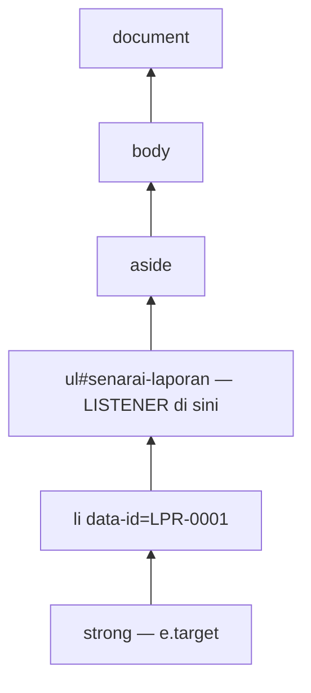

# 07 · DOM, Event & Borang — Membina Antara Muka GeoLapor dengan Selamat

> Nota topikal (rujukan merentas hari) · Indeks: [`README.md`](./README.md)

## Objektif nota

- **Memilih** elemen dengan `getElementById`, `querySelector(All)` dan **merentas** pokok DOM (`closest`, `children`, `parentElement`).
- **Mencipta dan mengubah** elemen, atribut, kelas dan gaya; **merender** senarai laporan dari data API **tanpa** risiko XSS (`textContent`/`createElement`, bukan `innerHTML` dengan data pengguna).
- **Mengendali** event `click`, `input`, `change`, `keyup`, `submit` dan **menggunakan** event delegation untuk senarai dinamik.
- **Membina** borang laporan dengan validasi asas (HTML + JS), `FormData`, POST JSON, dan **memaparkan** error 422 di sebelah medan.

---

## 1. Kenapa DOM?

API memberi **data**; pengguna melihat **halaman**. **DOM** (Document Object Model) ialah jambatan: browser menukar HTML kepada pokok objek JavaScript yang boleh dibaca dan diubah. Setiap kali GeoLapor menambah item senarai, menukar lencana status, atau menunjukkan error borang — itu manipulasi DOM.

```text
document
└── html
    ├── head
    └── body
        ├── header#kepala
        ├── main
        │   ├── div#peta                    ← Leaflet (nota 08)
        │   ├── aside#panel
        │   │   ├── form#borang-penapis
        │   │   └── ul#senarai-laporan      ← li[data-id="LPR-0001"] …
        │   └── form#borang-laporan
        └── div#notis[role=status]
```

---

## 2. Memilih & merentas

```js
// Satu elemen
const peta = document.getElementById('peta');                    // pantas, ikut id
const senarai = document.querySelector('#senarai-laporan');       // pemilih CSS
const butangHantar = document.querySelector('#borang-laporan button[type="submit"]');

// Banyak elemen → NodeList (statik)
const semuaLi = document.querySelectorAll('#senarai-laporan li');
semuaLi.forEach((li) => li.classList.remove('dipilih'));
const ids = [...semuaLi].map((li) => li.dataset.id);             // tukar ke array untuk map/filter

// Dalam elemen tertentu (lebih pantas & tepat)
const borang = document.querySelector('#borang-laporan');
const inputTajuk = borang.querySelector('[name="tajuk"]');
const inputLat = borang.elements.lat;                             // borang.elements ikut name

// Merentas
const li = senarai.querySelector('li');
li.parentElement;          // ul#senarai-laporan
li.nextElementSibling;     // li seterusnya (atau null)
senarai.children;          // HTMLCollection anak elemen
li.closest('aside');       // nenek moyang terdekat yang padan pemilih — PENTING untuk delegasi
```

> ⚠️ **`null` kerana skrip terlalu awal / pemilih salah.** `Cannot read properties of null (reading 'addEventListener')` = `querySelector` tidak jumpa. Semak: (1) `defer`/`type="module"`? (2) id dieja sama (`senarai-laporan` vs `senaraiLaporan`)? (3) `#` untuk id dalam `querySelector`, **tanpa** `#` untuk `getElementById`.

---

## 3. `textContent` vs `innerHTML` — isu keselamatan

Bayangkan pengguna menghantar laporan dengan tajuk:

```text

```

```js
// ❌ BAHAYA — string dijadikan HTML; onerror DILAKSANAKAN pada setiap browser yang memaparkan senarai
li.innerHTML = `<strong>${laporan.tajuk}</strong>`;

// ✅ SELAMAT — dipaparkan sebagai teks, tiada HTML dilaksanakan
const strong = document.createElement('strong');
strong.textContent = laporan.tajuk;
li.append(strong);
```

Inilah **XSS (Cross-Site Scripting)** tersimpan: data dari API (yang asalnya dari pengguna lain) dilaksanakan sebagai kod dalam browser anda. Popup Leaflet juga sama — `marker.bindPopup(teksPengguna)` menerima HTML!

| Property / API | Tafsir sebagai | Guna untuk data pengguna? |
|-------------|----------------|---------------------------|
| `el.textContent = s` | Teks biasa | ✅ Ya |
| `document.createElement` + `append` | Nod DOM | ✅ Ya |
| `el.setAttribute('title', s)` | Nilai atribut (bukan `href`/`src`/`on*`) | ✅ Ya |
| `el.innerHTML = s` | **HTML** | ❌ Tidak (hanya untuk templat statik anda sendiri) |
| `el.insertAdjacentHTML` | **HTML** | ❌ Tidak |
| `a.href = s` | URL — `javascript:` boleh dilaksana | ⚠️ Sahkan skema `https:` dahulu |
| `L.marker().bindPopup(s)` (Leaflet) | **HTML** | ⚠️ Hantar **elemen DOM**, bukan string |

> **Peraturan projek:** jangan gunakan `innerHTML` dengan data pengguna. Jika HTML kaya benar-benar diperlukan, sanitasi dengan pustaka seperti DOMPurify — tetapi dalam GeoLapor kita tidak memerlukannya.

---

## 4. Mencipta & mengubah elemen

### 4.1 Fungsi render satu laporan

```js
const LABEL_STATUS = { baharu: 'Baharu', 'dalam-tindakan': 'Dalam tindakan', selesai: 'Selesai', ditolak: 'Ditolak' };

function elemenLaporan(feature) {
  const { id, tajuk, kategori, status } = feature.properties;
  const [lng, lat] = feature.geometry.coordinates;

  const li = document.createElement('li');
  li.className = 'laporan';
  li.dataset.id = id;                              // → data-id="LPR-0001" (untuk delegasi)
  li.tabIndex = 0;                                 // boleh difokus dengan papan kekunci

  const tajukEl = document.createElement('strong');
  tajukEl.textContent = tajuk;                     // ✅ selamat

  const lencana = document.createElement('span');
  lencana.classList.add('lencana', `status-${status}`);   // kelas untuk warna CSS
  lencana.textContent = LABEL_STATUS[status] ?? status;

  const meta = document.createElement('small');
  meta.textContent = `${kategori} · ${lat.toFixed(4)}, ${lng.toFixed(4)}`;

  const padam = document.createElement('button');
  padam.type = 'button';
  padam.dataset.tindakan = 'padam';
  padam.textContent = 'Padam';
  padam.setAttribute('aria-label', `Padam laporan ${id}`);

  li.append(tajukEl, lencana, meta, padam);
  return li;
}
```

### 4.2 Render senarai — sekali ke DOM

```js
function renderSenarai(ul, features) {
  if (features.length === 0) {
    const kosong = document.createElement('li');
    kosong.className = 'kosong';
    kosong.textContent = 'Tiada laporan sepadan dengan penapis.';
    ul.replaceChildren(kosong);
    return;
  }
  ul.replaceChildren(...features.map(elemenLaporan));   // ganti semua anak dalam SATU operasi
}
```

> 💡 `replaceChildren(...)` membersihkan dan mengisi semula dalam satu langkah — lebih ringkas daripada `ul.innerHTML = ''` + loop `appendChild`, dan browser hanya melukis semula sekali. Untuk ratusan item, `DocumentFragment` memberi kesan yang sama.

### 4.3 Atribut, kelas, gaya

```js
li.classList.add('dipilih');
li.classList.toggle('dipilih', idDipilih === li.dataset.id);   // paksa on/off ikut syarat
li.classList.contains('dipilih');

butangHantar.disabled = true;                  // property boolean
butangHantar.setAttribute('aria-busy', 'true');
li.hidden = true;                              // sembunyi (lebih jelas daripada style.display)

// Gaya: utamakan KELAS CSS. Gaya sebaris hanya untuk nilai dinamik.
lencana.style.backgroundColor = warnaIkutKod[kategori] ?? '#6c757d';
document.documentElement.style.setProperty('--tinggi-peta', '60vh');  // CSS variable
```

---

## 5. Event

### 5.1 `addEventListener`

```js
const inputCari = document.querySelector('#cari');
const pilihKategori = document.querySelector('#penapis-kategori');

inputCari.addEventListener('input', (e) => {      // setiap perubahan (taip, tampal, padam)
  console.log('carian:', e.target.value);
});
pilihKategori.addEventListener('change', (e) => {  // bila nilai <select> dipilih
  console.log('kategori:', e.target.value);
});
inputCari.addEventListener('keyup', (e) => {
  if (e.key === 'Escape') {                         // e.key, bukan keyCode (lapuk)
    inputCari.value = '';
    inputCari.dispatchEvent(new Event('input'));    // cetuskan semula penapisan
  }
});
```

| Event | Bila | Guna dalam GeoLapor |
|-------|------|---------------------|
| `click` | Klik / Enter pada butang | Butang padam, item senarai |
| `input` | Setiap perubahan nilai | Carian `q` (dengan debounce) |
| `change` | Nilai disahkan (select, checkbox, selepas blur untuk text) | Penapis kategori/status, togol layer |
| `keyup` / `keydown` | Kekunci | `Escape` kosongkan carian, `Enter` pada item senarai |
| `submit` | Borang dihantar (butang atau Enter) | Borang laporan |
| `DOMContentLoaded` | DOM siap | Tidak perlu jika guna `defer`/`module` |

> ⚠️ **`addEventListener('click', simpan())`** — tanda kurung memanggil fungsi **serta-merta** dan mendaftarkan hasilnya (`undefined`). Hantar rujukan: `addEventListener('click', simpan)` atau `() => simpan(id)`.

### 5.2 Event delegation — satu listener untuk seluruh senarai

Senarai dirender semula setiap kali penapis berubah. Jika setiap `<li>` ada listener sendiri, anda perlu memasangnya semula setiap kali (dan listener lama mungkin bocor). **Delegasi**: pasang **satu** listener pada induk yang kekal; gunakan *bubbling* dan `closest()` untuk tahu apa yang diklik.

```js
senarai.addEventListener('click', async (e) => {
  const li = e.target.closest('li[data-id]');         // klik pada <strong>/<small> pun sampai ke li
  if (!li || !senarai.contains(li)) return;           // klik di luar item
  const id = li.dataset.id;

  if (e.target.closest('[data-tindakan="padam"]')) {
    e.stopPropagation();
    if (!confirm(`Padam ${id}?`)) return;
    await padamLaporan(id);                           // services/api.js
    li.remove();
    return;
  }
  pilihLaporan(id);                                   // zum peta ke marker (Hari 3 S3)
});

// Aksesibiliti: Enter pada item yang difokus
senarai.addEventListener('keydown', (e) => {
  if (e.key === 'Enter' && e.target.matches('li[data-id]')) pilihLaporan(e.target.dataset.id);
});
```



> 💡 **`e.target` vs `e.currentTarget`:** `target` = elemen paling dalam yang diklik (`<strong>`); `currentTarget` = elemen yang memegang listener (`<ul>`). Delegasi menggunakan `target.closest(...)`.

### 5.3 Event peta (preview nota 08)

```js
peta.on('click', (e) => {                          // Leaflet: e.latlng = { lat, lng }
  borang.elements.lat.value = e.latlng.lat.toFixed(6);
  borang.elements.lng.value = e.latlng.lng.toFixed(6);
});
```

---

## 6. Borang

### 6.1 HTML dengan validasi terbina

```html
<form id="borang-laporan" novalidate>
  <label for="tajuk">Tajuk</label>
  <input id="tajuk" name="tajuk" required minlength="5" maxlength="120" aria-describedby="ralat-tajuk">
  <p id="ralat-tajuk" class="ralat" aria-live="polite"></p>

  <label for="kategori">Kategori</label>
  <select id="kategori" name="kategori" required>
    <option value="">— pilih —</option>
    <!-- diisi dari GET /api/kategori -->
  </select>
  <p id="ralat-kategori" class="ralat" aria-live="polite"></p>

  <label for="catatan">Catatan</label>
  <textarea id="catatan" name="catatan" maxlength="1000"></textarea>

  <fieldset>
    <legend>Lokasi (klik peta)</legend>
    <input name="lat" inputmode="decimal" required placeholder="lat cth 2.9264" aria-describedby="ralat-lat">
    <input name="lng" inputmode="decimal" required placeholder="lng cth 101.6958" aria-describedby="ralat-lng">
    <p id="ralat-lat" class="ralat"></p>
    <p id="ralat-lng" class="ralat"></p>
  </fieldset>

  <button type="submit">Hantar laporan</button>
</form>
```

`novalidate` mematikan gelembung error default browser supaya **kita** memaparkan mesej BM yang konsisten — tetapi atribut `required`/`minlength` masih boleh disemak melalui `checkValidity()`.

### 6.2 Isi `<select>` dari API

```js
const kategori = await senaraiKategori();       // [{ kod, nama, warna }]
const pilih = borang.elements.kategori;
for (const { kod, nama } of kategori) {
  pilih.append(new Option(nama, kod));          // new Option(teks, nilai) — selamat (teks)
}
```

### 6.3 Hantar: `FormData` → validasi → POST JSON → 422

```js
import { ciptaLaporan, ApiError } from './services/api.js';
import { dalamMalaysia } from './utils/geo.js';

function validasi(data) {
  const ralat = {};
  if (data.tajuk.length < 5) ralat.tajuk = 'Tajuk sekurang-kurangnya 5 aksara.';
  if (!data.kategori) ralat.kategori = 'Sila pilih kategori.';
  if (!Number.isFinite(data.lat) || !Number.isFinite(data.lng)) {
    ralat.lat = 'Koordinat tidak sah — klik pada peta.';
  } else if (!dalamMalaysia([data.lng, data.lat])) {
    ralat.lat = 'Lokasi di luar Malaysia. Adakah lat/lng tertukar?';
  }
  return ralat;
}

function paparRalatMedan(borang, ralat = {}) {
  for (const el of borang.querySelectorAll('.ralat')) el.textContent = '';   // kosongkan dahulu
  for (const input of borang.querySelectorAll('[aria-invalid]')) input.removeAttribute('aria-invalid');

  for (const [medan, mesej] of Object.entries(ralat)) {
    const p = borang.querySelector(`#ralat-${medan}`);
    if (p) p.textContent = mesej;                                              // ✅ textContent
    borang.elements[medan]?.setAttribute('aria-invalid', 'true');
  }
  const pertama = Object.keys(ralat)[0];
  if (pertama) borang.elements[pertama]?.focus();                              // bawa pengguna ke medan error
}

borang.addEventListener('submit', async (e) => {
  e.preventDefault();                               // ⚠️ tanpa ini halaman dimuat semula

  const fd = new FormData(borang);
  const data = {
    tajuk: fd.get('tajuk').trim(),
    kategori: fd.get('kategori'),
    catatan: fd.get('catatan').trim(),
    lat: fd.get('lat') === '' ? NaN : Number(fd.get('lat')),   // '' → NaN, bukan 0
    lng: fd.get('lng') === '' ? NaN : Number(fd.get('lng')),
  };

  const ralat = validasi(data);                     // 1. validasi klien — pantas, mesra
  paparRalatMedan(borang, ralat);
  if (Object.keys(ralat).length) return;

  const butang = borang.querySelector('[type="submit"]');
  butang.disabled = true;                           // 2. halang klik berganda → laporan pendua
  butang.textContent = 'Menghantar…';
  try {
    const baharu = await ciptaLaporan(data);        // 3. POST JSON → 201 Feature
    notis(`Laporan ${baharu.id} berjaya dihantar.`);
    borang.reset();
    tambahKePetaDanSenarai(baharu);
  } catch (err) {
    if (err instanceof ApiError && err.status === 422) {
      paparRalatMedan(borang, err.medan ?? {});     // 4. validasi SERVER menang
    } else {
      notis(err.message, 'ralat');
    }
  } finally {
    butang.disabled = false;
    butang.textContent = 'Hantar laporan';
  }
});
```

**Kenapa validasi dua kali?** Validasi klien untuk **pengalaman pengguna** (maklum balas segera). Validasi server untuk **kebenaran** — sesiapa boleh memintas JS dengan `curl`. Server sentiasa menjadi hakim terakhir; UI mesti boleh memaparkan `medan` dari 422.

> 💡 `Object.fromEntries(new FormData(borang))` menukar semua medan kepada objek sekali gus — berguna, tetapi ingat semua nilai ialah **string** (atau `File`). Tukar nombor secara eksplisit.

### 6.4 Notis yang boleh dibaca pembaca skrin

```js
const kotakNotis = document.querySelector('#notis');     // <div id="notis" role="status" aria-live="polite">
function notis(mesej, jenis = 'info') {
  kotakNotis.className = `notis notis-${jenis}`;
  kotakNotis.textContent = mesej;                         // ✅ textContent
  clearTimeout(notis.pemasa);
  notis.pemasa = setTimeout(() => (kotakNotis.textContent = ''), 5000);
}
```

---

## 7. Prestasi DOM — ringkas

| Amalan | Kenapa |
|--------|--------|
| Bina dahulu, masukkan ke DOM sekali (`replaceChildren`, `DocumentFragment`) | Elak lukis semula berulang |
| Delegasi untuk senarai | Satu listener vs 400 |
| Debounce `input` carian (300 ms — [nota 02](./02-fungsi-skop-closure.md) §7.3) | Kurang render & request |
| Jangan baca `offsetHeight` dalam loop yang menulis gaya | Elak *layout thrashing* |
| Ratusan marker → clustering (Hari 5, [nota 08](./08-web-mapping-leaflet.md)) | DOM peta ringan |

---

## ⚠️ Kesilapan lazim

| Kesilapan | Gejala | Pembetulan |
|-----------|--------|------------|
| `innerHTML` dengan tajuk/catatan pengguna | XSS; HTML rosak jika tajuk ada `<` | `textContent` / `createElement` |
| `bindPopup(\`<b>${tajuk}</b>\`)` | XSS dalam popup peta | Bina elemen, `bindPopup(el)` |
| Lupa `e.preventDefault()` pada submit | Halaman dimuat semula, data hilang, tiada error kelihatan | `e.preventDefault()` baris pertama |
| `querySelector('peta')` (tanpa `#`) | `null` | `#peta` atau `getElementById('peta')` |
| Listener pada setiap `<li>` selepas render semula | Klik berganda / tiada tindak balas | Delegasi pada `<ul>` |
| `e.target.dataset.id` terus | `undefined` bila klik anak `<strong>` | `e.target.closest('li[data-id]')` |
| `Number(fd.get('lat'))` untuk medan kosong | `0` lulus validasi | Semak `''` dahulu → `NaN` |
| Butang tidak dinyahaktif semasa hantar | Laporan pendua | `disabled = true` + `finally` |
| Hanya validasi klien | Data tidak sah melalui `curl` | Papar 422 `medan` dari server |
| Error tidak dikosongkan antara hantaran | Mesej lama kekal | Kosongkan semua `.ralat` dahulu |
| `addEventListener('click', f())` | Fungsi jalan sekali, klik tiada kesan | `addEventListener('click', f)` |

---

## 📖 Bacaan buku

> *JavaScript All-in-One For Dummies* (Minnick, 2023) — pengayaan selepas nota ini. Halaman PDF = muka surat cetak + 24.
>
> - **Apa itu DOM; bila skrip berjalan (`defer`, `async`)** — B2 · Bab 1 (What a Web Browser Does), *The Rendering Engine; Identifying and preventing render blocking; Unblocking your code with async and defer* — ms. 235–239 (**PDF 259–263**)
> - **Memilih elemen** — B2 · Bab 2 (Programming the Browser), *Introducing the HTML DOM; Selecting element nodes* — ms. 249–254 (**PDF 273–278**)
> - **Cipta & sisip elemen, `innerHTML`, `classList`, method elemen** — B2 · Bab 2 (Programming the Browser), *Creating and adding elements to the DOM; Element nodes; Element methods* — ms. 254–257 (**PDF 278–281**)
> - **`addEventListener`, objek event, bubbling, event tersuai** — B1 · Bab 10 (Making Things Happen with Events), *Listening for Events* — ms. 184–195 (**PDF 208–219**)
> - **`submit` & `preventDefault`** — B1 · Bab 10 (Making Things Happen with Events), *Preventing default actions* — ms. 195–196 (**PDF 219–220**)


## Rujukan rasmi

- MDN — Introduction to the DOM: <https://developer.mozilla.org/en-US/docs/Web/API/Document_Object_Model/Introduction>
- MDN — `Document.querySelector()`: <https://developer.mozilla.org/en-US/docs/Web/API/Document/querySelector>
- MDN — `Element.closest()`: <https://developer.mozilla.org/en-US/docs/Web/API/Element/closest>
- MDN — `Node.textContent`: <https://developer.mozilla.org/en-US/docs/Web/API/Node/textContent>
- MDN — `Element.innerHTML` (pertimbangan keselamatan): <https://developer.mozilla.org/en-US/docs/Web/API/Element/innerHTML>
- MDN — `Element.replaceChildren()`: <https://developer.mozilla.org/en-US/docs/Web/API/Element/replaceChildren>
- MDN — Event bubbling & delegation: <https://developer.mozilla.org/en-US/docs/Learn_web_development/Core/Scripting/Event_bubbling>
- MDN — `FormData`: <https://developer.mozilla.org/en-US/docs/Web/API/FormData>
- MDN — Client-side form validation: <https://developer.mozilla.org/en-US/docs/Learn_web_development/Extensions/Forms/Form_validation>
- MDN — ARIA live regions: <https://developer.mozilla.org/en-US/docs/Web/Accessibility/ARIA/Guides/Live_regions>
- OWASP — Cross Site Scripting Prevention Cheat Sheet: <https://cheatsheetseries.owasp.org/cheatsheets/Cross_Site_Scripting_Prevention_Cheat_Sheet.html>
- Leaflet — `bindPopup` (menerima String | HTMLElement): <https://leafletjs.com/reference.html#layer-bindpopup>

## Digunakan pada Hari N

| Hari | Sesi | Bahagian nota |
|------|------|---------------|
| 3 | S1 · DOM Selection & Traversal | §1–2 (pokok DOM, pemilihan, `closest`) → rangka halaman GeoLapor |
| 3 | S2 · DOM Element Manipulation | §3 (`textContent` vs `innerHTML`), §4 (render senarai dari API, kelas, gaya) |
| 3 | S3 · Event Handling | §5 (`click/input/change/keyup`, delegasi, event peta) → klik senarai zum marker |
| 3 | S4 · Form Handling | §6 (validasi, `FormData`, POST JSON, 422) → borang laporan baharu |
| 4 | S4 · Browser Storage | §6.3 (simpan draf borang — lihat [nota 12](./12-storan-pelayar.md)) |
| 5 | S3 · Best Practices & Conclusion | §3 (senarai semak keselamatan XSS), §7 (prestasi) |
