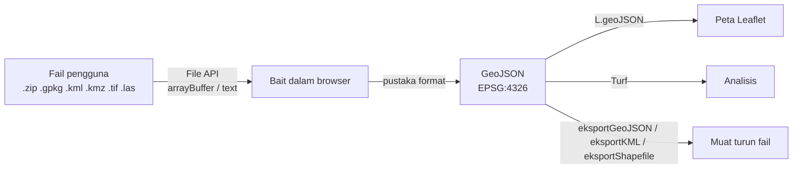

# 09 · Format Data Geospatial: Baca, Tulis & Tukar dalam JavaScript

> Nota topikal · Indeks: [`./README.md`](./README.md)

## Objektif nota

Selepas membaca nota ini, anda boleh:

- **Mengelaskan** format geospatial kepada vektor, raster dan khusus, dan **menyatakan** kelebihan/kekurangan setiap satu (Shapefile, GeoPackage, GeoJSON, GeoTIFF, ECW, KML/KMZ, LAS/LAZ + COG, FlatGeobuf, PMTiles, MBTiles, WKT/WKB, CSV).
- **Memilih** pustaka JavaScript yang betul untuk membaca/menulis setiap format dan **menukarnya** kepada GeoJSON untuk dipaparkan dalam Leaflet.
- **Menukar** koordinat antara WGS84 (EPSG:4326), GDM2000 (EPSG:4742), Peninsula RSO (EPSG:3375) dan Borneo RSO (EPSG:3376) menggunakan proj4.
- **Menggunakan** GDAL/ogr2ogr untuk kerja penukaran yang tidak sesuai dibuat dalam browser (ECW, fail besar, projection rumit).

---

## 1. Kenapa format penting untuk pembangun web?

Pegawai PGN bekerja dengan data dalam pelbagai format — Shapefile daripada kontraktor, GeoPackage daripada QGIS, KML daripada Google Earth, GeoTIFF/ECW daripada imejan udara, LAS daripada survei LiDAR. Browser pula hanya faham **JSON, teks, imej dan bait mentah (`ArrayBuffer`)**.

Kerja kita di Hari 4 ialah menjadi **penterjemah**:



> **Prinsip:** Dalam aplikasi, **GeoJSON dalam EPSG:4326** ialah "bahasa perantaraan". Semua format dibaca → ditukar ke GeoJSON 4326 → baru digunakan. Eksport dibuat dari GeoJSON juga.

---

## 2. Peta format (ringkasan)

| Format | Jenis | Satu fail? | Teks/Binari | Baca dalam JS | Tulis dalam JS | Catatan |
|--------|-------|-----------|-------------|---------------|----------------|---------|
| **GeoJSON** `.geojson/.json` | Vektor | Ya | Teks (JSON) | `JSON.parse` | `JSON.stringify` | Natif web; wajib WGS84 (RFC 7946) |
| **Shapefile** `.shp .shx .dbf .prj` | Vektor | **Tidak** (≥3 fail; biasa di-zip) | Binari | **shpjs** | **@mapbox/shp-write** | Nama medan ≤10 aksara, 2 GB had |
| **GeoPackage** `.gpkg` | Vektor + raster | Ya | SQLite | **sql.js** (+ nyahkod WKB) | (lanjutan: GDAL/server) | Standard OGC moden |
| **KML / KMZ** `.kml .kmz` | Vektor (+ overlay) | Ya | XML / ZIP | **@tmcw/togeojson** (+ **JSZip** untuk KMZ) | **tokml** | Google Earth; sentiasa WGS84 |
| **GeoTIFF** `.tif` | Raster | Ya | Binari | **geotiff** (geotiff.js) | geotiff.js `writeArrayBuffer` (asas) | Imej + georujukan |
| **COG** `.tif` | Raster | Ya | Binari | geotiff.js (`fromUrl` + HTTP Range) | GDAL `-of COG` | GeoTIFF disusun untuk web |
| **ECW** `.ecw` | Raster | Ya | Binari proprietari | **Tiada pustaka JS** | — | Tukar dengan GDAL/QGIS → GeoTIFF/COG |
| **LAS / LAZ** `.las .laz` | Point cloud | Ya | Binari | **@loaders.gl/las** | (PDAL) | LAZ = LAS mampat |
| **FlatGeobuf** `.fgb` | Vektor | Ya | Binari | **flatgeobuf** | flatgeobuf | Strim + indeks ruang, pantas |
| **PMTiles** `.pmtiles` | Tile | Ya | Binari | **pmtiles** | (tippecanoe/go-pmtiles) | Satu fail tile, dihidang HTTP Range |
| **MBTiles** `.mbtiles` | Tile | Ya | SQLite | sql.js (asas) / server | (tippecanoe, GDAL) | Perlu tile server biasanya |
| **WKT / WKB** | Geometri | — | Teks / Binari | **wellknown**, **wkx** | sama | Format dalam DB (PostGIS) |
| **CSV lat/lng** | Titik | Ya | Teks | **papaparse** | papaparse `unparse` | Paling biasa dari Excel |
| **GML** `.gml` | Vektor | Ya | XML | (OpenLayers `ol/format/GML`) | sama | Output default WFS |

---

## 3. Vektor

### 3.1 GeoJSON — asas semua

```json
{
  "type": "FeatureCollection",
  "features": [
    {
      "type": "Feature",
      "id": "LPR-0001",
      "geometry": { "type": "Point", "coordinates": [101.6958, 2.9264] },
      "properties": { "tajuk": "Papan tanda sempadan rosak", "kategori": "infrastruktur" }
    }
  ]
}
```

- ✅ Mudah dibaca manusia, natif dalam JS, disokong semua pustaka peta.
- ❌ Besar (teks), tiada indeks ruang, **mesti** WGS84 `[lng, lat]` — tiada medan `crs` dalam RFC 7946 (versi lama 2008 ada; jangan bergantung padanya).

```js
// io/format.js — eksportGeoJSON (nama TANPA sambungan; fungsi menambah .geojson)
export function eksportGeoJSON(fc, nama = 'laporan') {
  const blob = new Blob([JSON.stringify(fc, null, 2)], { type: 'application/geo+json' });
  muatTurun(blob, `${nama}.geojson`);
}

// Pembantu dalaman — cipta <a download> sementara
function muatTurun(blob, namaFail) {
  const url = URL.createObjectURL(blob);
  const a = document.createElement('a');
  a.href = url;
  a.download = namaFail;
  document.body.append(a);
  a.click();
  a.remove();
  setTimeout(() => URL.revokeObjectURL(url), 1000); // beri masa browser mula muat turun, kemudian bebaskan ingatan
}
```

### 3.2 Shapefile — "standard lama" yang masih ada di mana-mana

| Fail | Isi |
|------|-----|
| `.shp` | Geometri |
| `.shx` | Indeks kedudukan geometri |
| `.dbf` | Atribut (dBase) — nama medan **≤ 10 aksara**, tiada jenis tarikh-masa penuh |
| `.prj` | Sistem koordinat (WKT) — **tanpanya, anda tidak tahu projection!** |
| `.cpg` | Pengekodan aksara (cth `UTF-8`) — tanpanya huruf jawi/aksen boleh rosak |

Kerana berbilang fail, pengguna web biasanya memuat naik **`.zip`**.

```js
import shp from 'shpjs';

// Baca .zip Shapefile → GeoJSON. Jika .prj ada DAN proj4 faham, shpjs tukar ke WGS84 automatik.
const buf = await fail.arrayBuffer();
const hasil = await shp(buf);
// ⚠️ Satu layer → FeatureCollection; berbilang .shp dalam zip → ARRAY FeatureCollection
const senarai = Array.isArray(hasil) ? hasil : [hasil];
```

```js
import shpwrite from '@mapbox/shp-write';

// io/format.js — eksportShapefile
export async function eksportShapefile(fc, nama = 'laporan') {
  // Nama medan DBF maksimum 10 aksara; satu jenis geometri per fail .shp
  const blob = await shpwrite.zip(fc, {
    outputType: 'blob',
    compression: 'DEFLATE',
    types: { point: nama, polygon: `${nama}-poligon`, polyline: `${nama}-garisan` },
  });
  muatTurun(blob, `${nama}.zip`); // mengandungi .shp .shx .dbf .prj (WGS84)
}
```

> ⚠️ **Perangkap `.prj` RSO (diuji):** `shp(buf)` menggunakan proj4 untuk mentafsir `.prj`. Fail `.prj` gaya **OGC WKT** EPSG:3375 ditukar dengan betul, tetapi **ESRI WKT** (`PROJECTION["Rectified_Skew_Orthomorphic_Natural_Origin"]`, lazim daripada ArcGIS/QGIS "ESRI") menyebabkan error `Could not get projection name`. Tanpa `.prj` langsung, koordinat kekal dalam meter RSO.

Pendekatan yang disyorkan: `io/format.js` anda patut **membaca `.prj` sendiri** dan memilih bila hendak reproject:

```js
// io/format.js (petikan) — kawal projection secara eksplisit
import JSZip from 'jszip';
import { parseShp, parseDbf, combine } from 'shpjs';
import { keWgs84, prjIalahRso, prjIalahGeografi } from '../utils/unjuran.js';

const zip = await JSZip.loadAsync(arrayBuffer);
// ... cari .shp, .dbf, .prj, .cpg dengan nama asas yang sama ...
let fc = combine([parseShp(shpBuf), dbfBuf ? parseDbf(dbfBuf, cpgTeks) : undefined]); // koordinat MENTAH

if (prjTeks && prjIalahRso(prjTeks)) {
  fc = keWgs84(fc, 'EPSG:3375');   // kenal pasti RSO dengan regex (OGC atau ESRI WKT) → WGS84
} else if (prjTeks && !prjIalahGeografi(prjTeks)) {
  fc = keWgs84(fc, prjTeks);       // CRS terunjur lain: cuba WKT terus dengan proj4
}
```

### 3.3 GeoPackage — pengganti moden Shapefile

GeoPackage (OGC) ialah **fail SQLite** dengan jadual metadata piawai:

| Jadual | Guna |
|--------|------|
| `gpkg_contents` | Senarai layer (`table_name`, `data_type` = `features`/`tiles`) |
| `gpkg_geometry_columns` | Lajur geometri & `srs_id` setiap layer |
| `gpkg_spatial_ref_sys` | Definisi CRS |
| *(jadual anda)* | cth `kemudahan` — setiap baris satu feature; geometri = **blob GPKG** (header `GP` + WKB) |

- ✅ Satu fail, tiada had 10 aksara, berbilang layer, boleh simpan raster, disokong QGIS/ArcGIS.
- ❌ Perlu enjin SQLite — dalam browser = **sql.js** (WebAssembly, ~1 MB).

```js
import initSqlJs from 'sql.js';
import wasmUrl from 'sql.js/dist/sql-wasm.wasm?url'; // Vite: dapatkan URL fail wasm

/** Nyahkod geometri GeoPackage (header GP + WKB) — Point sahaja (tahap asas kursus). */
function gpkgKeTitik(blob) {
  const dv = new DataView(blob.buffer, blob.byteOffset, blob.byteLength);
  if (dv.getUint8(0) !== 0x47 || dv.getUint8(1) !== 0x50) throw new Error('Bukan geometri GPKG'); // 'G','P'
  const bendera = dv.getUint8(3);
  const jenisEnvelope = (bendera >> 1) & 0b111;            // 0 = tiada, 1 = xy, 2/3 = xyz/xym, 4 = xyzm
  const saizEnvelope = [0, 32, 48, 48, 64][jenisEnvelope];
  const o = 8 + saizEnvelope;                              // WKB bermula selepas header 8 bait + envelope
  const wkbLe = dv.getUint8(o) === 1;                      // 1 = little-endian
  const jenis = dv.getUint32(o + 1, wkbLe);
  if (jenis !== 1) throw new Error(`Jenis WKB ${jenis} belum disokong`);
  return [dv.getFloat64(o + 5, wkbLe), dv.getFloat64(o + 13, wkbLe)]; // [x, y] = [lng, lat] jika 4326
}

// Versi ringkas (titik sahaja). Boleh dilanjutkan menjadi parser WKB penuh:
// Point, LineString, Polygon, Multi*, GeometryCollection + reprojection jika srs_id = 3375.
async function bacaGeoPackageTitik(arrayBuffer) {
  const SQL = await initSqlJs({ locateFile: () => wasmUrl });
  const db = new SQL.Database(new Uint8Array(arrayBuffer));
  try {
    const [{ values }] = db.exec(`
      SELECT c.table_name, g.column_name, c.srs_id
      FROM gpkg_contents c JOIN gpkg_geometry_columns g USING (table_name)
      WHERE c.data_type = 'features'`);
    const [jadual, lajurGeom] = values[0];               // layer pertama (asas)
    const stmt = db.prepare(`SELECT * FROM "${jadual}"`);
    const features = [];
    while (stmt.step()) {
      const { [lajurGeom]: geom, ...properties } = stmt.getAsObject(); // asingkan geometri daripada atribut
      features.push({ type: 'Feature', geometry: { type: 'Point', coordinates: gpkgKeTitik(geom) }, properties });
    }
    stmt.free();
    return { type: 'FeatureCollection', features };
  } finally {
    db.close();
  }
}
```

> 💡 **Tip:** Kod di atas sengaja terhad kepada **Point** (cukup untuk `kemudahan.gpkg`) supaya struktur header `GP` + WKB jelas. Untuk poligon/garisan, lanjutkan `bacaWkb()` sendiri, gunakan pustaka WKB (`wkx`), atau tukar GPKG → GeoJSON di server dengan `ogr2ogr`.

### 3.4 KML / KMZ

KML = XML (Google Earth). KMZ = **ZIP** yang mengandungi `doc.kml` (+ ikon/imej).

```js
import { kml } from '@tmcw/togeojson';
import JSZip from 'jszip';

function bacaKml(teks) {
  const dokumen = new DOMParser().parseFromString(teks, 'text/xml'); // DOMParser natif browser
  if (dokumen.querySelector('parsererror')) throw new Error('Fail KML tidak sah (XML rosak)');
  return kml(dokumen); // FeatureCollection; properties termasuk name, description + ExtendedData
}

async function bacaKmz(arrayBuffer) {
  const zip = await JSZip.loadAsync(arrayBuffer);
  // Konvensyen: fail utama ialah doc.kml; jika tiada, ambil .kml pertama
  const utama = zip.file('doc.kml') ?? zip.file(/\.kml$/i)[0];
  if (!utama) throw new Error('Tiada fail .kml dalam KMZ');
  return bacaKml(await utama.async('string'));
}
```

```js
import tokml from 'tokml';

export function eksportKML(fc, nama = 'laporan') {
  const teks = tokml(fc, {
    name: 'tajuk',          // properties.tajuk → <name>
    description: 'catatan', // properties.catatan → <description>
    documentName: nama,
  });
  muatTurun(new Blob([teks], { type: 'application/vnd.google-earth.kml+xml' }), `${nama}.kml`);
}
```

Kedua-dua arah diuji: `tokml` → `togeojson` memulangkan geometri & atribut yang sama, ditambah `name`/`description`.

### 3.5 Format vektor lain yang patut dikenali

| Format | Kenapa relevan | JS |
|--------|---------------|-----|
| **FlatGeobuf** `.fgb` | Binari, ada indeks ruang; boleh strim hanya feature dalam bbox melalui HTTP Range — sangat pantas untuk set data besar | `import { deserialize } from 'flatgeobuf/lib/mjs/geojson.js'` → `for await (const f of deserialize(url, bbox))` |
| **WKT** | `POINT (101.6958 2.9264)` — cara geometri ditulis dalam SQL/PostGIS | `wellknown.parse(wkt)` → GeoJSON geometry; `wellknown.stringify(geom)` |
| **WKB** | Binari WKT — lajur `geometry` dalam PostGIS/GeoPackage | `wkx` (`Geometry.parse(buffer).toGeoJSON()`) |
| **CSV lat/lng** | Eksport Excel paling biasa | `Papa.parse(teks, { header: true, dynamicTyping: true, skipEmptyLines: true })` |
| **GML** | Output default WFS; XML verbose | minta `outputFormat=application/json` sahaja jika boleh |

```js
import Papa from 'papaparse';

// CSV → GeoJSON (diuji). Perhatikan tukar susunan: CSV ada lat,lng → GeoJSON [lng, lat]
export function csvKeGeoJSON(teks) {
  const { data, errors } = Papa.parse(teks, { header: true, dynamicTyping: true, skipEmptyLines: true });
  if (errors.length) throw new Error(`CSV rosak baris ${errors[0].row}: ${errors[0].message}`);
  return {
    type: 'FeatureCollection',
    features: data
      .filter((r) => Number.isFinite(r.lat) && Number.isFinite(r.lng))
      .map(({ lat, lng, ...properties }) => ({
        type: 'Feature',
        geometry: { type: 'Point', coordinates: [lng, lat] },
        properties,
      })),
  };
}
```

---

## 4. Raster

### 4.1 GeoTIFF & COG

GeoTIFF = TIFF biasa + **tag georujukan** (titik ikat, saiz piksel, key CRS). Setiap piksel ialah nilai (cth ketinggian, suhu, reflektans).

```js
import { fromArrayBuffer } from 'geotiff';

// io/raster.js — bacaGeoTIFF(arrayBuffer) (diuji dengan GeoTIFF 4×3 Float32 sintetik)
export async function bacaGeoTIFF(arrayBuffer) {
  const tiff = await fromArrayBuffer(arrayBuffer);
  const imej = await tiff.getImage();           // imej (IFD) pertama
  const [nilai] = await imej.readRasters();     // band pertama: TypedArray (cth Float32Array) lebar×tinggi
  const noData = imej.getGDALNoData();          // null jika tiada
  let min = Infinity;
  let max = -Infinity;
  for (const v of nilai) {                      // loop, BUKAN Math.min(...nilai) — elak RangeError
    if (Number.isNaN(v) || v === noData) continue;
    if (v < min) min = v;
    if (v > max) max = v;
  }
  return {
    lebar: imej.getWidth(),
    tinggi: imej.getHeight(),
    bbox: imej.getBoundingBox(),                // [minX, minY, maxX, maxY] dalam CRS fail
    min,
    max,
    nilai,
  };
}

// Pemerhatian lain yang berguna semasa meneroka fail:
//   imej.getResolution()     → [saizX, -saizY, 0]   (Y negatif: baris bergerak ke selatan)
//   imej.getGeoKeys()        → { GeographicTypeGeoKey: 4326 } atau { ProjectedCSTypeGeoKey: 3375 }
//   imej.getSamplesPerPixel()→ bilangan band
```

**COG (Cloud Optimized GeoTIFF)** ialah GeoTIFF yang disusun dengan tile dalaman + overview supaya browser boleh membaca **hanya bahagian yang diperlukan** melalui HTTP Range:

```js
import { fromUrl } from 'geotiff';
const cog = await fromUrl('http://localhost:3000/data/dem-putrajaya.tif'); // server mesti sokong Range
const imej = await cog.getImage();
const tetingkap = await imej.readRasters({ window: [0, 0, 50, 50] });     // baca 50×50 piksel sahaja
```

> 💡 **Tip:** Untuk memaparkan GeoTIFF di atas Leaflet, pilihan paling ringkas ialah (1) lukis nilai ke `<canvas>` (lihat `rasterKeDataUrl()` dalam `io/raster.js`) → `L.imageOverlay(dataUrl, [[minLat, minLng], [maxLat, maxLng]])`, atau (2) terbitkan melalui GeoServer sebagai WMS. Plugin seperti `georaster-layer-for-leaflet` wujud untuk kes lanjutan.

### 4.2 ECW — tiada pustaka JavaScript

ECW (Enhanced Compression Wavelet, kini milik Hexagon) digunakan untuk imejan udara/satelit besar (mampatan tinggi). **Tiada pustaka JS** yang boleh membacanya, dan pemacu GDAL untuk ECW memerlukan **ERDAS ECW/JP2 SDK** (terma lesen Hexagon — penyahkodan dibenarkan untuk kegunaan desktop, penggunaan server mungkin perlu lesen). Aliran kerja yang disyorkan:

```bash
# Semak sokongan ECW dalam GDAL anda (QGIS di Windows/OSGeo4W biasanya disertakan)
gdalinfo --formats | grep -i ecw

# Tukar ECW → Cloud Optimized GeoTIFF (sesuai web), reproject ke 3857 untuk tile web
gdalwarp -t_srs EPSG:3857 -r bilinear imej.ecw sementara.tif
gdal_translate -of COG -co COMPRESS=JPEG -co QUALITY=85 sementara.tif imej_cog.tif
```

Atau dalam QGIS: klik kanan layer → *Export → Save As…* → GeoTIFF. Kemudian terbitkan melalui GeoServer (WMS/WMTS) atau baca COG dengan geotiff.js.

---

## 5. Format khusus

### 5.1 LAS / LAZ (point cloud LiDAR)

LAS (standard ASPRS) = header 227+ bait (versi, bilangan titik, skala, offset, min/max) + rekod titik (X, Y, Z sebagai integer berskala, intensiti, klasifikasi, pulangan, RGB bagi format tertentu). **LAZ** = LAS dimampatkan tanpa kehilangan (LASzip, ~7–20% saiz).

```js
import { parse } from '@loaders.gl/core';
import { LASLoader } from '@loaders.gl/las';

// io/lidar.js — bacaLAS(arrayBuffer): asas sahaja (versi, bilangan titik, bbox, julat Z)
export async function bacaLAS(arrayBuffer) {
  // Header LAS: bait 0–3 = "LASF", bait 24/25 = versi major/minor
  const dv = new DataView(arrayBuffer);
  const tandatangan = String.fromCharCode(...new Uint8Array(arrayBuffer, 0, 4));
  if (tandatangan !== 'LASF') throw new Error('Bukan fail LAS (tiada tandatangan "LASF")');
  const versi = `${dv.getUint8(24)}.${dv.getUint8(25)}`;

  // worker: false → parse dalam thread utama (fail kecil; elak konfigurasi worker)
  const data = await parse(arrayBuffer, LASLoader, { worker: false, las: { shape: 'mesh' } });
  const { mins, maxs } = data.loaderData;   // min/maks dari header LAS
  return {
    versi,
    bilanganTitik: data.header.vertexCount,
    bbox: [mins[0], mins[1], maxs[0], maxs[1]], // dalam CRS fail (selalunya RSO meter, BUKAN darjah!)
    julatZ: [mins[2], maxs[2]],                 // ketinggian min/maks
  };
}
// Diuji dengan LAS 1.2 sintetik (5 titik): data.header.vertexCount = 5,
// data.attributes = { POSITION (Float32Array x,y,z…), intensity, classification }
```

> ⚠️ Koordinat LAS biasanya dalam projection projek (cth RSO meter — `sampel.las` kursus dalam EPSG:3375). `bbox` di atas **bukan** lat/lng — tukar penjuru dengan `rsoKeLngLat([minX, minY])` dan `rsoKeLngLat([maxX, maxY])` sebelum dilukis di Leaflet. Untuk memvisualkan jutaan titik dalam 3D, gunakan deck.gl `PointCloudLayer`, Potree, atau CesiumJS (di luar skop kursus).

### 5.2 Tile dalam satu fail: MBTiles & PMTiles

| | MBTiles | PMTiles |
|---|---|---|
| Bekas | SQLite (`tiles(zoom_level, tile_column, tile_row, tile_data)`) | Fail binari tunggal + direktori |
| Hidang | Perlu tile server (cth TileServer GL, GeoServer plugin) | **Terus dari storage statik/HTTP Range** — tiada tile server |
| Guna | Peta asas luar talian, aplikasi mudah alih | Peta asas vektor/raster statik, murah dihos |
| JS | (server) | `pmtiles` + MapLibre (`maplibregl.addProtocol`) atau `protomaps-leaflet` |

> ⚠️ `tile_row` dalam MBTiles menggunakan skema **TMS** (y terbalik berbanding XYZ). `y_xyz = 2^z − 1 − tile_row`.

---

## 6. Sistem koordinat di Malaysia

| EPSG | Nama rasmi (EPSG) | Jenis | Guna |
|------|-------------------|-------|------|
| **4326** | WGS 84 | Geografi (darjah) | GPS, GeoJSON, web |
| **4742** | GDM2000 | Geografi (darjah) | Datum geosentrik nasional Malaysia (GRS80); dalam amalan ≈ WGS84 (beza sentimeter) |
| **3375** | GDM2000 / Peninsula RSO | Projection (meter) — Hotine Oblique Mercator | Pemetaan Semenanjung |
| **3376** | GDM2000 / East Malaysia BRSO | Projection (meter) | Pemetaan Sabah & Sarawak |
| **3377–3385** | GDM2000 / *Negeri* Grid — Johor (3377), Sembilan and Melaka (3378), Pahang (3379), Selangor (3380), Terengganu (3381), Pinang (3382), Kedah and Perlis (3383), Perak (3384), Kelantan (3385) | Projection **Cassini-Soldner** (meter) | Pemetaan kadaster negeri |
| 3168 | Kertau (RSO) / RSO Malaya (m) | Projection (datum lama Kertau) | Data warisan sebelum GDM2000 |
| 29873 | Timbalai 1948 / RSO Borneo (m) | Projection (datum lama Timbalai) | Data warisan Borneo |
| **3857** | WGS 84 / Pseudo-Mercator | Projection (meter) | **Paparan** tile web sahaja — jangan simpan data dalam 3857 |

*(Semua kod & nama disahkan terhadap epsg.io pada 26 Sep 2026.)*

### 6.1 proj4 — `utils/unjuran.js`

```js
import proj4 from 'proj4';

/** Definisi proj4 EPSG:3375 (Hotine Oblique Mercator varian A, elipsoid GRS80) — setara https://epsg.io/3375.proj4 */
export const RSO_PROJ =
  '+proj=omerc +lat_0=4 +lonc=102.25 +alpha=323.0257964666666 +k=0.99984 ' +
  '+x_0=804671 +y_0=0 +no_uoff +gamma=323.1301023611111 +ellps=GRS80 ' +
  '+towgs84=0,0,0,0,0,0,0 +units=m +no_defs';

proj4.defs('EPSG:3375', RSO_PROJ);
// EPSG:4326 dan EPSG:3857 sudah terbina dalam proj4.

/** Unjur semula SELURUH FeatureCollection ke WGS84 — pulangkan FC BAHARU (asal tidak diubah). */
export function keWgs84(fc, dariEpsg = 'EPSG:3375') {
  const penukar = proj4(dariEpsg, 'EPSG:4326');
  const tukar = ([x, y, ...lain]) => [...penukar.forward([x, y]), ...lain]; // kekalkan Z jika ada
  return {
    ...fc,
    features: fc.features.map((f) => ({ ...f, geometry: petaKoordinat(f.geometry, tukar) })),
    // petaKoordinat: jalan setiap aras array koordinat (Point … MultiPolygon) — lihat fail penuh
  };
}

/** Satu titik [x, y] RSO (meter) → [lng, lat] */
export function rsoKeLngLat([x, y]) {
  return proj4('EPSG:3375', 'EPSG:4326', [x, y]);
}

/** Satu titik [lng, lat] → [x, y] RSO (meter) */
export function lngLatKeRso([lng, lat]) {
  return proj4('EPSG:4326', 'EPSG:3375', [lng, lat]);
}

// Diuji (proj4 2.22):
lngLatKeRso([101.6958, 2.9264]);                     // → [411007.11, 323878.55]  (Putrajaya dalam RSO)
rsoKeLngLat([411007.11, 323878.55]);                 // → [101.695800, 2.926400]
keWgs84(zonRso).features[0].geometry.coordinates[0][0]; // [410000, 323000] → [101.68676, 2.918434]
proj4('EPSG:4326', 'EPSG:3857', [101.6958, 2.9264]); // → [11320724.67, 325907.09]
```

String lain (daripada epsg.io, untuk rujukan — epsg.io menulis parameter dalam susunan berbeza tetapi hasilnya sama):

```text
EPSG:3376  +proj=omerc +no_uoff +lat_0=4 +lonc=115 +alpha=53.31580995 +gamma=53.1301023611111 +k=0.99984 +x_0=0 +y_0=0 +ellps=GRS80 +towgs84=0,0,0,0,0,0,0 +units=m +no_defs +type=crs
EPSG:3380  +proj=cass +lat_0=3.68464905 +lon_0=101.389107913889 +x_0=-34836.161 +y_0=56464.049 +ellps=GRS80 +towgs84=0,0,0,0,0,0,0 +units=m +no_defs +type=crs
EPSG:4742  +proj=longlat +ellps=GRS80 +no_defs +type=crs
```

> 💡 **Tip — kenal pasti CRS dengan nombor:** Jika koordinat kelihatan seperti `[101.69, 2.92]` → darjah (4326/4742). Jika `[411007, 323878]` → meter RSO Semenanjung. Jika `[11320724, 325907]` → 3857. Jika nombor kecil/negatif puluhan ribu → mungkin Cassini negeri.

> ⚠️ Datum lama (Kertau, Timbalai) memerlukan parameter anjakan datum (`+towgs84`) yang tepat — string epsg.io menggunakan anjakan 3-parameter (ketepatan ~beberapa meter). Untuk kerja kadaster/ukur, ikut parameter rasmi JUPEM dan jalankan penukaran dalam GIS desktop/server, bukan dalam browser.

---

## 7. GDAL / OGR — helaian ringkas

GDAL ialah "pisau Swiss" data geospatial (dipakej bersama QGIS). Guna untuk kerja berat **sebelum** data sampai ke aplikasi web.

```bash
# --- Maklumat ---
ogrinfo -so data.gpkg                         # senarai layer (ringkasan)
ogrinfo -so data.gpkg kemudahan               # medan, CRS, bilangan feature, extent
gdalinfo dem.tif                              # saiz, CRS, band, statistik (tambah -stats)

# --- Vektor (ogr2ogr: -f format_output  output  input) ---
ogr2ogr -f GeoJSON -t_srs EPSG:4326 zon.geojson sempadan-zon-rso.shp        # SHP (RSO) → GeoJSON WGS84
ogr2ogr -f GPKG zon.gpkg sempadan-zon-rso.shp -nln sempadan_zon             # SHP → GeoPackage (nama layer)
ogr2ogr -f GeoJSON kemudahan.geojson kemudahan.kml                          # KML → GeoJSON
ogr2ogr -f GeoJSON kemudahan.geojson /vsizip/kemudahan.kmz                  # KMZ terus (vsizip)
ogr2ogr -f "ESRI Shapefile" -lco ENCODING=UTF-8 keluar.shp laporan.geojson  # GeoJSON → SHP
ogr2ogr -f CSV -lco GEOMETRY=AS_XY titik.csv kemudahan.gpkg                 # → CSV dengan lajur X,Y
ogr2ogr -f GeoJSON -where "kategori='tanah'" tanah.geojson laporan.geojson  # tapis atribut
ogr2ogr -f FlatGeobuf zon.fgb zon.geojson                                   # → FlatGeobuf
ogr2ogr -f GeoJSON -s_srs EPSG:3375 -t_srs EPSG:4326 out.geojson in.csv \
  -oo X_POSSIBLE_NAMES=x -oo Y_POSSIBLE_NAMES=y                             # CSV RSO → GeoJSON

# --- Raster ---
gdalwarp -t_srs EPSG:4326 dem_rso.tif dem_4326.tif                          # unjur semula raster
gdal_translate -of COG -co COMPRESS=DEFLATE dem.tif dem_cog.tif             # → Cloud Optimized GeoTIFF
gdal_translate -of GTiff imej.ecw imej.tif                                  # ECW → GeoTIFF (perlu pemacu ECW)
gdal_translate -of MBTILES dem_warna.tif dem.mbtiles                        # raster → MBTiles

# --- Point cloud: gunakan PDAL (bukan GDAL) ---
pdal info sampel.las --summary                                              # bilangan titik, bbox, CRS
pdal translate sampel.laz sampel.las                                        # LAZ → LAS
```

---

## 8. `bacaFail` — satu pintu masuk untuk semua format

Idea di sebalik `io/format.js`: pengguna seret apa-apa fail → satu fungsi memilih pembaca berdasarkan sambungan → sentiasa pulangkan GeoJSON 4326.

```js
// io/format.js — bacaFail(file)
const sambungan = (nama) => nama.slice(nama.lastIndexOf('.')).toLowerCase();

export async function bacaFail(file) {
  const ext = sambungan(file.name);
  switch (ext) {
    case '.geojson':
    case '.json':
      return keFeatureCollection(JSON.parse(await file.text())); // terima FC, Feature atau geometri
    case '.zip':
      return bacaShapefileZip(await file.arrayBuffer());       // §3.2 (+ reprojection RSO)
    case '.gpkg':
      return bacaGeoPackage(await file.arrayBuffer());         // §3.3
    case '.kml':
      return bacaKml(await file.text());                       // §3.4
    case '.kmz':
      return bacaKmz(await file.arrayBuffer());
    default:
      throw new Error(`Format fail tidak disokong: ${ext} (guna .geojson, .json, .zip, .gpkg, .kml, .kmz)`);
  }
}
```

Raster dan point cloud **tidak** melalui `bacaFail` kerana hasilnya bukan FeatureCollection: panggil `bacaGeoTIFF(await file.arrayBuffer())` atau `bacaLAS(await file.arrayBuffer())` terus. CSV (§3.5) ialah ⭐ cabaran — tambah `case '.csv'` sendiri.

```js
// ui: <input type="file" accept=".geojson,.json,.zip,.kml,.kmz,.gpkg,.csv">
input.addEventListener('change', async () => {
  const [fail] = input.files;
  if (!fail) return;
  try {
    const fc = await bacaFail(fail);
    lapisanImport.clearLayers().addData(fc);
    notis(`${fc.features.length} ciri dimuat daripada ${fail.name}`, 'berjaya');
  } catch (err) {
    notis(err.message, 'ralat'); // ui/notis.js — textContent, selamat
  }
});
```

---

## ⚠️ Kesilapan lazim

| Simptom | Punca | Pembetulan |
|---------|-------|------------|
| Poligon Shapefile muncul di tengah Afrika/lautan | Koordinat RSO (meter) dianggap darjah | Semak `.prj`; `keWgs84(fc, 'EPSG:3375')` atau `ogr2ogr -t_srs EPSG:4326` |
| shpjs: `Could not get projection name` | `.prj` ESRI WKT untuk RSO | Baca `.prj` sendiri + `prjIalahRso()` → `keWgs84()` (§3.2) |
| Hanya `.shp` dimuat naik, atribut hilang | `.dbf` tidak disertakan | Minta pengguna zip `.shp .shx .dbf .prj .cpg` bersama |
| Nama medan terpotong `keluasan_h` | Had 10 aksara `.dbf` | Guna GeoPackage/GeoJSON; atau nama pendek |
| Huruf rosak dalam atribut | Tiada `.cpg`/pengekodan salah | Tambah `.cpg` `UTF-8`; `-lco ENCODING=UTF-8` |
| KMZ gagal dibaca sebagai XML | KMZ ialah ZIP, bukan XML | JSZip dahulu, kemudian `doc.kml` |
| Browser beku semasa baca GeoTIFF/LAS besar | Semua dibaca serentak di thread utama | Guna COG + `window`, Web Worker, atau proses di server |
| `Math.min(...band)` → `RangeError` | Terlalu banyak argumen | Loop `for…of` |
| sql.js: `both async and sync fetching of the wasm failed` | Fail `.wasm` tidak dijumpai | `locateFile` → URL wasm yang betul (Vite `?url`) |
| Titik CSV terbalik | Lajur `lat,lng` dimasukkan terus ke `coordinates` | `[lng, lat]` untuk GeoJSON |

---

## Rujukan rasmi

- RFC 7946 GeoJSON: <https://datatracker.ietf.org/doc/html/rfc7946>
- Esri Shapefile Technical Description: <https://www.esri.com/content/dam/esrisites/sitecore-archive/Files/Pdfs/library/whitepapers/pdfs/shapefile.pdf>
- OGC GeoPackage: <https://www.ogc.org/standards/geopackage/> · <https://www.geopackage.org/>
- OGC KML: <https://www.ogc.org/standards/kml/> · Google KML Reference: <https://developers.google.com/kml/documentation/kmlreference>
- ASPRS LAS (spesifikasi di GitHub): <https://github.com/ASPRSorg/LAS>
- COG: <https://www.cogeo.org/> · FlatGeobuf: <https://flatgeobuf.org/> · PMTiles: <https://github.com/protomaps/PMTiles> · MBTiles: <https://github.com/mapbox/mbtiles-spec>
- Pustaka: shpjs <https://github.com/calvinmetcalf/shapefile-js> · shp-write <https://github.com/mapbox/shp-write> · togeojson <https://github.com/tmcw/togeojson> · tokml <https://github.com/mapbox/tokml> · JSZip <https://stuk.github.io/jszip/> · sql.js <https://sql.js.org/> · geotiff.js <https://geotiffjs.github.io/> · loaders.gl LAS <https://loaders.gl/docs/modules/las> · wellknown <https://github.com/mapbox/wellknown> · wkx <https://github.com/cschwarz/wkx> · Papa Parse <https://www.papaparse.com/> · proj4js <https://proj4js.org/>
- GDAL: ogr2ogr <https://gdal.org/en/stable/programs/ogr2ogr.html> · gdal_translate <https://gdal.org/en/stable/programs/gdal_translate.html> · gdalwarp <https://gdal.org/en/stable/programs/gdalwarp.html> · pemacu ECW <https://gdal.org/en/stable/drivers/raster/ecw.html> · pemacu COG <https://gdal.org/en/stable/drivers/raster/cog.html>
- PDAL: <https://pdal.io/>
- EPSG.io (semak kod & string proj4): <https://epsg.io/3375>

*Versi yang diuji untuk nota ini: shpjs 6.2, @mapbox/shp-write 0.4.3, @tmcw/togeojson 7.1, tokml 0.4, geotiff 3.x, @loaders.gl/las 4.5, sql.js 1.14, proj4 2.22, papaparse 5.7, wellknown 0.5.*

## Digunakan pada Hari N

- **Hari 1** — GeoJSON sebagai objek JS (§3.1).
- **Hari 2** — layer GeoJSON daripada API; `JSON` hantar/terima.
- **Hari 4 (utama)** — S1: pasang pustaka format; S2: `bacaFail`, eksport, proj4/RSO, GeoTIFF, LAS (§2–§8).
- **Hari 5** — S2: menyesuaikan data PGN (GDAL → COG/GeoServer) ke dalam sistem web (§4.2, §7).
