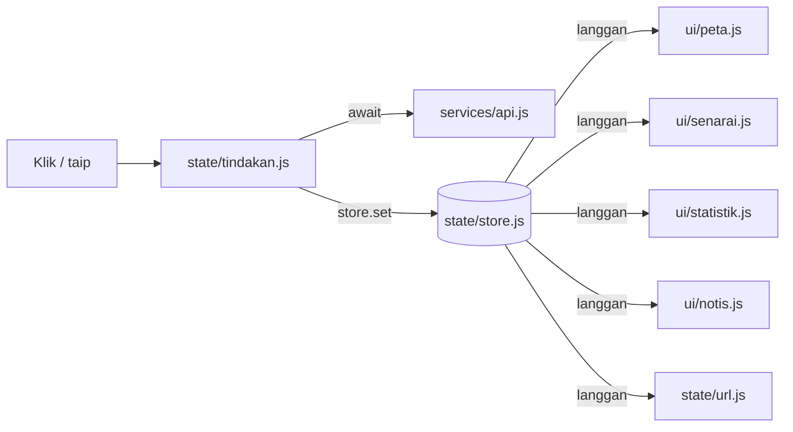
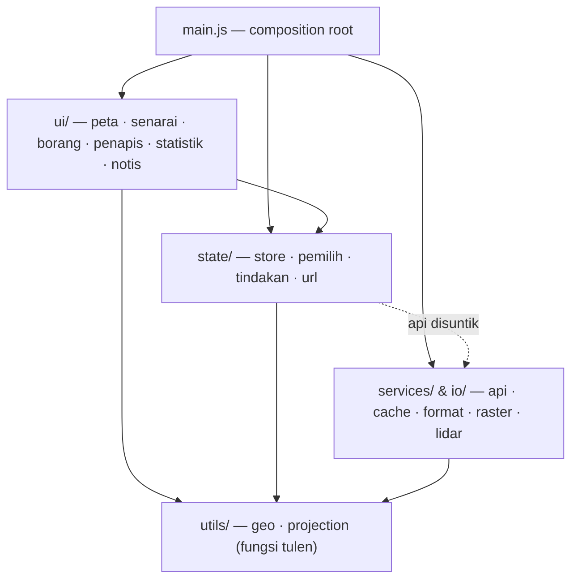

# 13 · State Management & Arkitektur Frontend Moden

> Nota topikal · Indeks: [`./README.md`](./README.md)

## Objektif nota

Selepas membaca nota ini, anda boleh:

- **Menerangkan** kenapa aplikasi peta memerlukan *satu sumber kebenaran* dan **membina** store pub/sub (`ciptaStore`) dengan kemas kini *immutable*.
- **Menulis** *selector* (keadaan terbitan) dengan memo ringkas, **menyegerakkan** peta + senarai + penapis melalui pelanggan store, dan **menyimpan** penapis dalam URL.
- **Melaksanakan** *optimistic update* dengan *rollback* sasaran apabila API gagal, dan **mengujinya** dengan API palsu.
- **Menyusun** aplikasi kepada layer `ui → state → services/io → utils` dengan arah dependency yang betul.
- **Memilih** teknik prestasi peta (clustering, simplify, muat ikut `bbox`, debounce) dan **membandingkan** store kita dengan Redux Toolkit, Zustand, Pinia, Signals serta React/Vue/Svelte.

---

## 1. Kenapa state management?

Pada Hari 3, GeoLapor dibina dengan event handler yang **terus** mengubah DOM:

```js
// ❌ Hari 3 — setiap handler tahu tentang semua UI lain
butangSimpan.addEventListener('click', async () => {
  const baharu = await ciptaLaporan(data);
  senaraiUl.append(binaLi(baharu));     // kemas kini senarai
  lapisanLaporan.addData(baharu);       // kemas kini peta
  kiraanEl.textContent = ++jumlah;      // kemas kini kiraan
  // statistik? penapis aktif? laporan dipilih? ... terlupa satu → UI bercanggah
});
```

Dengan 3 komponen, ada 3 hubungan. Dengan 6 komponen (peta, senarai, borang, penapis, statistik, notis), setiap handler perlu tahu tentang 5 yang lain — dan satu yang terlupa menyebabkan **peta menunjukkan 12 laporan tetapi senarai 11**.

Penyelesaian: **satu store** memegang keadaan; UI hanya (a) **membaca** keadaan untuk melukis dan (b) **meminta** perubahan melalui tindakan. Tiada komponen UI perlu tahu komponen lain wujud.



Ini **aliran data satu hala** (*unidirectional data flow*) — idea yang sama di sebalik Redux, Vuex/Pinia, Elm dan Flux.

### Jenis keadaan

| Jenis | Contoh GeoLapor | Tempat |
|-------|-----------------|--------|
| Salinan data server | `laporan`, `kategori` | store (di-sync dengan API) |
| Keadaan UI global | `dipilihId`, `memuat`, `ralat`, `notis` | store |
| Keadaan navigasi | `penapis` | store **+ URL** |
| Keadaan setempat | teks sedang ditaip, `<details>` terbuka | elemen DOM itu sendiri |
| Keadaan terbitan | laporan ditapis, kiraan ikut kategori | **tidak disimpan** — dikira oleh selector |

---

## 2. Store pub/sub — `state/store.js`

Ini kod **sebenar** `state/store.js` yang diajar pada Hari 5:

```js
// state/store.js — Store berpusat ringkas (corak pub/sub). Diajar pada Hari 5 (S1).
//
// Aliran data satu hala:
//   tindakan pengguna → store.set(...) → semua pelanggan (langgan) dipanggil → UI dilukis semula

/**
 * @template {object} T
 * @param {T} keadaanAwal
 * @returns {{ dapat: () => T, set: (kemaskiniAtauFungsi: Partial<T> | ((keadaan: T) => Partial<T>)) => void,
 *            langgan: (fn: (baharu: T, lama: T) => void) => () => void }}
 */
export function ciptaStore(keadaanAwal) {
  let keadaan = { ...keadaanAwal };
  const pelanggan = new Set();

  return {
    /** Keadaan semasa. Jangan ubah terus — guna set(). */
    dapat() {
      return keadaan;
    },

    /** Kemas kini keadaan (objek separa ATAU fungsi yang memulangkan objek separa). */
    set(kemaskiniAtauFungsi) {
      const tampalan =
        typeof kemaskiniAtauFungsi === 'function' ? kemaskiniAtauFungsi(keadaan) : kemaskiniAtauFungsi;
      if (!tampalan || typeof tampalan !== 'object') return;

      // Tiada perubahan sebenar (semua nilai sama rujukan) → jangan maklumkan pelanggan
      const berubah = Object.keys(tampalan).some((k) => !Object.is(keadaan[k], tampalan[k]));
      if (!berubah) return;

      const lama = keadaan;
      keadaan = { ...keadaan, ...tampalan }; // objek BAHARU — keadaan lama tidak diubah (immutable)
      for (const fn of [...pelanggan]) fn(keadaan, lama);
    },

    /** Daftar pelanggan. Memulangkan fungsi untuk berhenti melanggan. */
    langgan(fn) {
      pelanggan.add(fn);
      return () => pelanggan.delete(fn);
    },
  };
}
```

| Keputusan | Kenapa |
|-----------|--------|
| Closure (`let keadaan` di dalam fungsi) | Tiada siapa boleh menukar `keadaan` kecuali melalui `set()` — enkapsulasi tanpa kelas (nota 02). |
| `set(objek)` **atau** `set(fungsi)` | Objek untuk kes mudah (`{ memuat: true }`); fungsi apabila nilai baharu bergantung pada nilai **terkini** (`s => ({ laporan: [...s.laporan, baharu] })`). |
| Gabung cetek `{ ...keadaan, ...tampalan }` | Hanya hantar medan yang berubah. Medan lain dikekalkan **dengan rujukan yang sama**. |
| Semak `Object.is` sebelum memaklumkan | `store.set({ n: 0 })` apabila `n` sudah 0 tidak mencetuskan lukisan semula — menjimatkan kerja & mengelak infinite loop (pelanggan yang memanggil `set` semula). |
| Pelanggan terima `(baharu, lama)` | Pelanggan boleh semak `baharu.penapis !== lama.penapis` dan **langkau kerja** — murah kerana kita immutable. |
| `for (const fn of [...pelanggan])` | Lelaran atas **salinan** Set: jika pelanggan nyahlanggan (atau melanggan) semasa dimaklumkan, lelaran tidak terganggu. |
| `langgan` pulangkan `nyahlanggan` | Komponen yang dibuang mesti berhenti mendengar — jika tidak, ia terus melukis ke elemen yang sudah tiada (kebocoran memori). |

```js
// Cuba dalam console / node --input-type=module
const store = ciptaStore({ kiraan: 0 });
const nyahlanggan = store.langgan((baharu, lama) => console.log(lama.kiraan, '→', baharu.kiraan));
store.set({ kiraan: 1 });                       // 0 → 1
store.set((k) => ({ kiraan: k.kiraan + 1 }));   // 1 → 2
store.set({ kiraan: 2 });                       // (senyap — tiada perubahan)
nyahlanggan();
store.set({ kiraan: 99 });                      // (senyap — sudah nyahlanggan)
```

> 💡 **Idea mod dev (pilihan):** `Object.freeze(keadaan)` selepas setiap `set` menjadikan mutasi terus (`store.dapat().memuat = true`) melontar `TypeError` dalam modul — pepijat ditangkap awal. Ia **cetek** (objek bersarang tidak dibekukan) dan ada kos kecil, jadi implementasi di atas tidak menggunakannya; boleh dibungkus dengan `if (import.meta.env.DEV)`.

---

## 3. Kemas kini *immutable*

Store mengesan perubahan dengan **perbandingan rujukan** (`Object.is`). Mutasi mengekalkan rujukan → store fikir tiada perubahan:

```js
// ❌ Mutasi — array SAMA; Object.is(lama, baharu) === true → set() diabaikan, UI tidak dilukis semula
const s = store.dapat();
s.laporan.push(laporanBaharu);
store.set({ laporan: s.laporan });

// ✅ Immutable — array BAHARU
store.set((s) => ({ laporan: [...s.laporan, laporanBaharu] }));
```

| Operasi | ❌ Mutasi | ✅ Immutable |
|---------|----------|-------------|
| Tambah | `arr.push(x)` | `[...arr, x]` |
| Buang | `arr.splice(i, 1)` | `arr.filter((f) => f.id !== id)` · `arr.toSpliced(i, 1)` (ES2023) |
| Ganti satu | `arr[i] = x` | `arr.map((f) => (f.id === id ? x : f))` · `arr.with(i, x)` (ES2023) |
| Susun | `arr.sort(fn)` | `arr.toSorted(fn)` (ES2023) |
| Terbalik | `arr.reverse()` | `arr.toReversed()` (ES2023) |
| Medan bersarang | `f.properties.status = 's'` | `{ ...f, properties: { ...f.properties, status: 's' } }` |
| Salinan dalam | — | `structuredClone(obj)` — mahal, guna jarang (cth sebelum eksport) |

```js
const asal = [3, 1, 2];
const tersusun = asal.toSorted((a, b) => a - b); // [1, 2, 3]
asal;                                             // [3, 1, 2] — tidak berubah
asal.with(0, 9);                                  // [9, 1, 2]
asal.toSpliced(1, 1);                             // [3, 2]
```

> ⚠️ **Spread adalah cetek.** `{ ...f }` menyalin `f` tetapi `f.properties` masih objek yang **sama**. Setiap aras yang anda ubah mesti disalin.

---

## 4. Keadaan terbitan & *selector* — `state/pemilih.js`

**Jangan simpan apa yang boleh dikira.** Jika store menyimpan `laporan` **dan** `laporanDitapis`, dua medan itu boleh bercanggah. Sebaliknya, tulis **selector** — fungsi tulen `(keadaan) => nilai`:

```js
// src/state/pemilih.js
import { tapisLaporan, kiraIkut } from '../utils/geo.js';

/** Ingat hasil terakhir; kira semula hanya jika argumen (rujukan) berubah. */
export function memoAkhir(fn) {
  let argLama = null;
  let hasilLama;
  return (...arg) => {
    const sama = argLama !== null && arg.length === argLama.length && arg.every((a, i) => a === argLama[i]);
    if (!sama) {
      argLama = arg;
      hasilLama = fn(...arg);
    }
    return hasilLama;
  };
}

const tapisMemo = memoAkhir(tapisLaporan);

export const pilihLaporanDitapis = (s) => tapisMemo(s.laporan, s.penapis);

export const pilihLaporanDipilih = (s) => s.laporan.find((f) => f.id === s.dipilihId) ?? null;

export const pilihRingkasan = (s) => {
  const ditapis = pilihLaporanDitapis(s);
  return {
    jumlah: s.laporan.length,
    dipapar: ditapis.length,
    ikutKategori: kiraIkut(ditapis, 'kategori'),
    ikutStatus: kiraIkut(ditapis, 'status'),
  };
};
```

- `tapisLaporan`/`kiraIkut` ialah fungsi **Hari 1** — digunakan semula tanpa perubahan.
- `memoAkhir` sah **kerana** kita immutable: rujukan `laporan` & `penapis` yang sama ⇒ hasil yang sama. Menukar `dipilihId` tidak memaksa penapisan semula (diuji: `pilihLaporanDitapis` memulangkan rujukan yang **sama**).
- Rujukan yang stabil juga membolehkan komponen UI melangkau lukisan: `if (senarai !== senaraiLama) …`.

---

## 5. Tindakan — `state/tindakan.js`

**Tindakan** ialah satu-satunya tempat yang memanggil API **dan** mengubah store. `api` **disuntik** (bukan di-`import`) supaya boleh diganti dengan objek palsu dalam ujian.

```js
// src/state/tindakan.js
const gantiLaporan = (senarai, id, fn) => senarai.map((f) => (f.id === id ? fn(f) : f));

/**
 * @param {ReturnType<import('./store.js').ciptaStore>} store
 * @param {typeof import('../services/api.js')} api  disuntik → boleh diuji dengan API palsu
 */
export function ciptaTindakan(store, api) {
  return {
    async muatLaporan() {
      store.set({ memuat: true, ralat: null });
      try {
        const fc = await api.senaraiLaporan();
        store.set({ laporan: fc.features, memuat: false });
      } catch (ralat) {
        store.set({ memuat: false, ralat: ralat.message });
      }
    },

    pilih(id) {
      store.set({ dipilihId: id });
    },

    tukarPenapis(tampalan) {
      store.set((s) => ({ penapis: { ...s.penapis, ...tampalan } }));
    },

    /** Optimistic update: ubah UI dahulu, sahkan dengan server, undur SATU rekod jika gagal. */
    async tukarStatus(id, statusBaru) {
      const asal = store.dapat().laporan.find((f) => f.id === id);
      if (!asal) return;

      // 1. Optimistik — pengguna nampak perubahan serta-merta
      store.set((s) => ({
        laporan: gantiLaporan(s.laporan, id, (f) => ({ ...f, properties: { ...f.properties, status: statusBaru } })),
      }));

      try {
        // 2. Sahkan — server ialah sumber kebenaran muktamad (mengisi `dikemaskini`)
        const dariPelayan = await api.kemaskiniLaporan(id, { status: statusBaru });
        store.set((s) => ({ laporan: gantiLaporan(s.laporan, id, () => dariPelayan) }));
      } catch (ralat) {
        // 3. Rollback sasaran + beritahu pengguna
        store.set((s) => ({
          laporan: gantiLaporan(s.laporan, id, () => asal),
          notis: { jenis: 'ralat', mesej: `Status ${id} tidak disimpan: ${ralat.message}` },
        }));
      }
    },
  };
}
```

### Kenapa rollback **sasaran**?

Versi paling ringkas menyimpan **seluruh** senarai sebelum perubahan (`const sebelum = store.dapat().laporan`) dan memulihkannya jika gagal. Itu betul untuk satu klik — tetapi jika pengguna menukar **dua** status dengan pantas dan yang pertama gagal selepas yang kedua berjaya, `sebelum` akan **memadam** kejayaan kedua. Ujian di bawah membuktikannya: rollback sasaran lulus, rollback seluruh senarai gagal.

| Sesuai optimistik | Tidak sesuai |
|-------------------|--------------|
| Tukar status, kegemaran, susun semula | **Cipta** (ID `LPR-{0000}` dijana server) — guna pesimistik atau ID sementara |
| Kadar kejayaan tinggi, mudah diundur | Tidak boleh diundur / ada kesan sampingan (e-mel, kewangan) |

Uji dengan mock API: `?gagal=1` (500) atau buang header `X-API-Key` (401) — kedua-duanya mesti menyebabkan rollback + notis.

---

## 6. Menyegerakkan peta + senarai + penapis

Setiap modul UI ikut satu kontrak: **`pasangX(elemen, { store, tindakan })` → pulangkan cleanup**. Ia membaca melalui selector, menulis melalui tindakan.

```js
// src/ui/senarai.js — render dari store, tanpa innerHTML
import { pilihLaporanDitapis } from '../state/pemilih.js';

export function pasangSenarai(ul, { store, tindakan }) {
  ul.addEventListener('click', (e) => {                 // delegasi event (Hari 3)
    const li = e.target.closest('li[data-id]');
    if (li) tindakan.pilih(li.dataset.id);
  });

  let senaraiLama = null;
  function lukis(s) {
    const senarai = pilihLaporanDitapis(s);
    if (senarai !== senaraiLama) {                      // langkau jika hasil selector sama (memo)
      senaraiLama = senarai;
      ul.replaceChildren(
        ...senarai.map((f) => {
          const li = document.createElement('li');
          li.dataset.id = f.id;
          li.textContent = `${f.id} · ${f.properties.tajuk}`; // textContent — selamat XSS
          return li;
        }),
      );
    }
    for (const li of ul.children) li.classList.toggle('dipilih', li.dataset.id === s.dipilihId);
  }

  lukis(store.dapat());
  return store.langgan(lukis);                          // cleanup = nyahlanggan
}
```

```js
// src/ui/peta.js (petikan) — layer laporan
import L from 'leaflet';
import { pilihLaporanDitapis, pilihLaporanDipilih } from '../state/pemilih.js';

export function pasangLapisanLaporan(peta, { store, tindakan }) {
  const lapisan = L.geoJSON(null, {
    onEachFeature: (f, layer) => layer.on('click', () => tindakan.pilih(f.id)),
  }).addTo(peta);

  const lukis = (baharu, lama) => {
    const ditapis = pilihLaporanDitapis(baharu);
    if (!lama || ditapis !== pilihLaporanDitapis(lama)) lapisan.clearLayers().addData(ditapis);
    if (!lama || baharu.dipilihId !== lama.dipilihId) {
      const f = pilihLaporanDipilih(baharu);
      if (f) {
        const [lng, lat] = f.geometry.coordinates;      // ⚠️ GeoJSON: lng dahulu
        peta.flyTo([lat, lng], 16);                     // ⚠️ Leaflet: lat dahulu
      }
    }
  };
  lukis(store.dapat(), null);
  return store.langgan(lukis);
}
```

Tukar dropdown kategori → `tindakan.tukarPenapis({ kategori })` → `store.set` → senarai, peta, statistik, URL **semuanya** dikemas kini. Penapis tidak tahu peta wujud.

> 💡 Corak yang sama boleh dilanjutkan meluas: `pasangX(el, { store, tindakan })`, `state/tindakan.js` dengan rollback sasaran, dan `state/url.js` — bandingkan dengan kod anda, atau tanya jurulatih jika tersekat.

---

## 7. Keadaan dalam URL — `state/url.js`

Penapis dalam URL = pautan boleh dikongsi, boleh ditanda buku, dan butang **Back** berfungsi.

```js
// src/state/url.js
const MEDAN_PENAPIS = ['kategori', 'status', 'q'];

export function penapisDariUrl(search) {
  const p = new URLSearchParams(search);
  return Object.fromEntries(MEDAN_PENAPIS.map((k) => [k, p.get(k) ?? '']));
}

export function queryDariPenapis(penapis) {
  const p = new URLSearchParams();
  for (const k of MEDAN_PENAPIS) if (penapis[k]) p.set(k, penapis[k]); // abaikan nilai kosong
  const qs = p.toString();
  return qs ? `?${qs}` : '';
}

/** Browser sahaja: tulis penapis ke URL setiap kali ia berubah, baca semula bila Back/Forward. */
export function segerakUrl(store) {
  store.set({ penapis: penapisDariUrl(location.search) });       // URL menang semasa mula
  const nyahlanggan = store.langgan((baharu, lama) => {
    if (baharu.penapis === lama.penapis) return;
    const url = `${location.pathname}${queryDariPenapis(baharu.penapis)}${location.hash}`;
    history.replaceState(null, '', url);                         // tiada reload, tiada entri sejarah baharu
  });
  const bilaPopstate = () => store.set({ penapis: penapisDariUrl(location.search) });
  window.addEventListener('popstate', bilaPopstate);
  return () => {
    nyahlanggan();
    window.removeEventListener('popstate', bilaPopstate);
  };
}
```

```js
queryDariPenapis({ kategori: '', status: 'baharu', q: 'Jalan 2 & 3' }); // '?status=baharu&q=Jalan+2+%26+3'
penapisDariUrl('?status=baharu&q=Jalan+2+%26+3');                       // { kategori: '', status: 'baharu', q: 'Jalan 2 & 3' }
```

- `penapisDariUrl`/`queryDariPenapis` ialah fungsi **tulen** → diuji dengan `node --test`. `segerakUrl` menyentuh `location`/`history` → diuji dalam browser.
- `replaceState` untuk carian ditaip (elak 12 entri sejarah untuk "l-a-m-p-u"); `pushState` jika mahu Back kembali ke penapis sebelumnya.
- ⚠️ `` `?q=${q}` `` rosak apabila `q` mengandungi `&`/`#` — sentiasa guna `URLSearchParams`.
- Hubungan dengan `localStorage` (nota 12): URL untuk **berkongsi**, localStorage untuk **mengingat** pilihan peribadi. Jika kedua-duanya ada, URL menang.

---

## 8. Arkitektur berlapis



| Layer | Tanggungjawab | Boleh import | **Tidak boleh** | Uji dengan |
|---------|---------------|--------------|-----------------|-----------|
| `utils/` | Logik tulen: kira, tapis, unjur | pustaka tulen (Turf, proj4) | DOM, `L`, `fetch`, layer lain | `node --test` (mudah) |
| `services/`, `io/` | Dunia luar: HTTP, storage, fail | `utils/` | `state/`, `ui/` | `node --test` + fetch/IndexedDB palsu |
| `state/` | Keadaan, selector, tindakan | `utils/`; `services/` **melalui suntikan** | `ui/`, DOM, `L` | `node --test` + API palsu |
| `ui/` | DOM, Leaflet, event | `state/`, `utils/`, Leaflet | `services/` terus | browser |
| `main.js` | Sambung semua; tiada logik | semua | — | manual / E2E |

Kenapa arah ini penting:

1. **Tukar UI tanpa sentuh logik** — beralih Leaflet → OpenLayers hanya mengubah `ui/peta.js`.
2. **Tukar backend tanpa sentuh UI** — mock API → API sebenar → GeoServer WFS hanya mengubah `services/`.
3. **Uji tanpa browser** — semakin banyak logik di bawah, semakin banyak ujian milisaat.

> 💡 Semak pelanggaran: `grep -rn "from '../ui" src/state src/services src/utils` mesti kosong. Modul yang diuji dengan `node --test` dan gagal kerana `document is not defined` ialah **isyarat seni bina** — logik itu berada di layer yang salah.

### Struktur folder (sasaran akhir Hari 5)

```text
projek/geolapor-mula/
├── index.html · package.json · vite.config.js · eslint.config.js
├── tests/                  *.test.js  → "test": "node --test \"tests/**/*.test.js\""
└── src/
    ├── main.js             composition root
    ├── services/           api.js (ApiError, mintaJson, senaraiLaporan, …) · cache.js
    ├── state/              store.js (+ pemilih.js · tindakan.js · url.js — Lab Hari 5)
    ├── io/                 format.js · raster.js · lidar.js
    ├── utils/              geo.js · unjuran.js
    └── ui/                 peta.js · senarai.js · borang.js · penapis.js · statistik.js · notis.js
                            (+ lapisan.js · fail.js · analisis.js)
```

### Komponen sebagai fungsi

Framework memberi "komponen"; dalam vanilla JS, **fungsi pemasang** memadai:

```js
/**
 * Kontrak:  pasangX(elemenAkar, { store, tindakan }) → cleanup()
 *  - terima elemen (jangan querySelector global) → boleh dipasang dua kali, mudah diuji
 *  - baca melalui selector, tulis melalui tindakan
 *  - pulangkan cleanup (nyahlanggan + buang listener global)
 */
export function pasangKiraan(el, { store }) {
  const lukis = (s) => { el.textContent = `${pilihLaporanDitapis(s).length} laporan`; };
  lukis(store.dapat());
  return store.langgan(lukis);
}
```

---

## 9. Prestasi aplikasi peta

| Gejala | Teknik | Alat |
|--------|--------|------|
| Ribuan marker bertindih, peta tersekat | **Clustering** | `leaflet.markercluster` · MapLibre `cluster: true` · `supercluster` |
| Poligon sempadan berat | **Simplify** | `turf.simplify` (nota 10) · `ogr2ogr -simplify` · mapshaper |
| Muat semua rekod negara pada permulaan | **Muat ikut `bbox`** | `?bbox=minLng,minLat,maxLng,maxLat` |
| Request bertubi-tubi semasa pan/taip | **Debounce** + `AbortController` | `nyahlantun()` dalam `ui/penapis.js` |

**a) Clustering**

```bash
npm install leaflet.markercluster
```

```js
import L from 'leaflet';                          // Leaflet 1.9 UMD juga menetapkan window.L — plugin memerlukannya
import 'leaflet.markercluster';
import 'leaflet.markercluster/dist/MarkerCluster.css';
import 'leaflet.markercluster/dist/MarkerCluster.Default.css';

const kluster = L.markerClusterGroup({ disableClusteringAtZoom: 17, chunkedLoading: true });
kluster.addLayer(L.geoJSON(fc));                  // tambah layer GeoJSON ke kumpulan kluster
peta.addLayer(kluster);
// Kemas kini: kluster.clearLayers(); kluster.addLayer(L.geoJSON(fcBaharu));
```

**b) Simplify untuk paparan**

```js
import { simplify } from '@turf/simplify';
const zonRingkas = simplify(zonFc, { tolerance: 0.0005, highQuality: false }); // ~50 m; asal tidak diubah
L.geoJSON(zonRingkas).addTo(peta);   // PAPARAN sahaja — kira keluasan/analisis dengan data asal
```

**c) Muat ikut `bbox` + debounce + batal request lama**

```js
import { nyahlantun } from './ui/penapis.js';
import { senaraiLaporan } from './services/api.js';

let pengawal = null;
const muatDalamPandangan = nyahlantun(async () => {
  pengawal?.abort();                              // batal request sebelumnya yang belum selesai
  pengawal = new AbortController();
  const b = peta.getBounds();
  const bbox = [b.getWest(), b.getSouth(), b.getEast(), b.getNorth()]; // susunan API: minLng,minLat,maxLng,maxLat
  try {
    const fc = await senaraiLaporan({ bbox, had: 500 }, { signal: pengawal.signal }); // bbox array → "a,b,c,d"
    store.set({ laporan: fc.features });
  } catch (err) {
    if (err.name !== 'AbortError') store.set({ ralat: err.message }); // AbortError = sengaja, abaikan
  }
}, 300);

peta.on('moveend', muatDalamPandangan);           // 'moveend' sekali selepas pan/zum, bukan 'move' (60×/s)
```

```js
// ui/penapis.js — debounce: tangguh panggilan sehingga pengguna berhenti `ms` milisaat
export function nyahlantun(fn, ms = 300) {
  let pemasa;
  return (...args) => {
    clearTimeout(pemasa);
    pemasa = setTimeout(() => fn(...args), ms);
  };
}
```

> ⚠️ `senaraiLaporan` patut melontar semula `AbortError` **asal** apabila pemanggil membatalkan (bukan `ApiError`), jadi semakan `err.name === 'AbortError'` berfungsi. Timeout dan network error pula menjadi `ApiError` dengan `status: 0`.

**d) Ukur dahulu.** DevTools → **Performance** (rakam pan/zum) dan `console.time('tapis')`. Jangan optimumkan 40 titik.

---

## 10. Pustaka state popular — idea yang sama

Cari tiga perkara dalam mana-mana pustaka: **di mana keadaan disimpan, bagaimana ia dikemas kini, bagaimana UI dimaklumkan.**

| Pustaka | Ekosistem | Kemas kini | UI dimaklumkan melalui | Tambahan |
|---------|-----------|-----------|------------------------|----------|
| **Store kita** | Vanilla | `set(tampalan \| fn)` | `langgan(fn)` | — |
| **Redux Toolkit** | Kebanyakannya React | `dispatch(action)` → *reducer* tulen (Immer benarkan sintaks "mutasi") | `useSelector` | DevTools *time-travel*, RTK Query |
| **Zustand** | React / vanilla | `setState(partial \| fn)` — hampir sama dengan kita | hook / `subscribe` | Sangat kecil, middleware `persist` |
| **Pinia** | Vue | ubah `state` terus dalam *actions* (reaktiviti Vue mengesan) | automatik | *getters* ≈ selector |
| **Signals** (Preact Signals, SolidJS, Angular; cadangan TC39) | Pelbagai | `isyarat.value = x` | dependency tracking automatik | `computed()` ≈ selector + memo automatik |

```js
// Zustand (vanilla) — diuji
import { createStore } from 'zustand/vanilla';
const store = createStore(() => ({ penapis: { kategori: '' } }));
store.subscribe((baharu, lama) => console.log(lama.penapis.kategori, '→', baharu.penapis.kategori));
store.setState((s) => ({ penapis: { ...s.penapis, kategori: 'tanah' } }));  //  → tanah

// Redux Toolkit — slice
import { createSlice } from '@reduxjs/toolkit';
const laporanSlice = createSlice({
  name: 'laporan',
  initialState: { senarai: [], penapis: { kategori: '' } },
  reducers: {
    tukarPenapis(state, action) { state.penapis.kategori = action.payload; }, // Immer → immutable di sebalik tabir
  },
});

// Signals (@preact/signals-core) — diuji
import { signal, computed, effect } from '@preact/signals-core';
const penapis = signal({ kategori: '', status: '', q: '' });
const laporan = signal([]);
const ditapis = computed(() => tapisLaporan(laporan.value, penapis.value)); // memo automatik
effect(() => console.log('dipapar', ditapis.value.length));                 // "langgan" automatik
penapis.value = { ...penapis.value, kategori: 'tanah' };
```

> 💡 **Untuk projek PGN:** satu halaman peta dengan 3–6 panel → store vanilla ini **memadai** dan tiada dependency untuk diselenggara. Beralih ke pustaka apabila sudah memilih framework (React → Zustand/Redux Toolkit; Vue → Pinia).

---

## 11. React, Vue, Svelte — ciri yang sama

Ciri: dropdown kategori + kiraan laporan ditapis. Perhatikan: **state → paparan diterbitkan**, persis seperti store + selector kita.

```jsx
// React (JSX)
import { useState, useMemo } from 'react';
export function Penapis({ laporan }) {
  const [kategori, setKategori] = useState('');
  const ditapis = useMemo(() => tapisLaporan(laporan, { kategori }), [laporan, kategori]); // ≈ memoAkhir
  return (
    <label>
      Kategori
      <select value={kategori} onChange={(e) => setKategori(e.target.value)}>
        <option value="">Semua</option>
        <option value="tanah">Tanah</option>
      </select>
      <span>{ditapis.length} laporan</span>  {/* JSX melarikan teks secara automatik — selamat XSS */}
    </label>
  );
}
```

```vue
<!-- Vue 3 (SFC, Composition API) -->
<script setup>
import { ref, computed } from 'vue';
const props = defineProps({ laporan: Array });
const kategori = ref('');
const ditapis = computed(() => tapisLaporan(props.laporan, { kategori: kategori.value }));
</script>
<template>
  <label>Kategori
    <select v-model="kategori"><option value="">Semua</option><option value="tanah">Tanah</option></select>
    <span>{{ ditapis.length }} laporan</span>
  </label>
</template>
```

```svelte
<!-- Svelte 5 (runes) -->
<script>
  let { laporan } = $props();
  let kategori = $state('');
  let ditapis = $derived(tapisLaporan(laporan, { kategori }));
</script>
<label>Kategori
  <select bind:value={kategori}><option value="">Semua</option><option value="tanah">Tanah</option></select>
  <span>{ditapis.length} laporan</span>
</label>
```

| | React | Vue | Svelte | Vanilla + store kita |
|---|---|---|---|---|
| Keadaan | `useState` | `ref` | `$state` | `store` |
| Terbitan | `useMemo` | `computed` | `$derived` | selector + `memoAkhir` |
| Kemas kini DOM | Virtual DOM diff | Reaktiviti + VDOM | Dikompil kepada kemas kini DOM terus | `langgan` + `replaceChildren` manual |
| Peta Leaflet | `react-leaflet` | `vue-leaflet` | pembalut manual | terus |

Dan **Node.js**: JavaScript yang sama di server — `projek/api/server.mjs` (mock API) ialah contohnya. Framework backend (Express, Fastify, NestJS) + PostGIS ialah langkah seterusnya untuk API sebenar.

---

## 12. Menguji layer state (`node --test`)

Semua ujian di bawah **lulus** terhadap `store.js` + `pemilih.js`/`tindakan.js`/`url.js` di atas (15 ujian, Node 22+). Letak dalam folder `tests/` dan jalankan `npm test` (`"test": "node --test \"tests/**/*.test.js\""`).

```js
// tests/store.test.js
import { test } from 'node:test';
import assert from 'node:assert/strict';
import { ciptaStore } from '../src/state/store.js';

test('dapat() memulangkan keadaan awal', () => {
  const store = ciptaStore({ kiraan: 0 });
  assert.deepEqual(store.dapat(), { kiraan: 0 });
});

test('set(objek) menggabung dan mencipta objek baharu', () => {
  const store = ciptaStore({ a: 1, b: 2 });
  const sebelum = store.dapat();
  store.set({ b: 3 });
  assert.deepEqual(store.dapat(), { a: 1, b: 3 });
  assert.notEqual(store.dapat(), sebelum); // rujukan berbeza
  assert.equal(sebelum.b, 2);              // yang lama tidak berubah
});

test('set(fungsi) menerima keadaan semasa', () => {
  const store = ciptaStore({ kiraan: 1 });
  store.set((s) => ({ kiraan: s.kiraan + 1 }));
  assert.equal(store.dapat().kiraan, 2);
});

test('langgan dipanggil dengan (baharu, lama) dan boleh nyahlanggan', () => {
  const store = ciptaStore({ n: 0 });
  const panggilan = [];
  const nyahlanggan = store.langgan((baru, lama) => panggilan.push([lama.n, baru.n]));
  store.set({ n: 1 });
  nyahlanggan();
  store.set({ n: 2 });
  assert.deepEqual(panggilan, [[0, 1]]);
});

test('set tanpa perubahan tidak memaklumkan pelanggan', () => {
  const store = ciptaStore({ n: 0 });
  let dipanggil = 0;
  store.langgan(() => dipanggil++);
  store.set({ n: 0 });
  assert.equal(dipanggil, 0);
});
```

```js
// tests/tindakan.test.js (petikan) — API palsu, tiada rangkaian
import { test } from 'node:test';
import assert from 'node:assert/strict';
import { ciptaStore } from '../src/state/store.js';
import { ciptaTindakan } from '../src/state/tindakan.js';

const laporan = (id, status) => ({
  type: 'Feature', id,
  geometry: { type: 'Point', coordinates: [101.69, 2.93] },
  properties: { id, status, tajuk: `Laporan ${id}` },
});
const storeAwal = () => ciptaStore({
  laporan: [laporan('LPR-0001', 'baharu'), laporan('LPR-0002', 'baharu')],
  penapis: { kategori: '', status: '', q: '' }, dipilihId: null, memuat: false, ralat: null, notis: null,
});

test('tukarStatus: rollback rekod itu sahaja + notis bila API gagal', async () => {
  const store = storeAwal();
  const api = { kemaskiniLaporan: async () => { throw new Error('Ralat HTTP 500'); } };
  await ciptaTindakan(store, api).tukarStatus('LPR-0001', 'selesai');
  const s = store.dapat();
  assert.equal(s.laporan[0].properties.status, 'baharu');       // diundur
  assert.equal(s.notis.jenis, 'ralat');
  assert.match(s.notis.mesej, /LPR-0001.*500/);
});

test('rollback sasaran tidak memadam kejayaan serentak rekod lain', async () => {
  const store = storeAwal();
  const api = {
    kemaskiniLaporan: async (id, { status }) => {
      if (id === 'LPR-0001') { await new Promise((r) => setTimeout(r, 10)); throw new Error('gagal'); }
      return laporan(id, status);
    },
  };
  const t = ciptaTindakan(store, api);
  await Promise.all([t.tukarStatus('LPR-0001', 'selesai'), t.tukarStatus('LPR-0002', 'ditolak')]);
  const [a, b] = store.dapat().laporan;
  assert.equal(a.properties.status, 'baharu');   // gagal → diundur
  assert.equal(b.properties.status, 'ditolak');  // berjaya → kekal
});
```

Lebih lanjut tentang `node --test`: [nota 14](./14-debugging-dan-amalan-terbaik.md).

---

## ⚠️ Kesilapan lazim

| Simptom | Punca | Pembetulan |
|---------|-------|------------|
| UI tidak dikemas kini selepas `set` | Mutasi (`push`, `sort`, `f.properties.x = …`) → rujukan sama → `set` diabaikan | Cipta objek/array baharu (§3) |
| Senarai & peta tunjuk bilangan berbeza | Keadaan terbitan disimpan dua kali | Satu `laporan` + selector |
| Infinite loop / "Maximum call stack" | Pelanggan memanggil `set` dengan nilai baharu setiap kali | Semak `baharu.x !== lama.x` sebelum bertindak; jangan cipta objek baharu tanpa sebab |
| Komponen dibuang tetapi masih melukis / error `null` | Tidak nyahlanggan | Simpan & panggil cleanup |
| Rollback memadam perubahan lain | Rollback seluruh senarai | Rollback sasaran satu rekod (§5) |
| Rollback senyap — pengguna fikir berjaya | Tiada notis | Set `notis` dalam `catch` |
| Selector memo tidak pernah "kena" | Argumen objek baharu setiap panggilan (`{ ...s.penapis }`) | Hantar rujukan dari store terus |
| URL rosak dengan `&` dalam carian | Template literal | `URLSearchParams` |
| `document is not defined` dalam `node --test` | Logik DOM dalam `state/`/`utils/` | Pindahkan ke `ui/` |
| `L.markerClusterGroup is not a function` | Plugin dimuat sebelum Leaflet / CSS tidak diimport | `import L from 'leaflet'` dahulu, kemudian `import 'leaflet.markercluster'` |

---

## Rujukan rasmi

- MDN — `structuredClone`: <https://developer.mozilla.org/en-US/docs/Web/API/Window/structuredClone> · `Array.prototype.toSorted`: <https://developer.mozilla.org/en-US/docs/Web/JavaScript/Reference/Global_Objects/Array/toSorted> · `Array.prototype.with`: <https://developer.mozilla.org/en-US/docs/Web/JavaScript/Reference/Global_Objects/Array/with> · `Object.freeze`: <https://developer.mozilla.org/en-US/docs/Web/JavaScript/Reference/Global_Objects/Object/freeze>
- MDN — `URLSearchParams`: <https://developer.mozilla.org/en-US/docs/Web/API/URLSearchParams> · `history.replaceState`: <https://developer.mozilla.org/en-US/docs/Web/API/History/replaceState> · `popstate`: <https://developer.mozilla.org/en-US/docs/Web/API/Window/popstate_event>
- Redux Toolkit: <https://redux-toolkit.js.org/> · Zustand: <https://zustand.docs.pmnd.rs/> · Pinia: <https://pinia.vuejs.org/> · Preact Signals: <https://preactjs.com/guide/v10/signals/> · Cadangan TC39 Signals: <https://github.com/tc39/proposal-signals>
- React: <https://react.dev/learn> · Vue: <https://vuejs.org/guide/introduction.html> · Svelte: <https://svelte.dev/docs/svelte/overview> · Node.js: <https://nodejs.org/en/learn/getting-started/introduction-to-nodejs>
- Leaflet.markercluster: <https://github.com/Leaflet/Leaflet.markercluster> · Turf `simplify`: <https://turfjs.org/docs/api/simplify>
- Node.js test runner: <https://nodejs.org/api/test.html>

## Digunakan pada Hari N

- **Hari 1** — fungsi tulen `tapisLaporan`/`kiraIkut` yang kemudian menjadi asas selector.
- **Hari 2** — `services/api.js`, `AbortController`, `ApiError` yang digunakan oleh tindakan.
- **Hari 3** — delegasi event & render tanpa `innerHTML` dalam komponen.
- **Hari 5 (utama)** — S1: store, immutable, selector, sinkroni, URL, optimistic update (§1–§7, §10); S2: layer, folder, komponen, prestasi, framework (§8, §9, §11); S3: ujian layer state (§12).
