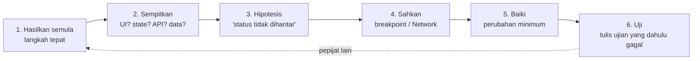

# 14 · Debugging, Error Handling, Ujian & Amalan Terbaik

> Nota topikal · Indeks: [`./README.md`](./README.md)

## Objektif nota

Selepas membaca nota ini, anda boleh:

- **Mengikuti** kitaran debugging bersistem dan **menggunakan** method `console` (`table`, `group`, `time`, `assert`, `trace`, `dir`), `debugger`, serta jenis breakpoint dalam DevTools (baris, bersyarat, logpoint, fetch/XHR, pengecualian).
- **Menggunakan** panel Sources, Network dan Application untuk mengesan pepijat API, CORS dan storage.
- **Menulis** error handling berlapis: `try…catch…finally`, custom error (`ApiError`), `error.cause`, lontar semula, dan handler global `error`/`unhandledrejection`.
- **Menulis & menjalankan** ujian pantas dengan `node --test` + `node:assert/strict` (termasuk `fetch` palsu dengan `mock`).
- **Menyemak** kod terhadap senarai semak kod bersih dan keselamatan sebelum demo.

---

## 1. Debugging ialah kaedah, bukan tekaan

Pembangun baharu menukar kod secara rawak sehingga "ia berfungsi". Pembangun berpengalaman mengikut kitaran:



**Sempitkan mengikut layer** (nota 13): Adakah request dihantar? (Network) → Adakah response betul? (Network → Response) → Adakah store dikemas kini? (`store.dapat()`) → Adakah UI melukis? (Elements). Setiap soalan membuang separuh ruang carian.

---

## 2. `console` — lebih daripada `log`

| Method | Guna | Contoh GeoLapor |
|--------|------|-----------------|
| `console.log(a, b)` | Log biasa — **hantar objek sebagai argumen berasingan**, bukan `'x' + obj` | `console.log('laporan', f)` |
| `console.table(arr)` | Array objek sebagai jadual (boleh susun lajur) | `console.table(store.dapat().laporan.map((f) => f.properties))` |
| `console.group/groupCollapsed(label)` + `groupEnd()` | Kumpul log berkaitan | log setiap perubahan store |
| `console.time(l)` / `timeEnd(l)` | Ukur tempoh | `console.time('tapis')` … `console.timeEnd('tapis')` |
| `console.assert(syarat, …)` | Log **hanya** jika syarat palsu | `console.assert(dalamMalaysia(f.geometry.coordinates), 'Koordinat terbalik?', f.id)` |
| `console.trace()` | Cetak susunan panggilan (siapa memanggil saya?) | dalam `store.set` — cari siapa mengubah `penapis` |
| `console.dir(obj)` | Objek sebagai pokok property (berguna untuk elemen DOM) | `console.dir(document.querySelector('#peta'))` |
| `console.warn/error` | Tahap amaran/error (boleh ditapis dalam Console) | error API |
| `console.count(l)` | Kira berapa kali baris dicapai | berapa kali pelanggan dipanggil? |

```js
// Logger store — pasang dalam mod dev sahaja (main.js)
if (import.meta.env.DEV) {
  store.langgan((baharu, lama) => {
    const berubah = Object.keys(baharu).filter((k) => baharu[k] !== lama[k]);
    console.groupCollapsed(`store: ${berubah.join(', ')}`);
    for (const k of berubah) console.log(k, lama[k], '→', baharu[k]);
    console.groupEnd();
  });
  window.__geolapor = { store };   // cuba dalam Console: __geolapor.store.dapat()
}
```

> ⚠️ `console.log(obj)` dalam Chrome memaparkan objek **secara langsung (live)** — jika objek dimutasi kemudian, anda nampak nilai **baharu** apabila mengembangnya. Guna `console.log(structuredClone(obj))` atau `JSON.stringify` untuk petikan pada masa itu. (Satu lagi sebab untuk immutable!)

---

## 3. DevTools (Chrome / Edge)

Buka: **F12** atau `Ctrl+Shift+I` (Mac: `Cmd+Opt+I`).

### 3.1 Sources — hentikan masa

| Jenis breakpoint | Cara | Bila |
|------------------|------|------|
| **Baris** | Klik nombor baris | Asas |
| **Bersyarat** | Klik kanan nombor baris → *Add conditional breakpoint* → `id === 'LPR-0007'` | Loop / banyak panggilan, hanya satu kes bermasalah |
| **Logpoint** | Klik kanan → *Add logpoint* → `'status', f.properties.status` | "console.log tanpa ubah kod" — tiada lupa buang |
| **`debugger;`** | Tulis dalam kod | Kod dijana/sukar dicari; **buang sebelum commit** (ESLint `no-debugger`) |
| **Fetch/XHR** | Panel kanan → *XHR/fetch Breakpoints* → `+` → `/api/laporan` | "Siapa yang menghantar request ini?" |
| **Event listener** | *Event Listener Breakpoints* → Mouse → click | Tidak tahu handler mana yang berjalan |
| **Pengecualian** | Ikon ⏸ *Pause on exceptions* (+ *caught*) | Error ditelan oleh `catch` |

Semasa berhenti: **Step over** (F10), **Step into** (F11), **Step out** (Shift+F11), **Resume** (F8). Panel **Scope** menunjukkan variable tempatan/closure; **Watch** untuk ungkapan (`store.dapat().penapis`); **Call Stack** untuk laluan panggilan.

**Source maps:** Vite dev server memberi *source map* secara automatik, jadi breakpoint diletak pada `src/state/tindakan.js` asal walaupun browser menjalankan kod yang diubah. Untuk build produksi, `build.sourcemap: true` dalam `vite.config.js` (pertimbangkan sama ada source map patut didedahkan secara awam).

### 3.2 Network — "adakah server betul atau saya?"

| Semak | Di mana | Contoh pepijat |
|-------|---------|----------------|
| Request dihantar? | Senarai (tapis **Fetch/XHR**) | Tiada baris → handler tidak berjalan / `preventDefault` hilang |
| URL & query | *Headers → General* | `?bbox=2.9,101.6,…` → lat/lng terbalik |
| Header request | *Headers → Request* | `X-API-Key` tiada → 401 |
| Badan dihantar | *Payload* | `[object Object]` → lupa `JSON.stringify` |
| Status | Lajur Status | 422 → lihat *Response* `medan` |
| Response | *Response* / *Preview* | HTML (`<!doctype`) bukan JSON → URL salah → `Unexpected token '<'` |
| CORS | Console + baris merah `(failed) CORS` | Server tiada `Access-Control-Allow-Origin` → proxy (nota 11) |
| Kelewatan | *Timing* · *Throttling: Slow 4G* | Uji spinner & `timeoutMs` |

💡 Klik kanan request → **Copy as cURL** → jalankan di terminal untuk mengasingkan masalah browser vs server.

### 3.3 Application

`Local storage`, `Session storage`, `IndexedDB` (lihat cache layer), `Cache storage`, *Clear site data* (nota 12).

### 3.4 Elements & Console trik

- `$0` = elemen yang dipilih dalam Elements; `$$('li[data-id]')` = `querySelectorAll` sebagai array.
- Klik pautan `fail.js:42` pada error merah → terus ke baris dalam Sources.
- *Preserve log* supaya log tidak hilang selepas muat semula.

---

## 4. Error handling

### 4.1 `try…catch…finally`

```js
async function muatLaporan() {
  store.set({ memuat: true, ralat: null });
  try {
    const fc = await senaraiLaporan(store.dapat().penapis);
    store.set({ laporan: fc.features });
  } catch (err) {
    store.set({ ralat: err.message });           // mesej BM untuk pengguna
    console.error('muatLaporan gagal', err);     // butiran teknikal untuk pembangun
  } finally {
    store.set({ memuat: false });                // SENTIASA berjalan — spinner tidak tersangkut
  }
}
```

Empat peraturan:

1. **Tangkap hanya apa yang anda boleh kendalikan.** `catch (e) {}` kosong menyembunyikan pepijat.
2. **Lontar semula** apa yang bukan urusan anda (`throw err`).
3. **`finally`** untuk pembersihan yang mesti berlaku.
4. **Pengguna nampak mesej berguna (BM); console nampak butiran** (stack, `cause`).

> ⚠️ `try…catch` **tidak** menangkap error dalam Promise yang tidak di-`await`: `try { fetchSesuatu(); } catch {}` — error berlaku kemudian, di luar blok. Sentiasa `await` (atau `.catch()`).

### 4.2 Custom error — `ApiError` (`services/api.js`)

```js
/** Error API dengan status HTTP & error medan (422). status 0 = network/timeout. */
export class ApiError extends Error {
  constructor(mesej, status, medan) {
    super(mesej);
    this.name = 'ApiError';          // tanpa ini, err.name ialah 'Error'
    this.status = status;
    this.medan = medan ?? null;      // 422: { tajuk: 'Wajib diisi', … }
  }
}
```

Kenapa kelas sendiri? Supaya pemanggil boleh **membezakan** jenis kegagalan:

```js
try {
  await ciptaLaporan(data);
} catch (err) {
  if (err.name === 'AbortError') return;                         // dibatalkan sengaja — bukan error
  if (err instanceof ApiError && err.status === 422) {
    paparRalatMedan(err.medan);                                  // di sebelah medan borang
  } else if (err instanceof ApiError && err.status === 401) {
    notis('Kunci API tidak sah', 'ralat');
  } else if (err instanceof ApiError && err.status === 0) {
    notis('Tiada sambungan ke pelayan. Cuba lagi.', 'amaran');
  } else {
    throw err;                                                   // tidak dijangka → biar handler global
  }
}
```

| `status` | Maksud (mock API GeoLapor) | Tindakan UI |
|----------|---------------------------|-------------|
| 0 | Rangkaian putus / timeout | Butang "Cuba lagi" |
| 401 | Tiada/salah `X-API-Key` | Mesej konfigurasi |
| 404 | Laporan tiada | Buang dari senarai, notis |
| 422 | Validasi gagal (`medan`) | Tanda medan borang |
| 500 | Server error (`?gagal=1`) | Notis + rollback (nota 13) |

### 4.3 `error.cause` — error chain (ES2022)

Apabila membungkus error peringkat rendah, **jangan buang** error asal:

```js
function huraiLapisan(teks) {
  try {
    return JSON.parse(teks);
  } catch (err) {
    throw new Error('Fail lapisan bukan GeoJSON yang sah', { cause: err }); // cause = error asal
  }
}

try {
  huraiLapisan('{rosak');
} catch (err) {
  console.error(err.message);        // 'Fail lapisan bukan GeoJSON yang sah'
  console.error(err.cause.name);     // 'SyntaxError' — butiran asal masih ada
}
```

`ApiError` di atas menerima 3 argumen; jika mahu menyokong `cause`, lanjutkan tandatangan dengan objek pilihan keempat dan hantar ke `super(mesej, pilihan)` — tanpa mengubah pemanggil sedia ada.

### 4.4 Handler global — jaring keselamatan terakhir

```js
// main.js — tangkap apa yang terlepas (BUKAN pengganti try…catch)
window.addEventListener('error', (e) => {
  console.error('Ralat tidak ditangkap:', e.error ?? e.message);
  notis('Ralat tidak dijangka. Sila muat semula halaman.', 'ralat');
});

window.addEventListener('unhandledrejection', (e) => {
  console.error('Promise ditolak tanpa catch:', e.reason);
  notis('Operasi gagal. Cuba lagi.', 'ralat');
});
```

Dalam produksi, di sinilah error dihantar ke log server (Sentry, endpoint dalaman) — **tanpa** data peribadi.

---

## 5. Ujian pantas dengan `node --test`

Node.js 22+ ada *test runner* terbina — **tiada pakej**. Layer `utils/`, `state/` (dan `services/` dengan `fetch` palsu) boleh diuji kerana tidak menyentuh DOM (nota 13 §8).

### 5.1 Struktur & arahan

```text
projek/geolapor-mula/
├── package.json     "type": "module", "scripts": { "test": "node --test \"tests/**/*.test.js\"" }
├── src/…
└── tests/
    ├── geo.test.js       import … from '../src/utils/geo.js'
    ├── store.test.js     import … from '../src/state/store.js'
    └── tindakan.test.js
```

```bash
npm test                              # jalankan skrip di atas
node --test                           # tanpa argumen: cari *.test.js / test/**/*.js secara automatik
node --test "tests/**/*.test.js"      # glob — PETIKAN wajib (supaya Node, bukan shell, mengembangkannya)
node --test --watch                   # jalankan semula bila fail disimpan
node --test --test-name-pattern="rollback"   # hanya ujian yang namanya sepadan
```

> ⚠️ **Kesilapan lazim — `node --test src/state/`.** Memberi **folder** sebagai argumen gagal pada Node terkini (diuji pada Node 26: `✖ src/state … 'test failed'`) kerana ia dianggap nama fail. Guna `node --test` tanpa argumen atau glob berpetik.

### 5.2 `node:assert/strict` — yang paling kerap

| Fungsi | Guna |
|--------|------|
| `assert.equal(a, b)` | `a === b` (mod strict) |
| `assert.deepEqual(a, b)` | Kandungan objek/array sama (strict: jenis pun sama) |
| `assert.notEqual(a, b)` | Rujukan berbeza (cth objek baharu selepas `set`) |
| `assert.ok(x)` | Truthy |
| `assert.match(str, /re/)` | String sepadan regex |
| `assert.throws(fn, jangkaan)` | Fungsi sync melontar |
| `await assert.rejects(janji, jangkaan)` | Promise di-reject (async) |

### 5.3 Ujian `utils/geo.js`

```js
// tests/geo.test.js
import { test, describe } from 'node:test';
import assert from 'node:assert/strict';
import { jarakKm, tapisLaporan, kiraIkut, bboxDari, dalamMalaysia } from '../src/utils/geo.js';

const titik = (id, lng, lat, kategori, status, tajuk) => ({
  type: 'Feature', id,
  geometry: { type: 'Point', coordinates: [lng, lat] },
  properties: { id, kategori, status, tajuk },
});
const SAMPEL = [
  titik('LPR-0001', 101.6958, 2.9264, 'infrastruktur', 'baharu', 'Papan tanda sempadan rosak'),
  titik('LPR-0002', 101.6500, 2.9200, 'tanah', 'selesai', 'Tanah runtuh kecil'),
  titik('LPR-0003', 101.7100, 2.9400, 'infrastruktur', 'dalam-tindakan', 'Lampu jalan padam'),
];

describe('jarakKm', () => {
  test('titik sama = 0', () => assert.equal(jarakKm([101.7, 2.9], [101.7, 2.9]), 0));
  test('1 darjah latitud ≈ 111.19 km', () => {
    assert.ok(Math.abs(jarakKm([101.7, 2], [101.7, 3]) - 111.19) < 0.01);
  });
});
describe('tapisLaporan', () => {
  test('tanpa penapis pulangkan semua', () => assert.equal(tapisLaporan(SAMPEL).length, 3));
  test('ikut kategori + carian tanpa huruf besar/kecil', () => {
    const hasil = tapisLaporan(SAMPEL, { kategori: 'infrastruktur', q: 'LAMPU' });
    assert.deepEqual(hasil.map((f) => f.id), ['LPR-0003']);
  });
  test('tidak mengubah array asal', () => {
    tapisLaporan(SAMPEL, { status: 'selesai' });
    assert.equal(SAMPEL.length, 3);
  });
});
test('kiraIkut kategori', () => {
  assert.deepEqual(kiraIkut(SAMPEL, 'kategori'), { infrastruktur: 2, tanah: 1 });
});
test('bboxDari [minLng, minLat, maxLng, maxLat]', () => {
  assert.deepEqual(bboxDari(SAMPEL), [101.65, 2.92, 101.71, 2.94]);
  assert.equal(bboxDari([]), null);
});
test('dalamMalaysia menolak koordinat terbalik [lat, lng]', () => {
  assert.equal(dalamMalaysia([101.6958, 2.9264]), true);
  assert.equal(dalamMalaysia([2.9264, 101.6958]), false);
});
```

Ujian `store.js` dan `tindakan.js` (optimistic + rollback): lihat [nota 13 §12](./13-state-dan-arkitektur.md#12-menguji-layer-state-node---test).

### 5.4 Ujian `services/api.js` dengan `fetch` palsu

`mock.method(globalThis, 'fetch', …)` menggantikan `fetch` sementara — tiada server diperlukan:

```js
// tests/api.test.js
import { test, mock, afterEach } from 'node:test';
import assert from 'node:assert/strict';
import { mintaJson, ApiError } from '../src/services/api.js';

afterEach(() => mock.restoreAll());   // pulihkan fetch sebenar selepas setiap ujian

const jawapan = (status, badan) =>
  new Response(badan === null ? null : JSON.stringify(badan), { status, headers: { 'Content-Type': 'application/json' } });

test('422 → ApiError dengan status & medan', async () => {
  mock.method(globalThis, 'fetch', async () => jawapan(422, { ralat: 'Data tidak sah', medan: { tajuk: 'Wajib diisi' } }));
  await assert.rejects(mintaJson('/api/laporan', { method: 'POST', body: {} }), (err) => {
    assert.ok(err instanceof ApiError);
    assert.equal(err.status, 422);
    assert.deepEqual(err.medan, { tajuk: 'Wajib diisi' });
    return true;
  });
});

test('POST menghantar X-API-Key & JSON', async () => {
  const f = mock.method(globalThis, 'fetch', async () => jawapan(201, { id: 'LPR-0041' }));
  await mintaJson('/api/laporan', { method: 'POST', body: { tajuk: 'Uji' } });
  const [, pilihan] = f.mock.calls[0].arguments;
  assert.equal(pilihan.headers['X-API-Key'], 'latihan-pgn-2026');
  assert.equal(pilihan.body, '{"tajuk":"Uji"}');
});

test('rangkaian putus → ApiError status 0', async () => {
  mock.method(globalThis, 'fetch', async () => { throw new TypeError('fetch failed'); });
  await assert.rejects(mintaJson('/api/kesihatan'), { name: 'ApiError', status: 0 });
});

test('204 → null', async () => {
  mock.method(globalThis, 'fetch', async () => new Response(null, { status: 204 }));
  assert.equal(await mintaJson('/api/laporan/LPR-0001', { method: 'DELETE' }), null);
});
```

> ⚠️ **Perangkap `import.meta.env` dalam Node (diuji):** `import.meta.env` hanya wujud dalam Vite. Dalam `node --test`, `import.meta.env.VITE_API_URL` melontar `TypeError: Cannot read properties of undefined (reading 'VITE_API_URL')` **semasa import** — semua ujian fail itu gagal. Guna optional chaining: `import.meta.env?.VITE_API_URL ?? 'http://localhost:3000'`. Dengan perubahan itu, keempat-empat ujian di atas lulus.

### 5.5 Apa yang patut diuji dahulu?

Logik yang **mudah salah** dan **mahal jika salah**: penukaran koordinat (`[lng, lat]`!), penapisan, rollback optimistik, pemetaan status HTTP → `ApiError`. Jangan uji Leaflet sendiri — ia sudah diuji oleh pembangunnya.

---

## 6. JSDoc — jenis tanpa TypeScript

VS Code membaca komen JSDoc dan memberi autolengkap + amaran jenis. Tambah `// @ts-check` di baris pertama fail untuk semakan lebih ketat.

```js
// @ts-check
/**
 * Jarak bulatan besar antara dua titik.
 * @param {[number, number]} a  [lng, lat] — susunan GeoJSON
 * @param {[number, number]} b  [lng, lat]
 * @returns {number} jarak dalam kilometer
 */
export function jarakKm(a, b) { /* … */ }

/** @typedef {{ kategori?: string, status?: string, q?: string }} Penapis */

/**
 * @param {GeoJSON.Feature[]} features
 * @param {Penapis} [penapis]
 */
export function tapisLaporan(features, penapis = {}) { /* … */ }
```

---

## 7. Senarai semak kod bersih

| # | Semak | Contoh |
|---|-------|--------|
| C1 | Nama bermakna & konsisten: fungsi = kata kerja, data = kata nama | `muatLaporan()`, `laporanDitapis` — bukan `data2`, `doIt()` |
| C2 | Satu fungsi, satu tugas (≲ 30 baris) | `pasangSenarai` tidak memanggil `fetch` |
| C3 | Tiada nombor/string ajaib | `const TTL_MS = 24 * 60 * 60 * 1000` |
| C4 | Fungsi tulen di `utils/`; kesan sampingan di tepi | `tapisLaporan` tidak menyentuh DOM |
| C5 | Immutable dalam store | `map`/spread — tiada `push` pada keadaan |
| C6 | `const` default, `let` bila perlu, tiada `var`; `===` sentiasa | ESLint `prefer-const`, `no-var`, `eqeqeq` |
| C7 | Tiada `console.log` / `debugger` sisa | `npm run lint` bersih |
| C8 | Error dikendalikan di peringkat betul; tiada `catch {}` kosong tanpa komen | §4 |
| C9 | Komen menerangkan **kenapa**, bukan **apa** | `// [lng, lat] — susunan GeoJSON` |
| C10 | JSDoc pada fungsi awam modul | §6 |
| C11 | Prettier + ESLint 0 error | `npm run lint && npx prettier --check .` |
| C12 | Ujian hijau | `npm test` |

---

## 8. Senarai semak keselamatan frontend

| # | Semak | Kenapa |
|---|-------|--------|
| K1 | **Tiada `innerHTML`** dengan data pengguna/API — guna `textContent` / `createElement`; popup Leaflet diberi elemen DOM | XSS: tajuk `` akan dijalankan |
| K2 | **Tiada rahsia dalam frontend** — semua `VITE_*` dibundel ke JS awam | Sesiapa boleh buka DevTools → Sources |
| K3 | Key `latihan-pgn-2026` hanya untuk mock API latihan | Sistem sebenar: SSO/token + proxy backend |
| K4 | **Validasi di server** — validasi klien hanya untuk UX | Penyerang memanggil API terus dengan `curl` |
| K5 | Token/kata laluan tidak dalam `localStorage` | Skrip XSS boleh membacanya; guna kuki `HttpOnly` |
| K6 | **CORS bukan pengesahan** — ia hanya mengawal browser mana boleh *membaca* response | `curl` tidak peduli CORS; lindungi API dengan auth |
| K7 | HTTPS di luar localhost | Key/token boleh dihidu di rangkaian |
| K8 | `npm audit` + versi disemat (lockfile) | Dependency terjejas |
| K9 | Content Security Policy (CSP) di web server | Had sumber skrip; `script-src 'self'` menyekat skrip sebaris yang disuntik |
| K10 | Pautan luar `target="_blank"` dengan `rel="noopener noreferrer"` | Elak tabnabbing |
| K11 | `postMessage`: sahkan `event.origin` | Mesej daripada laman lain |
| K12 | Data sintetik sahaja dalam latihan (`@latihan.test`) | Tiada data PGN/JUPEM sebenar |

```http
# Contoh header CSP (ditetapkan oleh web server, bukan JS) untuk GeoLapor + tile OSM
Content-Security-Policy: default-src 'self'; img-src 'self' data: https://tile.openstreetmap.org;
  connect-src 'self' http://localhost:3000; style-src 'self'; script-src 'self'; object-src 'none'
```

---

## ⚠️ Kesilapan lazim

| Simptom | Punca | Pembetulan |
|---------|-------|------------|
| `Unexpected token '<', "<!doctype"... is not valid JSON` | URL salah → server pulangkan HTML (404/index.html) | Semak URL dalam Network; semak `res.ok` sebelum `res.json()` |
| `TypeError: Cannot read properties of undefined (reading 'properties')` | `find` pulangkan `undefined` | `?.` + semak `if (!f) return` |
| Spinner tersangkut selepas error | `memuat: false` hanya dalam cabang berjaya | `finally` |
| Error "hilang" — tiada apa berlaku | `catch {}` kosong / Promise tidak di-`await` | Log + kendalikan; `await`; handler `unhandledrejection` |
| Log menunjukkan nilai "masa depan" | Console Chrome memaparkan objek live | `structuredClone` / `JSON.stringify` semasa log |
| `node --test src/state/` gagal | Folder sebagai argumen | `node --test` atau glob berpetik |
| `document is not defined` dalam ujian | Modul yang diuji menyentuh DOM | Pindah logik ke `utils/`/`state/` |
| `Cannot read properties of undefined (reading 'VITE_API_URL')` dalam ujian | `import.meta.env` tiada dalam Node | `import.meta.env?.VITE_API_URL` |
| Ujian lulus walaupun kod rosak | `assert.rejects` tanpa `await` | `await assert.rejects(...)` |
| `err instanceof ApiError` palsu | Membandingkan kelas dari salinan modul lain / error bukan dari `mintaJson` | Semak `err.name === 'ApiError'` sebagai sandaran |

---

## Rujukan rasmi

- Chrome DevTools — Breakpoints: <https://developer.chrome.com/docs/devtools/javascript/breakpoints> · Network: <https://developer.chrome.com/docs/devtools/network> · Console API: <https://developer.chrome.com/docs/devtools/console/api>
- MDN — `console`: <https://developer.mozilla.org/en-US/docs/Web/API/console> · `debugger`: <https://developer.mozilla.org/en-US/docs/Web/JavaScript/Reference/Statements/debugger> · `try...catch`: <https://developer.mozilla.org/en-US/docs/Web/JavaScript/Reference/Statements/try...catch> · `Error.cause`: <https://developer.mozilla.org/en-US/docs/Web/JavaScript/Reference/Global_Objects/Error/cause>
- MDN — event `error`: <https://developer.mozilla.org/en-US/docs/Web/API/Window/error_event> · `unhandledrejection`: <https://developer.mozilla.org/en-US/docs/Web/API/Window/unhandledrejection_event>
- Node.js — Test runner: <https://nodejs.org/api/test.html> · Assert: <https://nodejs.org/api/assert.html>
- JSDoc: <https://jsdoc.app/>
- MDN — CSP: <https://developer.mozilla.org/en-US/docs/Web/HTTP/Guides/CSP> · CORS: <https://developer.mozilla.org/en-US/docs/Web/HTTP/Guides/CORS>
- OWASP Top 10: <https://owasp.org/www-project-top-ten/> · XSS Prevention Cheat Sheet: <https://cheatsheetseries.owasp.org/cheatsheets/Cross_Site_Scripting_Prevention_Cheat_Sheet.html>
- npm audit: <https://docs.npmjs.com/cli/v11/commands/npm-audit>

## Digunakan pada Hari N

- **Hari 1** — `console`, syntax error, `try…catch` asas dengan `JSON.parse`.
- **Hari 2** — `ApiError`, status HTTP, tab Network, `AbortError`.
- **Hari 3** — `textContent` vs `innerHTML` (K1), breakpoint event listener.
- **Hari 4** — ESLint (`no-debugger`, `no-console`), `npm audit`, source maps Vite.
- **Hari 5 (utama)** — S3: debugging bersistem, error berlapis, handler global, `node --test`, senarai semak kod bersih & keselamatan.
